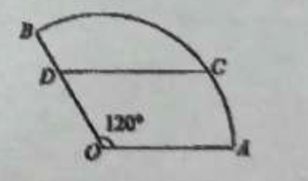

## 20260512 高一数学三角练习卷

> ⭐️全对

### 一、填空题
1. 若 $\tan\left(\alpha - \dfrac{\pi}{4}\right) = \dfrac{1}{6}$，则 $\tan\alpha =$ \_\_\_\_\_\_\_\_\_\_\_\_。
2. 已知角 $\theta$ 的顶点与原点重合，始边与 $x$ 轴的正半轴重合，终边在直线 $y=2x$ 上，则 $\cos2\theta =$ \_\_\_\_\_\_\_\_\_\_\_\_。
3. 已知 $\sin^2\left( \dfrac{\pi}{4} + \alpha\right) = \dfrac{2}{3}$，则 $\sin2\alpha$ 的值是\_\_\_\_\_\_\_\_\_\_\_\_。
4. 若 $\tan\alpha = \dfrac{3}{4}$，则 $\cos^2\alpha + 2\sin2\alpha =$ \_\_\_\_\_\_\_\_\_\_\_\_。
5. $\triangle ABC$ 的内角 $A$、$B$、$C$ 的对边分别为 $a$、$b$、$c$。已知 $a=\sqrt{5}$，$c=2$，$\cos A = \dfrac{2}{3}$，则 $b=$ \_\_\_\_\_\_\_\_\_\_\_\_。
6. $\triangle ABC$ 的内角 $A$、$B$、$C$ 的对边分别为 $a$、$b$、$c$。若 $b=6$，$a=2c$，$B= \dfrac{\pi}{3}$，则 $\triangle ABC$ 的面积为\_\_\_\_\_\_\_\_\_\_\_\_。
7. 在平面直角坐标系 $xOy$ 中，角 $\alpha$ 与角 $\beta$ 均以 $Ox$ 为始边，它们的终边关于 $y$ 轴对称。若 $\sin\alpha = \dfrac{1}{3}$，则 $\cos(\alpha - \beta) =$ \_\_\_\_\_\_\_\_\_\_\_\_。
8. 某船在海平面 $A$ 处测得灯塔 $B$ 在北偏东 $30^\circ$ 方向，与 $A$ 相距 $6.0$ 海里。船由 $A$ 向正北方向航行 $8.1$ 海里达到 $C$ 处，这时灯塔 $B$ 与船相距\_\_\_\_\_\_\_\_\_\_\_\_海里。(精确到 $0.1$ 海里)
9. 在锐角 $\triangle ABC$ 中，角 $B$ 所对的边长 $b=6$，$\triangle ABC$ 的面积为 $15$，外接圆半径 $R=5$，则 $\triangle ABC$ 的周长为\_\_\_\_\_\_\_\_\_\_\_\_。
10. 已知 $a$、$b$、$c$ 分别为 $\triangle ABC$ 的三个内角 $A$、$B$、$C$ 的对边，$a=2$，且 $(2+b)(\sin A - \sin B) = (c-b)\sin C$，则 $\triangle ABC$ 面积的最大值为\_\_\_\_\_\_\_\_\_\_\_\_。

### 二、选择题
11. 若 $\tan\alpha>0$，则（）。
A. $\sin2\alpha>0$；                      B. $\cos\alpha>0$；
C. $\sin\alpha>0$；                         D. $\cos2\alpha>0$。
12. 某人要制作一个三角形，要求它的三条高的长度分别为 $\dfrac{1}{13}$，$\dfrac{1}{11}$，$\dfrac{1}{5}$，则此人（）。
A. 不能作出这样的三角形；                    B. 能作出一个锐角三角形；
C. 能作出一个直角三角形；                    D. 能作出一个钝角三角形。

### 三、解答题
13. 已知 $0<x< \dfrac{\pi}{2}$，      化简：$\lg\left(\cos x \cdot \tan x + 1 - 2\sin^2 \dfrac{x}{2}\right) + \lg\left[\sqrt{2}\cos\left(x - \dfrac{\pi}{4}\right)\right] - \lg(1 + \sin2x)$。
14. 已知角 $\alpha$ 的顶点与原点 $O$ 重合，始边与 $x$ 轴的正半轴重合，它的终边过点 $P\left(- \dfrac{3}{5}, - \dfrac{4}{5}\right)$。
(1) 求 $\sin(\alpha + \pi)$ 的值；
(2) 若角 $\beta$ 满足 $\sin(\alpha + \beta) = \dfrac{5}{13}$，求 $\cos\beta$ 的值。==其中 $\alpha + \beta \in (\dfrac{\pi}{2},\pi)$==
15. 已知 $A$、$B$、$C$ 是 $\triangle ABC$ 的三个内角，$a$、$b$、$c$ 是其三条边，$a=2$，$\cos C = - \dfrac{1}{4}$。
(1) $\sin A = 2\sin B$，求 $b$、$c$；     (2) $\cos\left(A - \dfrac{\pi}{4}\right) = \dfrac{4}{5}$，求 $c$。
16. 如图，某住宅小区的平面图是圆心角为 $120^\circ$ 的扇形 $AOB$，$C$ 是该小区的一个出入口，且小区里有一条平行于 $AO$ 的小路 $CD$。已知某人从 $O$ 沿 $OD$ 走到 $D$ 用了 $2$ 分钟，从 $D$ 沿 $DC$ 走到 $C$ 用了 $3$ 分钟。若此人步行的速度为每分钟 $50$ 米，则该扇形的半径为多少米？
    