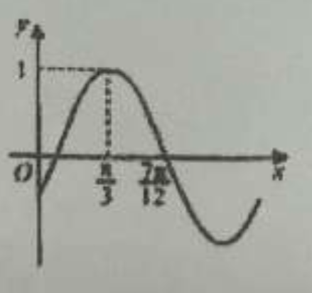

## 20260529 期末复习卷（一）

> 🤬表示计算错

### 一、填空题
1. 已知复数 $z_1=2+3i$，$z_2=3-i$，在复平面内，$z_1 \cdot z_2$ 对应的点在第 \_\_\_\_\_\_\_\_\_\_\_\_ 象限。
2. 已知点 $P(1,2)$，$Q(4,5)$，则 $\overrightarrow{PQ}$ 的单位向量的坐标为 \_\_\_\_\_\_\_\_\_\_\_\_。
3. 已知角 $\alpha$ 终边上的一点 $P(a,\sqrt{3}a)(a<0)$，则 $\sin\alpha =$ \_\_\_\_\_\_\_\_\_\_\_\_。
4. $\tan\left(\alpha-\dfrac{\pi}{4}\right)=2$，则 $\tan\alpha =$ \_\_\_\_\_\_\_\_\_\_\_\_。
5. 计算：$\lim\limits_{n \to \infty}\left[1-\dfrac{1}{2}+\dfrac{1}{4}-\dfrac{1}{8}+\cdots+(-1)^{n-1}\cdot\dfrac{1}{2^{n-1}}\right]=$ \_\_\_\_\_\_\_\_\_\_\_\_。
6. 函数 $f(x)=2\sin\left(\dfrac{\pi}{4}+x\right)\cos\left(\dfrac{\pi}{4}+x\right)$ 的最小正周期为 \_\_\_\_\_\_\_\_\_\_\_\_。
7. 已知方程 $x^2+ax+b=0\ (a,b \in \mathbb{R})$ 的一个根为 $1+2i$，则复数 $a+bi$ 的模为 \_\_\_\_\_\_\_\_\_\_\_\_。
8. 在 $\triangle ABC$ 中，设 $M$ 是 $BC$ 的中点，且 $|AM|=3$，$|BC|=10$，则 $\overrightarrow{AB} \cdot \overrightarrow{AC}=$ \_\_\_\_\_\_\_\_\_\_\_\_。
9. 已知实数 $m>\dfrac{1}{2 \times 5}+\dfrac{1}{5 \times 8}+\dfrac{1}{8 \times 11}+\cdots+\dfrac{1}{(3n-1)(3n+2)}$ 对于 $n \in \mathbb{N}^*$ 恒成立，则 $m$ 的取值范围为 \_\_\_\_\_\_\_\_\_\_\_\_。
10. 复数 $z$ 满足 $|z-3i|=2$（$i$ 为虚数单位），则 $|z-4i|$ 的取值范围是 \_\_\_\_\_\_\_\_\_\_\_\_。
11. 已知函数 $f(x)=\sin(\omega x+\phi)\ \left(\omega>0,\ -\dfrac{\pi}{2}<\phi<\dfrac{\pi}{2}\right)$ 的部分图像如图所示，则函数 $f(x)$ 的解析式为 $f(x)=$ \_\_\_\_\_\_\_\_\_\_\_\_。
12. ❌数列 $\{a_n\}$ 满足 $a_1=1$，$a_2=1$，$a_n + a_{n+1} + a_{n+2} = \cos\dfrac{2n\pi}{3},\ n \in \mathbb{N}^*$，数列 $\{a_n\}$ 的前 $n$ 项和为 $S_n$，则 $S_{62}=$ \_\_\_\_\_\_\_\_\_\_\_\_。

### 二、选择题
13. 为了得到函数 $y=3\sin\left(2x+\dfrac{\pi}{6}\right)$ 的图像，只需要将函数 $y=3\sin(2x)$ 的图像（）
A. 向左平移 $\dfrac{\pi}{6}$ 个单位                                                  B. 向左平移 $\dfrac{\pi}{12}$ 个单位
C. 向右平移 $\dfrac{\pi}{6}$ 个单位                                                     D. 向右平移 $\dfrac{\pi}{12}$ 个单位
14. ❌若向量 $\vec{a}=(-3,-1)$，$\vec{b}=(\lambda,1)$，$\vec{a}$ 与 $\vec{b}$ 的夹角为钝角，则实数 $\lambda$ 的取值范围是（）
A. $\left(-\dfrac{1}{3},+\infty\right)$                                                                   B. $\left(-\infty,-\dfrac{1}{3}\right)$
C. $\left(-\dfrac{1}{3},3\right) \cup (3,+\infty)$                                                  D. $\left(-\infty,-3\right) \cup \left(-3,-\dfrac{1}{3}\right)$
15. 设 $z_1$，$z_2$ 为复数，则下列命题中一定成立的是（）
A. 如果 $z_1-z_2>0$，那么 $z_1>z_2$                             B. 如果 $|z_1|=|z_2|$，那么 $z_1=\pm z_2$
C. 如果 $\left|\dfrac{z_1}{z_2}\right|>1$，那么 $|z_1|>|z_2|$                            D. 如果 $z_1^2+z_2^2=0$，那么 $z_1=z_2=0$
16. 已知数列 $\{a_n\}$ 的前 $n$ 项和为 $T_n$，数列 $\{T_n\}$ 是递增数列是 $a_{2023} > a_{2022}$ 的（）
A. 充分不必要条件                                                               B. 必要不充分条件
C. 充要条件                                                                            D. 既不充分也不必要条件

### 三、解答题
17. 已知 $|\vec{a}|=5$，$|\vec{b}|=6$，$\sin\langle\vec{a},\vec{b}\rangle=0.6$。求 $\vec{b}$ 在 $\vec{a}$ 方向上的投影与数量投影。
18. 在 $\triangle ABC$ 中，$a,b,c$ 分别是 $A,B,C$ 的对边，且 $\dfrac{\cos B}{\cos C}=-\dfrac{b}{2a+c}$。
（1）求角 $B$ 的大小；（2）若 $b=\sqrt{13}$，$a+c=4$，求 $\triangle ABC$ 的面积。
19. 某地投入资金进行生态环境建设，并以此发展旅游产业。根据规划，本年度投入 800 万元，以后每年投入将比上年减少 20%。本年度当地旅游业收入估计为 400 万元，由于该项建设对旅游业的促进作用，预计今后的旅游业收入每年会比上年增加 25%。
（1）设 $n$ 年内（本年度为第一年）总投入为 $a_n$ 万元，旅游业总收入为 $b_n$ 万元，写出 $a_n$，$b_n$ 的表达式；（2）❌至少经过几年旅游业的总收入才能超过总投入？
20. 🤬已知函数 $f(x)=2\cos^2x+2\sqrt{3}\sin x\cos x-1$。
（1）求函数 $y=f(x)$ 的最小正周期和单调递增区间；
（3）若不等式 $|f(x)-m|<2$ 在 $x \in \left[-\dfrac{\pi}{4},\dfrac{\pi}{4}\right]$ 上恒成立，求实数 $m$ 的取值范围。
21. 若数列 $\{a_n\}$ 的每一项都不等于零，且对于任意的 $n \in \mathbb{N}^*$，都有 $\dfrac{a_{n+2}}{a_n}=q$（$q$ 为常数），则称数列 $\{a_n\}$ 为“类等比数列”。已知数列 $\{b_n\}$ 满足：$b_1=b(b \in \mathbb{R},b \neq 0)$，对于任意的 $n \in \mathbb{N}^*$，都有 $b_n \cdot b_{n+1}=2^{n+1}$。
（1）求证：数列 $\{b_n\}$ 是“类等比数列”；
（2）❌求 $\{b_n\}$ 通项公式；（3）若 $\{b_n\}$ 是单调递增数列，求实数 $b$ 的取值范围。