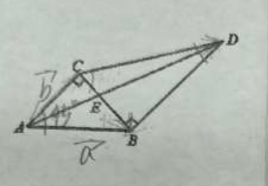

## 20251022 期末复习卷(8)

> ⚠️ 不是作业

### 一、填空题
1. 已知复数 $z_1=1+3\mathrm{i}$，$z_2=3+\mathrm{i}$，在复平面内，$z_1-z_2$ 对应的点在第\_\_\_\_\_\_\_\_\_\_\_\_象限。
2. 在数列$\{a_n\}$中，若$a_1=3$，$a_{n+1}=a_n+4$，则$a_5=$\_\_\_\_\_\_\_\_\_\_\_\_。
3. 若等比数列$\{a_n\}$满足：$a_1+a_3=5$，且公比 $q=2$，则 $a_3+a_5=$\_\_\_\_\_\_\_\_\_\_\_\_。
4. 若关于$x$的实系数一元二次方程 $x^2-bx+c=0$的一根为 $1-\mathrm{i}$，则 $b+c=$\_\_\_\_\_\_\_\_\_\_\_\_。
5. 数列$\{a_n\}$的前$n$项和为$S_n$，$S_n=\dfrac{a_n(3^n-1)}{2}(n\in\mathbf{N}^*)$，且$a_4=54$，则$a_1=$\_\_\_\_\_\_\_\_\_\_\_\_。
6. 设等比数列$\{a_n\}$的前$n$项和为$S_n$，若$\dfrac{S_6}{S_3}=3$，则$\dfrac{S_9}{S_6}=$\_\_\_\_\_\_\_\_\_\_\_\_。
7. 在$\triangle ABC$中，已知$\overrightarrow{AB}=\vec{a}$，$\overrightarrow{BC}=\vec{b}$，$G$为$\triangle ABC$的重心，用向量$\vec{a}$、$\vec{b}$表示向量$\overrightarrow{AG}=$\_\_\_\_\_\_\_\_\_\_\_\_。
8. ❌【这里没讲实数根还是虚数根】已知方程 $x^2-kx+2=0(k\in R)$的两个根为$x_1,x_2$，若$|x_1-x_2|=2$，则$k=$\_\_\_\_\_\_\_\_\_\_\_\_。
9. 已知菱形  $ABCD$ 的边长为 $1$，$\angle DAB=\dfrac{\pi}{3}$，点$E$为该菱形边上任意一点，则$\overrightarrow{AB}\cdot\overrightarrow{AE}$的取值范围是\_\_\_\_\_\_\_\_\_\_\_\_。
10. 一个球自$12$米高的地方自由落下，触地面后的回弹高度时下落高度的一半，到球停止在地面上为止，球运动的路程总和是\_\_\_\_\_\_\_\_\_\_\_\_米。
11. 函数$f(x)=\cos2x+2\sin x$的最小值为$m$，最大值$M$，则$m+M=$\_\_\_\_\_\_\_\_\_\_\_\_。
12. 已知数列$\{a_n\}$和$\{b_n\}$，其中$a_n$是$\sqrt{2}=1.41421356237\cdots$的小数点后的第$n$位数字，(例如$a_1=4,a_6=3$)，若 $b_1=a_1$，且任意的 $n\in\mathbf{N}^*$，均有$b_{n+1}=a_{b_n}$，则 $b_{2019}=$\_\_\_\_\_\_\_\_\_\_\_\_。

### 二、选择题
13. ❌设$\{\vec{e_1},\vec{e_2}\}$是平面内的一个基底，则下面的四组向量不能作为基底的是（）
A. $\vec{e_1}+\vec{e_2}$ 和 $\vec{e_1}-\vec{e_2}$                                 B. $\vec{e_1}$ 和 $\vec{e_1}+\vec{e_2}$
C. $3\vec{e_1}-\vec{e_2}$ 和 $2\vec{e_1}-6\vec{e_2}$                            D. $\vec{e_1}+3\vec{e_2}$ 和 $\vec{e_2}+3\vec{e_1}$

14. 已知复数$z$在复平面内的对应的点的坐标为$(2,-1)$，则下列结论正确的是（）
A. 复数$z$的共轭复数是$2-\mathrm{i}$                        B. $z\cdot\mathrm{i}^3=-1+2\mathrm{i}$
C. $|z|=5$                                                       D. $z^2$的虚部是$-4$

15. 等差数列$\{a_n\}$的公差为$d$，$d\neq0$。若$\{a_n\}$的前$10$项和大于其前$21$项和，则（）
A. $d<0$                        B. $d>0$                      C. $a_{16}<0$              D. $a_{16}>0$

16. 在$\triangle ABC$中，$AC=4$，且$\overrightarrow{AC}$在$\overrightarrow{AB}$方向上的投影数量是$-2$，则$|\overrightarrow{BC}-\lambda\overrightarrow{BA}|(\lambda\in\mathbf{R})$的最小值为（）
A. $2\sqrt{2}$                         B. $2\sqrt{5}$                      C. $2\sqrt{3}$                   D. $6$

### 三、解答题
17. 数列$\{a_n\}$的首项为$2$，且$a_{n+1}=\dfrac{1}{2}(a_1+a_2+\cdots+a_n),(n\in\mathbf{N}^*)$。记$S_n$为数列$\{a_n\}$前$n$项和，求$S_n$。

18. 已知一个平面上向量$\vec{a}=(1,2),\vec{b}=(-3,-2)$。
(1) 当$k\vec{a}+\vec{b}$与$\vec{a}-3\vec{b}$垂直时，求$k$值；
(2) 若$\vec{a}$与$\vec{a}+\lambda\vec{b}$的夹角为锐角，求实数$\lambda$的取值范围。

19. ⚠️如图，两块直角三角板拼在一起，已知$\angle ABC=45^\circ$，$\angle BCD=60^\circ$。
(1) 若记$\overrightarrow{AB}=\vec{a}$，$\overrightarrow{AC}=\vec{b}$，试用$\vec{a}$，$\vec{b}$表示向量$\overrightarrow{AD}$、$\overrightarrow{CD}$；
(2) 若$AB=\sqrt{2}$，求$\overrightarrow{AD}$在$\overrightarrow{AB}$上的投影向量。

20. ⚠️已知$\vec{m}=\left(\sqrt{3}\sin x,2\cos\left(x-\dfrac{\pi}{2}\right)\right)$，$\vec{n}=(2\cos x,\sin x)$，函数$f(x)=6-\vec{m}\cdot\vec{n}$。
(1) 求函数$f(x)$的单调递增区间；
(2) 在$\triangle ABC$中，若$f(A)=3$，$BC=\sqrt{7}$，且$\triangle ABC$面积为$\dfrac{3\sqrt{3}}{2}$，求$AB+AC$。

21. ⚠️已知非零向量$\{\vec{a_n}\}$满足：$\vec{a_1}=(x_1,y_1)$，$x_1=1,y_1=2$，$\vec{a_n}=(x_n,y_n)=\dfrac{1}{2}(x_{n-1}-y_{n-1},x_{n-1}+y_{n-1}),(n\ge2,n\in\mathbf{N}^*)$。
(1) 求证：数列$\{|\vec{a_n}|\}$是等比数列，并求出通项公式；
(2) 求：向量$\vec{a_{n-1}}$与$\vec{a_n}$的夹角的大小；