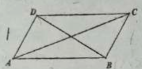
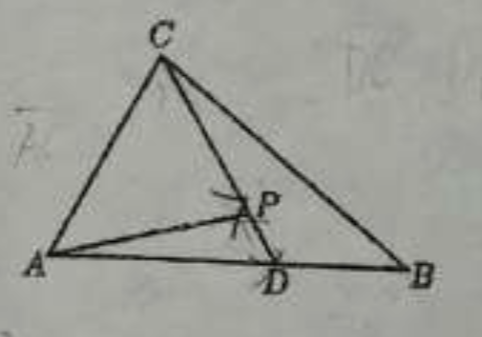

## 20260611 期末复习卷（九）
### 一、填空题
1. 已知复数 $z=\dfrac{3-\text{i}}{2+\text{i}} - b\text{i}$（$\text{i}$ 为虚数单位，$b \in \mathbb{R}$）为实数，则 $b=$\_\_\_\_\_\_\_\_\_\_\_\_。
2. 已知 $\vec{b}=(3,1)$，$\vec{c}=(2,-1)$，$\vec{a}=2\vec{b}-\vec{c}$，则 $\vec{a}$ 的单位向量的坐标为\_\_\_\_\_\_\_\_\_\_\_\_。
3. 若 $\sin\theta:\cos \dfrac{\theta}{2} =2:3$，则 $\cos\theta=$\_\_\_\_\_\_\_\_\_\_\_\_。
4. ❌若等差数列$\{a_n\}$中，$a_1<0$，$S_n$ 为前 $n$ 项和，$S_7=S_{13}$，则当 $S_n$ 最小时 $n=$\_\_\_\_\_\_\_\_\_\_\_\_。
5. 如图，在平行四边形 $ABCD$ 中，$AB=2$，$AD=1$，则 $\overrightarrow{AC} \cdot \overrightarrow{BD}$ 的值为\_\_\_\_\_\_\_\_\_\_\_\_。
6. ❌若 $1+\dfrac{1}{2}+\dfrac{1}{2^2}+\dfrac{1}{2^3}+\dots+\dfrac{1}{2^{n-1}}>\dfrac{127}{64}$，则正整数 $n$ 的最小值是\_\_\_\_\_\_\_\_\_\_\_\_。
7. 已知等比数列$\{a_n\}$的公比为 $2$，前 $4$ 项的和是 $1$，则前 $8$ 项的和为\_\_\_\_\_\_\_\_\_\_\_\_。
8. 已知复数 $z$ 满足 $|z-\text{i}|=2$，$\overline{z}$ 为 $z$ 的共轭复数，则 $z \cdot \overline{z}$ 的最大值为\_\_\_\_\_\_\_\_\_\_\_\_。
9. 已知向量 $\vec{a},\vec{b}$ 满足 $|\vec{a}|=1$，$\vec{a} \perp \vec{b}$，则向量 $\vec{a}-2\vec{b}$ 在向量 $\vec{a}$ 方向上的投影向量为\_\_\_\_\_\_\_\_\_\_\_\_。
10. 如图所示，在$\triangle ABC$中，$\overrightarrow{AD}=\dfrac{3}{5}\overrightarrow{AB}$，$P$ 为 $CD$ 上一点，且满足 $\overrightarrow{AP}=m\overrightarrow{AC}+\dfrac{3}{7}\overrightarrow{AB}$，则 $m=$\_\_\_\_\_\_\_\_\_\_\_\_。
11. 若数列$1,2\cos\theta,2^2\cos^2\theta,2^3\cos^3\theta,\dots$，前 $100$ 项之和为 $0$，则 $\theta$ 的值为\_\_\_\_\_\_\_\_\_\_\_\_。
12. 已知函数$f(x)=\begin{cases}(3-a)x-3,(x \le 7)\\a^{x-6},(x>7)\end{cases}$，数列$\{a_n\}$满足$a_n=f(n)\ (n \in \mathbb{N}^*)$，且$\{a_n\}$是严格递增数列，则实数$a$的取值范围是\_\_\_\_\_\_\_\_\_\_\_\_。

### 二、选择题
13. 已知复数 $z_1,z_2$ 在复平面内对应的点分别为$(1,-1),(0,-1)$，则 $\dfrac{z_1}{z_2}=$（）
A. $1+\text{i}$                              B. $1-\text{i}$                                   C. $-1+\text{i}$                        D. $-1-\text{i}$

14. 如果$\vec{a},\vec{b}$是两个非零向量，那么“$\vec{a} \cdot \vec{b}=0$”是“$|\vec{a}+\vec{b}|=|\vec{a}-\vec{b}|$”的（）条件
A. 充要                             B. 充分非必要                       C. 必要非充分              D. 既非充分也非必要

15. 已知$\sin\left(2x+\dfrac{\pi}{4}\right)=-\dfrac{\sqrt{2}}{2},x \in \left(-\dfrac{\pi}{2},\dfrac{\pi}{2}\right)$，则$x$的值为（）
A. $\dfrac{\pi}{4}$                                  B. $-\dfrac{\pi}{4}$                                  C. $-\dfrac{\pi}{4}$或$\dfrac{\pi}{4}$                     D. $-\dfrac{\pi}{4}$或$\dfrac{\pi}{6}$

16. 已知数列$\{a_n\}$，$a_n=2^n+1$，则$\dfrac{1}{a_2-a_1}+\dfrac{1}{a_3-a_2}+\dots+\dfrac{1}{a_{n+1}-a_n}=$（）
A. $1+\dfrac{1}{2^n}$                         B. $1-2^n$                              C. $1-\dfrac{1}{2^n}$                          D. $1+2^n$

### 三、解答题
15. 已知坐标平面上三个点 $A(1,1)$、$B(4,2)$ 与 $C(-2,-6)$。
(1) 求$\triangle ABC$的面积。
(2) 若 $A,B,C,D$ 四点按顺时针顺序构成平行四边形，求点 $D$ 的坐标。

16. 已知数列$\{a_n\}\ (n \in \mathbb{N}^*)$，若$\{a_n+a_{n+1}\}$为等比数列，则称$\{a_n\}$具有性质P。
(1) 若数列$\{a_n\}$具有性质P，且$a_1=a_2=1,a_3=3$，求$a_4,a_5$的值；
(2) 若$b_n=2^n+(-1)^n$，求证：数列$\{b_n\}$具有性质P。

17. 某厂为提高效益，特投入98万元引进先进设备，并马上投入生产通讯设备。第一年需要的各种费用是12万元，从第二年开始，所需费用会比上一年增加4万元，而每年因引入该设备可获得的年利润为50万元。
(1) 引进该设备多少年后，开始盈利？
(2) 引进该设备若干年后，有两种处理方案：第一种：年平均盈利达到最大值时，以26万元的价格卖出；第二种：盈利总额达到最大值时，以8万元的价格卖出。问哪种方案较为合算？并说明理由。

18. 已知向量$\vec{a}=(\sqrt{3}\sin x,\cos x)$，$\vec{b}=\left(\sin\left(x+\dfrac{\pi}{2}\right),\cos x\right)$，设$f(x)=\vec{a} \cdot \vec{b}$。
(1) 求函数$y=f(x)$的最小正周期；
(2) 在$\triangle ABC$中，角$A、B、C$所对的边分别为$a、b、c$。若$f(A)=1$，$b=4$，三角形$ABC$的面积为$2\sqrt{3}$，求边$a$的长。

19. 给定数列$\{a_n\}$，若满足$a_1=a\ (a>0且a \neq 1)$，对于任意的$n,m \in \mathbb{N}^*$，都有$a_{n+m}=a_n \cdot a_m$，则称数列$\{a_n\}$为指数数列。
(1) 已知数列$\{a_n\},\{b_n\}$的通项公式分别为$a_n=3 \cdot 2^{n-1}$，$b_n=3^n$，试判断$\{a_n\},\{b_n\}$是不是指数数列（请说明理由）；
❌(2) 若数列$\{a_n\}$满足：$a_1=2$，$a_2=4$，$a_{n+2}=3a_{n+1}-2a_n$，证明：$\{a_n\}$是指数数列。