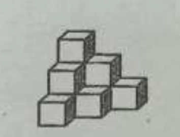

# 第 4 章 数列

## 20260508 数列的基本概念

### 一、填空题
1. $600$ 是数列 $1 \times 2, 2 \times 3, 3 \times 4, 4 \times 5, \dots$ 的第 \_\_\_\_\_\_\_\_\_\_\_\_ 项。
2. 在数列 $\{a_n\}$ 中，$a_1=1$，$a_{n+1}-a_n=2$，则 $a_5=$ \_\_\_\_\_\_\_\_\_\_\_\_。
3. 在数列 $\{a_n\}$ 中，$a_4=32$，$\dfrac{a_{n+1}}{a_n}=2$，则 $a_1=$ \_\_\_\_\_\_\_\_\_\_\_\_。
4. 已知数列的首项 $a_1=1$，$a_{n+1}=2a_n-3$，则数列的第 $3$ 项是 \_\_\_\_\_\_\_\_\_\_\_\_。
5. 数列 $1.1, 1.01, 1.001, 1.0001\cdots$ 的一个通项公式为：\_\_\_\_\_\_\_\_\_\_\_\_。
6. ❌数列 $-\dfrac{3}{2}, \dfrac{5}{4}, -\dfrac{7}{8}, \dfrac{9}{16}, \cdots$ 的一个通项公式为：\_\_\_\_\_\_\_\_\_\_\_\_。

### 二、选择题
7. 下列说法不正确的是（）
A. 数列 $1,1,1,1,\dots$ 是无穷数列
B. 数列 $5,4,3,2,1$ 是有穷数列
C. 数列 $1,\dfrac{1}{2},\dfrac{1}{4},\dfrac{1}{8},\dots$ 的一个通项公式是 $a_n=\dfrac{1}{2^n}$
D. 若数列的通项公式为 $a_n=\sin n\pi$，则 $a_6=0$

8. 已知数列 $0,2,4,6,\dots$，则 $14$ 是这个数列的（）
A. 第 $6$ 项                     B. 第 $7$ 项                        C. 第 $8$ 项                   D. 第 $9$ 项

9. 在数列 $1,1,2,3,5,8,x,21,34,55,\dots$ 中，$x$ 的值应当是（）
A. $14$                             B. $13$                               C. $12$                            D. $11$

10. 已知数列 $1,0,1,0,\dots$，则下列选项中，不能作它的通项公式的是（）
A. $\dfrac{1}{2}[1+(-1)^{n+1}]$                                  B. $\dfrac{1-\cos n\pi}{2}$
C. $\sin^2\left(\dfrac{n\pi}{2}\right)$                                          D. $\dfrac{1}{2}[1+(-1)^{n+1}]+(n-1)(n-2)$

### 三、解答题
11. 在数列 $\{a_n\}$ 中，已知 $a_n=n^2-6n-72, n \in \mathbf{N}^*$。
(1) 写出数列 $\{a_n\}$ 的前三项及 $a_{n+1}$；
(2) 数列 $\{a_n\}$ 从第几项开始大于零？

12. 写出下面数列的一个通项公式，使它前面的四项分别是下列各数：
(1) $2,2,2,2,\dots$                                                         (2) $1,-2,3,-4,\dots$
(3) $\dfrac{2^2+1}{2^2-1}, \dfrac{3^2+1}{3^2-1}, \dfrac{4^2+1}{4^2-1}, \dots$                             (4) $0.1, 0.02, 0.003, 0.0004, \dots$

13. 根据下列递推公式写出数列的前 $4$ 项：
(1) $\begin{cases} a_1=3 \\ a_n=2a_{n-1}+1 \ (n \ge 2) \end{cases}$                               (2) $\begin{cases} a_1=100 \\ a_{n+1}=15-a_n \ (n \ge 1) \end{cases}$

14. 分别根据数列的通项公式，求出数列的最大项或最小项。
(1) $a_n=\dfrac{n^2+4}{2n} \ (n \in \mathbf{N}^*)$                  (2) $a_n=-2n^2+17n+2 \ (n \in \mathbf{N}^*)$
(3)❌ $a_n=\dfrac{n-\sqrt{10}}{n-\sqrt{11}} \ (n \in \mathbf{N}^*)$                (4) $a_n=\dfrac{n}{n^2+110} \ (n \in \mathbf{N}^*)$

## 20260509 等差数列的通项公式(1)
### 一、填空题
1. 若 $x$ 与 $4$ 的等差中项 $7$，则 $x =$\_\_\_\_\_\_\_\_\_\_\_\_。
2. 等差数列的前三项为 $a-5$，$-3a-4$，$-6a-5$，则 $a =$\_\_\_\_\_\_\_\_\_\_\_\_。
3. 三个数 $a,b,c$ 成等差数列，且 $a+b+c=2007$，则 $b =$\_\_\_\_\_\_\_\_\_\_\_\_。
4. 已知等差数列 $\{a_n\}$ 中，$a_4 = -8$，$a_5 = -11$ 则 $a_8 =$\_\_\_\_\_\_\_\_\_\_\_\_。
5. 在 $1$ 和 $4$ 之间插入 $3$ 个数使它们成等差数列，则这三个数分别为 \_\_\_\_\_\_\_\_\_\_\_\_。
6. ❌若 $x \neq y$，且两个数列 $x,a_1,a_2,y$ 和 $x,b_1,b_2,b_3,y$ 各成等差数列，则 $\dfrac{a_2 - a_1}{b_2 - b_1} =$\_\_\_\_\_\_\_\_\_\_\_\_。

### 二、选择题
7. 等差数列 $\dfrac{3}{2}, -\dfrac{1}{2}, -\dfrac{5}{2}, \dots$ 的通项公式是（）
A. $a_n = 2n - \dfrac{1}{2}$                                        B. $a_n = \dfrac{3}{2} - 2n$                              C. $a_n = \dfrac{7 - 4n}{2}$                      D. $a_n = \dfrac{3}{2} + 2n$

8. “$a + c = 2b$”是 $a,b,c$ 成等差数列的（）
A. 必要条件                            B. 充分条件                                      C. 充要条件                               D. 非充分非必要条件

9. 已知 $a$ 和 $2b$ 的等差中项是 $5$，$2a$ 和 $b$ 的等差中项是 $4$，则 $a$ 和 $b$ 的等差中项是（）
A. $\dfrac{3}{2}$                                               B. $3$                                              C. $6$                                               D. $9$

10. 三个数 $a,b,c$ 的倒数成等差数列，且 $a,b,c$ 互不相等，则 $\dfrac{a - b}{b - c}$ 为（）
A. $\dfrac{c}{a}$                                              B. $\dfrac{a}{b}$                                          C. $\dfrac{a}{c}$                                                D. $\dfrac{b}{c}$

### 三、解答题
11. 已知三个数成等差数列，其和为 $15$，首末两数的积为 $9$，求这三个数。

12. 假设体育场一角看台的座位从第 $2$ 排起每一排都比前一排多相等数目的座位。若第 $3$ 排有 $10$ 个座位，第 $9$ 排有 $28$ 个座位，则第 $12$ 排有多少个座位？

13. ❌‼️已知 $\triangle ABC$ 中，设 $\lg\sin A, \lg\sin B, \lg\sin C$ 成等差数列，且三内角 $A,B,C$ 也成等差数列，求证：$\triangle ABC$ 为正三角形。

14. 已知等差数列 $\{a_n\}$ 中，$a_1 + a_2 + a_3 = 9$，$a_1 \cdot a_2 \cdot a_3 = 15$，求 $a_{10}$ 及通项公式 $a_n$。

15. 已知等差数列 $\{a_n\}$ 中，$a_1 = 2$，$a_4 = 3$，若在每相邻两项之间插入三个数，使它和原数列的数构成一个新的等差数列，求：(1) 原数列的第 $12$ 项是新数列的第几项？(2) 新数列的第 $29$ 项是否是原数列中的项？若是，是第几项？

## 20260511 等差数列的前 n 项的和(1)
### 一、填空题
1. ❌在等差数列 $\{a_n\}$ 中，$a_1 = 3$，$a_{10} = -\dfrac{3}{2}$，则前 20 项之和 $S_{20} =$ \_\_\_\_\_\_。
2. 在等差数列 $\{a_n\}$ 中，$a_6 + a_9 + a_{12} + a_{15} = 30$，则前 20 项之和 $S_{20} =$ \_\_\_\_\_\_。
3. 在等差数列 $\{a_n\}$ 中，$a_3 + a_7 + 2a_{15}= 40$，则前 19 项之和 $S_{19} =$ \_\_\_\_\_\_。
4. 在数列 $\{a_n\}$ 中，前 $n$ 项之和 $S_n = n^2 + 3n + 1$，则 $a_1 + a_3 + a_5 =$ \_\_\_\_\_\_。
5. 在数列 $\{a_n\}$ 中，$a_1 = 1$，$\dfrac{1}{a_{n+1}} = \dfrac{1}{a_n} + \dfrac{1}{3}(n \in \mathbb{N}^*)$，则 $a_{50} =$ \_\_\_\_\_\_。
6. 已知数列 $\{a_n\}$ 的前 $n$ 项和 $S_n = An^2 + Bn + C$，则 $\{a_n\}$ 是等差数列的必要条件是\_\_\_\_\_\_。

### 二、选择题
7. 如果凸五边形各内角的度数成等差数列，那么必有一个内角为（）
A. $108^\circ$                                   B. $120^\circ$                                       C. $90^\circ$                                  D. $72^\circ$

8. 已知等差数列 $\{a_n\}$ 的公差为 $d$，且 $d \neq 0$，$a_1 \neq d$，若等差数列的前 20 项的和 $S_{20} = 10M$，则 $M$ 为（）
A. $a_5 + a_{15}$                           B. $a_2 + 2a_{10}$                             C. $a_{20} + d$                          D. $a_7 + a_{14}$

9. 一个首项为 23，公差为整数的等差数列，如果前六项均为正数，第七项起为负数，则它的公差为（）
A. $-2$                                       B. $-3$                                          C. $-4$                                   D. $-5$

10. 若数列 $\{a_n\}$ 是等差数列，首项 $a_1 > 0$，$a_{2003} + a_{2004} > 0$；$a_{2003} \cdot a_{2004} < 0$，则使前 $n$ 项和 $S_n > 0$ 成立的最大自然数 $n$ 是（）
A. $4005$                                   B. $4006$                                      C. $4007$                                    D. $4008$

### 三、解答题
11. 已知等差数列 $\{a_n\}$ 中，$S_{10} = 100$，$S_{100} = 10$，求 $S_{110}$。

12. 已知数列 $\{a_n\}$ 的前 $n$ 项和 $S_n = -\dfrac{3}{2}n^2 + \dfrac{205}{2}n$，则数列 $\{a_n\}$ 的通项公式为\_\_\_\_\_\_。

13. 一个等差数列的首项为 20，公差为 $-3$，当 $n$ 为何值时，前 $n$ 项的和最大？并求此最大值。

14. 在等差数列 $\{a_n\}$ 中，$a_1 = 10$，$S_{10} > 0$，$S_{11} < 0$，
(1) 求公差 $d$ 的取值范围。         (2) ❌问 $n$ 为何值时，$S_n$ 取得最大值？

15. 把正整数按下列方法分组：$(1)$，$(2, 3)$，$(4, 5, 6)$，…，其中每组都比它的前一组多一个数，设 $S_n$ 表示第 $n$ 组中所有各数的和，那么 $S_{21}$ 等于（）
A. $1\ 113$                                    B. $4\ 641$                                         C. $5\ 082$                            D. $53\ 361$

## 20260512 等差数列的前 n 项的和(2)

### 一、填空题
1. 已知数列 $\{a_n\}$ 为等差数列，$a_1 = 1$，$a_2 = 4$，则 $S_{10} =$\_\_\_\_\_\_\_\_\_\_。
2. 已知 $\{a_n\}$ 为等差数列，$a_1 = 50$，$d = -2$，$S_n = 0$，则 $n =$\_\_\_\_\_\_\_\_\_\_。
3. ❌在 $1$ 与 $6$ 之间插入 $3$ 个数，使这 $5$ 个数成等差数列，则这三个数的和为 \_\_\_\_\_\_\_\_\_\_。
4. 已知等差数列为 $100, 99\ \dfrac{1}{3}, \dots, -24$，其 $100$ 项的和为 \_\_\_\_\_\_\_\_\_\_。
5. 若各项均为整数的等差数列 $\{a_n\}$ 的公差 $d = -3$，并且有 $S_{11} < 0 < S_{10}$，则其首项 $a_1 =$\_\_\_\_\_\_\_\_\_\_。
6. 已知等差数列 $\{a_n\}$ 中，$a_1 = -25$，$S_3 = S_8$，则当 $a_n > 0$ 时，最小的正整数 $n =$\_\_\_\_\_\_\_\_\_\_。

### 二、选择题
7. 已知等差数列 $\{a_n\}$ 的通项公式是 $a_n = 2n - 28$，则首项为正值的项是（）
A. 第 $14$ 项                                                              B. 第 $15$ 项
C. 第 $14$ 项或第 $15$ 项                                         D. 第 $16$ 项

8. 已知等差数列 $\{a_n\}$ 中，前 $n$ 项和 $S_n = n^2 - 15n$，则使 $S_n$ 为最小值的 $n$ 是（）
A. $7$                                           B. $8$
C. $7$ 或 $8$                                  D. $9$

9. 若等差数列 $\{a_n\}$ 的前 $23$ 项之和和 $S_{23} > 0$，则必能断定该数列中（）
A. $a_{23} > 0$                               B. $a_{22} > 0$                         C. $a_{12} > 0$                               D. $a_{11} > 0$

10. 已知数列 $\{a_n\}$ 为等差数列，若 $\dfrac{a_{11}}{a_{10}} < -1$，且它们的前 $n$ 项和 $S_n$ 有最大值，则使 $S_n > 0$ 的 $n$ 的最大值为（）
A. $11$                                      B. $19$                                        C. $20$                                       D. $21$

### 三、解答题
11. 在等差数列 $\{a_n\}$ 中，已知 $a_1 = -3$，$11a_5 = 5a_8$。求数列 $\{a_n\}$ 的前 $n$ 项和 $S_n$ 的最小值。

12. 已知等差数列 $\{a_n\}$，其前 $n$ 项和为 $S_n$。若存在两个不相等的正整数 $p$ 和 $q$，满足 $S_p = q$，$S_q = p$，求 $S_{p+q}$。

13. ❌在等差数列 $\{a_n\}$ 中，其前 $n$ 项和为 $S_n$。已知公差 $d = 2$，$S_{20} = 400$。
(1) 写出 $\sum_{k=1}^{10} a_{2k-1}$ 的具体展开式，并求其值；
(2) 用求和符号表示 $a_2 + a_4 + a_6 + \dots + a_{20}$，并求其值。

14. 某产品按质量分成 $10$ 个档次，生产最低档次产品的利润是 $8$ 元/件。每提高一个档次，每件产品的利润增加 $2$ 元，但产量每天减少 $3$ 件。如果在某段时间内，最低档次（记作第 $1$ 档次）的产品每天可生产 $60$ 件，那么在该段时间内，生产第几档次的产品可获得最大利润？

## 20260519 等比数列的通项公式(1)
### 一、填空题
1. ❌等比数列 $\{a_n\}$ 中，已知 $a_1 = 2007$，$q = \dfrac{1}{7}$，求 $\{a_n\}$ 的通项公式 \_\_\_\_\_\_\_\_\_\_\_\_。
2. $a^4 + a^2b^2$ 与 $b^4 + a^2b^2$（$ab \neq 0$）的等比中项是 \_\_\_\_\_\_\_\_\_\_\_\_。
3. 三个实数 $a,b,c$ 成等差数列，又成等比数列，则 $a:b:c =$ \_\_\_\_\_\_\_\_\_\_\_\_。
4. 数列 $\{a_n\}$ 中，若 $a_1 = 3$，$a_n = 2a_{n+1}$，则 $a_4 =$ \_\_\_\_\_\_\_\_\_\_\_\_。
5. 若 $a,b,c$ 成等比数列，则函数 $y = ax^2 + bx + c$ 的图像与 $x$ 轴的交点的个数为 \_\_\_\_\_\_\_\_\_\_\_\_ 个。
6. 等比数列 $\{a_n\}$ 中，$a_1 + a_2 = 2a_3$，则公比 $q$ 的值是 \_\_\_\_\_\_\_\_\_\_\_\_。

### 二、选择题
7. 已知 $\{a_n\}$ 是公比为 $q(q \neq 1)$ 的等比数列，则数列 ①$\{2^{a_n}\}$ ②$\{a_n^2\}$ ③$\{\dfrac{1}{a_n^2}\}$ ④$\{2a_n\}$ 中等比数列的个数是（）
A. 1                            B. 2                           C. 3                           D. 4

8. 下列命题中，真命题的个数为（）
① 在等比数列中，至少可以有一项为 0 ② 常数列既是等差数列，也是等比数列
③ 在等比数列 $\{a_n\}$ 中，若公比大于 1，则 $\{a_n\}$ 是递增数列
A. 0 个                       B. 1 个                     C. 2 个                      D. 3 个

9. $2, 2^x - 1, 2^x + 3$ 成等比数列，则 $x$ 的值等于（）
A. 0                             B. $\log_2 5$                C. 6                           D. $\log_2 6$

10. $\lg a$、$\lg b$、$\lg c$ 成等差数列是 $a$、$b$、$c$ 成等比数列的（）
A. 充分不必要条件                      B. 必要不充分条件
C. 充要条件                                    D. 非充分非必要条件

### 三、解答题
11. 已知 $b$ 是 $a$、$c$ 的等差中项，$a$、$b$、$c$ 三数之和为 9 且 $b-1$ 是 $a$、$c-1$ 的等比中项，求 $a$、$b$、$c$ 的值。

12. 等比数列 $\{a_n\}$ 中，已知 $a_1 + a_2 + a_3 = 6$，$a_4 + a_5 + a_6 = 48$，求数列的通项公式。

13. 各项都是正数的等比数列 $\{a_n\}$ 的公比 $q \neq 1$，且 $a_2, \dfrac{1}{2}a_3, a_1$ 成等差数列，则 $\dfrac{a_3 + a_4}{a_4 + a_5}$ 的值为多少？

14. 设二次方程 $a_nx^2 - a_{n+1}x + 1 = 0$（$n \in \mathbb{N}^*$）有两个实根 $\alpha$ 和 $\beta$，且满足 $6\alpha - 2\alpha\beta + 6\beta = 3$。
(1) 试用 $a_n$ 表示 $a_{n+1}$；
(2) ❌求证：$\{a_n - \dfrac{2}{3}\}$ 是等比数列。

## 20260520 等比数列前n项和

### 一、填空题
1. 等比数列 $\{a_n\}$ 中，$a_1=8, q=\dfrac{1}{2}$，则 $S_5 =$ \_\_\_\_\_\_\_\_\_\_\_\_。
2. 等比数列 $\{a_n\}$ 中，公比 $q=2, S_4=1$，则 $S_8 =$ \_\_\_\_\_\_\_\_\_\_\_\_。
3. 等比数列 $\{a_n\}$ 中，$S_n=2^n-1$，则 $a_1^2+a_2^2+\dots+a_n^2 =$ \_\_\_\_\_\_\_\_\_\_\_\_。
4. 等比数列 $\{a_n\}$ 中，$S_7=48, S_{14}=60$，则 $S_{21} =$ \_\_\_\_\_\_\_\_\_\_\_\_。
5. $1+\dfrac{1}{2}+\dfrac{1}{2^2}+\dots+\dfrac{1}{2^n} =$ \_\_\_\_\_\_\_\_\_\_\_\_。
6. ❌等比数列 $\{a_n\}$ 中，$a_1+a_2+a_3=18, a_2+a_3+a_4=-9$，则 $S_n =$ \_\_\_\_\_\_\_\_\_\_\_\_。
7. 等比数列 $\{a_n\}$ 的前 $n$ 项和记为 $S_n$，且 $a_3=3S_2+2, a_4=3S_3+2$，则公比等于 \_\_\_\_\_\_\_\_\_\_\_\_。
8. 等比数列前 $n$ 项和为 $S_n=3^n+k$，则 $k =$ \_\_\_\_\_\_\_\_\_\_\_\_。
9. ❌数列 $9, 99, 999, \dots, \underbrace{99\cdots9}_{n个9}$ 的和为 \_\_\_\_\_\_\_\_\_\_\_\_。
10. 如果 $\lg x + \lg x^2 + \dots + \lg x^{10} = 110$，那么 $\lg x + \lg^2 x + \dots + \lg^{10} x =$ \_\_\_\_\_\_\_\_\_\_\_\_。

### 二、选择题
11. 设等比数列 $\{a_n\}$ 的前 $n$ 项和为 $S_n$，若 $\dfrac{S_6}{S_3}=3$，则 $\dfrac{S_9}{S_6} =$（ ）
A. $2$                          B. $\dfrac{7}{3}$                          C. $\dfrac{8}{3}$                          D. $3$

12. 设等比数列 $\{a_n\}$ 的前 $n$ 项和为 $S_n$，若 $S_2:S_3=3:2$，则公比 $q$ 为（ ）
A. $1$                                                           B. $1$ 或 $-\dfrac{1}{2}$ 
C. $-\dfrac{1}{2}$                                                     D. $-1$ 或 $\dfrac{1}{2}$

### 三、解答题
13. ❌设等比数列 $\{a_n\}$ 的公比 $q<1$，前 $n$ 项和为 $S_n$。已知 $a_3=2, S_4=5S_2$，求数列 $\{a_n\}$ 的通项公式。

14. 设 $S_n$ 是数列 $\{a_n\}$ 的前 $n$ 项和，且 $S_n=2a_n-2\ (n\in \mathbf{N}^*)$，求数列 $\{a_n\}$ 的通项公式。

15. ❌设 $\{a_n\}$ 是公比大于 $1$ 的等比数列，已知 $S_3=7$，且 $a_1+3, 3a_2, a_3+4$ 构成等差数列。
(1) 求数列 $\{a_n\}$ 的通项公式。
(2) 令 $b_n=\ln a_{3n+1},\ n=1,2,\dots$，求数列 $\{b_n\}$ 的前 $n$ 项和 $T_n$。

16. 一个球从 $100\ \text{m}$ 高处自由落下，假设每次着地后又跳回到原高度的一半再落下。
(1) 当它第 $10$ 次着地时，求它经过的总路程；
(2) 它可能在某次着地时，经过的总路程超过 $300\ \text{m}$ 吗？如果可能，请说明是第几次着地首次超过 $300\ \text{m}$；如果不可能，请说明理由。

## 20260522 数列的通项公式

### 一、填空题
1. 已知数列 $\{a_n\}$ 前 $n$ 项和 $S_n = -n^2$，则 $a_n =$ \_\_\_\_\_\_\_\_\_\_\_\_
2. 已知数列 $\{a_n\}$ 前 $n$ 项和 $S_n = -n^2 + 1$，则 $a_n =$ \_\_\_\_\_\_\_\_\_\_\_\_
3. ❌数列 $\{a_n\}$ 满足 $a_1 = 0$，且 $\dfrac{1}{1-a_{n+1}} - \dfrac{1}{1-a_n} = 2$（$n \in N^*$），则通项公式 $a_n =$ \_\_\_\_\_\_\_\_\_\_\_\_
4. 在数列 $\{a_n\}$ 中，$a_1 = \dfrac{1}{3}$，并且对任意 $n \in N^*, n \ge 2$ 都有 $a_n \cdot a_{n-1} = a_{n-1} - a_n$ 成立，则 $a_n =$ \_\_\_\_\_\_\_\_\_\_\_\_
5. 已知数列 $\{a_n\}$ 满足 $a_1 = 1$，$a_n - a_{n-1} = n$（$n \ge 2$），则 $a_n =$ \_\_\_\_\_\_\_\_\_\_\_\_
6. 在数列 $\{a_n\}$ 中，$3a_{n+1} = 3a_n + 2$（$n \in N$），且 $a_2 + a_4 + a_7 + a_9 = 20$，则 $a_{10} =$ \_\_\_\_\_\_\_\_\_\_\_\_
7. 数列 $\{a_n\}$ 中，$a_1 = 1$，对于 $n \ge 2$，$n \in N^*$ 都有 $a_1 \cdot a_2 \cdot a_3 \cdots a_n = n^2$，则 $a_3 + a_5 =$ \_\_\_\_\_\_\_\_\_\_\_\_
8. 将棱长相等的正方体按如图所示的形状摆放，从上往下依次为第 1 层、第 2 层、第 3 层、……则第 20 层正方体的个数是 \_\_\_\_\_\_\_\_\_\_\_\_
9. ❌数列 $\{a_n\}$ 的首项为 3，$\{b_n\}$ 为等差数列且 $b_n = a_{n+1} - a_n$（$n \in N^*$）。若 $b_3 = -2$，$b_{10} = 12$，则 $a_n =$ \_\_\_\_\_\_\_\_\_\_\_\_

### 二、选择题
10. 在数列 $\{a_n\}$ 中，$a_1 = -2$，$a_{n+1} = 2a_n + n$，则 $a_3 =$（ ）
A. $-6$                        B. $-5$                              C. $-4$                    D. $-3$
11. 数列 $\{a_n\}$ 的前 $n$ 项和 $S_n = n^2 \cdot a_n$（$n \ge 2$），而 $a_1 = 1$，通过计算，猜想 $a_n =$（ ）
A. $\dfrac{2}{(n+1)^2}$                                  B. $\dfrac{2}{(n+1)n}$                              C. $\dfrac{2}{2^n - 1}$                           D. $\dfrac{2}{2n - 1}$

### 三、解答题
12. 在数列 $\{a_n\}$ 中，$a_1 = 2$，且 $a_n = a_{n-1} + \lg \dfrac{n}{n-1}$（$n \ge 2$）。求数列 $\{a_n\}$ 的通项公式。
13. 已知数列 $\{a_n\}$ 中，$a_1 = 2$，$a_{n+1} = 3a_n + 2$，求数列 $\{a_n\}$ 的通项公式及前 $n$ 项和 $S_n$。
14. 已知数列 $\{a_n\}$ 满足 $a_1 = 2$，$a_n > 0$，且 $(n+1) \cdot a_n^2 + a_n \cdot a_{n+1} - n \cdot a_{n+1}^2 = 0$。求数列 $\{a_n\}$ 的通项公式。
15. 已知数列 $\{a_n\}$ 满足 $a_1 = 1, a_2 = 4, a_{n+2} = 4a_{n+1} - 3a_n$（$n \in N^*$）。
(1) 求 $a_3, a_4$ 的值；
(2) 证明：数列 $\{a_{n+1} - a_n\}$ 是等比数列；
(3) ❌求数列 $\{a_n\}$ 的通项公式。