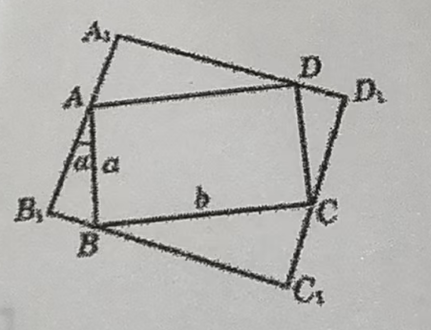
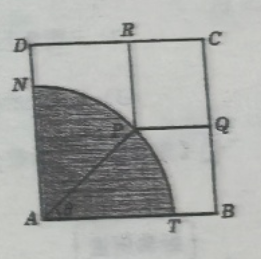
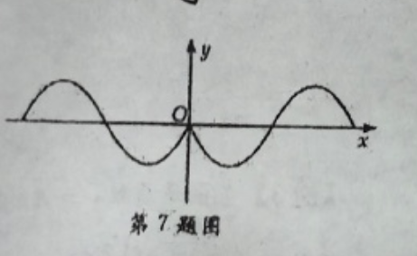
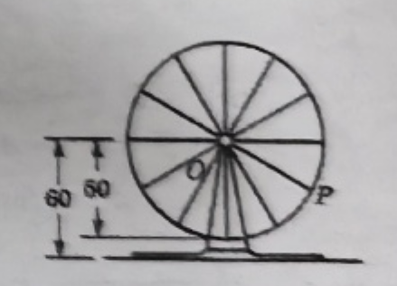
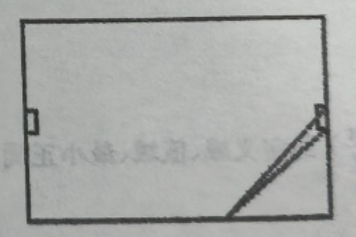

# 第 七 章 三角函数
## 20260326 正弦函数和余弦函数的定义域以及值域
### 一、填空题
1. ❌函数 $y = \sqrt{-2\sin^2 x + \sin x}$ 的定义域是\_\_\_\_\_\_\_\_\_\_\_\_。
2. 函数 $y = \sin^2 2x + \sin 2x$ 的值域是\_\_\_\_\_\_\_\_\_\_\_\_。
3. 要使 $\cos x \cdot \sin x = m - 2$ 有意义，实数 $m$ 的取值范围是\_\_\_\_\_\_\_\_\_\_\_\_。
4. 已知函数 $y = a\sin x + b$ 的最大值为 $1$，取小值为 $-7$，则函数 $y = a\sin x + b\cos x$ 的最大值是\_\_\_\_\_\_\_\_\_\_\_\_。
5. ❌若 $\sin |x| = \sin(-x)$，则 $x$ 的取值范围是\_\_\_\_\_\_\_\_\_\_\_\_。
6. 已知：$\theta \in (0, \dfrac{\pi}{2})$，且函数 $y = (\sin\theta)^{x^2 - 6x + 5}$ 的最大值为 $16$，则 $\theta =$\_\_\_\_\_\_\_\_\_\_\_\_。

### 二、选择题
7. 使 $y = 3 - \cos\dfrac{x}{2}$ 取最小值的 $x$ 的集合是（  ）
A. $\{x \mid x = 4k\pi, k \in \Z\}$                         B. $\{x \mid x = 2k\pi, k \in \Z\}$
C. $\{x \mid x = k\pi, k \in \Z\}$                             D. $\{x \mid x = \dfrac{3}{2}k\pi, k \in \Z\}$

8. 函数 $y = -\sin^2 x + 4\sin x + \dfrac{7}{4}$ 的值域是（  ）
A. $[-\dfrac{13}{4}, \dfrac{23}{4}]$                                B. $[-\dfrac{13}{4}, \dfrac{19}{4}]$                             C. $[\dfrac{19}{4}, \dfrac{23}{4}]$                     D. $(-\infty, \dfrac{23}{4}]$

9. 使 $m^2 + 2m - \sin x = 0\ (x \in \R)$ 成立的实数 $m$ 满足的条件是（  ）
A. $m < -2$ 或 $m > 0$                                                  B. $-1 \le m \le 1$
C. $-1 - \sqrt{2} \le m \le -1 + \sqrt{2}$                              D. 全体实数

10. 如果函数 $f(x)$ 的定义域是 $(0, \dfrac{1}{2}]$，那么 $f(\sin x \cos x)$ 的定义域为（  ）
A. $(2k\pi, (2k+1)\pi)\ (k \in \Z)$                                     B. $(2k\pi, (2k+\dfrac{1}{2})\pi)\ (k \in \Z)$
C. $(k\pi, (k+\dfrac{1}{2})\pi)\ (k \in \Z)$                                        D. $\R$

### 三、解答题
11. 求下列函数的定义域：
❌(1) $y = \sqrt{\cos(\sin x)}$；                                 (2) $y = \sqrt{25 - x^2} + \lg\cos x$。

12. 求下列函数的最大值：
(1) $f(x) = \cos^2 x - \sin x + 3$；              (2) $y = \sin^2 x + \sin x \cos x$。

13. 函数 $f(x) = 2a\sin x \cos x + 2b\cos^2 x$，$f(\dfrac{\pi}{6}) = \dfrac{3\sqrt{3}}{2} + 6$，$f(0) = 8$，求 $a,b$ 的值及 $f(x)$ 的最大值。

14. ❌如图，矩形 $ABCD$ 的四个顶点分别在矩形 $A_1B_1C_1D_1$ 的四条边上，$AB = a$，$BC = b$。如果 $AB$ 与 $A_1B_1$ 的夹角为 $\alpha$，那么当 $\alpha$ 取何值时，矩形 $A_1B_1C_1D_1$ 的周长最大？ 

## 20260327 正弦函数和余弦函数的周期性

### 一、填空题
1. $y = \sin x + \sqrt{3}\cos x$ 的最小正周期是\_\_\_\_\_\_\_\_\_\_\_\_\_\_\_。
2. ❌函数 $y = 2\sin(\omega x + \dfrac{\pi}{4})$ 的最小正周期是 $2$，则 $\omega$ 的值为\_\_\_\_\_\_\_\_\_\_\_\_\_\_\_。
3. 函数 $y = \sin\dfrac{\pi}{2}x \cdot \sin\dfrac{\pi}{2}(x-1)$ 的最小正周期是\_\_\_\_\_\_\_\_\_\_\_\_\_\_\_。
4. 已知周期函数 $f(x)$ 是奇函数，其最小正周期是 $6$，若 $f(-1)=1$，求 $f(-5)=$\_\_\_\_\_\_\_\_\_\_\_\_\_\_\_。
5. 函数 $f(x) = 1 - 2\cos^2\omega x$ 的最小正周期是函数 $g(x) = \cos4x$ 的最小正周期的 $2$ 倍，则 $\omega=$\_\_\_\_\_\_\_\_\_\_\_\_\_\_\_。
6. 设 $f(x)$ 是定义域为 $\mathbb{R}$ 且最小正周期为 $\dfrac{5\pi}{2}$ 的函数，且$$f(x) = \begin{cases}\sin x, & 0 \leqslant x < \pi \\ \cos x, & -\pi < x < 0 \end{cases}$$ 则 $f(-\dfrac{11}{4}\pi)=$\_\_\_\_\_\_\_\_\_\_\_\_\_\_\_。

### 二、选择题
7. 函数 $y = \dfrac{\sin x + \cos x + 1}{\cos x + 1}$ 的最小正周期是（  ）
A. $\dfrac{\pi}{2}$                                  B. $\pi$                            C. $2\pi$                             D. $3\pi$

8. 已知函数 $f(x) = \sin(\dfrac{k}{10}x + \dfrac{\pi}{3})(k \neq 0)$，当自变量 $x$ 在任意两个整数之间（包括整数本身）变化时，至少包含一个周期，则最小正整数 $k$ 是（  ）
A. $60$                                   B. $61$                         C. $62$                             D. $63$

9. 对于函数 $f(x) = \sin^2\dfrac{\pi x}{2}$，使 $f(x+c) = f(x)$ 恒成立的最小正整数 $c$ 是（  ）
A. $1$                                    B. $2$                               C. $3$                               D. $4$

10. 为了使函数 $y = \sin\omega x(\omega > 0)$ 在区间 $[0,1]$ 上至少出现 $50$ 次最大值，则 $\omega$ 的最小值是（  ）
A. $98\pi$                            B. $\dfrac{197}{2}\pi$                          C. $\dfrac{199}{2}\pi$                       D. $100\pi$

### 三、解答题
11. 求下列函数的最小正周期：
(1) $y = 1 + 2\sin(\dfrac{\pi}{6} - 3x)$；                                       (2) $y = \dfrac{1}{2}\cos^2x + \sin x\cos x + \dfrac{3}{2}\sin^2x$；
(3) $y = 2\cos\left(3x - \dfrac{\pi}{4}\right)$；                                             (4) $y = 2\sqrt{3}\sin x\cos x + 2\cos^2x - 1$。

12. 已知函数 $f(x) = \sqrt{3}\sin(2x - \dfrac{\pi}{6}) + 2\sin^2(x - \dfrac{\pi}{12})(x \in \mathbb{R})$
(1) 求函数 $f(x)$ 的最小正周期；
(2) 求使函数 $f(x)$ 取得最大值的 $x$ 的集合。

13. 如图，有一块边长为 $3\ \text{m}$ 的正方形铁皮 $ABCD$，其中阴影部分 $ATN$ 是一个半径为 $2\ \text{m}$ 的扇形。设这个扇形已经腐蚀不能使用，但其余部分均完好。工人师傅想在未被腐蚀的部分裁下一块其边落在 $BC$ 与 $CD$ 上的矩形铁皮 $PQCR$，使点 $P$ 在弧 $TN$ 上。设 $\angle TAP = \theta$，矩形 $PQCR$ 的面积为 $S\ \text{m}^2$。
(1) 求 $S$ 关于 $\theta$ 的函数表达式；
(2) ❌求 $S$ 的最大值及 $S$ 取得最大值时 $\theta$ 的值。

## 20260330 正弦函数和余弦函数的奇偶性和单调区间

### 一、填空题
1. 函数 $y = \cos(x - \dfrac{\pi}{2})$ 的奇偶性是\_\_\_\_\_\_\_\_\_\_\_\_。
2. 函数 $y = 3\cos(2x + \dfrac{\pi}{3})$ 的单调递减区间是\_\_\_\_\_\_\_\_\_\_\_\_。
3. 函数 $y = \sin x \cdot \sin(\dfrac{\pi}{2} - x)$ 的奇偶性是\_\_\_\_\_\_\_\_\_\_\_\_，单调递增区间是\_\_\_\_\_\_\_\_\_\_\_\_。
4. ❌函数 $y = 2\sin(\dfrac{\pi}{6} - 2x), x \in [0, \pi]$ 的递增区间是\_\_\_\_\_\_\_\_\_\_\_\_。
5. 已知函数 $f(x) = a\sin 2x + bx^3 + 1$，若 $f(-3) = 5$，则 $f(3) =$\_\_\_\_\_\_\_\_\_\_\_\_。
6. ❌已知定义在 $\mathbb{R}$ 上的奇函数 $f(x)$，当 $x < 0$ 时，$f(x) = \cos 3x + \sin 2x$，则当 $x \in \mathbb{R}$ 时，$f(x)$ 的解析式为\_\_\_\_\_\_\_\_\_\_\_\_。

### 二、选择题
7. 函数 $y = \sin x$ 与 $y = \cos x$ 在 $(0, 2\pi)$ 都是递减的区间是
    A. $(0, \dfrac{\pi}{2})$                 B. $(\dfrac{\pi}{2}, \pi)$                     C. $(\pi, \dfrac{3\pi}{2})$                  D. $(\dfrac{3\pi}{2}, 2\pi)$

8. 下列四个函数中，以 $\pi$ 为最小正周期，且在区间 $(\dfrac{\pi}{2}, \pi)$ 上为减函数的是
A. $y = \cos^2 x$                                                   B. $y = 2|\sin x|$
C. $y = (\dfrac{1}{3})^{\cos x}$                                                D. $y = -\cos x$

9. ❌已知奇函数 $f(x)$ 在 $[-1, 0]$ 上为单调递减函数，又 $\alpha, \beta$ 为锐角三角形两内角，则
A. $f(\cos \alpha) > f(\cos \beta)$                                    B. $f(\sin \alpha) > f(\sin \beta)$
C. $f(\sin \alpha) > f(\cos \beta)$                                     D. $f(\sin \alpha) < f(\cos \beta)$

10. 满足下列三个条件：(1)在区间 $(0, \dfrac{\pi}{2})$ 上递增；(2)以 $\pi$ 为周期；(3)为偶函数的函数是
A. $y = \tan x$                                                    B. $y = e^{-\cos x}$
C. $y = \cos |x|$                                                  D. $y = |\sin x|$

### 三、解答题
11. ❌判断下列函数的奇偶性：
(1) $y = \cos(2x - \dfrac{5}{2}\pi)$；                          (2) $y = \sin x \cos(x - \dfrac{\pi}{4}) + \cos x \sin(x - \dfrac{\pi}{4})$。

12. 求下列函数的单调增区间：$y = \sin x (\sin x - \cos x)$。

13. ❌已知函数 $f(x) = (1 + \cos 2x) \sin^2 x, x \in \mathbb{R}$，讨论函数的奇偶性，并求出周期。

14. 已知函数 $f(x) = 2\cos x \sin(x + \dfrac{\pi}{3}) - \sqrt{3} \sin^2 x - \sin x \cos x$。
    (1) 求 $f(x)$ 的最小正周期；  ~~(2) 求 $f(x)$ 的最大值和最小值；~~ 求 $f(x)$, 在 $x \in[\dfrac{\pi}{3},\dfrac{2\pi}{3}]$ 时的值域
    (3) 求 $f(x)$ 的递增区间。

15. 某实验室一天的温度 $y$（单位：$^\circ\text{C}$）随时间 $t$（单位：$\text{h}$）的变化近似满足函数关系：
$y = 10 - \sqrt{3} \cos \dfrac{\pi}{12} t - \sin \dfrac{\pi}{12} t, t \in [0, 24)$。
(1) 求实验室一天中的最大温差；
(2) ❌若要求实验室温度不高于 $11^\circ\text{C}$，则在哪段时间实验室需要降温？

## 20260331 函数 $y = A\sin(\omega x + \varphi)$ 的图像

### 一、填空题
1. 若函数 $y = a + b\sin x$ 的最大值是 $\dfrac{3}{2}$，最小值是 $\dfrac{1}{2}$，则 $a =$ \_\_\_\_\_\_\_\_\_\_\_\_，$b =$ \_\_\_\_\_\_\_\_\_\_\_\_。

2. 函数 $y = -2\sin\left(\dfrac{\pi}{6} - \dfrac{x}{2}\right)$ 的最小正周期是 \_\_\_\_\_\_\_\_\_\_\_\_。

3. ❌已知：函数 $y = A\sin(\omega x + \varphi)$，在同一周期内，当 $x = \dfrac{\pi}{12}$ 时，$y_{\max} = 2$，当 $x = \dfrac{7\pi}{12}$ 时，$y_{\min} = -2$，则函数表达式为 \_\_\_\_\_\_\_\_\_\_\_\_。

4. 函数 $y = \sin x - \cos x$ 的图像可由 $y = \sin x + \cos x$ 的图像向右至少平移 \_\_\_\_\_\_\_\_\_\_\_\_ 个单位得到。

5. 将函数 $y = f(x)$ 的图像上各点的纵坐标保持不变，横坐标缩短为原来的 $\dfrac{1}{3}$，再把所有点的纵坐标伸长为原来的 $4$ 倍，这样得到的曲线与 $y = \sin x$ 的图像相同，则函数 $f(x) =$ \_\_\_\_\_\_\_\_\_\_\_\_。

6. 已知曲线 $y = A\sin(\omega x + \varphi) (A>0, \omega>0)$ 上的一个最高点的坐标是 $(2, \sqrt{3})$，由这个最高点到相邻的最低点，曲线交 $x$ 轴于 $(6,0)$ 点，则该曲线的解析式为 \_\_\_\_\_\_\_\_\_\_\_\_。

### 二、选择题
7. 如图，曲线对应的函数是（ ）
A. $y = |\sin x|$                                                   B. $y = \sin |x|$
C. $y = -\sin |x|$                                                  D. $y = -|\sin x|$

8. 将函数 $y = \sin\left(2x + \dfrac{\pi}{6}\right)$ 的图像向左平移 $\dfrac{\pi}{6}$ 个单位所对应的函数是（ ）
A. $y = \sin\left(2x + \dfrac{\pi}{3}\right)$                    B. $y = \sin\left(2x - \dfrac{\pi}{6}\right)$
C. $y = \sin 2x$                                                    D. $y = \cos 2x$

9. ❌将余弦曲线 $y = \cos x$ 上各点的横坐标变为原来的 $\dfrac{1}{2}$，得到函数 $y_1$ 的图像，再将 $y_1$ 的图像向右平移 $\dfrac{\pi}{6}$ 个单位，得到 $y_2$ 的图像，则与 $y_2$ 的图像关于 $y$ 轴对称的函数的解析式是（ ）
A. $y = \cos\left(2x + \dfrac{\pi}{6}\right)$                    B. $y = \cos\left(2x - \dfrac{\pi}{6}\right)$
C. $y = \cos\left(2x + \dfrac{\pi}{3}\right)$                    D. $y = \cos\left(2x - \dfrac{\pi}{3}\right)$

### 三、解答题
10. 利用“五点法”作函数 $y = 2\sin\left(2x - \dfrac{\pi}{3}\right)$ 的图像，并指出这个函数的振幅、周期和初相。

    |      |      |      |      |      |      |
    | ---- | ---- | ---- | ---- | ---- | ---- |
    |      |      |      |      |      |      |
    |      |      |      |      |      |      |
    |      |      |      |      |      |      |

11. 已知函数 $y = \sqrt{3}\sin x + \cos x, x \in \mathbb{R}$。
    (1) 当 $y$ 取最大值时，求自变量 $x$ 的集合；
    (2) 该函数图像可由 $y = \sin x (x \in \mathbb{R})$ 的图像经过怎样的平移和伸缩变换得到？

12. 已知函数 $y = \sin^2 x + \sqrt{3}\sin x \cos x + 2\cos^2 x (x \in \mathbb{R})$。
    (1) 求函数的最小正周期和单调增区间；
    (2) 函数的图像可以由函数 $y = \sin 2x (x \in \mathbb{R})$ 的图像经过怎样的变换得到？

13. 如图，摩天轮上一点 $P$ 距离地面的高度 $y$ 关于时间 $t$ 的函数表达式为 $y = A\sin(\omega t + \varphi) + b$，$\varphi \in [-\pi, \pi]$。已知摩天轮的半径为 $50\ \text{m}$，其中心点 $O$ 距地面 $60\ \text{m}$，摩天轮以每 $30$ 分钟转一圈的方式做匀速转动，而点 $P$ 的起始位置在摩天轮的最低点处。
    (1) 根据条件具体写出 $y(m)$ 关于 $t(\text{min})$ 的函数表达式；
    (2) 在摩天轮转动的一圈内，点 $P$ 有多长时间距离地面超过 $85\ \text{m}$？
    

## 20260401 正切函数的图像

### 一、填空题
1. $f(x) = \dfrac{1}{1 - \tan x}$ 的定义域是\_\_\_\_\_\_\_\_\_\_\_\_。

2. 函数 $y = \tan x - \cot x$ 的最小正周期是\_\_\_\_\_\_\_\_\_\_\_\_。

3. 函数 $y = \tan\left(\dfrac{\pi}{3} - x\right), x \in \left[0, \dfrac{\pi}{3}\right]$ 的值域是\_\_\_\_\_\_\_\_\_\_\_\_。

4. 函数 $y = \tan\left(\dfrac{x}{2} + \dfrac{\pi}{3}\right)$ 的单调递增区间是\_\_\_\_\_\_\_\_\_\_\_\_。

5. 已知 $f(x) = a\tan x^3 + b\sin x + dx + 3$，且 $f(5) = 6$，则 $f(-5) =$\_\_\_\_\_\_\_\_\_\_\_\_。

6. ❌给出下列命题：① 函数 $y = \tan x + \cot x$ 的最小正周期是 $\pi$；② 函数 $y = \tan x$ 在定义域内是增函数；③ $y = \tan x$ 是奇函数，其中真命题的序号是\_\_\_\_\_\_\_\_\_\_\_\_。

---

### 二、选择题
7. 函数 $y = 3\tan\left(\dfrac{x}{\omega} + \dfrac{\pi}{4}\right)(\omega < 0)$ 的最小正周期是（  ）
A. $-\dfrac{\pi}{\omega}$                        B. $-\omega\pi$                           C. $-\dfrac{2\pi}{\omega}$                       D. $2|\omega|\pi$

8. 函数 $y = 2\tan\left(3x - \dfrac{\pi}{4}\right)$ 图像与 $x$ 轴的一个交点坐标是（  ）
A. $\left(\dfrac{4}{3}\pi, 0\right)$              B. $\left(\dfrac{\pi}{12}, 0\right)$                     C. $\left(\dfrac{4\pi}{3}, 0\right)$               D. $\left(\dfrac{\pi}{6}, 0\right)$

9. 如果 $\alpha, \beta \in \left(\dfrac{\pi}{2}, \pi\right)$ 且 $\tan\alpha < \cot\beta$，那么必有（  ）
A. $\alpha < \beta$                     B. $\beta < \alpha$                      C. $\alpha + \beta < \dfrac{3\pi}{2}$            D. $\alpha + \beta > \dfrac{3\pi}{2}$

10. ~~函数 $y = \tan\dfrac{kx}{5}$ 在区间 $[0, 1]$ 内至少有 4 次失去意义，则 $k$ 的最小正整数值是（  ）~~
~~A. $7$               B. $8$                C. $9$                D. $10$~~

### 三、解答题
11. 确定函数 $f(x) = \tan\left(\dfrac{\pi}{6}x + \dfrac{\pi}{3}\right)$ 的定义域、值域、单调性、零点、周期性。

12. 已知函数 $f(x) = \dfrac{\cos^3\left(\frac{x}{2} + \frac{\pi}{2}\right)\cos\frac{x}{2}}{\sin x}$。
(1) 求 $f(x)$ 的定义域；                 (2) 判断函数 $f(x)$ 的奇偶性，并说明理由。

13. 求函数 $y = \tan^2 x + 2\tan x, x \in \left[-\dfrac{\pi}{6}, \dfrac{\pi}{4}\right]$ 的值域。

14. 已知函数 $f(x) = \dfrac{\sqrt{2}\sin x}{\sqrt{1 + \cos^2 x - \sin^2 x}}$。
(1) 求 $f(x)$ 的定义域；                           (2) 判断 $f(x)$ 的奇偶性；
(3)❌ 作出函数 $f(x)$ 的大致图像；         (4)❌ 指出函数 $f(x)$ 的最小正周期和严格增区间。

15. ❌设足球长的宽为 65 米，球门居中，宽 7 米。当足球运动员沿边路带球突破时，距底线多远处射门，对球门所张的角最大？（保留两位小数）
    