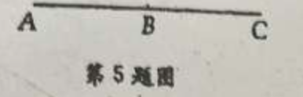
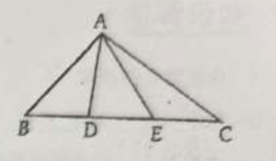
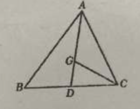
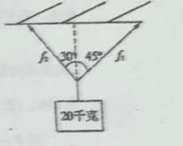
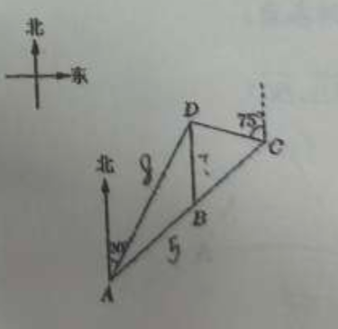

# 第 八 章 平面向量
## 20260424 向量的基本概念和线性运算

### 一、填空题
1. 已知点 $A(-1,1)$ 和 $B(2,5)$，则 $|\overrightarrow{AB}| =$ \_\_\_\_\_\_\_\_\_\_\_\_。
2. 已知 $A(1,7), B(3,5)$，在 $y$ 轴上取一点 $P$，使 $|\overrightarrow{PA}| = |\overrightarrow{PB}|$，则 $P$ 点的坐标是 \_\_\_\_\_\_\_\_\_\_\_\_。
3. $\vec{a} = \vec{b}$ 是 $\vec{a} \parallel \vec{b}$ 的 \_\_\_\_\_\_\_\_\_\_\_\_ 条件。
4. ❌对于所有模相等的向量，如果它们的始点位置相同，那么它们的终点一定在 \_\_\_\_\_\_\_\_\_\_\_\_ 上。
5. 如图，$B$ 是线段 $AC$ 的中点，若分别以图中各点为起点和终点，则最多可以写出 \_\_\_\_\_\_\_\_\_\_\_\_ 个互不相等的非零向量。
6. 给出下列命题：
① 若 $|\vec{a}| = |\vec{b}|$，则 $\vec{a} = \vec{b}$ 或 $\vec{a} = -\vec{b}$
② 若 $\vec{a} \parallel \vec{b}$，则 $|\vec{a}| = |\vec{b}|$
③ 若 $\vec{a} = \vec{0}$，则 $-\vec{a} = -\vec{0}$
④ 若 $\vec{a} = \vec{b}, \vec{b} = \vec{c}$，则 $\vec{a} = \vec{c}$
其中正确的命题是 \_\_\_\_\_\_\_\_\_\_\_\_。

### 二、选择题
7. 下列各量中向量的个数有（）
① 某中学高二年级学生总数
② 地球环绕太阳运行的速度
③ 储蓄中的利息
④ 一盒豆腐的重量
A. 0个                              B. 1个                                   C. 2个                                      D. 3个

8. 两个非零向量 $\vec{a}, \vec{b}$ 互为负向量，则下列各式：
① $\vec{a} + \vec{b} = 0$  ② $\vec{a} + \vec{b} = \vec{0}$  ③ $\vec{a} = -\vec{b}$  ④ $|\vec{a}| = |\vec{b}|$
其中正确的个数是（）
A. 1个                              B. 2个                                   C. 3个                                        D. 4个

9. 若 $O$ 是正三角形 $ABC$ 的中心，向量 $\overrightarrow{AO}, \overrightarrow{OB}, \overrightarrow{OC}$ 是（ ）
A. 有相同起点的向量                                  B. 平行向量
C. 模相等的向量                                           D. 相等的向量

10. 已知 $\vec{a}, \vec{b}, \vec{c}$ 是非零向量，且 $\vec{a} = \vec{c}$，甲：$\vec{a} \parallel \vec{b}$；乙：$\vec{b} = \vec{c}$，则甲是乙的（）
A. 充分非必要条件                                    B. 必要非充分条件
C. 充要条件                                                 D. 既非充分，又非必要条件

### 三、解答题
11. 化简下列向量线性运算：
(1) $4(2\vec{a} - \vec{b}) + 3(3\vec{a} - 2\vec{b})$               (2) $2(3\vec{a} - 4\vec{b} + \vec{c}) - 3(2\vec{a} + \vec{b} - 3\vec{c})$

12. 如图，在 $\triangle ABC$ 中，$D,E$ 是 $BC$ 边上的三等分点，设 $\overrightarrow{AB} = \vec{a}, \overrightarrow{AC} = \vec{b}$，试用 $\vec{a}、\vec{b}$ 表示向量 $\overrightarrow{AD}$ 和 $\overrightarrow{AE}$。
    

13. 如图，在 $\triangle ABC$ 中，已知 $D$ 是 $BC$ 的中点，$G$ 是 $\triangle ABC$ 的重心。设向量 $\overrightarrow{BC} = \vec{a}$，向量 $\overrightarrow{AC} = \vec{b}$。试用 $\vec{a}、\vec{b}$ 分别表示向量 $\overrightarrow{AD}$、$\overrightarrow{AG}$、$\overrightarrow{GC}$。
    

### 三角天天练
1. 在 $\triangle ABC$ 中，$B = 60^\circ, AB = 2, AC = 2\sqrt{3}$，则 $\triangle ABC$ 的面积是 \_\_\_\_\_\_\_\_\_\_\_\_。

2. 已知函数 $f(x) = \sin x \cos\left(\dfrac{\pi}{2} + x\right) + \sqrt{3}\sin x \cos x$
(1) 求函数 $f(x)$ 的最小正周期及单调递增区间；
(2) ❌若 $f(x) = \alpha$ 在区间 $[0, \dfrac{\pi}{2}]$ 上有两个解 $x_1, x_2$，求实数 $\alpha$ 的取值范围。

## 20260427 向量的投影
### 一、填空题
1. 设 $\triangle ABC$ 的重心为 $G$，各边中点分别为 $D$、$E$、$F$，则 $\overrightarrow{GD} + \overrightarrow{GE} + \overrightarrow{GF} =$ \_\_\_\_\_\_\_\_\_\_\_\_。

2. 在直角三角形 $ABC$ 中，若斜边 $BC=4$，直角边 $AB=2$，则 $\langle \overrightarrow{BA}, \overrightarrow{BC} \rangle =$ \_\_\_\_\_\_\_\_\_\_\_\_。

3. 甲往东北方向走了 $50\mathrm{cm}$，然后又折向正西方向走了 $50\sqrt{2}\mathrm{cm}$，这时甲离出发点 \_\_\_\_\_\_\_\_\_\_\_\_ $\mathrm{m}$，方向在 \_\_\_\_\_\_\_\_\_\_\_\_。

4. ❌在等腰三角形 $ABC$ 中，$AB=AC=1$，角 $B=30^\circ$，则 $\overrightarrow{AB}$ 在向量 $\overrightarrow{AC}$ 方向上的数量投影是 \_\_\_\_\_\_\_\_\_\_\_\_。

5. 化简 $(\overrightarrow{AB} - \overrightarrow{CD}) - (\overrightarrow{AC} - \overrightarrow{BD}) =$ \_\_\_\_\_\_\_\_\_\_\_\_。

6. 设向量 $\vec{a}$、$\vec{b}$ 满足 $\langle \vec{a}, \vec{b} \rangle = \dfrac{\pi}{6}$ 且 $|\vec{a}| = |\vec{b}|$，记 $\vec{c}$ 为 $\vec{b}$ 在 $\vec{a}$ 方向上的投影向量。若 $\vec{c} = \lambda \vec{a}$，则 $\lambda =$ \_\_\_\_\_\_\_\_\_\_\_\_。

### 二、选择题
7. 设 $\vec{a}$、$\vec{b}$ 均为非零向量，则 $\langle \vec{a}, \vec{b} \rangle$ 的取值范围为（ ）
A. $(0, \pi)$；                           B. $[0, \pi)$；                              C. $(0, \pi]$；                       D. $[0, \pi]$。

8. 若 $\vec{a} + \vec{b} + \vec{c} = \vec{0}$，则 $\vec{a}$、$\vec{b}$、$\vec{c}$ （ ）
A. 一定可以构成一个三角形                                    B. 一定不可以构成一个三角形
C. 都是非零向量时能构成一个三角形                     D. 都是非零向量时也可能无法构成三角形

9. 在四边形 $ABCD$ 中，若 $\overrightarrow{AC} = \overrightarrow{AB} + \overrightarrow{AD}$，则四边形 $ABCD$ 为（ ）
A. 矩形                                B. 菱形                               C. 正方形                           D. 平行四边形

10. 下列各式中，一定能成立的是（ ）
A. $|\vec{a}| + |\vec{b}| \ge |\vec{a} + \vec{b}|$                                                          B. $|\vec{a}| + |\vec{b}| > |\vec{a} + \vec{b}|$
C. $|\vec{a}| + |\vec{b}| \le |\vec{a} + \vec{b}|$                                                           D. $|\vec{a}| + |\vec{b}| < |\vec{a} + \vec{b}|$

11. 若向量 $\overrightarrow{OP_i} (i=1, 2, 3, \dots, n)$ 在向量 $\overrightarrow{OP}$ 方向上的投影向量相等，则（ ）
A. 点 $P_i (i=1, 2, 3, \dots, n)$ 共线，且该直线垂直于直线 $OP$；
B. 点 $P_i (i=1, 2, 3, \dots, n)$ 共线，且该圆的半径为 $|\overrightarrow{OP}|$；
C. 点 $P_i (i=1, 2, 3, \dots, n)$ 共线，且该直线平行于直线 $OP$；
D. 点 $P_i (i=1, 2, 3, \dots, n)$ 共线，且该直线即为直线 $OP$。

### 三、解答题
13. ❌在三角形 $ABC$ 中，已知 $\sin A : \sin B : \sin C = 2:3:4$，且 $a + b = 10$，求向量 $\overrightarrow{AB}$ 在向量 $\overrightarrow{AC}$ 上的数量投影。

14. [不做]一个质量为 20 千克的物体用两根绳子悬挂起来，如图所示，两个绳子与铅垂线的夹角分别为 $30^\circ$ 和 $45^\circ$，求这两根绳子所承受的力。（精确到 0.1 牛）
    

### 三角天天练
1. ❌函数 $f(x) = \sin \omega x + \sqrt{3} \cos \omega x (x \in \mathbb{R})$，又 $f(\alpha) = -2$，$f(\beta) = 0$ 且 $|\alpha - \beta|$ 的最小值等于 $\dfrac{3\pi}{4}$，则正数 $\omega$ 的值为 \_\_\_\_\_\_\_\_\_\_\_\_。

2. 如下图，某市郊外景区内一条笔直的公路 $a$ 经过三个景点 $A$、$B$、$C$，景区管委会又开发了风景优美的景点 $D$，经测量景点 $D$ 位于景点 $A$ 的北偏东 $30^\circ$ 方向 $8\mathrm{km}$ 处，位于景点 $B$ 的正北方向，还位于景点 $C$ 的北偏西 $75^\circ$ 方向上，已知 $AB = 5\mathrm{km}$。（结果精确到 $0.1\mathrm{km}$）
  (1) 景区管委会准备由景点 $D$ 向景点 $B$ 修建一条笔直的公路，不考虑其他因素，求出这条公路的长；
    (2) 若 ❌$BC = 6\mathrm{km}$，求点 $C$ 与景点 $D$ 之间的距离。
    

## 20260428 向量的数量积的定义和运算
### 一、填空题
1. 已知非零向量 $\vec{a},\vec{b}$ 满足 $|\vec{a}|=|\vec{b}|=|\vec{a}+\vec{b}|$，则 $\vec{a}$ 与 $\vec{b}$ 的夹角 $\theta =$ \_\_\_\_\_\_\_\_\_\_\_\_。
2. 已知 $|\vec{a}|=2$，$|\vec{b}|=2\sqrt{3}$，$\vec{a}\cdot\vec{b}=-2\sqrt{6}$，则 $\vec{a}$ 与 $\vec{b}$ 的夹角 $\theta =$ \_\_\_\_\_\_\_\_\_\_\_\_。
3. 已知 $|\vec{a}|=1$，$|\vec{b}|=2$，$\vec{a}$ 与 $\vec{b}$ 的夹角为 $120^\circ$，则 $|2\vec{a}+\vec{b}|=$ \_\_\_\_\_\_\_\_\_\_\_\_。
4. $\vec{a}=\vec{b}$ 是 $\vec{a^2}=\vec{b^2}$ 成立的  \_\_\_\_\_\_\_\_\_\_\_\_ 条件。
5. 已知 $|\vec{a}|=4$，$|\vec{b}|=5$；$|\vec{a}+\vec{b}|=3$，则 $\vec{a}\cdot\vec{b}=$ \_\_\_\_\_\_\_\_\_\_\_\_。
6. 已知向量 $\overrightarrow{OA}=\vec{a}$，$\overrightarrow{OB}=\vec{b}$ 且 $|\vec{a}|=|\vec{b}|=1$，$\angle AOB=60^\circ$，则 $|\vec{a}+\vec{b}|=$ \_\_\_\_\_\_\_\_\_\_\_\_。
7. 在直角三角形 $ABC$ 中，若 $D$ 是斜边 $AB$ 的中点，$P$ 为线段 $CD$ 的中点，则 $\dfrac{|\overrightarrow{PA}|^2+|\overrightarrow{PB}|^2}{|\overrightarrow{PC}|^2}=$ \_\_\_\_\_\_\_\_\_\_\_\_。

### 二、选择题
8. 对非零向量 $\vec{a},\vec{b}$，下列不等式恒成立的是（）
A. $\vec{a}\cdot\vec{b} \ge |\vec{a}|\cdot|\vec{b}|$                                             B. $\vec{a}\cdot\vec{b} \le |\vec{a}|\cdot|\vec{b}|$
C. $\vec{a}\cdot\vec{b} > |\vec{a}|\cdot|\vec{b}|$                                              D. $\vec{a}\cdot\vec{b} < |\vec{a}|\cdot|\vec{b}|$

9. 下列命题中 ① 若 $\vec{a}$ 与 $\vec{b}$ 互为负向量，则 $\vec{a}+\vec{b}=0$； ② 若 $k$ 为实数，且 $k\vec{a}=\vec{0}$，则 $k=0$ 或 $\vec{a}=\vec{0}$； ③ 若 $\vec{a}\cdot\vec{b}=0$，则 $\vec{a}=\vec{0}$ 或 $\vec{b}=\vec{0}$； ④ 若 $\vec{a}$ 与 $\vec{b}$ 为平行向量，则 $\vec{a}\cdot\vec{b}=|\vec{a}|\cdot|\vec{b}|$，其中真命题的个数为（）
A. 1个                      B. 2个                         C. 3个                             D. 4个

10. 两个非零向量 $\vec{a},\vec{b}$ 垂直的充要条件是（）
A. $\vec{a}\cdot\vec{b}=|\vec{a}||\vec{b}|$                                              B. $\vec{a}\cdot\vec{b}=0$
C. $|\vec{a}+\vec{b}|=|\vec{a}-\vec{b}|$                                        D. $(\vec{a}+\vec{b})\cdot(\vec{a}-\vec{b})=0$

### 三、解答题
11. 已知 $|\vec{a}|=\sqrt{3}$，$|\vec{b}|=1$，$\vec{a}$ 与 $\vec{b}$ 夹角为 $30^\circ$，$\overrightarrow{OD}=2\vec{a}-\vec{b}$，$\overrightarrow{OC}=-\vec{a}+3\vec{b}$，求 $|\overrightarrow{CD}|$。
12. $\text{Rt}\triangle ABC$ 中，$\angle B=90^\circ$，$AB=\sqrt{3}$，$BC=1$，求 $\overrightarrow{AB}\cdot\overrightarrow{BC}+\overrightarrow{BC}\cdot\overrightarrow{CA}+\overrightarrow{CA}\cdot\overrightarrow{AB}$。
13. 设向量 $\vec{a}$、$\vec{b}$、$\vec{c}$ 满足 $\vec{a}+\vec{b}+\vec{c}=\vec{0}$，且 $|\vec{a}|=4$，$|\vec{b}|=3$，$|\vec{c}|=5$。求下列各式的值：
(1) $\vec{a}\cdot\vec{c}$；             (2) $\vec{a}\cdot\vec{b}+\vec{b}\cdot\vec{c}+\vec{c}\cdot\vec{a}$。
14. 已知 $\vec{a}+3\vec{b}$ 与 $7\vec{a}-5\vec{b}$ 垂直，$\vec{a}-4\vec{b}$ 与 $7\vec{a}-2\vec{b}$ 垂直，求 $\vec{a},\vec{b}$ 夹角 $\theta$ 的值。

### 三角天天练
1. 已知角 $\alpha$ 的顶点在坐标原点，始边与 $x$ 轴的正半轴重合，角 $\alpha$ 的终边与单位圆的交点坐标是 $\left(-\dfrac{3}{5},\dfrac{4}{5}\right)$，则 $\sin2\alpha=$ \_\_\_\_\_\_\_\_\_\_\_\_。
2. 已知函数 $f(x)=\cos\left(2x-\dfrac{\pi}{3}\right)+2\sin\left(x-\dfrac{\pi}{4}\right)\sin\left(x+\dfrac{\pi}{4}\right)$，求函数 $f(x)$ 的最小正周期以及 $f(x)$ 在区间 $\left[-\dfrac{\pi}{12},\dfrac{\pi}{2}\right]$ 上的值域。