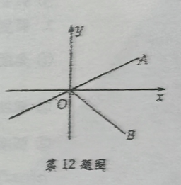
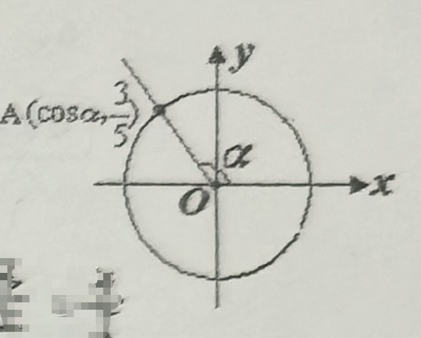

# 第 六 章 三角
## 20260302   任意角及其度量(1)

### 一、填空题  
1. ❌分针经过 2 小时 40 分钟所转过的角度是\_\_\_\_\_\_\_\_度，这个角是\_\_\_\_\_\_\_\_象限角。  
2. 与 \( 950^\circ \) 终边相同的角的集合是 \( \{\alpha \mid \alpha = k \cdot 360^\circ + 230^\circ, k \in \mathbb{Z}\} \)，它是第\_\_\_\_\_\_\_\_象限角，其中最小正角是\_\_\_\_\_\_\_\_°，最大负角是\_\_\_\_\_\_\_\_°。  
3. ❌\( -1005^\circ \) 是第\_\_\_\_\_\_\_\_象限的角，\( 397^\circ \) 是第\_\_\_\_\_\_\_\_象限角。  
4. ❌已知 \( \{\alpha \mid \alpha = k \cdot 360^\circ + 45^\circ, k \in \mathbb{Z}\} \)，其中在 \( -720^\circ \sim 720^\circ \) 之间的角有\_\_\_\_\_\_\_\_。  
5. 设 \(\alpha\) 是第二象限的角，将 \(\alpha\) 的终边逆时针旋转 \( 90^\circ \)，再顺时针旋转 \( 180^\circ \) 所得的角是第\_\_\_\_\_\_\_\_象限角。  
6. ❌若 \( \alpha \) 是锐角，则 \( k \cdot 180^\circ - \alpha (k \in \mathbb{Z}) \) 是第\_\_\_\_\_\_\_\_象限角。  

### 二、选择题  
7. 设 \( A = \{\theta \mid \theta \text{ 为锐角 }\} \)，\( B = \{\theta \mid \theta \text{ 为第一象限角 }\} \)，\( C = \{\theta \mid \theta \text{ 为小于 } 90^\circ \text{ 的角 }\} \)，\( D = \{\theta \mid \theta \text{ 为小于 } 90^\circ \text{ 的正角 }\} \)，则（    ）  
A. \( A = B \)  
B. \( B = C \)  
C. \( A = C \)  
D. \( D = A \)  

8. 下列命题中正确的是（    ）  
A. 第一象限的角必是锐角  
B. 终边相同的角必相等  
C. 相等的角终边相同  
D. 不相等的角其终边位置不相等  

9. 所有与角 \( \alpha \) 终边相同的角可表示为 \( k \cdot 360^\circ + \alpha \ (k \in \mathbb{Z}) \)，其中 \( \alpha \)（    ）  
A. 一定是小于 90° 的角  
B. 一定是第一象限的角  
C. 一定是正角  
D. 可以是任意角  

10. 与 \( 620^\circ \) 终边相同的角是（    ）  
A. \( -710^\circ \)  
B. \( -640^\circ \)  
C. \( -620^\circ \)  
D. \( -460^\circ \)  

### 三、解答题  
11. ❌经过 40 分钟，求时钟的秒针、分针、时针各转过的角度。  

12. 已知 \( 0^\circ < \beta < 360^\circ \)，且角 \( \beta \) 的 9 倍角的终边与角 \( \beta \) 的终边重合，求 \( \beta \)。  

13. 已知 \( \alpha = 1690^\circ \)，  
(1) 把 \( \alpha \) 写成 \( k \cdot 360^\circ + \beta (k \in \mathbb{Z}, \beta \in [0^\circ, 360^\circ)) \) 的形式；  
(2) 求 \( \theta \)，使 \( \theta \) 与 \( \alpha \) 终边重合，且 \( \theta \in (-1440^\circ, -720^\circ) \)。  

14. 集合 \( M = \{x \mid x = \dfrac{k}{2} \cdot 180^\circ + 45^\circ, k \in \mathbb{Z}\} \)，\( N = \{x \mid x = \dfrac{k}{4} \cdot 180^\circ + 45^\circ, k \in \mathbb{Z}\} \)，那么两集合的关系是什么？  

15. 若角 \( \alpha \) 的终边和函数 \( y = -x \) 的图像重合，试写出角 \( \alpha \) 的集合。

## 20260303 任意角及其度量(2)

### 一、填空题
1. 终边落在第一、三象限的角平分线上的角的集合为\_\_\_\_\_\_\_\_\_\_，第一象限的角平分线上的角的集合为\_\_\_\_\_\_\_\_\_\_。
2. 将下列各角的角度数化成弧度数（保留$\pi$）  
   (1) $15^\circ = \underline{\quad\quad}$ 弧度；  
   (2) $75^\circ = \underline{\quad\quad}$ 弧度；  
   (3) $225^\circ = \underline{\quad\quad}$ 弧度；  
   (4) $-315^\circ = \underline{\quad\quad}$ 弧度。
3. 将下列各角的弧度数化成角度数（精确到0.1度）  
   (1) $\dfrac{\pi}{5}$ 弧度 $= \underline{\quad\quad}^\circ$；                   (2) $\dfrac{\pi}{12}$ 弧度 $= \underline{\quad\quad}^\circ$；  
   (3) $-\dfrac{7}{3}\pi$ 弧度 $= \underline{\quad\quad}^\circ$；          (4) $8$ 弧度 $= \underline{\quad\quad}^\circ$。
4. 直径为20cm的轮子，每秒钟旋转45弧度，轮周上一点经过3秒钟所转过的弧长等于\_\_\_\_\_\_\_\_\_\_cm。
5. 若 2 弧度的圆心角所对的弦长是2cm，则这个圆心角所对的弧长是\_\_\_\_\_\_\_\_\_\_。
6. 若角 $ \alpha $ 终边与角 $ \beta $ 终边关于$x$轴对称，则 $ \alpha $ 与 $ \beta $ 的关系是\_\_\_\_\_\_\_\_\_\_。

### 二、选择题
7. 下列命题中正确的是(   )  
   A. 终边相等的角是相等的角  
   B. 终边在第二象限的角是钝角  
   C. 若角$ \alpha $的终边在第一象限，则$\dfrac{\alpha}{2}$的终边也一定在第一象限  
   D. 终边在坐标轴上的所有角可表示为$\dfrac{k}{2}\pi$

8. 若$\alpha$是第一象限角，则$\dfrac{\alpha}{2}$是(   )  
   A. 第一象限角  
   B. 第一或第二象限角  
   C. 第一或第三象限角  
   D. 第一或第四象限角
9. 终边在 $x$ 轴的正半轴和 $y$ 轴的负半轴的夹角平分线上的角$ \alpha $的集合是(   )  
   A. $\left\{\alpha \mid \alpha = 2k\pi + \dfrac{3}{4}\pi, k \in \mathbb{Z}\right\}$             B. $\left\{\alpha \mid \alpha = k\pi + \dfrac{3}{4}\pi, k \in \mathbb{Z}\right\}$  
   C. $\left\{\alpha \mid \alpha = 2k\pi - \dfrac{\pi}{4}, k \in \mathbb{Z}\right\}$                 D. $\left\{\alpha \mid \alpha = k\pi - \dfrac{\pi}{4}, k \in \mathbb{Z}\right\}$
10. 角$ \alpha $和$ \beta $满足关系：$\alpha = 2k\pi + \pi - \beta (k \in \mathbb{Z})$，则角$ \alpha $与$ \beta $的终边(   )  
    A. 关于$x$轴对称                                         B. 关于$y$轴对称  
    C. 关于原点对称                                       D. 以上答案都不对

### 三、解答题
11. ❌设一个扇形的周长是16，其面积是12，求它的圆心角的大小。
12. 如图，射线OA，OB与$x$轴的夹角为$\dfrac{\pi}{6}$，$\dfrac{\pi}{4}$。  
    求：(1) 终边在直线OA上的角的集合；  
         (2) 终边在$\angle AOB$内（不包括边界)的角的集合。
13. ❌已知集合$A = \{x \mid 2k\pi - \dfrac{\pi}{4} < x < 2k\pi + \dfrac{\pi}{4}, k \in \mathbb{Z}\}$，$B = \{y \mid 0 < y < 4\pi\}$，求$A \cap B$。
14. ❌一个扇形OAB的中心角为150°，扇形的面积为$\dfrac{5}{3}\pi \, \text{cm}^2$，求弧AB的长和弦AB的长。

## 20260304 任意角及其正弦、余弦、正切、余切(1)

### 一、填空题

1. 若 $\alpha$ 的终边经过点 $P(-\sqrt{3},1)$，则 $\sin\alpha=$\_\_\_\_\_\_\_\_\_， $\cos\alpha=$\_\_\_\_\_\_\_\_\_， $\tan\alpha=$\_\_\_\_\_\_\_\_\_， $\cot\alpha=$\_\_\_\_\_\_\_\_\_。
2. 点 $P(3t,4t)(t<0)$ 是角 $\alpha$ 终边上的一点，则 $\cot\alpha=$\_\_\_\_\_\_\_\_\_。
3. 角 $\alpha$ 终边上有一点 $P$，到原点距离为 $\sqrt{10}$，且 $\tan\alpha=-\dfrac{1}{3}(0<\alpha<\pi)$，则 $P$ 的坐标为 \_\_\_\_\_\_\_\_\_。
4. 已知 $-\pi<\alpha<\pi$， $\cos\alpha=-\dfrac{\sqrt{2}}{2}$，则角 $\alpha$ 的值是 \_\_\_\_\_\_\_\_\_。
5. 满足 $\sin\alpha=0$， $\cos\alpha=-1$ 的角 $\alpha$ 的集合是\_\_\_\_\_\_\_\_\_。
6. 角 $\theta$ 的终边在函数 $y=3x(x>0)$ 的图像上，则 $\tan\theta=$\_\_\_\_\_\_\_\_\_。

### 二、选择题

7. 设 $P(3,y)$ 是角 $\alpha$ 终边上的一点，若 $\cos\alpha=\dfrac{3}{5}$，则 $y$ 的值是
A. 4                               B. ±4                        C.  $-4$                         D. $±\dfrac{1}{4}$

8. $\alpha$ 为第二象限，其终边上有一点 $P(x, \sqrt{5})$ 且 $\cos\alpha=\dfrac{\sqrt{2}}{4}x$，则 $\tan\alpha$ 的值为
A. $-\dfrac{\sqrt{15}}{3}$                 B. $\dfrac{\sqrt{15}}{3}$                   C. $-\dfrac{\sqrt{15}}{5}$                D. $\dfrac{\sqrt{15}}{5}$

9. 如果角 $\alpha$ 的终边经过点 $P(0,m)(m\neq0)$，那么下列各式中无意义的是
A. $\sin\alpha$                    B. $\cos\alpha$                       C. $\tan\alpha$                   D. $\cot\alpha$

10. ❌已知角 $\alpha$ 的终边上有一点 $P(\cos\dfrac{\pi}{5},\sin\dfrac{\pi}{5})$，则角 $\alpha$ 为
A. $\sin\dfrac{\pi}{5}$                 B. $\cos\dfrac{\pi}{5}$                     C. $2k\pi+\dfrac{3}{10}\pi,  k\in \Z$          D. $k\pi+\dfrac{\pi}{5}， k\in \Z$

### 三、解答题

11. 已知角 $\alpha$ 的终边上一点 $P$ 的坐标为 $(12a, -5a)(a<0)$，求角 $\alpha$ 的**四个三角比**。

12. 求 $\dfrac{19}{6}\pi$ 的正弦、余弦、正切的值。

13. 已知角 $\alpha$ 的终边在函数 $y=-\left|x\right|$ 的图像上，求 $\cos\alpha$ 和 $\tan\alpha$。

14. ❌用三角比定义证明： $(\sin x+\tan x)(\cos x+\cot x)=(1+\sin x)(1+\cos x)$。

15. 填表

| P在角 $\alpha$ 的终边上 | P(-5,12) | P(0,-6) | P(6,0) | P(-9,-12) |
| :--- | :--- | :--- | :--- | :--- |
| $\sin\alpha$ |  |  |  |           |
| $\cos\alpha$ | |  |  |           |
| $\tan\alpha$ | |         |        |           |
| $\cot\alpha$ | | |        |           |

## 20260305 同角三角比的关系

### 一、填空题

1. 若 $\cos \alpha = -\dfrac{1}{3}$，$\alpha$ 是第二象限角，则 $\tan \alpha =$\_\_\_\_\_\_\_\_\_\_\_\_\_\_\_\_。

2. 若 $\sin \alpha = \dfrac{4}{5}$，且 $\alpha$ 为第二象限角，则 $\tan \alpha + \cot \alpha =$\_\_\_\_\_\_\_\_\_\_\_\_\_\_\_\_。

3. 若 $\sin \alpha + \cos \alpha = -\dfrac{1}{2}$，则 $\sin \alpha \cdot \cos \alpha =$\_\_\_\_\_\_\_\_\_\_\_\_\_\_\_\_。

4. 若 $2\sin \alpha + \cos \alpha = 0$，则 $\dfrac{4\sin \alpha - 3\cos \alpha}{5\cos \alpha + 3\sin \alpha} =$\_\_\_\_\_\_\_\_\_\_\_\_\_\_\_\_。

5. ❌下列关系式中：① $\tan \alpha = \dfrac{1}{2}，\cot\alpha = \dfrac{1}{3}$；② $\sin \alpha = \dfrac{1}{3}，\cos \alpha = \dfrac{2}{3}$；③ $\sin \alpha = \dfrac{\sqrt{5}}{5}，\tan \alpha = \dfrac{1}{2}$；④ $\sec \alpha = \dfrac{1}{3}，\tan \alpha = \dfrac{1}{3}$。能够存在 $\alpha$，使得关系式成立的序号是 \_\_\_\_\_\_\_\_。

6. 若 $\dfrac{\pi}{2} < x < \pi$，则 $-\dfrac{\cos x}{\lvert \cos x \rvert} + \dfrac{\sqrt{1 - \cos^2 x}}{\sin x} =$\_\_\_\_\_\_\_\_\_\_\_\_\_\_\_\_。

### 二、选择题

7. 已知 $\dfrac{\sin \alpha}{\sqrt{1 - \cos^2 \alpha}} = \dfrac{\cos \alpha}{\sqrt{1 - \sin^2 \alpha}} = -1$，则 $\alpha$ 的终边在
A. 第一象限                                       B. 第三象限
C. 第一或第三象限                         D. 第二或第四象限

8. ❌由 $\tan \alpha = t$ 求得 $\sin \alpha = \pm \dfrac{t}{\sqrt{1+t^2}}$，其符号当 $\alpha$ 
A. 在第一、二象限取“+”，第三、四象限取“-”   
B. 在第一、四象限取“+”，第二、三象限取“-”
C. 在第一、三象限取“+”，第二、四象限取“-”
D. 仅在第一象限取“+”

9. ❌$\sin \alpha \ne \dfrac{1}{2}$ 是 $\alpha \ne \dfrac{\pi}{6}$ 的
A. 充分不必要条件                                   B. 必要不充分条件
C. 充要条件                                                 D. 不充分不必要条件

10. ❌若 $\cos 150^\circ = a$，则 $\tan 150^\circ$ 的值是
A. $\dfrac{\sqrt{1-a^2}}{a}$                    B. $\dfrac{a}{\sqrt{1-a^2}}$
C. $-\dfrac{\sqrt{1-a^2}}{a}$                  D. $-\dfrac{a}{\sqrt{1-a^2}}$

### 三、解答题

11. ❌已知 $\triangle ABC$ 中，$\sin A = \dfrac{3}{5}$，求 $\cos A$，$\tan A$ 的值。

12. 根据下列条件，求值：
（1）已知 $\tan \alpha - \cot \alpha = 3$，求 $\tan^2 \alpha + \cot^2 \alpha$。
（2）已知 $4\sec \alpha + \tan \alpha = 8$，求 $\sin \alpha$。
（3）❌已知 $\sin \alpha + \sin \beta = 1$，且 $\cos \alpha + \cos \beta = 1$，求 $\sin \alpha + \cos \alpha$。

13. 根据下列条件，求值：
（1）若 $\dfrac{4\sin \alpha - 2\cos \alpha}{5\cos \alpha + 3\sin \alpha} = \dfrac{6}{11}$，求 $\tan \alpha$。
（2）❌若 $1 + \sin^2 \varphi = 3\sin \varphi \cos \varphi$，求 $\tan \varphi$。

14. 已知 $\sin \alpha$，$\cos \alpha$ 是关于 $x$ 的二次方程 $2x^2 + 4kx - 3k = 0$ 的两个实数根，求实数 $k$ 的值。

## 20260306 三角比的化简和证明

### 一、填空题

1. 已知 $\tan \alpha = \sqrt{3}，\pi < \alpha < \frac{3}{2}\pi$，则 $\cos \alpha - \sin \alpha$ 的值为 \_\_\_\_\_\_\_\_。

2. 已知 $\tan \alpha = 2$，则 $ \dfrac{1}{1+\sin\alpha}+\dfrac{1}{1-\sin\alpha} $ 的值为 \_\_\_\_\_\_\_\_。

3. 若 $\cos \theta + \cos^2 \theta = 1$，则 $\sin^2 \theta +\sin^4 \theta =$ \_\_\_\_\_\_\_\_。

4. ❓️化简：$ \dfrac{\sqrt{1-2\sin10^{\circ}\cos10^{\circ}}}{\sqrt{\sin10^{\circ}-\sqrt{1-\sin10^{\circ}\cos10^{\circ}}}} $。

5. 化简：$(1 - \tan^4 \theta) \cdot \cos^2 \theta + \tan^2 \theta =$ \_\_\_\_\_\_\_\_。

6. 化简：$\sin^2 \alpha + \sin^2 \beta - \sin^2 \alpha \sin^2 \beta + \cos^2 \alpha \cos^2 \beta =$ \_\_\_\_\_\_\_\_。

### 二、选择题

7. 若 $ \dfrac{\cos\theta}{\sqrt{1+\tan^{2}\theta}}+\dfrac{\sin\theta}{\sqrt{1+\cot^{2}\theta}}=-1 $，则 $\theta$ 在
A. 第一象限                                   B. 第二象限                           C. 第三象限                       D. 第四象限

8. 化简：$\sqrt{\dfrac{1}{1 + \tan^2 170^\circ}}$ 的结果是
A. $-\cos 170^\circ$                            B. $\cos 170^\circ$                            C. $\pm \cos 170^\circ$                     D. $-\sec 170^\circ$

9. 如果 $\theta$ 是第二象限角，满足 $ \cos\frac{\theta}{2}-\sin\frac{\theta}{2}=\sqrt{1-\sin\theta} $，那么 $ \dfrac{\theta}{2} $ 是
A. 第一象限的角                      B. 第二象限的角                   C. 第三象限的角                   D. 第一象限或第三象限的角

10. 当 $x\neq\dfrac{k}{2}\pi$ 时，$\dfrac{\sin x + \tan x}{\cos x + \cot x}$ 的值
A. 恒为正值                 B. 恒为负值                  C. 恒为非负值                 D. 不能确定

### 三、解答题

11. 如图所示，角 $\alpha$ 的终边与单位圆交于第二象限点 $A(\cos \alpha, \dfrac{3}{5})$，，求 $\cos \alpha - \sin \alpha$ 的值。

12. 已知 $ -\dfrac{\pi}{2} < \alpha < \dfrac{\pi}{2} $，化简：$\sqrt{\dfrac{1+\sin \alpha}{1-\sin \alpha}} - \sqrt{\dfrac{1-\sin \alpha}{1+\sin \alpha}}$。

13. 已知关于 $x$ 的一元二次方程 $x^2 - (\tan \alpha + \cot \alpha)x + 1 = 0$ 的一个实数根是 $2 + \sqrt{3}$，求 $\sin \alpha \cdot \cos \alpha$。

14. 已知 $\sin \alpha + \cos \alpha = \dfrac{\sqrt{3}}{3} $，且 $\alpha \in (0, \pi)$，求 $\tan \alpha + \cot \alpha$ 及 $\sin \alpha - \cos \alpha$ 的值。

15. 已知点 $P(1, m)$ 是角 $\alpha$ 终边上的一点，且 $\tan \alpha = 3$。
    （1）求 $m$ 的值；（2）求值：$\dfrac{\sin \alpha + m \cos \alpha}{2 \sin \alpha + 3 \cos \alpha}$；  （3）求值：$\dfrac{2\sin^2 \alpha - 3 \cos^2 \alpha}{4 \sin^2 \alpha - 9 \cos^2 \alpha}$；  
    （4）求值 $4\sin^{2}\alpha - 3\sin\alpha\cos\alpha - 5\cos^{2}\alpha$：。
    
## 20260309 诱导公式(1)

### 一、填空题

1. 若 $\sin(\pi - \alpha) = -\dfrac{2}{3}$，且 $\alpha \in \left(-\dfrac{\pi}{2}, 0\right)$，则 $\cot(2\pi - \alpha) =$ \_\_\_\_\_\_\_\_\_。

2. 化简 $\dfrac{\tan(\pi + \alpha) \cdot \cos(\alpha - \pi) \cdot \cos(-\alpha)}{\cot(\pi - \alpha) \cdot \sin(\alpha - 2\pi)}$ = \_\_\_\_\_\_\_\_\_。

3. 求值：$\sin\left(-\dfrac{\pi}{4}\right) =$ \_\_\_\_\_\_\_\_\_，$\cos\left(-\dfrac{7\pi}{4}\right) =$ \_\_\_\_\_\_\_\_\_。

4. 化简 $\sqrt{1 + 2\sin(\pi - 2) \cdot \cos(\pi + 2)} =$ \_\_\_\_\_\_\_\_\_。

5. 若 $\cos\left(\dfrac{\pi}{6} - \alpha\right) = m$（$|m| \leqslant 1$），则 $\cos\left(\dfrac{5\pi}{6} + \alpha\right)$ 的值用 $m$ 表示为 \_\_\_\_\_\_\_\_\_。

6. 若 $\sin\alpha \cdot \cos\alpha = \dfrac{1}{8}$，$\dfrac{\pi}{4} < \alpha < \dfrac{\pi}{2}$，则 $\cos\alpha - \sin\alpha$ 的值为 \_\_\_\_\_\_\_\_\_。

### 二、选择题

7. 已知 $\sin(\pi + \alpha) = \dfrac{3}{5}$，且 $\alpha$ 是第四象限角，则 $\cos(\alpha - 2\pi)$ 的值是
    A. $-\dfrac{4}{5}$          B. $\dfrac{4}{5}$          C. $\pm\dfrac{4}{5}$          D. $\dfrac{3}{5}$

8. ❌如果 $\cos(\pi - \alpha) = \dfrac{\sqrt{3}}{2}$，$\alpha \in (-\pi, \pi)$，则 $\alpha$ 角是
    A. $\pm\dfrac{5}{6}\pi$          B. $\pm\dfrac{\pi}{6}$          C. $\pm\dfrac{2}{3}\pi$          D. $\pm\dfrac{5}{6}\pi$ 或 $\dfrac{7}{6}\pi$

9. 下列各式中，不正确的是
    A. $\sin(-\alpha) = -\sin\alpha$          B. $\cos(-\alpha) = -\cos\alpha$ 
    C. $\tan(-\alpha) = -\tan\alpha$          D. $\cot(-\alpha) = -\cot\alpha$

10. 已知函数 $f(x) = \cos\dfrac{x}{2}$，则下列等式成立的是
    A. $f(2\pi - x) = f(x)$          B. $f(2\pi + x) = f(x)$          C. $f(-x) = -f(x)$          D. $f(-x) = f(x)$

### 三、解答题

11. 已知 $\sin(\pi + \alpha) = -\dfrac{1}{3}$。
（1）$\alpha$ 为锐角时，求 $\cos(5\pi + \alpha)$；（2）$\alpha$ 为锐角时，求 $\tan(5\pi + \alpha)$。

12. 求值：$\sin\dfrac{\pi}{3} - \cos\dfrac{\pi}{6} + \sin\dfrac{7\pi}{6} \cdot \cos\dfrac{5\pi}{3} + \sin\dfrac{11\pi}{4} \cdot \cos\dfrac{7\pi}{4}$。

13. $\dfrac{\sin(\pi - \theta) + \cos(2\pi - \theta)}{\sin(6\pi + \theta) + \cos(3\pi - \theta)} = 2$，求 $\sin\theta \cdot \cos\theta$ 的值。

14. 化简：$\cos\dfrac{4n + 3}{4}\pi + \cos\dfrac{4n - 3}{4}\pi$（$n \in \mathbf{Z}$）。

15. ❌$\triangle ABC$ 中，若 $\sin(2\pi - A) = -\sqrt{2}\sin(\pi - B)$，$\sqrt{3}\cos A = -\sqrt{2}\cos(\pi - B)$，求 $\triangle ABC$ 的三内角。

## 20260310 诱导公式(2)

### 一、填空题

1. $\sin\left(\alpha - \dfrac{\pi}{2}\right) =$ \_\_\_\_\_\_\_\_\_。

2. ❌已知 $\alpha$ 的终边经过点 $P(4,-3)$，则 $\sin \alpha =$ \_\_\_\_\_\_\_\_\_，$\tan\left(\dfrac{3\pi}{2}+\alpha\right)=$ \_\_\_\_\_\_\_\_\_。

3. 已知 $\sin\left(\dfrac{\pi}{6} + \alpha\right) = \dfrac{1}{5}$，则 $\cos\left(\dfrac{\pi}{3} - \alpha\right) =$ \_\_\_\_\_\_\_\_\_。

4. 已知 $\cos\left(\dfrac{\pi}{4} - \alpha\right) = \dfrac{3}{5}$，则 $\sin\left(\dfrac{3\pi}{4} - \alpha\right) =$ \_\_\_\_\_\_\_\_\_。

5. 已知 $\sin(180^\circ + \alpha) = \dfrac{1}{3}$，则 $\cos(270^\circ + \alpha) =$ \_\_\_\_\_\_\_\_\_。

6. 已知 $\sin\left(\dfrac{3\pi}{2} - \alpha\right) + 2\cos(\pi - \alpha) = \sin \alpha$，则 $\sin^2 \alpha - \sin \alpha \cdot \cos \alpha =$ \_\_\_\_\_\_\_\_\_。

7. 在平面直角坐标系 $xOy$ 中，角 $\alpha$ 以 $Ox$ 为始边，终边与单位圆交于点 $\left(\dfrac{\sqrt{3}}{3}, -\dfrac{\sqrt{6}}{3}\right)$，则 $\cos(\pi + \alpha) =$ \_\_\_\_\_\_\_\_\_。

8. ❌已知 $\sin\left(\dfrac{3\pi}{2} - \alpha\right) + 2\cos(\pi - \alpha) = \sin \alpha$，则 $\sin^2(\pi + \alpha) - \sin\left(\dfrac{\pi}{2} + \alpha\right) \cdot \cos\left(\dfrac{3\pi}{2} - \alpha\right) =$ \_\_\_\_\_\_\_\_\_。

9. 已知函数 $f(n) = \sin\dfrac{n\pi}{4}\,(n \in \mathbb{Z})$，则 $f(1) + f(2) + \cdots + f(16) =$ \_\_\_\_\_\_\_\_\_。

### 二、解答题

10. 在 $\triangle ABC$ 中，$\sqrt{3}\sin\left(\dfrac{\pi}{2}-A\right)=3\sin(\pi-A)$，且 $\cos A=-\sqrt{3}\cos(\pi-B)$，求角 $C$。

11. 已知 $\sin \alpha + 2\cos \alpha = \sqrt{5}$。
（1）求 $\tan \alpha$ 的值；
（2）求 $\sin(2\pi-\alpha)+\cos(\pi+\alpha)$ 的值。

12. 若角 $\alpha$ 为第四象限角，且 $\cos \alpha = \dfrac{\sqrt{5}}{5}$，求 $\dfrac{\sin(\alpha + \pi)-\cos\left(\alpha-\dfrac{\pi}{2}\right)}{\sin\left(\alpha+\dfrac{3\pi}{2}\right)-\cos(\alpha-2\pi)}$ 的值。

13. 已知 $\tan \alpha + \dfrac{1}{\tan \alpha} = \dfrac{5}{2}$，且 $\tan \alpha > 1$。
（1）求 $2\sin^2(3\pi-\alpha)-3\cos(\pi+\alpha)\sin(\pi-\alpha)+2$ 的值；

14. 在平面直角坐标系中，以 $x$ 轴的正半轴为角的始边，如果角 $\alpha$ 的终边与单位圆交于点 $A\left(-\dfrac{3}{5},\dfrac{4}{5}\right)$，角 $\beta$ 的终边落在射线 $y=x(x>0)$ 上。
（1）求 $\sin \alpha\cdot\tan \beta$ 的值；
（2）❌求 $\sin(3\pi+\alpha)\sin^2\beta+3\sin\beta\cos\beta$ 的值。

## 20260311 已知正弦、余弦或正切求角
### 一、填空题
1.  方程 $\cos x = -1$ 的解集为\_\_\_\_\_\_\_\_\_\_。
2.  方程 $\sin x = -\dfrac{\sqrt{3}}{2}$ 的解集为\_\_\_\_\_\_\_\_\_\_。
3.  方程 $\tan x = 1$ 的解集为\_\_\_\_\_\_\_\_\_\_。
4.  若角 $\alpha$ 的终边与角 $\beta$ 的终边关于 $y$ 轴对称，则 $\alpha$ 与 $\beta$ 的关系为\_\_\_\_\_\_\_\_\_\_。
5.  方程 $2\sin\left(\dfrac{\pi}{2} - x\right) = 1$ 的解集为\_\_\_\_\_\_\_\_\_\_。
6.  方程 $3\tan 2x = -\sqrt{3}$，$x \in [0, 2\pi]$ 的解集为\_\_\_\_\_\_\_\_\_\_。
7.  ~~方程 $2\sin^2\dfrac{x}{2} - 3\sin\dfrac{x}{2} - 1 = 1$ 的解集为\_\_\_\_\_\_\_\_\_\_。~~
8.  ~~方程 $\sin\left(2x + \dfrac{\pi}{4}\right) = \cos\left(\dfrac{\pi}{3} - x\right)$ 的解集为\_\_\_\_\_\_\_\_\_\_。~~
9.  ~~方程 $3\tan 2x = -\sqrt{3}$，$x \in [0, 2\pi]$ 的解集为\_\_\_\_\_\_\_\_\_\_。~~
10. ~~方程 $2\sin^2\dfrac{x}{2} - 3\sin\dfrac{x}{2} - 1 = 1$ 的解集为\_\_\_\_\_\_\_\_\_\_。~~
11. ~~方程 $\sin\left(2x + \dfrac{\pi}{4}\right) = \cos\left(\dfrac{\pi}{3} - x\right)$ 的解集为\_\_\_\_\_\_\_\_\_\_。~~

### 二、选择题
11. 若 $\cos(\pi - \alpha) = \dfrac{\sqrt{3}}{2}$，$\alpha \in (-\pi, \pi)$，则 $\alpha =$

    A. $\pm \dfrac{5}{6}\pi$ &emsp;&emsp; B. $\pm \dfrac{\pi}{6}$ &emsp;&emsp; C. $\pm \dfrac{2}{3}\pi$ &emsp;&emsp; D. $\pm \dfrac{7}{6}\pi$

12. “$A = \dfrac{\pi}{3} + 2k\pi (k \in \mathbb{Z})$”是”$\cos A = \dfrac{1}{2}$”的

    A. 充分非必要条件 &emsp;&emsp; B. 必要非充分条件 &emsp;&emsp; C. 充要条件 &emsp;&emsp; D. 既非充分又非必要条件

13. 若 $\alpha = k\pi + (-1)^k\beta$，且 $\alpha, \beta \neq \dfrac{k\pi}{2} (k \in \mathbb{Z})$，则下列结论正确的为

    A. $\tan \alpha = \tan \beta$ &emsp;&emsp; B. $\cot \alpha = \cot \beta$ &emsp;&emsp; C. $\cos \alpha = \cos \beta$ &emsp;&emsp; D. $\sin \alpha = \sin \beta$

14. ❎️若 $f(\cos x) = 2\cos^2 x - 1$，则方程 $f(\sin x) = 2\sin x - 1$ 的解集为

    A. $\{x \mid x = n\pi + \dfrac{\pi}{2}, n \in \mathbb{Z}\}$ &emsp;&emsp; B. $\{x \mid x = n\pi - \dfrac{\pi}{2}, n \in \mathbb{Z}\}$

    C. $\{x \mid x = n\pi, n \in \mathbb{Z}\}$ &emsp;&emsp; D. $\{x \mid x = n\pi \text{ 或 } x = 2n\pi + \dfrac{\pi}{6}, n \in \mathbb{Z}\}$

15. 下列各组方程同解的为

    A. $\dfrac{1 - \cos x}{\sin x} = 0$ 与 $\tan \dfrac{x}{2} = 0$ &emsp;&emsp; B. $\dfrac{\sin x}{1 + \cos x} = 0$ 与 $\tan \dfrac{x}{2} = 0$

    C. $\sin x = 0$ 与 $\tan \dfrac{x}{2} = 0$ &emsp;&emsp; D. $\cos 2x + 1 = 0$ 与 $\dfrac{\tan^2 x - 1}{\tan^2 x + 1} = 0$

16. 方程 $\cos 5x = \cos 3x$ 在区间 $[0, 4\pi]$ 上的所有解的和为

    A. $10\pi$ &emsp;&emsp; B. $32\pi$ &emsp;&emsp; C. $44\pi$ &emsp;&emsp; D. $34\pi$

### 三、解答题
17. 解方程：$\sin x = -\dfrac{\sqrt{2}}{2}$，$x$ 是第四象限的角。
18. 解方程：$2\cos\left(x + \dfrac{\pi}{4}\right) = \sqrt{2}$。
19. 解方程：$\tan\left(2x - \dfrac{\pi}{3}\right) = -\sqrt{3}$，$x \in [-\pi, \pi]$。
20. 若 $x = \dfrac{\pi}{3}$ 是方程 $2\cos(x + \alpha) = 1$ 的一个解，且 $\alpha \in (0, 2\pi)$，求 $\alpha$ 的值。
21. 设 $0 < \alpha < \dfrac{\pi}{2}$，且关于 $x$ 的方程 $x^2 - 4x\cos\alpha + 2 = 0$ 与 $x^2 - 4x\sin\alpha - 2 = 0$ 有一个实数解相同，求 $\alpha$ 的值。

## 20260312 两角和与差的余弦

### 一、填空题
1. $\cos75^{\circ}=$ \_\_\_\_\_\_\_\_\_ ， $\cos^{2}15^{\circ}-\sin^{2}15^{\circ}=$ \_\_\_\_\_\_\_\_\_ .
2. 计算： $\cos23^{\circ}\cdot\cos22^{\circ}-\cos67^{\circ}\cdot\cos68^{\circ}=$ \_\_\_\_\_\_\_\_\_ .
3. 计算： $\cos(31^{\circ}+\alpha)\cdot\cos(14^{\circ}-\alpha)-\sin(31^{\circ}+\alpha)\sin(14^{\circ}-\alpha)=$ \_\_\_\_\_\_\_\_\_ .
4. 若 $\cos(\alpha+\beta)\cos\alpha + \sin\alpha\sin(\alpha+\beta) = -\dfrac{4}{5}$，则 $\cos(5\pi+\beta) $ 的值是 \_\_\_\_\_\_\_\_\_ .
5. 若 $\sin\alpha=\dfrac{2}{3}$ ， $\cos\beta=-\dfrac{1}{4}$ ， $\alpha,\beta$ 是同一象限角，则 $\cos(\alpha - \beta)$ 的值为 \_\_\_\_\_\_\_\_\_ .
6. ❎️已知 $\alpha,\beta$ 为锐角， $\cos\alpha=\dfrac{4}{5}$ ， $\tan(\alpha - \beta)=-\dfrac{1}{3}$ ，则 $\cos\beta=$ \_\_\_\_\_\_\_\_\_ .

### 二、选择题
7. 若 $\sin2x\cdot\sin3x = \cos2x\cdot\cos3x$ ，则 $x$ 的一个值为
A. $18^\circ$     B. $30^\circ$     C. $36^\circ$     D. $45^\circ$

8. 已知 $\sin\alpha+\sin\beta+\sin\gamma = 0$ ， $\cos\alpha+\cos\beta+\cos\gamma = 0$ ，则 $\cos(\beta - \gamma)$ 的值为 
A. $-\dfrac{1}{2}$     B. $\dfrac{1}{2}$     C. $-1$     D. $1$
9. 下列四个命题中的真命题是
A. $\cos(\alpha + \beta) = \cos\alpha\cos\beta + \sin\alpha\sin\beta$ 对任意 $\alpha,\beta$ 都成立。
B. $\cos(\alpha + \beta) = \cos\alpha\cos\beta + \sin\alpha\sin\beta$ 只对有限个 $\alpha,\beta$ 成立。
C. $\cos(\alpha + \beta) = \cos\alpha\cos\beta + \sin\alpha\sin\beta$ 存在无数个 $\alpha,\beta$ 使之成立。
D. $\cos(\alpha + \beta) = \cos\alpha\cos\beta + \sin\alpha\sin\beta$ 不存在某个 $\alpha,\beta$ 使之成立。

### 三、解答题
11. 已知 $\beta$ 是第三象限角， $\cos(\alpha + \beta)\cos\alpha+\sin(\alpha + \beta)\sin\alpha=-\dfrac{4}{5}$ ，求 $\cos(\dfrac{\pi}{2}+\beta)$ .  
12. ❌在 $\triangle ABC$ 中， $\cos A=\dfrac{3}{5}$ ， $\cos B=\dfrac{5}{13}$ ，求 $\cos C$ .  
13. 化简 $\dfrac{\cos7^{\circ}-\cos8^{\circ}\cdot\cos15^{\circ}}{\cos23^{\circ}-\cos8^{\circ}\cdot\cos15^{\circ}}$ .  
14. 已知 $\cos(\alpha - \dfrac{\pi}{4})=\dfrac{12}{13}$ ，且 $\dfrac{\pi}{4}<\alpha<\dfrac{3\pi}{4}$ ，求 $\cos\alpha$ 的值.  
15. ❌已知 $\sin\theta+\cos\theta=\dfrac{1}{5}$ ， $\theta\in(0,\pi)$ ，求 $\cos(\theta - \dfrac{\pi}{3})+\cot\theta$ 的值.

## 20260313 两角和与差的正弦

### 一、填空题
1. 已知 $\alpha, \beta$ 为锐角，$\sin\alpha = \dfrac{3}{5}$，$\cos\beta = \dfrac{6}{7}$，则 $\sin(\alpha + \beta) = $ \_\_\_\_\_\_\_\_\_\_。
2. 若 $\alpha$ 为第二象限角，$\cos\alpha = -\dfrac{4}{5}$，则 $\sin\left(\alpha + \dfrac{\pi}{3}\right) = $ \_\_\_\_\_\_\_\_\_\_。
3. $\sin81^\circ\cos69^\circ + \sin69^\circ\sin9^\circ$ 的值为 \_\_\_\_\_\_\_\_\_\_。
4. 设 $\alpha, \beta$ 为锐角，$\cos\alpha = \dfrac{4}{5}$，$\cos(\alpha + \beta) = \dfrac{3}{5}$，则 $\sin\beta = $ \_\_\_\_\_\_\_\_\_\_。
5. 已知 $\sin\alpha + \cos\beta = \dfrac{1}{4}$，$\cos\alpha + \sin\beta = \dfrac{1}{3}$，则 $\sin(\alpha + \beta) = $ \_\_\_\_\_\_\_\_\_\_。
6. $A, B, C$ 为 $\triangle ABC$ 的三个内角，下列式子：
   ① $\sin C + \sin(A + B)$；② $\cos(A + B) + \cos C$；③ $\tan\dfrac{A+B}{2} \cdot \tan\dfrac{C}{2}$；④ $\cos\dfrac{A+B}{2} / \cos\dfrac{C}{2}$
   中一定是常数的序号是 \_\_\_\_\_\_\_\_\_\_。

### 二、选择题
7. 化简：$\sin(x - y)\cos y + \cos(x - y)\sin y$ 得 ( )
A. $1$                      B. $\sin x$        C. $\cos x$       D. $\sin x\cos2y$

8. 命题甲：$\sin x\sin\beta + \cos x\cos\beta = 0$，命题乙：$\sin x\cos\beta - \cos x\sin\beta = 1$，那么 ( )
A. 甲是乙的充分非必要条件
B. 甲是乙的必要非充分条件
C. 甲是乙的充要条件
D. 甲既不是乙的充分条件，又不是乙的必要条件

9. $\triangle ABC$ 中，若 $\sin(A - B)\cos B + \cos(A - B)\sin B \ge 1$，则 $\triangle ABC$ 是 ( )
A. 锐角三角形
B. 直角三角形
C. 钝角三角形
D. 直角三角形或钝角三角形

10. ❌【多选】若 $0 < \alpha, \beta < \dfrac{\pi}{2}$，则下列各式中，不正确的是 ( )
A. $\sin\alpha + \cos\alpha < 1$
B. $\sin\alpha - \cos\alpha < 1$
C. $\sin(\alpha + \beta) > \sin(\alpha - \beta)$
D. $\cos(\alpha + \beta) > \cos(\alpha - \beta)$

### 三、解答题
11. 已知 $\sin(\alpha + 30^\circ) = \dfrac{12}{13}$，$60^\circ < \alpha < 90^\circ$，求 $\sin\alpha$ 的值。
12. ❌已知点 $A$ 的坐标为 $(1,2)$，将 $OA$ 绕坐标原点 $O$ 逆时针旋转 $\dfrac{\pi}{4}$ 至 $OA'$，求点 $A'$ 的坐标。
13. 已知 $\cos(\pi - \alpha) = -\dfrac{1}{\sqrt{10}}$，$\sin\left(\dfrac{\pi}{2} + \beta\right) = \dfrac{1}{\sqrt{10}}$，$\alpha, \beta$ 均为锐角，求 $\alpha + \beta$ 的值。
14. 已知 $7\sin\beta = \sin(2\alpha + \beta)$，求证：$3\tan(\alpha + \beta) = 4\tan\alpha$。

## 20260316 两角和与差的正切

### 一、填空题
1.  $\dfrac{1-\tan15^\circ}{1+\tan15^\circ} =$\_\_\_\_\_\_\_\_\_
2.  已知 $\tan\alpha = \dfrac{1}{2}$，$\tan(\alpha+\beta) = 2$，则 $\tan\beta =$\_\_\_\_\_\_\_\_\_
3.  $\tan23^\circ + \tan37^\circ + \sqrt{3}\tan23^\circ \cdot \tan37^\circ =$\_\_\_\_\_\_\_\_\_
4.  $\cot\alpha = 2$，$\tan(\alpha-\beta) = -\dfrac{2}{5}$，则 $\tan\beta =$\_\_\_\_\_\_\_\_\_
5.  $\dfrac{1-\tan^222^\circ30'}{\tan22^\circ30'} =$\_\_\_\_\_\_\_\_\_
6.  已知 $\tan\alpha, \tan\beta$ 是方程 $x^2 -5x +6 =0$ 的两个根，则 $\sin^2(\alpha+\beta) =$\_\_\_\_\_\_\_\_\_

### 二、选择题
7.  $\cot\alpha = 2$，$\tan(\alpha-\beta) = -\dfrac{2}{5}$，则 $\tan(\beta-2\alpha)$ 的值是
    A. $\dfrac{1}{4}$                  B. $-\dfrac{1}{12}$                       C. $\dfrac{1}{8}$                          D. $-\dfrac{1}{8}$

8.  ❎️设命题甲：$ \tan(\alpha+\beta)=0 $，命题乙：$\tan\alpha + \tan\beta = 0$，则甲是乙的
    A. 充分非必要条件                         B. 必要非充分条件
    C. 充要条件                                      D. 非充分非必要条件

9.  已知 $\dfrac{1-\tan A}{1+\tan A} = 4+\sqrt{5}$，则 $\cot\left(\dfrac{\pi}{4}+A\right)$ 等于
    A. $ 4-\sqrt{5} $                                     B. $ 4+\sqrt{5} $                         C. $\dfrac{4-\sqrt{5}}{11}$                      D. $\dfrac{4+\sqrt{5}}{11}$

10. 已知 $\tan\alpha, \tan\left(\dfrac{\pi}{4}-\alpha\right)$ 为方程 $x^2 + px + q = 0$ 的两根，则 $p,q$ 满足
    A. $p+q+1=0$                          B. $p-q+1=0$
    C. $p+q-1=0$                         D. 不能确定

### 三、解答题
11. 已知 $\tan\alpha, \tan\beta$ 是方程 $x^2 -3x -3 =0$ 的两个根，求 $\sin^2(\alpha+\beta) -3\sin(\alpha+\beta)\cos(\alpha+\beta) -3\cos^2(\alpha+\beta)$ 的值。

12. 在 $\triangle ABC$ 中，求证：$\tan A + \tan B + \tan C = \tan A \cdot \tan B \cdot \tan C$。

13. 已知 $\sin\left(\dfrac{\pi}{6}+\alpha\right) = \dfrac{3}{5}$，$\dfrac{\pi}{3} < \alpha < \dfrac{5\pi}{6}$，求 $\tan\left(\dfrac{5\pi}{12}\pi+\alpha\right)$ 的值。

14. 已知 $\dfrac{\sin\alpha+\cos\alpha}{\sin\alpha-\cos\alpha}=3$，$\tan(\pi-\beta) = \dfrac{1}{2}$，求 $\tan(\alpha+\beta)$ 的值。

15. 计算
    (1) 已知 $\alpha+\beta=45^\circ$，求 $(1+\tan\alpha)(1+\tan\beta)$ 的值；
    (2) 求 $(1+\tan1^\circ)(1+\tan2^\circ)(1+\tan3^\circ)\cdots(1+\tan44^\circ)(1+\tan45^\circ)$ 的值。

## 20260317 正余弦的二倍角
### 一、填空题
1. 设 $\sin x: \sin \dfrac{x}{2} = 8:5$，则 $\cos x =$ \_\_\_\_\_\_\_\_\_\_\_\_。
2. 如果 $\cos \alpha = -\dfrac{1}{5}$，且 $\alpha$ 是第三象限角，那么 $\sin 2\alpha =$ \_\_\_\_\_\_\_\_\_\_\_\_。
3. 已知 $\sin \dfrac{\alpha}{2} = \dfrac{4}{5}$，$\cos \dfrac{\alpha}{2} = -\dfrac{3}{5}$，则 $\alpha$ 是第 \_\_\_\_\_\_\_\_\_\_\_\_ 象限角。
4. $\tan \alpha = \dfrac{1}{7}$，$\tan \beta = \dfrac{1}{3}$，若 $\alpha, \beta$ 为锐角，则 $\alpha + 2\beta =$ \_\_\_\_\_\_\_\_\_\_\_\_。
5. 求值：$\cos \dfrac{\pi}{7} \cdot \cos \dfrac{2}{7}\pi \cdot \cos \dfrac{4}{7}\pi =$ \_\_\_\_\_\_\_\_\_\_\_\_。
6. 若 $\sin^6 \theta + \cos^6 \theta = \dfrac{13}{16}$，则 $\sin 2\theta =$ \_\_\_\_\_\_\_\_\_\_\_\_。

### 二、选择题
7. 若 $\cos 2\theta = \dfrac{\sqrt{2}}{3}$，则 $\sin^4 \theta + \cos^4 \theta$ 的值是
A. $\dfrac{13}{18}$                     B. $\dfrac{11}{18}$                        C. $\dfrac{7}{9}$                  D. $\dfrac{4}{9}$

8. 设 $0 < \alpha < \pi$，$\sin \alpha + \cos \alpha = \dfrac{1}{2}$，则 $\cos 2\alpha$ 的值为
A. $\dfrac{\sqrt{7}}{4}$                   B. $-\dfrac{\sqrt{7}}{4}$                    C. $\pm \dfrac{\sqrt{7}}{4}$               D. $-\dfrac{1}{4}$

9. 化简 $\sqrt{2 + \cos 4 - \sin^2 2}$ 为
A. $\cos 2$                B. $-\cos 2$                C. $-\sqrt{3}\cos 2$           D. $\sqrt{3}\cos 2$

10. 已知 $\sin(\dfrac{\pi}{4} - \alpha) = -\dfrac{2}{3}$，$\dfrac{\pi}{4} < \alpha < \dfrac{\pi}{2}$，则 $\sin 2\alpha$ 的值等于
A. $\dfrac{1}{9}$                       B. $-\dfrac{1}{9}$                         C. $\dfrac{1}{8}$                     D. $-\dfrac{1}{8}$

### 三、解答题
11. $\tan A = 2$，$\tan B = \dfrac{1}{3}$，求 $\tan 2(A + B)$。
12. 已知 $2 - \sqrt{3}$ 是方程 $x^2 - (\tan \theta + \cot \theta)x + 1 = 0$ 的一个根，求 $\sin 2\theta$ 和 $\cos 4\theta$。
13. 已知 $\sin(\dfrac{\pi}{4} - x) = \dfrac{5}{13}$（$0 < x < \dfrac{\pi}{4}$），求 $\dfrac{\cos 2x}{\cos(\dfrac{\pi}{4} + x)}$ 的值。
14. 已知 $\tan 2\theta = -2\sqrt{2}$，$2\theta \in (\dfrac{\pi}{2}, \pi)$，求 $\dfrac{2\cos^2 \dfrac{\theta}{2} - \sin \theta - 1}{\sqrt{2}\sin(\dfrac{\pi}{4} + \theta)}$ 的值。

## 20260318 二倍角公式练习

> ⚠️ 题要确认

### 一、填空题
1.  化简：$\sin^{2}\dfrac{\alpha}{2}-\cos^{2}\dfrac{\alpha}{2}=$ \_\_\_\_\_\_\_\_\_\_\_\_。
2.  已知 $\sin2\alpha = -\dfrac{4}{5}$，$\alpha\in(-\dfrac{\pi}{4},\dfrac{\pi}{4})$，则 $\sin4\alpha=$ \_\_\_\_\_\_\_\_\_\_\_\_。
3.  若 $\cos2\alpha=\dfrac{2}{5}$，则 $\sin^{4}\alpha - \cos^{4}\alpha=$ \_\_\_\_\_\_\_\_\_\_\_\_。
4.  已知 $\sin \dfrac{\alpha}{2} = \dfrac{3}{5}, \cos \dfrac{\alpha}{2} = -\dfrac{4}{5}$，则 $\alpha$ 是第 \_\_\_\_\_\_\_\_\_\_\_\_象限角。
5.  已知 $\sin x = \dfrac{\sqrt{5}}{2}$，则 $\sin2(x - \dfrac{\pi}{4})=$ \_\_\_\_\_\_\_\_\_\_\_\_。
6.  ⚠️$x\in(-\dfrac{\pi}{2},0)$，$\cos x = \dfrac{4}{5}$，则 ~~$\tan2x=$~~ \_\_\_\_\_\_\_\_\_\_\_\_。
7.  若 $3\sin\theta + 4\cos\theta = 0$，则 $\cot2\theta=$ \_\_\_\_\_\_\_\_\_\_\_\_。
8.  已知 $\tan\dfrac{\alpha}{2}=2$，则 $\tan(\alpha+\dfrac{\pi}{4})=$ \_\_\_\_\_\_\_\_\_\_\_\_。
9.  若 $\tan(\dfrac{\pi}{4}+\alpha)= - 2$，则 $\cot2\alpha=$ \_\_\_\_\_\_\_\_\_\_\_\_。
10. 已知 $\theta$ 是第三象限角，化简：$\dfrac{\sqrt{1 + \sin2\theta}}{\sin\theta + \cos\theta}=$ \_\_\_\_\_\_\_\_\_\_\_\_。

### 二、选择题
11. $2\sqrt{1 - \sin8} + \sqrt{2 + 2\cos8}$ 等于（  ）
A. $2\sin4 - 4\cos4$                 B. $-2\sin4 - 4\cos4$                           C. $-2\sin4$                       D. $-2\sin4 + 4\cos4$ 
12. 设 $\alpha$ 为三角形的一个内角，且 $\sin\alpha + \cos\alpha=\dfrac{1 - \sqrt{3}}{2}$，则 $\cos2\alpha=$（  ）
A. $\dfrac{1}{2}$                                                B. $-\dfrac{1}{2}$                                                 C. $\dfrac{1}{2}$ 或 $-\dfrac{1}{2}$                           D. $\dfrac{\sqrt{3}}{2}$ 
13. 若 $\dfrac{1 + \sin x + \cos x}{1 + \sin x - \cos x}=\dfrac{1}{2}$，则 $\cos x$ 的值等于（  ）
A. $\dfrac{3}{5}$                                             B. $-\dfrac{3}{5}$                                                    C. $\dfrac{4}{5}$                                           D. $-\dfrac{4}{5}$ 
14. $\alpha\in(0,\pi)$，$\sin\alpha$，$\cos\alpha$ 分别是关于 $x$ 的方程 $25x^{2}-35x + 12 = 0$ 的两个根，则 $\cos2\alpha$ 的值是（  ）
A. $\dfrac{7}{25}$                                          B. $-\dfrac{7}{25}$                                           C. $\pm\dfrac{7}{25}$                                          D. $\dfrac{24}{25}$ 

### 三、解答题
15. ❌已知 $\sin\alpha=\dfrac{5}{13}$，$\alpha\in(\dfrac{\pi}{2},\pi)$，求 $\sin2\alpha$，$\cos2\alpha$，$\tan2\alpha$ 的值。
16. ❌已知 $\sin\alpha=\dfrac{3}{5}$，$\alpha\in(\dfrac{\pi}{2},\pi)$，$\tan(\pi - \beta)=\dfrac{1}{2}$，求 $\tan(\alpha - 2\beta)$ 的值。
17. 已知方程 $x^{2}-(\tan\alpha+\cot\alpha)x + 1 = 0$ 的一个根是 $\sqrt{2}-1$，求 $\sin2\alpha$ 的值。
18. 若$\dfrac{ \cos 2a}{ \sin(a-\frac{\pi}{4})}=-\dfrac{\sqrt{2}}{2}$，求$\sin a+\cos a$的值。
19. 设 $f(x)=2\tan x-\dfrac{2\sin^{2}\dfrac{x}{2}-1}{\sin\dfrac{x}{2}\cos\dfrac{x}{2}}$，则 $f(\dfrac{\pi}{12})$ 的值为 \_\_\_\_\_\_\_\_\_\_\_\_。

20. 证明下列恒等式:
    (1) $1+\sin\alpha=(\sin\dfrac{\alpha}{2}+\cos\dfrac{\alpha}{2})^{2}$                         (2) $\tan\alpha+\cot\alpha=2\csc 2\alpha$
21. 若 $\tan(\dfrac{\pi}{4}+\theta)+\tan(\dfrac{\pi}{4}-\theta)=4$，且 $-\pi<\theta<-\dfrac{\pi}{2}$，求 $\sin^{2}\theta-\sin 2\theta-\cos^{2}\theta$ 的值。
22. 已知 $\tan(\alpha+\dfrac{\pi}{4})=\dfrac{1}{2}$， (1) 求 $\tan\alpha$ 的值；    (2) 求 $\dfrac{\sin 2\alpha-\cos^{2}\alpha}{1+\cos 2\alpha}$ 的值。
23. ❌已知 $0<x<\dfrac{\pi}{2}<y<\pi$，且 $\sin(x+y)=\dfrac{5}{13}$。若 $\tan\dfrac{x}{2}=\dfrac{1}{2}$，分别求 $\cos x$ 与 $\cos y$ 的值。

## 20260319 辅助角公式

### 一、填空题
1. 把 $\dfrac{\sqrt{2}}{2}\sin\alpha - \dfrac{\sqrt{2}}{2}\cos\alpha$ 化成 $A\sin(\alpha+\varphi)$ 的形式是\_\_\_\_\_\_\_\_\_\_\_\_。
2. 用三角公式计算：$\sin75^\circ + \cos75^\circ =$\_\_\_\_\_\_\_\_\_\_\_\_。
3. 把 $2\cos\alpha + 2\sqrt{3}\sin\alpha$ 化成 $A\cos(\alpha+\varphi)$ 的形式是\_\_\_\_\_\_\_\_\_\_\_\_。
4. 将 $\sin\alpha - \sqrt{3}\cos\alpha$ 化成 $A\sin(\alpha+\varphi)(A>0)$ 的形式，则 $A=$\_\_\_\_\_\_\_\_\_\_\_\_，最小正角 $\varphi=$\_\_\_\_\_\_\_\_\_\_\_\_。
5. 若 $x \in \mathbb{R}$ 且 $\sqrt{3}\sin x + \cos x = 2a - 3$，则实数 $a$ 的取值范围是\_\_\_\_\_\_\_\_\_\_\_\_。
6. ❌已知 $\theta \in (0,\dfrac{\pi}{4})$ 且 $\lg(\cos\theta - \sin\theta) = \dfrac{1}{2}(\lg2 - \lg5)$，则 $\sqrt{2}\sin(\theta - \dfrac{\pi}{4}) =$\_\_\_\_\_\_\_\_\_\_\_\_。

### 二、选择题
7. 将 $-\dfrac{\sqrt{3}}{2}\cos\alpha - \dfrac{1}{2}\sin\alpha$ 化成 $A\sin(\alpha+\varphi)(A>0,0<\varphi<2\pi)$ 的形式，以下式子正确的是
A. $\sin(\alpha+\dfrac{4}{3}\pi)$             B. $\sin(\alpha+\dfrac{7}{6}\pi)$                C. $-\sin(\alpha+\dfrac{\pi}{3})$               D. $\sin(\alpha-\dfrac{2}{3}\pi)$

8. $\sqrt{3}\sin\alpha + \cos\alpha = \dfrac{3 - m}{3 + m}$，实数 $m$ 的取值范围是
A. $m \ge -1$ 或 $m < -3$                     B. $m \le -9$ 或 $m > -3$  
C. $m \ge -1$ 或 $m \le -9$                      D. $m > -3$ 或 $m < -3$

9. 下列各式中，成立的是
A. $\sin14^\circ + \cos14^\circ > \dfrac{\sqrt{6}}{2} > \sin16^\circ + \cos16^\circ$
B. $\sin14^\circ + \cos14^\circ < \dfrac{\sqrt{6}}{2} < \sin16^\circ + \cos16^\circ$
C. $\sin14^\circ + \cos14^\circ < \sin16^\circ + \cos16^\circ < \dfrac{\sqrt{6}}{2}$
D. $\sin16^\circ + \cos16^\circ < \sin14^\circ + \cos14^\circ < \dfrac{\sqrt{6}}{2}$

10. $\sqrt{3}\sin(\dfrac{\pi}{6}-x) + 3\sin(\dfrac{\pi}{3}+x)$ 的最大值为
A. $\sqrt{3}$                                 B. $3$                                                      C. $2\sqrt{3}$                         D. 不能确定

### 三、解答题
11. 对任意角 $\alpha$，$4\sin\alpha + t\cos\alpha$ 的最大值为 $5$，则常数 $t$ 的值为多少？

12. 在 $\triangle ABC$ 中，$\tan A + \tan B + 3 = 3\tan A\tan B$，求 $\tan C$。

13. 求满足：$\sin\theta - \cos\theta = \dfrac{\sqrt{2}}{2} \cdot \cos5^\circ - \dfrac{\sqrt{6}}{2} \cdot \sin5^\circ$ 的最小正角 $\theta$ 的值。

14. ❌化简 $\sin A + \sin(A+\dfrac{\pi}{3}\pi) + \sin(A+\dfrac{4}{3}\pi)$。

## 20260320 三角变换的应用
### （一）填空题
1. 已知 $\alpha$ 是第三象限的角，$\sin \alpha = -\dfrac{24}{25}$，则 $\tan \dfrac{\alpha}{2} =$\_\_\_\_\_\_。
2. 若 $\dfrac{5\pi}{2} < \alpha < 3\pi$，则 $\sqrt{\dfrac{1}{2} + \dfrac{1}{2}\sqrt{\dfrac{1}{2} + \dfrac{1}{2}\cos \alpha}} =$\_\_\_\_\_\_。
3. 化简 $\dfrac{1 - \sin 80^\circ}{\cos 80^\circ} =$\_\_\_\_\_\_。
4. 若 $\sin \alpha: \cos \dfrac{\alpha}{2} = 4:5$，则 $\tan \dfrac{\alpha}{4} =$\_\_\_\_\_\_。
5. 已知 $\dfrac{2\sin \alpha + \cos \alpha}{\sin \alpha - 3\cos \alpha} = -5$，则 $\cos 2\alpha =$\_\_\_\_\_\_。
6. 已知 $\cos x = -\dfrac{3}{5}$，$x \in$\_\_\_\_\_\_，则 $\tan \dfrac{x}{2} =$\_\_\_\_\_\_。（请将条件补充完整，并求出相应的 $\tan \dfrac{x}{2}$ 的值）
7. 化简 $\cos\left(x - \dfrac{\pi}{4}\right) - \cos\left(x + \dfrac{\pi}{4}\right) =$\_\_\_\_\_\_。
8. 已知 $\alpha - \beta = \dfrac{\pi}{3}$，则 $\sin \alpha \sin \beta$ 的最大值为\_\_\_\_\_\_。
9. 已知 $\sin \alpha + \sin \beta = \dfrac{1}{4}$，$\cos \alpha + \cos \beta = \dfrac{1}{3}$，则 $\tan(\alpha + \beta) =$\_\_\_\_\_\_。
10. 已知 $\alpha \in [\pi, 2\pi]$，化简 $\sqrt{2 + 2\cos \alpha} =$\_\_\_\_\_\_。

### （二）选择题
11. 已知 $\sin \theta + \sin\left(\theta + \dfrac{\pi}{3}\right) = 1$，则 $\sin\left(\theta + \dfrac{\pi}{6}\right) =$（）。
    A. $\dfrac{1}{2}$；                    B. $\dfrac{\sqrt{3}}{3}$；                   C. $\dfrac{2}{3}$；                     D. $\dfrac{\sqrt{2}}{2}$。
12. $\dfrac{\cos 20^\circ + \cos 40^\circ}{\sin 20^\circ + \sin 40^\circ}$ 的值为（）。
    A. $\sqrt{3}$；                   B. $\dfrac{\sqrt{3}}{3}$；                   C. $-\sqrt{3}$；                D. $-\dfrac{\sqrt{3}}{3}$。
13. $\cos 40^\circ + \cos 80^\circ + \cos 160^\circ$ 等于（）。
    A. $1$；                       B. $-1$；                    C. $0$；                        D. 以上都不对。

### （三）解答题
14. 已知 $\cos \beta = -\dfrac{3}{5}$，且 $\beta$ 为第三象限的角，求 $\cos \dfrac{\beta}{2}$ 的值。
15. 求证：$\cos^2 \alpha - \cos^2 \beta = -\sin(\alpha + \beta)\sin(\alpha - \beta)$。
16. 已知 $\cos \alpha = \dfrac{2}{3}$，求 $\cos^2\left(\dfrac{\pi}{6} + \dfrac{\alpha}{2}\right) + \cos^2\left(\dfrac{\pi}{6} - \dfrac{\alpha}{2}\right)$ 的值。
17. 已知 $\sin \dfrac{\alpha}{2} + \cos \dfrac{\alpha}{2} = -\dfrac{3\sqrt{5}}{5}$，且 $450^\circ < \alpha < 540^\circ$，求 $\cot \dfrac{\alpha}{4}$ 的值。