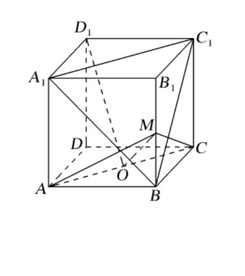
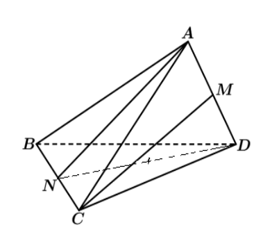

# 0927 错题

## 20260921 空间直线和平面综合练习 1
### 一、填空题
10. 🔴❌如图，在正方体 $ABCD-A_1B_1C_1D_1$ 中，$O$ 为底面 $ABCD$ 的中心，$M$ 为棱 $BB_1$ 的中点，则下列结论中正确的序号是 \_\_\_\_\_\_\_\_。【难题】
    ① $D_1O\parallel$ 平面 $A_1BC_1$；
    ② $MO\perp$ 平面 $A_1BC_1$；
    ③ 二面角 $M-AC-B$ 等于 $90^\circ$；
    ④ 异面直线 $BC_1$ 与 $AC$ 所成的角等于 $60^\circ$。
    

## 20260922 培优专题(2)
### 二、练习
2. 🔴已知 $OX$、$OY$、$OZ$ 是空间交于同一点 $O$ 的互相垂直的三条直线，点 $P$ 到这三条直线的距离分别为 $5$、$6$、$7$，则 $OP$ 长为 \_\_\_\_\_\_\_\_\_\_\_\_\_\_\_\_。

7. 🔴《九章算术》中将四个面都是直角三角形的四面体称为“==鳖臑==”，则以正方体 $ABCD-A_1B_1C_1D_1$ 的顶点为顶点的“鳖臑”的个数为 \_\_\_\_\_\_\_\_\_\_\_\_\_\_\_\_。

9. 🔴到空间不共面的 $A$、$B$、$C$、$D$ 四点距离相等的平面个数（　　）
   A. $7$ 个　　B. $4$ 个　　C. $3$ 个　　D. $1$ 个
   
   
   
   
   
13. 🔴一条与平面相交的线段，其长度为 $10\,\text{cm}$，两端点到平面的距离分别是 $2\,\text{cm}$、$3\,\text{cm}$，这条线段与平面 $\alpha$ 所成的角是 \_\_\_\_\_\_\_\_\_\_\_\_\_\_\_\_。

## 20260924 立体几何练习卷
### 二、解答题
17. 🔴在四面体 $ABCD$ 中，$AB = AC = BD = CD = 3$，$AD = BC = 2$，$M$、$N$ 分别是 $AD$、$BC$ 的中点。
    ① 求证：$AD \perp BC$；   ② 求异面直线 $AN$ 和 $CM$ 所成角的大小。
    