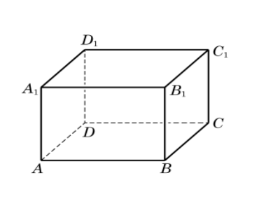
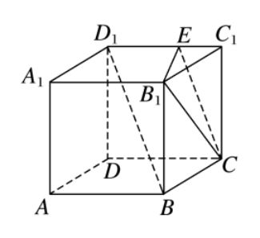
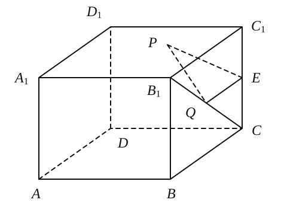

# 1002 错题

## 20260924 立体几何练习卷

### 一、填空题

11. 🔴❌如图，长方体木块 $ABCD-A_1B_1C_1D_1$ 中，$AB = 5$，$BC = 4$，$AA_1 = 3$，一只蚂蚁沿着木块表面从点 $A$ 到达点 $C_1$，蚂蚁爬过的最短路程为 \_\_\_\_\_\_\_\_。   

12. **如图**，$E$ 是棱长为 $1$ 的正方体 $ABCD-A_1B_1C_1D_1$ 的棱 $C_1D_1$ 上的一点，且 $BD_1 \parallel$ 平面 $B_1CE$，则线段 $CE$ 的长度为 \_\_\_\_\_\_\_\_。    

## 20260929 培优

### 三、长度和求最值

**8.** 【高考原题】如图，棱长为 $2$ 的正方体 $ABCD-A_1B_1C_1D_1$，$E$ 为 $CC_1$ 的中点，点 $P$、$Q$ 分别为面 $A_1B_1C_1D_1$ 和线段 $B_1C$ 上动点，求 $\triangle PEQ$ 周长的最小值（　　）。

A. $2\sqrt{2}$　　B. $\sqrt{10}$　　C. $\sqrt{11}$　　D. $\sqrt{12}$