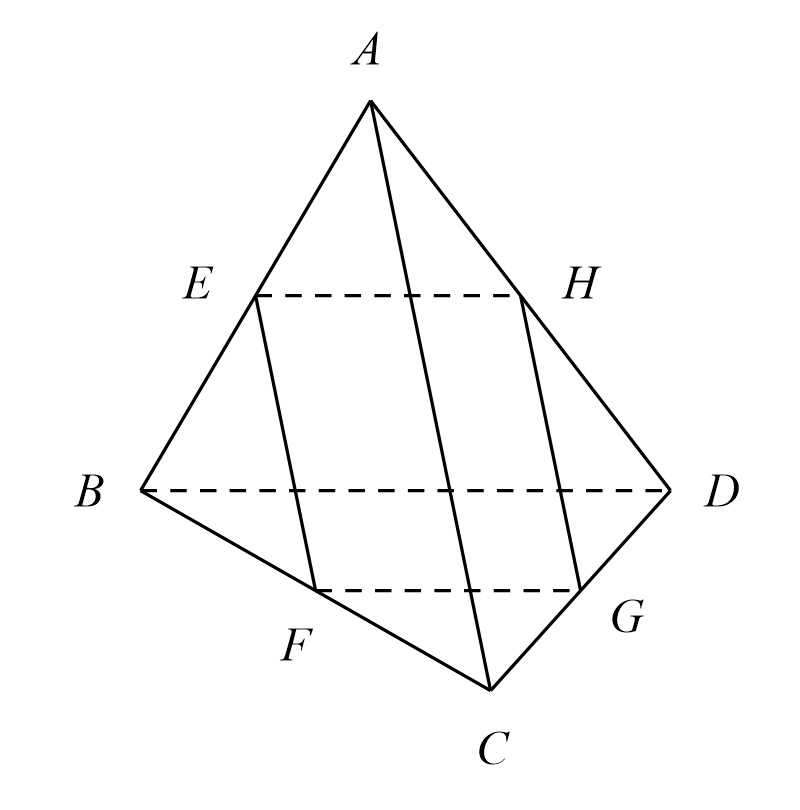
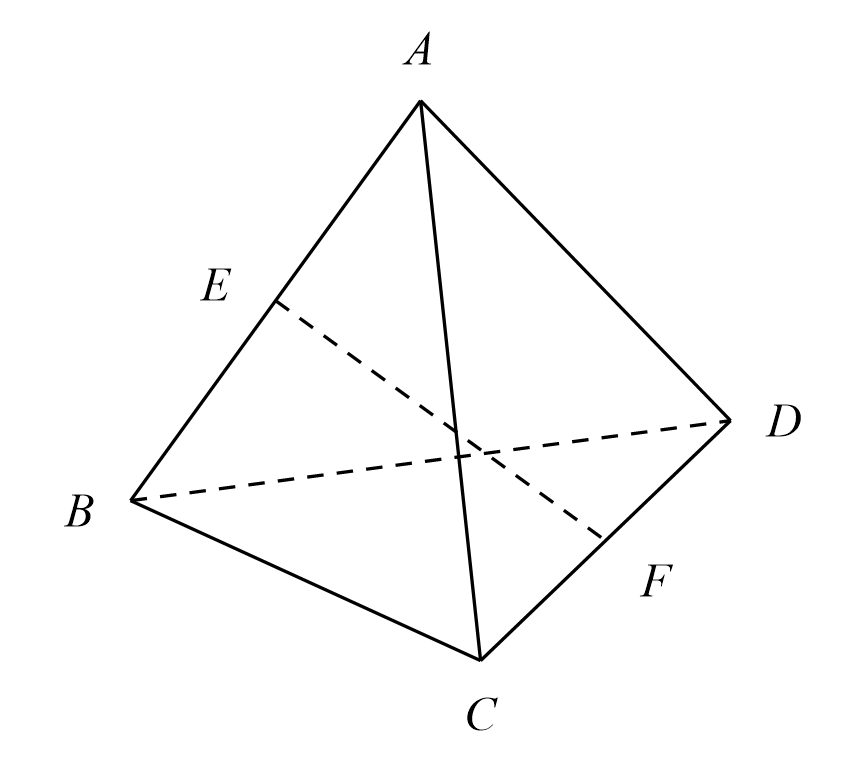
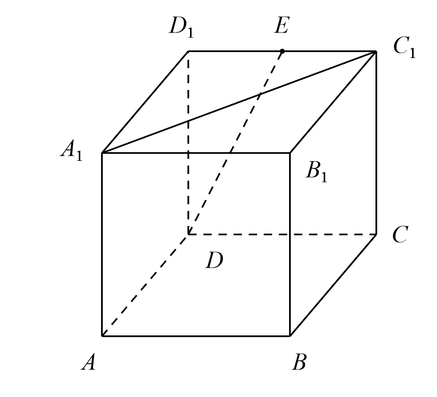
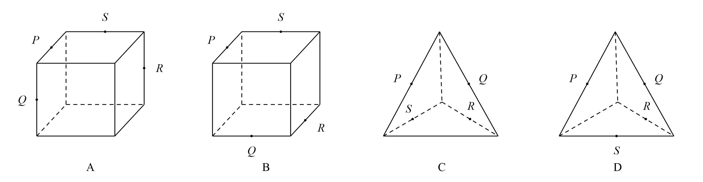
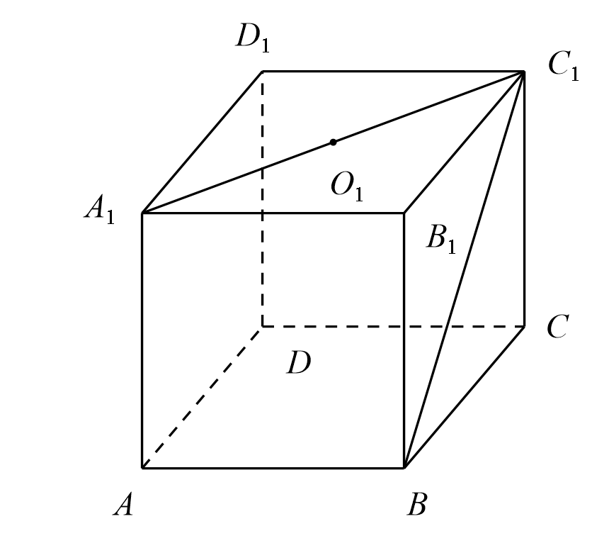
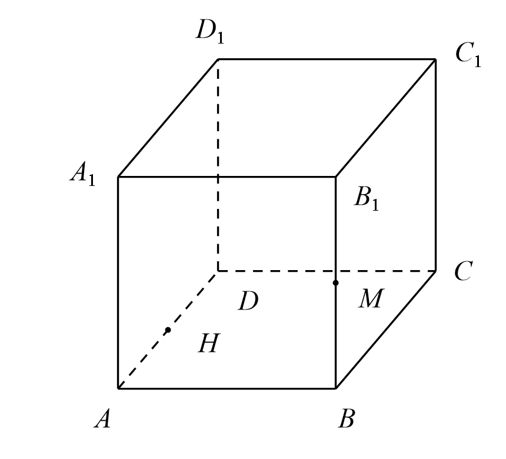
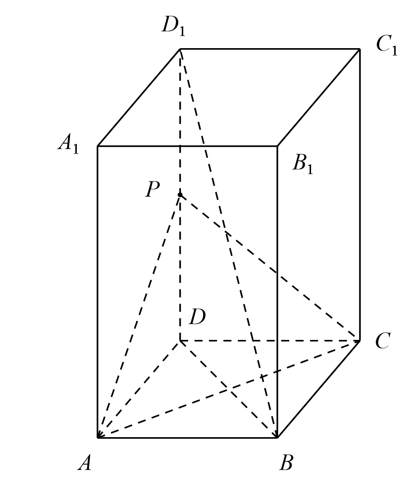

## 20260910 高二数学练习卷

### 一、填空题

1. 若 $\theta$ 是两条异面直线所成角，则 $\theta \in$ \_\_\_\_\_\_\_\_。

2. 空间 $4$ 个点最多可以确定 \_\_\_\_\_\_\_\_ 个平面。

3. 正方体的 $12$ 条棱中，与正方体的一条体对角线异面的棱有 \_\_\_\_\_\_\_\_ 条。

4. 若 $a,b$ 是异面直线，直线 $c \parallel a$，则 $c$ 与 $b$ 的位置关系是 \_\_\_\_\_\_\_\_。

5. 若空间中两条直线 $a,b$ 确定一个平面，则 $a,b$ 的位置关系为 \_\_\_\_\_\_\_\_。

6. ❌如果两条直线在同一平面上的**射影**是两条平行直线，则这两条直线位置关系可能是 \_\_\_\_\_\_\_\_。

7. 如图，在空间四边形 $ABCD$ 中，$E,F,G,H$ 分别是棱 $AB,BC,CD,DA$ 的中点，则当 $AC,BD$ 满足条件 \_\_\_\_\_\_\_\_ 时，四边形 $EFGH$ 为菱形；当 $AC,BD$ 满足条件 \_\_\_\_\_\_\_\_ 时，四边形 $EFGH$ 是正方形。   

8. 如图，在空间四边形 $ABCD$ 中，$AD=BC=2$，$E,F$ 分别是 $AB,CD$ 的中点，若 $EF=\sqrt{3}$，则异面直线 $AD,BC$ 所成角的大小是 \_\_\_\_\_\_\_\_。   

9. ❌如图，在正方体 $ABCD-A_1B_1C_1D_1$ 中，棱长为 $2$，$E$ 为 $D_1C_1$ 的中点，则直线 $A_1C_1$ 与 $DE$ 所成角的余弦值为 \_\_\_\_\_\_\_\_。   

10. ❌下列命题中正确的命题为 \_\_\_\_\_\_\_\_。

    ① 若 $\triangle ABC$ 在平面 $\alpha$ 外，它的三条边所在的直线分别交 $\alpha$ 于 $P,Q,R$，则 $P,Q,R$ 三点共线；

    ② 若三条直线 $a,b,c$ 互相平行且分别交直线 $l$ 于 $A,B,C$ 三点，则这四条直线共面；

    ③ 若直线 $a,b$ 异面，$b,c$ 异面，则 $a,c$ 异面；

    ④ 两两相交的三条直线确定一个平面。

### 二、选择题

11. 空间三条直线中的一条直线与其它两条都相交，那么由这三条直线最多可确定平面的个数是（　）个。  
    A. $1$；                     B. $2$；                C. $3$；                      D. $4$。

12. 如图是正方体或四面体，$P,Q,R,S$ 分别是所在棱的中点，则这四个点不共面的一个图是（　）。

    

### 三、解答题

13. 已知正方体 $ABCD-A_1B_1C_1D_1$ 中的棱长为 $2$。

    (1) $O_1$ 是 $A_1C_1$ 中点，求异面直线 $AO_1$ 与 $BC_1$ 所成角的大小。

    

    (2) 设 $BB_1$ 的中点为 $M$，$AD$ 的中点为 $H$，过 $C_1,M,H$ 作截面，并判断截面的形状。

    

14. 如图，在长方体 $ABCD-A_1B_1C_1D_1$ 中，$AB=AD=1$，$AA_1=2$，点 $P$ 为棱 $DD_1$ 的中点。

    求异面直线 $BD_1$ 与 $AP$ 所成角的大小。

    