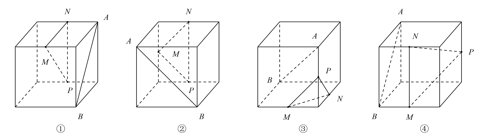
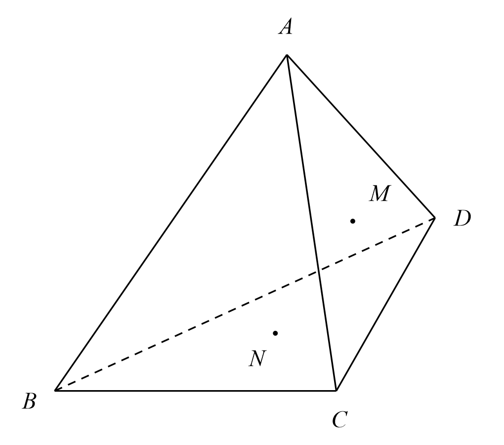
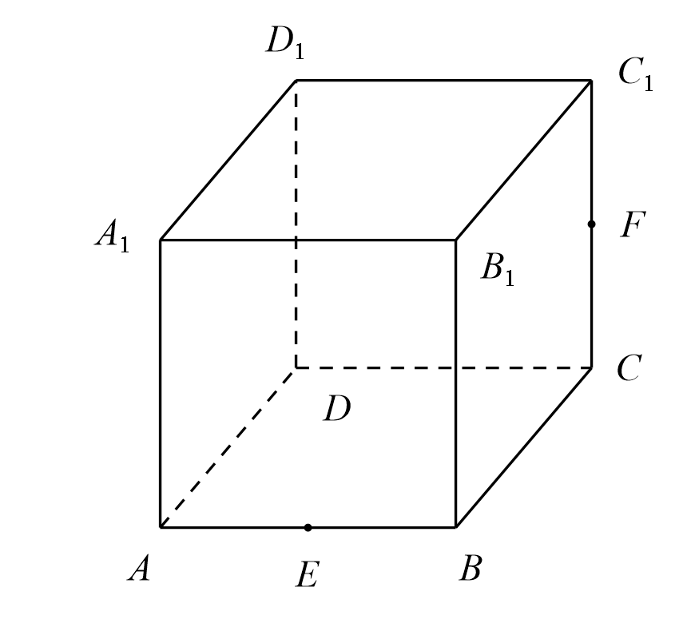
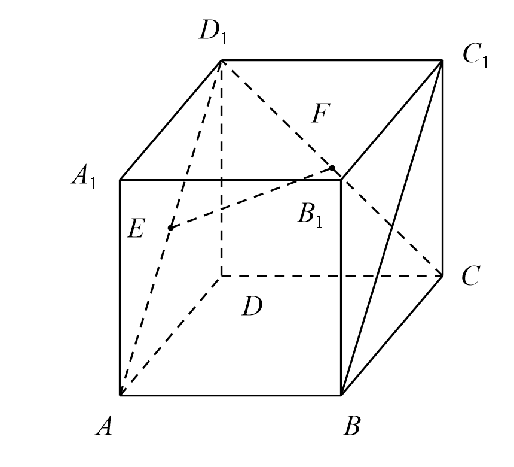
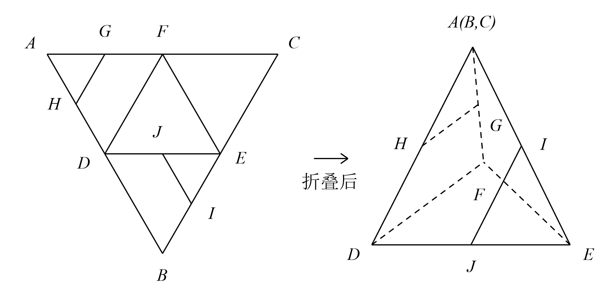

## 20260914 立体几何卷

### 一、填空题

1. “直线 $l$ 与平面 $\alpha$ 没有公共点”是“$l \parallel \alpha$”的 \_\_\_\_\_\_\_\_ 条件。

2. ❌平面外的直线上有两个点到平面 $\alpha$ 距离相等，则直线与平面的位置关系是 \_\_\_\_\_\_\_\_。

3. 过平面外一点与这个平面平行的直线有 \_\_\_\_\_\_\_\_ 条；如果直线 $a \parallel$ 平面 $\alpha$，那么在平面 $\alpha$ 内有 \_\_\_\_\_\_\_\_ 条直线与 $a$ 平行。

4. 正方体 $ABCD-A_1B_1C_1D_1$ 中，与平面 $ACD_1$ 平行的面对角线有 \_\_\_\_\_\_\_\_ 条。   

5. 下面四个正方体中，点 $A$、$B$ 为正方体的两个顶点，点 $M$、$N$、$P$ 分别为其所在棱的中点，能得出 $AB \parallel$ 平面 $MNP$ 的图形序号是 \_\_\_\_\_\_\_\_。（写出所有符合条件的序号）
   

### 二、选择题

6. ❌直线 $a$ 与平面 $\alpha$ 不平行，则 $\alpha$ 内与 $a$ 平行的直线有（ ）  
   A. 无数条；       B. $0$ 条；                C. $1$ 条；        D. 以上均不对。

7. 已知直线 $a$、$b$ 与平面 $\alpha$，有以下三个命题，其中真命题个数是（ ）  
   ① 若 $a \parallel b$，$b \subset \alpha$，则 $a \parallel \alpha$；  
   ② 若 $a \parallel b$，$a \parallel \alpha$，则 $b \parallel \alpha$；  
   ③ 若 $a \parallel \alpha$，$b \parallel \alpha$，则 $a \parallel b$。  
   A. $0$ 个；               B. $1$ 个；                 C. $2$ 个；         D. $3$ 个。

8. 已知 $A$、$B$、$C$、$D$ 是不共面四点，$M$、$N$ 分别是 $\triangle ACD$、$\triangle BCD$ 的重心，以下平面中与直线 $MN$ 平行的是（ ）  
   ① 平面 $ABC$；② 平面 $ABD$；③ 平面 $ACD$；④ 平面 $BCD$。  
   A. ①③；                 B. ①②；              C. ①②③；                D. ①②③④。

   

### 三、解答题

9. 如图，在正方体 $ABCD-A_1B_1C_1D_1$ 中，$E$、$F$ 分别为棱 $AB$、$CC_1$ 的中点。
   (1) 请在正方体的表面完整作出过点 $E$、$F$、$D_1$ 的截面。（保留作图痕迹）
   

10. 如图，正方体 $ABCD-A_1B_1C_1D_1$ 中，$E$、$F$ 分别为 $AD_1$、$CD_1$ 的中点。
    (1) 求证：$EF \parallel$ 平面 $ABCD$；
    (2) 求异面直线 $EF$ 与 $BC_1$ 所成角的大小。
    

11. 如图所示，在正三角形 $ABC$ 中，$D$、$E$、$F$ 分别为各边的中点，$G$、$H$、$I$、$J$ 分别为 $AF$、$AD$、$BE$、$DE$ 的中点，将 $\triangle ABC$ 沿 $DE$、$EF$、$DF$ 折成三棱锥以后，求 $GH$ 与 $IJ$ 所成角的度数。
    
