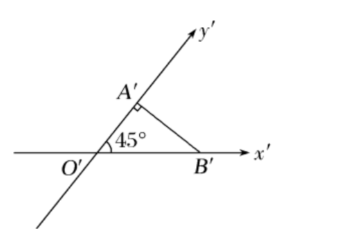
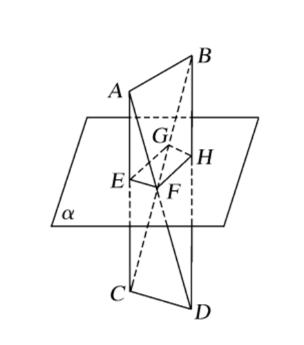
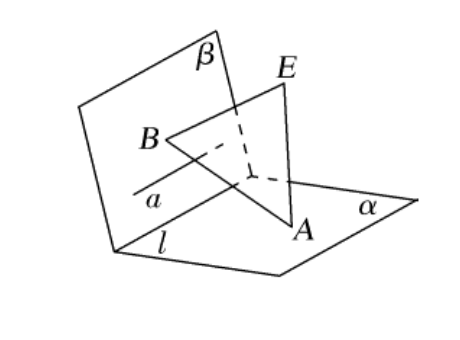
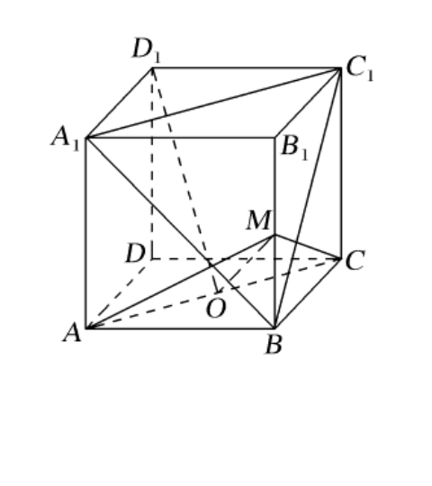
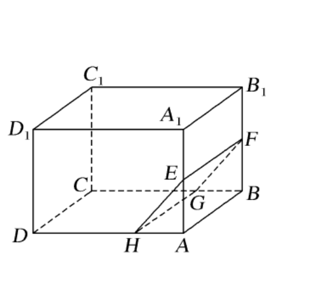
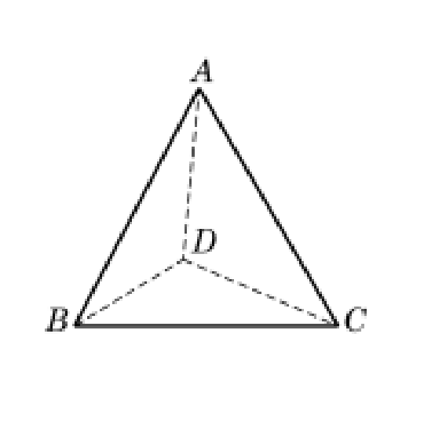
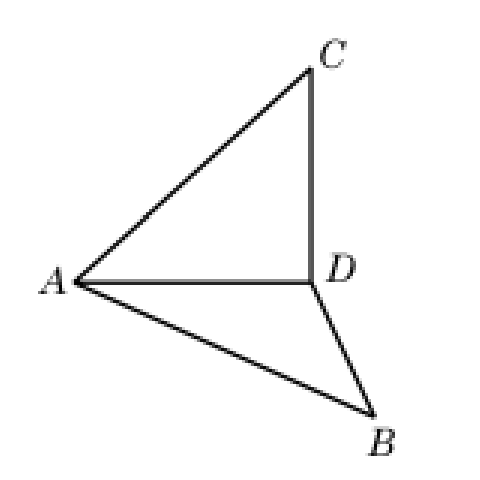
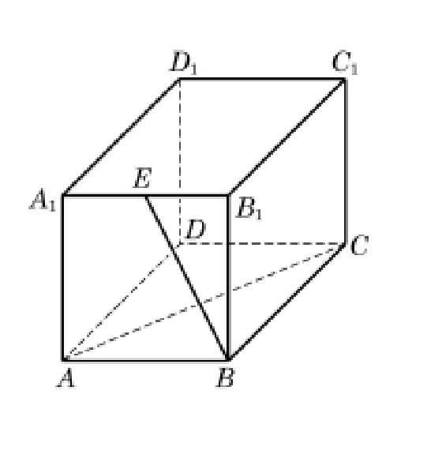
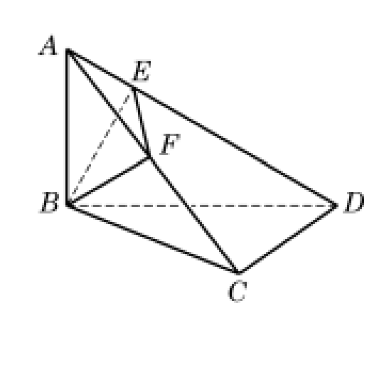
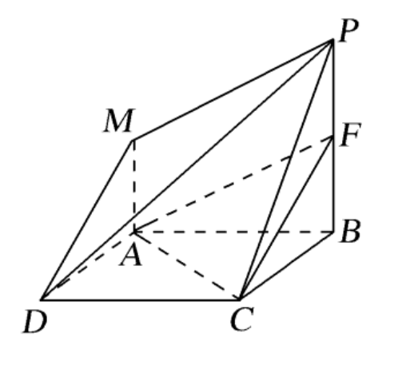

## 20260921 空间直线和平面综合练习 1

### 一、填空题

1. 如图，$\mathrm{Rt}\triangle O'A'B'$ 是一个平面图形的直观图，斜边 $O'B'=2$，则这个平面图形的面积是 \_\_\_\_\_\_\_\_。   

2. 已知 $a$、$b$ 为两条不同的直线，$\alpha$ 为一平面，且 $a\parallel\alpha$，$b\subset\alpha$，则直线 $a$ 与 $b$ 的位置关系是 \_\_\_\_\_\_\_\_。

3. 若 $a$ 和 $b$ 是异面直线，$b$ 和 $c$ 是异面直线，则 $a$ 和 $c$ 的位置关系是 \_\_\_\_\_\_\_\_。

4. 如图，已知 $A$、$B$、$C$、$D$ 四点不共面，且 $AB\parallel\alpha$，$CD\parallel\alpha$，$AC\cap\alpha=E$，$AD\cap\alpha=F$，$BD\cap\alpha=H$，$BC\cap\alpha=G$，则四边形 $EFHG$ 的形状是 \_\_\_\_\_\_\_\_。   

5. ❌已知 $A$、$B$ 两点与平面 $\alpha$ 的距离相等，则直线 $AB$ 与平面 $\alpha$ 的位置关系是 \_\_\_\_\_\_\_\_。【基本概念】

6. 如图，已知平面 $\alpha\cap$ 平面 $\beta=l$，$EA\perp\alpha$，垂足为 $A$，$EB\perp\beta$，$B$ 为垂足，直线 $a\subset\beta$，$a\perp AB$，则直线 $a$ 与直线 $l$ 的位置关系是 \_\_\_\_\_\_\_\_。

7. 直线 $n\perp$ 平面 $\alpha$，$n\parallel l$，直线 $m\subset\alpha$，则 $l$、$m$ 的位置关系是 \_\_\_\_\_\_\_\_。

8. 点 $P$ 在平面 $ABC$ 外，若 $PA=PB=PC$，则点 $P$ 在平面 $ABC$ 内的射影一定是 $\triangle ABC$ 的 \_\_\_\_\_\_\_\_。（答案从这里选取：外心、内心、垂心、重心）

9. 点 $S$ 在平面 $ABC$ 外，在四面体 $SABC$ 中，$SA$、$SB$、$SC$ 两两垂直，$\angle SBC=60^\circ$，则 $BC$ 与平面 $SAB$ 所成的角为 \_\_\_\_\_\_\_\_。

10. 🔴❌如图，在正方体 $ABCD-A_1B_1C_1D_1$ 中，$O$ 为底面 $ABCD$ 的中心，$M$ 为棱 $BB_1$ 的中点，则下列结论中正确的序号是 \_\_\_\_\_\_\_\_。【难题】
    ① $D_1O\parallel$ 平面 $A_1BC_1$；
    ② $MO\perp$ 平面 $A_1BC_1$；
    ③ 二面角 $M-AC-B$ 等于 $90^\circ$；
    ④ 异面直线 $BC_1$ 与 $AC$ 所成的角等于 $60^\circ$。
    

### 二、选择题

11. 直线 $l$ 垂直于平面 $\alpha$，$m\subset\alpha$，则一定有（　）
    A. $l\parallel m$　　B. $l$ 和 $m$ 异面　　C. $l$ 和 $m$ 相交　　D. $l$ 和 $m$ 不平行

12. 下列命题中，正确的命题是（　）
    A. 若 $a\parallel\alpha$，$\alpha\parallel\beta$，则 $a\parallel\beta$
    B. 若 $a\parallel\alpha$，$b\subset\alpha$，则 $a\parallel b$
    C. 若 $a\subset\alpha$，则 $a$ 与 $\alpha$ 有无数个公共点
    D. 若 $a\not\subset\alpha$，则 $a$ 与 $\alpha$ 没有公共点

13. 如图，在长方体 $ABCD-A_1B_1C_1D_1$ 中，点 $E$、$F$ 分别是棱 $AA_1$ 和 $BB_1$ 的中点，过 $EF$ 的平面 $EFGH$ 分别交 $BC$ 和 $AD$ 于点 $G$、$H$，则 $GH$ 与 $AB$ 的位置关系是（　）
    A. 平行　　B. 相交　　C. 异面　　D. 平行或异面
    

14. 下列命题：
    ① 一条直线与两个平行平面中的一个平面相交，必与另外一个平面相交；
    ② 如果一个平面平行于两个平行平面中的一个平面，必平行于另一个平面；
    ③ 若两个平面平行，则其中一个平面内的任一直线平行于另一平面。
    其中正确的命题的个数为（　）
    A. $1$　　B. $2$　　C. $3$　　D. $0$

### 三、解答题

15. 如图，在四面体 $ABCD$ 中，已知 $AB=AC=BD=CD=2$，$BC=2\sqrt{3}$，且 $AD=1$。试作出二面角 $A-BC-D$ 的平面角，并求它的度数。
    

16. ❌如图，以等腰直角三角形 $ABC$ 斜边 $BC$ 上的高 $AD$ 为折痕，使 $\triangle ABD$ 和 $\triangle ACD$ 折成互相垂直的两个面。求证：$BD\perp CD$，且 $\angle BAC=60^\circ$。
    【基础概念】
    
    
17. 如图，在长方体 $ABCD-A_1B_1C_1D_1$ 中，$E$ 为 $A_1B_1$ 的中点，$AB=BB_1=2$，$AC=2\sqrt{5}$。求异面直线 $BE$ 与 $AC$ 所成角的大小。
    

18. 如图，已知线段 $AB$ 垂直于三角形 $BCD$ 所在的平面，且 $AB=BC=CD=1$，$\angle BCD=90^\circ$。$BE\perp AD$，$E$ 为垂足，$F$ 为 $AC$ 的中点，求 $EF$ 的长。
    

19. 如图所示，四边形 $ABCD$ 是平行四边形，$PB\perp$ 平面 $ABCD$，$MA\parallel PB$，$PB=2MA$。在线段 $PB$ 上是否存在一点 $F$，使平面 $AFC\parallel$ 平面 $PMD$？若存在，请确定点 $F$ 的位置；若不存在，请说明理由。
    
