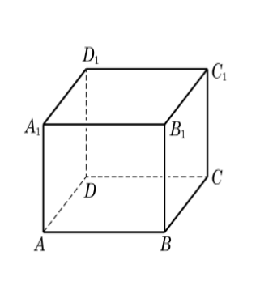
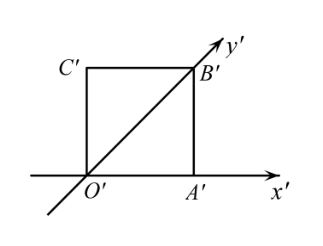
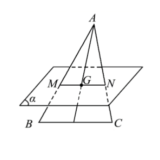
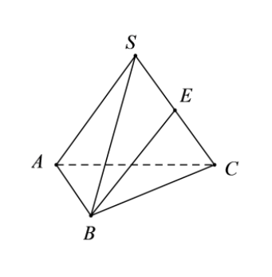
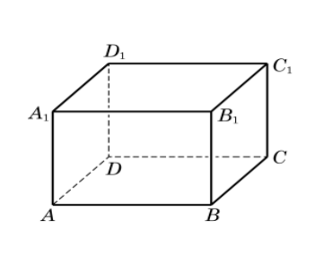
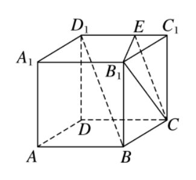
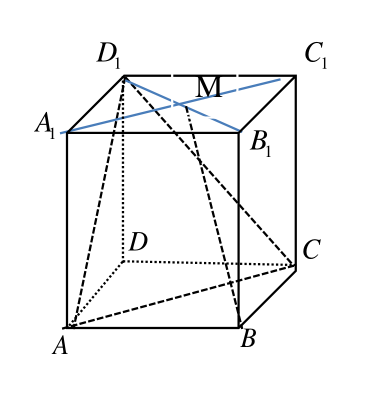
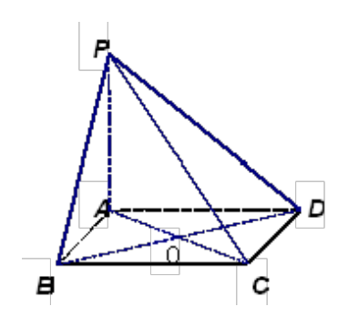
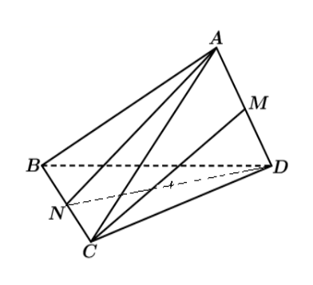

## 20260924 立体几何练习卷

### 一、填空题

1. 已知 $a \parallel c$，$b \parallel c$，则 $a$ 与 $b$ 的位置关系是 ________。

2. 直线 $PA$ 与平面 $ABC$ 所成角为 $\dfrac{\pi}{3}$，则直线 $PA$ 与平面 $ABC$ 内的任意一条直线所成角的取值范围是 ________。

3. 在正方体 $ABCD-A_1B_1C_1D_1$ 中，与 $AD_1$ 成 $60^\circ$ 角的面对角线的条数是 ________。   

4. 空间中四条直线两两相交，最多可以作 ________ 个不同的平面。

5. 在正方体 $ABCD-A_1B_1C_1D_1$ 中，直线 $AB_1$ 与平面 $ABCD$ 所成的角等于 ________。

6. 如图，正方形 $O'A'B'C'$ 的边长为 $1$，它是水平放置的一个平面图形的直观图，则原图形的周长是 ________。   

7. 已知直线 $a$、$b$ 和平面 $\alpha$，若 $a \parallel \alpha$，则“$b \perp a$”是“$b \perp \alpha$”的 ________ 条件。

8. 如图，在 $\triangle ABC$ 中，$BC = 9$，$BC \parallel$ 平面 $\alpha$，且平面 $ABC \cap \alpha = MN$，若 $\triangle ABC$ 的重心 $G$ 在线段 $MN$ 上，则线段 $MN$ 的长度为 ________。   

9. 已知异面直线 $a$、$b$ 所成角为 $70^\circ$，过空间定点 $P$ 与 $a$、$b$ 都成 $55^\circ$ 角的直线共有 ________ 条。

10. 如图，$S-ABC$ 中，若 $AC = 2\sqrt{3}$，$SA = SB = SC = AB = BC = 4$，$E$ 为棱 $SC$ 的中点，则异面直线 $AC$ 与 $BE$ 所成角的余弦值为 ________。    

11. 如图，长方体木块 $ABCD-A_1B_1C_1D_1$ 中，$AB = 5$，$BC = 4$，$AA_1 = 3$，一只蚂蚁沿着木块表面从点 $A$ 到达点 $C_1$，蚂蚁爬过的最短路程为 ________。    

12. **如图**，$E$ 是棱长为 $1$ 的正方体 $ABCD-A_1B_1C_1D_1$ 的棱 $C_1D_1$ 上的一点，且 $BD_1 \parallel$ 平面 $B_1CE$，则线段 $CE$ 的长度为 ________。    

### 二、选择题

13. 空间四个点中，三点共线是这四个点共面的（　）
    A. 充分非必要条件；               B. 必要非充分条件；                    C. 充要条件；                D. 既非充分又非必要条件。

14. 如果直线 $l$ 是平面 $\alpha$ 的斜线，那么平面 $\alpha$ 内（　）
    A. 不存在与 $l$ 平行的直线。                                               B. 不存在与 $l$ 垂直的直线。  
    C. 与 $l$ 垂直的直线只有一条。                                           D. 与 $l$ 平行的直线有无数条。

### 二、解答题

15. 长方体 $ABCD-A_1B_1C_1D_1$ 中，$AB = BC = 1$，$AA_1 = 2$，点 $M$ 是平面 $A_1B_1C_1D_1$ 的中心。
    ① 求证：$BM$ 与平面 $D_1AC$ 平行；  ② 求 $BM$ 与平面 $BB_1C_1C$ 所成的角的大小。
    
    
16. $ABCD$ 是边长为 $8$ 的菱形，$\angle BAD = 120^\circ$，$AC$ 与 $BD$ 交于点 $O$，$PA \perp$ 平面 $ABCD$，$PA = 6$。
    （1）求证：$BD \perp PC$；  （2）求异面直线 $PD$ 与 $AC$ 所成的角的大小。
    
    
17. 🔴在四面体 $ABCD$ 中，$AB = AC = BD = CD = 3$，$AD = BC = 2$，$M$、$N$ 分别是 $AD$、$BC$ 的中点。
    ① 求证：$AD \perp BC$；   ② 求异面直线 $AN$ 和 $CM$ 所成角的大小。
    
