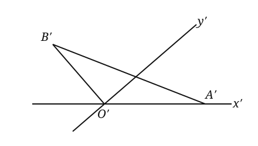
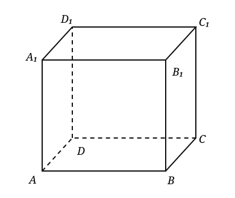
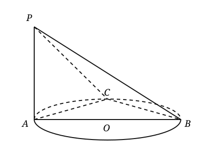
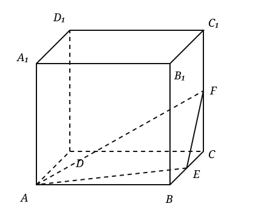
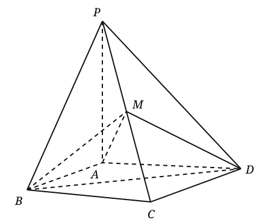
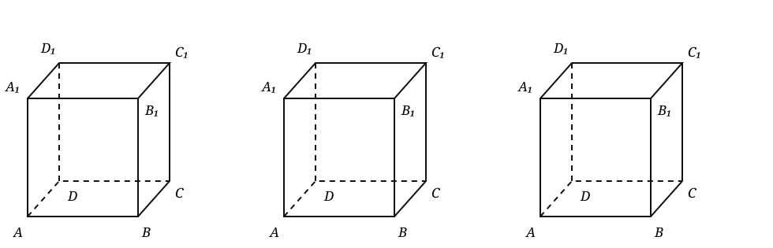

## 20260924 高二数学练习卷

### 一、定理默写

### 二、方法强化

1. 斜线与平面所成角的范围是\_\_\_\_\_\_\_\_；二面角的范围是\_\_\_\_\_\_\_\_。

2. 用斜二测画法画水平放置的正方形 $ABCD$ 的直观图，取 $AB$ 所在直线为 $x$ 轴，$AD$ 所在直线为 $y$ 轴。若在直观图中 $AB=2\text{ cm}$，则 $BC=$\_\_\_\_\_\_\_\_。

3. 如图，$\triangle ABO$ 的斜二测直观图是 $\triangle A'B'O'$，其中 $O'A'=O'B'=2\sqrt{2}$，$\angle B'O'y'=90^\circ$，则 $\triangle ABO$ 的面积是\_\_\_\_\_\_\_\_。   

4. 已知 $a$、$b$、$c$ 是空间中的三条不重合的直线，$\alpha$、$\beta$、$\gamma$ 是三个不同的平面，下列命题中真命题是（　）
   A. 若 $a\parallel\alpha$，$\alpha\parallel\beta$，则 $a\parallel\beta$
   B. 若 $\alpha\perp\beta$，$\beta\perp\gamma$，则 $\alpha\parallel\gamma$
   C. 若 $a\perp b$，$b\perp c$，则 $a\parallel c$
   D. 若 $b\perp\beta$，$b\perp\gamma$，则 $\beta\parallel\gamma$

5. 正方体 $ABCD-A_1B_1C_1D_1$ 的棱长为 $2$，求直线 $BB_1$ 与平面 $ACC_1A_1$ 的距离。
   

6. 如图，$PA$ 垂直于以 $AB$ 为直径的圆所在的平面，$C$ 为圆上弧 $AB$ 的中点，且 $PA=AB=2$，求 $PC$ 与平面 $ABC$ 所成的角。
   

7. 如图，在长方体 $ABCD-A_1B_1C_1D_1$ 中，$AB=2$，$BC=3$，$AA_1=4$。
   （1）求 $A_1B$ 与平面 $AA_1C_1C$ 所成角的正弦值；
   （2）求二面角 $A_1-BC-A$ 的正切值。
   

8. 如图，正方体 $ABCD-A_1B_1C_1D_1$ 的棱长为 $2$，$E$、$F$ 分别为 $BC$、$CC_1$ 的中点，则平面 $AEF$ 截正方体所得的截面周长为\_\_\_\_\_\_\_\_。
   

9. 如图，已知在长方体 $ABCD-A_1B_1C_1D_1$ 中，$DA=DC=3$，$DD_1=5$，点 $E$ 是 $D_1C$ 的中点。
   （1）求证：$AD_1\parallel$ 平面 $EBD$；
   （2）求异面直线 $AD_1$ 与 $DE$ 所成角的余弦值。
   

10. 在 $30^\circ$ 二面角的一个面内有一个点，它到另一个面的距离是 $15\text{ cm}$，则这个点到二面角的棱的距离为\_\_\_\_\_\_\_\_。

11. 在四棱锥 $P-ABCD$ 中，底面 $ABCD$ 为正方形，$PA\perp$ 平面 $ABCD$，$M$ 为 $PC$ 的中点。
    （1）求证：$PA\parallel$ 平面 $MBD$；
    （2）若 $AB=PA=1$，求直线 $AM$ 与平面 $ABCD$ 所成角的大小。
    

12. 正方体 $ABCD-A_1B_1C_1D_1$ 中，
    （1）求证：$DB_1\perp$ 平面 $A_1C_1B$；
    （2）求证：平面 $AB_1D_1\parallel$ 平面 $C_1BD$；
    （3）证明平面 $AA_1C_1C\perp$ 平面 $BB_1D_1D$。
    
