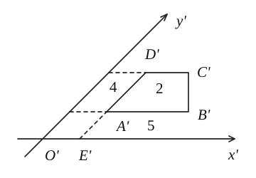
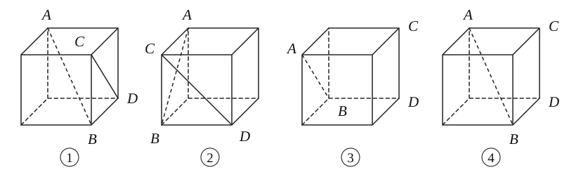
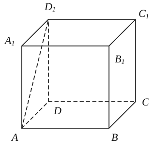
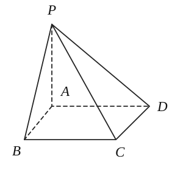
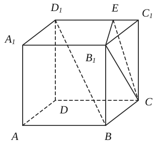
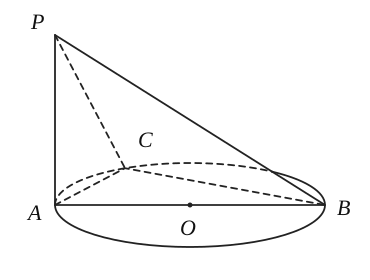
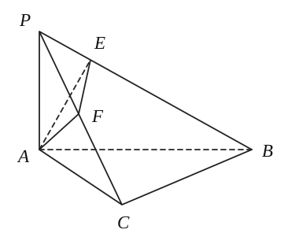
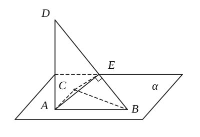
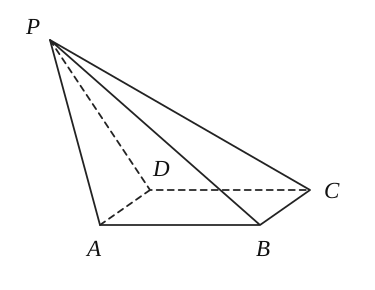

## 20261001 空间直线和平面综合2

### 一、填空题

1. 如图是水平放置的四边形 $ABCD$ 的直观图 $A'B'C'D'$，则原四边形 $ABCD$ 的面积是 \_\_\_\_\_\_\_\_。 

2. 空间中直线 $l$ 和三角形的两边 $AC$，$BC$ 同时垂直，则这条直线和三角形的第三边 $AB$ 的位置关系是 \_\_\_\_\_\_\_\_。

3. 已知 $l$，$m$ 是两条直线，$\alpha$ 是平面，若要得到“ $l\parallel\alpha$ ”，则需要在条件“ $m\subset\alpha$，$l\parallel m$ ”中另外添加的一个条件是 \_\_\_\_\_\_\_\_。

4. 在下列四个正方体中，能得出 $AB\perp CD$ 的有 \_\_\_\_\_\_\_\_。（填序号）    

5. 正方体 $ABCD-A_1B_1C_1D_1$ 中，与 $AD_1$ 所成角为 $60^\circ$ 的面对角线共有 \_\_\_\_\_\_\_\_ 条。    

6. 如图，$PA\perp$ 面 $ABCD$，面 $ABCD$ 为矩形，$AB=3$，$BC=4$。若 $PA=2$，则点 $P$ 到直线 $BD$ 的距离为 \_\_\_\_\_\_\_\_。    

7. 给出下列命题，其中所有正确命题的序号为 \_\_\_\_\_\_\_\_。

    ① 若两条不同的直线垂直于第三条直线，则这两条直线互相平行；
    ② 若两个不同的平面垂直于一条直线，则这两个平面互相平行；
    ③ 若一条直线平行于一个平面，另一条直线与这个平面垂直，则这两条直线互相垂直。

8. 如图，$E$ 是棱长为 $1$ 的正方体 $ABCD-A_1B_1C_1D_1$ 的棱 $C_1D_1$ 上的一点，且 $BD_1\parallel$ 平面 $B_1CE$，则线段 $CE$ 的长度为 \_\_\_\_\_\_\_\_。    

9. 如图，$PA$ 垂直于以 $AB$ 为直径的圆所在的平面，$C$ 为圆上异于 $A$，$B$ 的任意一点，则下列关系正确的序号是 \_\_\_\_\_\_\_\_。

    ① $PA\perp BC$；② $BC\perp$ 平面 $PAC$；② $AC\perp PB$；④ $PC\perp BC$。

    

10. 给定下列四个命题：

    ① 若一个平面内的两条直线与另一个平面都平行，那么这两个平面相互平行；
    ② 若一个平面经过另一个平面的垂线，那么这两个平面相互垂直；
    ③ 垂直于同一直线的两条直线相互平行；
    ④ 若两个平面垂直，那么一个平面内与它们的交线不垂直的直线与另一个平面也不垂直。

    其中，为真命题的序号是 \_\_\_\_\_\_\_\_。

### 二、选择题

11. 用斜二测画法画水平放置的平面图形直观图时，下列结论中正确的个数是（　）

    ① 平行的线段在直观图中仍然平行；② 相等的线段在直观图中仍然相等；③ 相等的角在直观图中仍然相等；④ 正方形在直观图中仍然是正方形。
    A. $1$                          B. $2$　　                         C. $3$　　               D. $4$

12. 在空间中，“两条直线不平行”是“这两条直线异面”的（　）
    A. 充分非必要条件　　B. 必要非充分条件　  　   C. 充要条件　　       D. 既非充分又非必要条件

13. 已知空间四边形 $ABCD$ 的四边相等，则它的两对角线 $AC$，$BD$ 的位置关系是（　）
    A. 垂直且相交　        　B. 相交但不一定垂直　  　C. 垂直但不相交　　D. 不垂直也不相交

14. 下列命题正确的个数是（　）
    ① 若直线 $l$ 上有无数个点不在平面 $\alpha$ 内，则 $l\parallel\alpha$；
    ② 若直线 $l\parallel\alpha$，则与平面 $\alpha$ 内的任意一条直线都平行；
    ③ 如果两条平行直线中的一条与一个平面平行，那么另一条也与这个平面平行；
    ④ 若直线 $l\parallel\alpha$，则与平面 $\alpha$ 内的任意一条直线都没有公共点。

     A. $0$　　                     B. $1$　　                         C. $2$　　                D. $3$

### 三、解答题

15. 证明：如果一个平面的一条平行线垂直于另一个平面，那么这两个平面互相垂直。

16. 如图，已知斜边为 $AB$ 的 $\mathrm{Rt}\triangle ABC$，$PA\perp$ 平面 $ABC$，$AE\perp PB$，$AF\perp PC$，$E$，$F$ 分别为垂足。求证：$EF\perp PB$。    

17. $\triangle ABC$ 的三个顶点 $A$，$B$，$C$ 到平面 $\alpha$ 的距离分别为 $2\ \mathrm{cm}$、$3\ \mathrm{cm}$、$4\ \mathrm{cm}$，且它们在 $\alpha$ 的同侧，求 $\triangle ABC$ 的重心到平面 $\alpha$ 的距离。

18. 如图，直角三角形 $ABC$ 在平面 $\alpha$ 上，且 $\angle BAC=90^\circ$。以 $A$ 为垂足作 $DA\perp\alpha$，在 $DB$ 上取一点 $E$，使 $AE\perp DB$。求证：$CE\perp DB$。    

19. 如图，点 $P$ 在平面 $ABCD$ 外，底面 $ABCD$ 是矩形，$AD\perp PD$，$BC=1$，$PC=2\sqrt{3}$，$PD=CD=2$。
    （1）证明平面 $PDC\perp$ 平面 $ABCD$；
    （2）求直线 $PB$ 与平面 $ABCD$ 所成角的正弦值。

    
