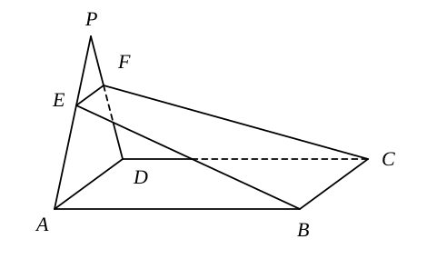
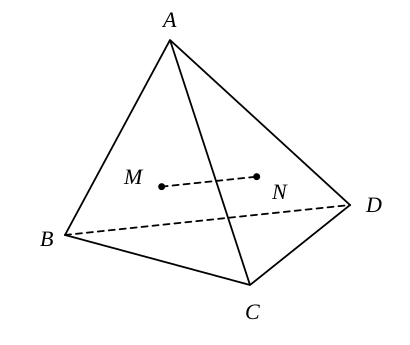
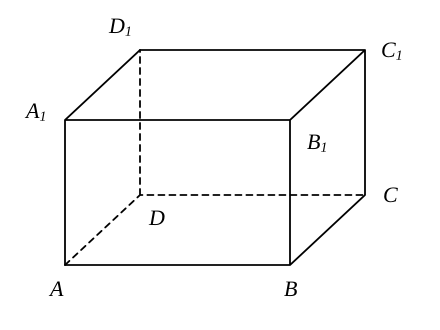
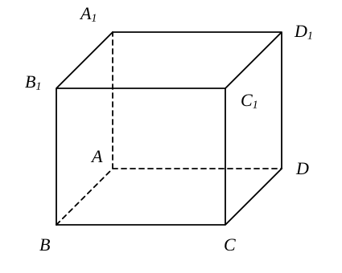
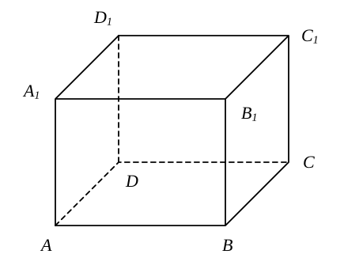
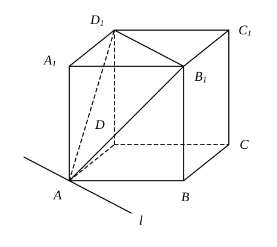
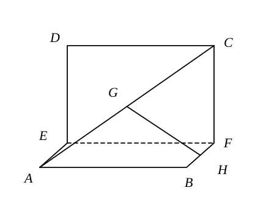
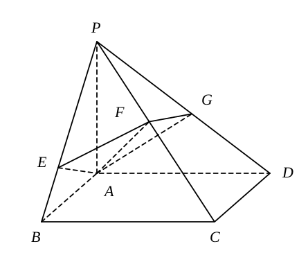

## 20261001 空间直线和平面综合2

### 一、填空题

1. 若 $a$，$b$ 是两条异面直线，且 $a\parallel$ 平面 $\alpha$，则 $b$ 与 $\alpha$ 的位置关系是 \_\_\_\_\_\_\_\_。

2. 直线 $n\perp$ 平面 $\alpha$，$n\parallel l$，直线 $m\subset\alpha$，则 $l$，$m$ 的位置关系是 \_\_\_\_\_\_\_\_。

3. 如图，四边形 $ABCD$ 是矩形，$P$ 在平面 $ABCD$ 外，过 $BC$ 作平面 $BCFE$ 交 $AP$ 于 $E$，交 $DP$ 于 $F$，则四边形 $BCFE$ 的形状一定是 \_\_\_\_\_\_\_\_。

    

4. 如图，$A$ 是 $\triangle BCD$ 所在平面外一点，$M$，$N$ 分别是 $\triangle ABC$ 和 $\triangle ACD$ 的重心，若 $MN=6$，则 $BD=$ \_\_\_\_\_\_\_\_。

    

5. 在 $\triangle ABC$ 中，$AB=AC=5$，$BC=6$，$PA\perp$ 平面 $ABC$，$PA=8$，则 $P$ 到 $BC$ 的距离是 \_\_\_\_\_\_\_\_。

6. 长方体 $ABCD-A_1B_1C_1D_1$ 中，$AA_1=5$，$AB=12$，那么直线 $B_1C_1$ 和平面 $A_1BCD_1$ 的距离是 \_\_\_\_\_\_\_\_。

    

7. 已知 $\alpha\parallel\beta$ 且 $\alpha$ 与 $\beta$ 间的距离为 $d$，直线 $a$ 与 $\alpha$ 相交于点 $A$，与 $\beta$ 相交于点 $B$，若 $AB=\frac{2\sqrt{3}}{3}d$，则直线 $a$ 与 $\alpha$ 所成的角等于 \_\_\_\_\_\_\_\_。

8. 若 $P$ 是 $\triangle ABC$ 所在平面外一点，且 $\triangle PBC$ 和 $\triangle ABC$ 都是边长为 $2$ 的正三角形，$PA=\sqrt{6}$，那么二面角 $P-BC-A$ 的大小为 \_\_\_\_\_\_\_\_。

9. 如图，在正方体 $ABCD-A_1B_1C_1D_1$ 中，下列说法正确的序号是 \_\_\_\_\_\_\_\_。

    $A_1C_1\perp BD$；

    ② $B_1C$ 与 $BD$ 所成的角为 $60^\circ$；

    ③ 二面角 $A_1-BC-D$ 的平面角为 $45^\circ$；

    ④ $AC_1$ 与平面 $ABCD$ 所成的角为 $45^\circ$。

    

10. 在棱长为 $2$ 的正方体 $ABCD-A_1B_1C_1D_1$ 中，$M$ 是棱 $A_1D_1$ 的中点，过 $C_1$，$B$，$M$ 作正方体的截面，则这个截面的形状是 \_\_\_\_\_\_\_\_，截面的面积是 \_\_\_\_\_\_\_\_。

    

### 二、选择题

11. 若空间两条直线 $a$ 和 $b$ 没有公共点，则 $a$ 与 $b$ 的位置关系是（　）

    A. 共面　　B. 平行　　C. 异面　　D. 平行或异面

12. 关于斜二测画法所得直观图，以下说法正确的是（　）

    A. 等腰三角形的直观图仍是等腰三角形　　B. 正方形的直观图为平行四边形

    C. 梯形的直观图不是梯形　　D. 正三角形的直观图一定为等腰三角形

13. 若平面 $\alpha\parallel$ 平面 $\beta$，直线 $a\subset\alpha$，点 $B\in\beta$，则 $\beta$ 内过点 $B$ 的所有直线中（　）

    A. 不一定存在与 $a$ 平行的直线　　B. 只有两条与 $a$ 平行的直线

    C. 存在无数条与 $a$ 平行的直线　　D. 存在唯一一条与 $a$ 平行的直线

14. 已知 $\alpha$，$\beta$ 为平面，$A$，$B$，$M$，$N$ 为点，$a$ 为直线，下列推理错误的是（　）

    A. $A\in a$，$A\in\beta$，$B\in a$，$B\in\beta\Rightarrow a\subset\beta$

    B. $M\in\alpha$，$M\in\beta$，$N\in\alpha$，$N\in\beta\Rightarrow\alpha\cap\beta=MN$

    C. $A\in\alpha$，$A\in\beta\Rightarrow\alpha\cap\beta=A$

    D. $A$，$B$，$M\in\alpha$，$A$，$B$，$M\in\beta$，且 $A$，$B$，$M$ 不共线 $\Rightarrow\alpha$，$\beta$ 重合

### 三、解答题

15. 证明：如果平面 $\alpha$ 和不在这个平面上的直线 $a$ 都垂直于平面 $\beta$，那么直线 $a$ 必平行于平面 $\alpha$。

16. 如图，正方体 $ABCD-A_1B_1C_1D_1$ 中，直线 $l$ 是平面 $AB_1D_1$ 与平面 $ABCD$ 的交线。求证：$B_1D_1\parallel l$。

    

17. 设正六边形 $ABCDEF$ 的边长为 $a$，线段 $PA$ 垂直于正六边形所在的平面，且 $PA=2a$。分别求点 $P$ 到 $CD$、$DE$ 与 $BC$ 所在直线的距离。

18. 已知点 $E$，$F$ 分别是正方形 $ABCD$ 的边 $AD$，$BC$ 的中点。现将四边形 $EFCD$ 沿 $EF$ 折起，使二面角 $C-EF-B$ 为直二面角。

    （1）若点 $G$，$H$ 分别是 $AC$，$BF$ 的中点，求证：$GH\parallel$ 平面 $EFCD$；

    （2）求直线 $AC$ 与平面 $ABFE$ 所成角的正弦值。

    

19. 如图，$PA\perp$ 平面 $ABCD$，底面 $ABCD$ 为矩形，$AE\perp PB$ 于 $E$，$AF\perp PC$ 于 $F$。

    （1）求证：$PC\perp$ 平面 $AEF$；

    （2）设平面 $AEF$ 交 $PD$ 于 $G$，求证：$AG\perp PD$。

    
