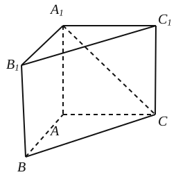
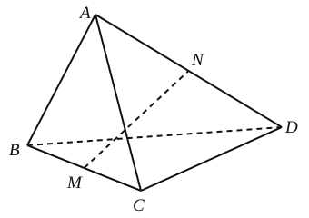
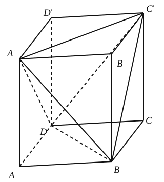
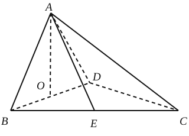
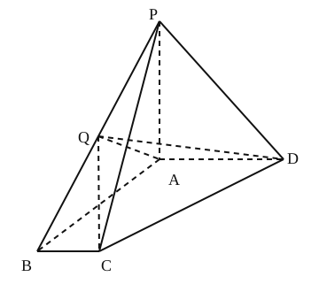
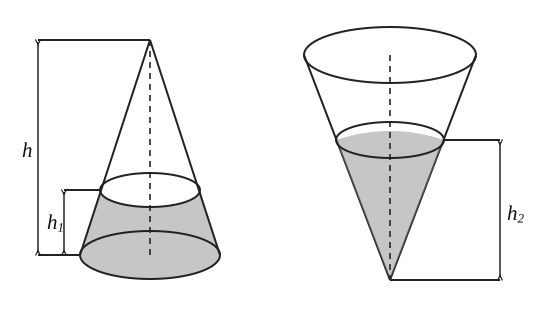
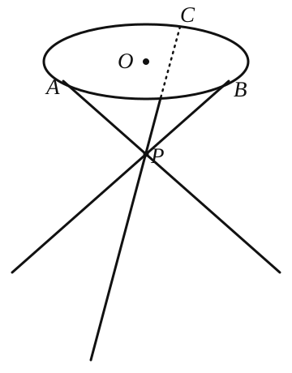

## 20261008 高二数学练习卷

### 一、填空题

1. “两条直线没有公共点”是“两条直线为异面直线”的\_\_\_\_\_\_\_\_\_\_\_\_条件。
2. 若圆锥的底面积为 $\pi$ ，母线长为 $2$ ，则该圆锥的高为\_\_\_\_\_\_\_\_\_\_\_\_。
3. 若正三棱柱的一个底面的面积为 $\sqrt{3}$ ，其侧面积为 $6$ ，则其体积为\_\_\_\_\_\_\_\_\_\_\_\_。
4. 一个三棱锥的三个侧面两两互相垂直，它们的面积分别为 $12\,\text{cm}^2$ 、 $8\,\text{cm}^2$ 、 $6\,\text{cm}^2$ ，那么它的体积是\_\_\_\_\_\_\_\_\_\_\_\_。
5. 若圆柱的侧面展开图是边长为 $2$ 和 $4$ 的矩形，则其体积为\_\_\_\_\_\_\_\_\_\_\_\_。
6. 正六棱柱的最大对角面的面积为 $4\,\text{m}^2$ ，互相平行的两个侧面的距离为 $\sqrt{3}\,\text{m}$ ，则这个六棱柱的体积为\_\_\_\_\_\_\_\_\_\_\_\_。
7. 如图，在直三棱柱 $ABC-A_1B_1C_1$ 中，若 $AB=AC=AA_1=1$ ， $BC=\sqrt{2}$ ，则异面直线 $A_1C$ 与平面 $BB_1C_1C$ 所成的角为\_\_\_\_\_\_\_\_\_\_\_\_。
8. 平行六面体 $ABCD-A_1B_1C_1D_1$ 的各棱长都等于 $4\,\text{cm}$ ，体积为 $12\,\text{cm}^3$ ，在棱 $AA_1$ 上取 $AP=1\,\text{cm}$ ，则棱锥 $P-ABCD$ 的体积为\_\_\_\_\_\_\_\_\_\_\_\_。
9. 点 $P$ 是棱长为 $1$ 的正四面体内的任意一点，它到这个四面体各面的距离之和为\_\_\_\_\_\_\_\_\_\_\_\_。
10. 三棱锥中，有一条棱长为 $6$ ，其余各棱长均为 $5$ ，则这个三棱锥的体积为\_\_\_\_\_\_\_\_\_\_\_\_。

### 二、选择题

11. 如图，在四面体 $ABCD$ 中， $AB=CD$ ， $M$ 、 $N$ 分别是 $BC$ 、 $AD$ 的中点，若 $AB$ 与 $CD$ 所成的角的大小为 $30^\circ$ ，则 $MN$ 和 $CD$ 所成的角的大小为

A. $15^\circ$                         B. $75^\circ$                                         C. $30^\circ$ 或 $60^\circ$                          D. $15^\circ$ 或 $75^\circ$

12. 以下四个命题：① 正棱锥的所有侧棱相等；② 直棱柱的侧面都是全等的矩形；③ 圆柱的母线垂直于底面；④ 用经过旋转轴的平面截圆锥，所得的截面一定是全等的等腰三角形。
其中，真命题的个数为
A. $4$                                 B. $3$                                          C. $2$                                          D. $1$

### 三、解答题

13. 已知某圆锥体的底面半径 $r=3$ ，沿圆锥体的母线把侧面展开后可得到圆心角为 $\dfrac{2\pi}{3}$ 的扇形，求该圆锥体的体积和表面积。

14. 正方体 $ABCD-A'B'C'D'$ 的棱长为 $a$ ，连接 $A'C'$ 、 $A'D$ 、 $A'B$ 、 $BD$ 、 $BC'$ 、 $C'D$ ，得到一个三棱锥 $A'-BC'D$ 。求：
(1) 三棱锥 $A'-BC'D$ 的表面积与正方体表面积的比值；
(2) 三棱锥 $A'-BC'D$ 的体积。

15. 如图，四面体 $ABCD$ 中， $O$ 、 $E$ 分别是 $BD$ 、 $BC$ 的中点， $AO\perp$ 平面 $BCD$ ，且 $CA=CB=CD=BD=2$ 。
(1) 求三棱锥 $A-BCD$ 的体积；(2) 求异面直线 $AE$ 与 $CD$ 所成角的大小。

16. 如图，在四棱锥 $P-ABCD$ 中，已知 $PA\perp$ 平面 $ABCD$ ，四边形 $ABCD$ 为直角梯形， $\angle ABC=\angle BAD=90^\circ$ ， $AB=AD=AP=2$ ， $BC=1$ 。
(1) 求点 $A$ 到平面 $PCD$ 的距离；
(2) 若点 $Q$ 为线段 $BP$ 的中点，求直线 $CQ$ 与平面 $ADQ$ 所成角的大小。

17. 如图，圆锥形容器的高为 $h$ ，圆锥内水面的高为 $h_1$ ，且 $h_1=\dfrac{1}{3}h$ ，若将圆锥倒置，水面高为 $h_2$ ，求则 $h_2$ （用 $h$ 表示）。

18. 如图，小凳凳面为圆形，凳脚为三根细钢管。考虑到钢管的受力等因素，设计的小凳应满足：三根细钢管相交处的节点 $P$ 与凳面圆形的圆心 $O$ 的连线垂直于凳面和地面，且 $P$ 分细钢管上下两段的比值为 $0.618$ ，三只凳脚与地面所成的角均为 $60^\circ$ 。若 $A$ 、 $B$ 、 $C$ 是凳面圆周的三等分点， $AB=18$ 厘米，求凳子的高度 $h$ 及三根细钢管的总长度（精确到 $0.01$ ）。

