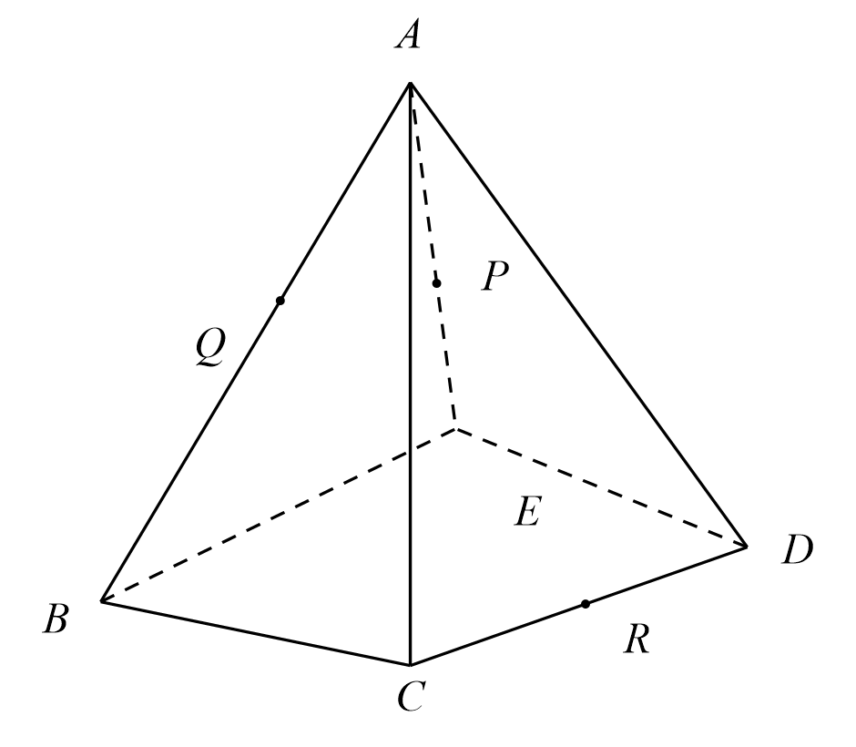
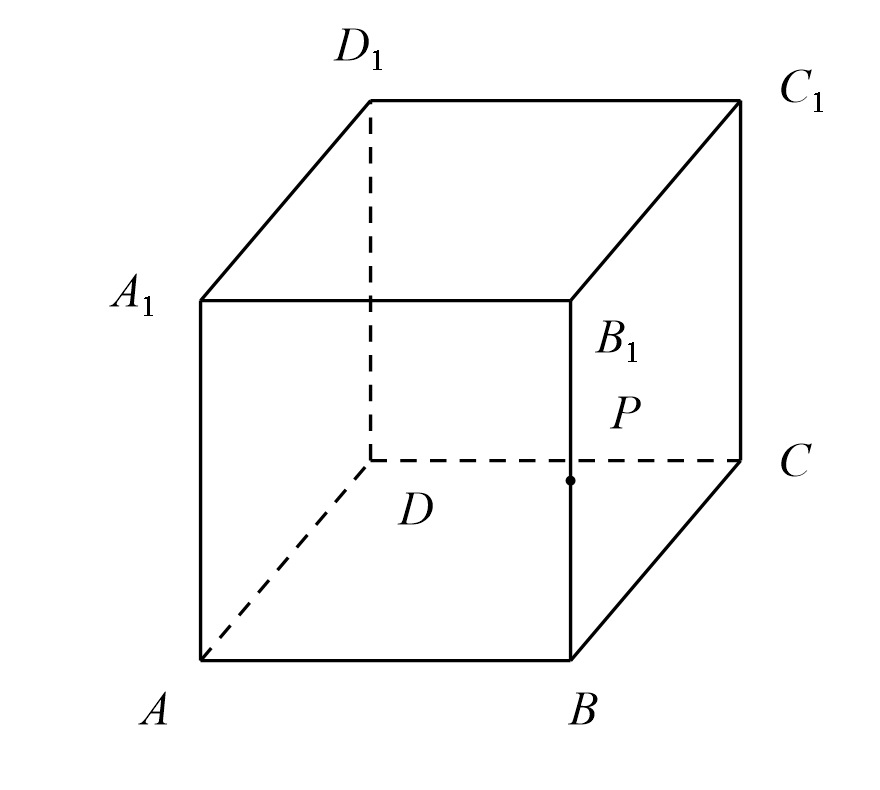
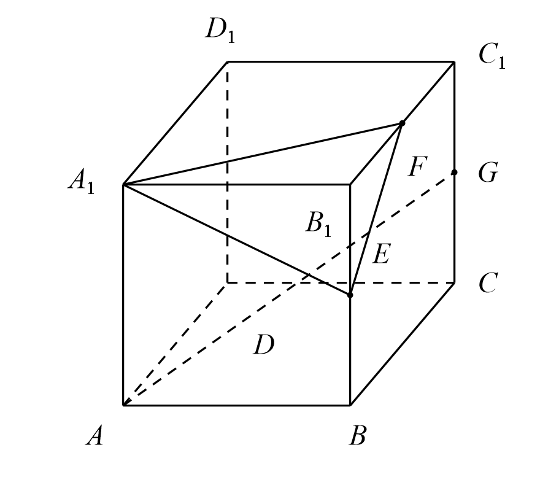
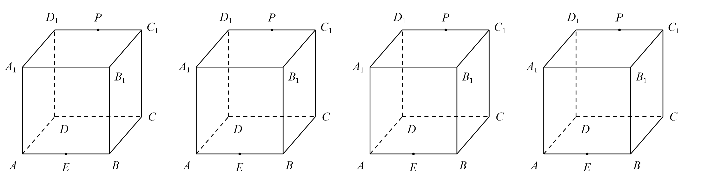
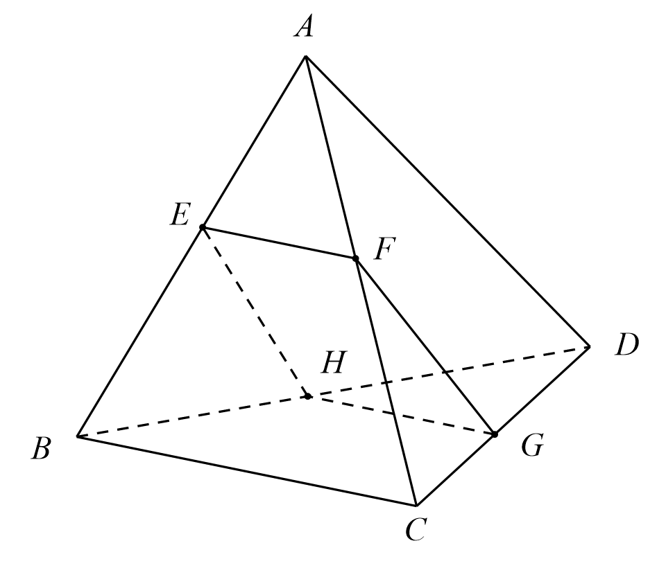
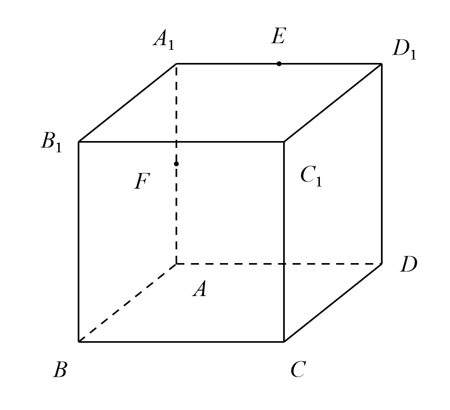
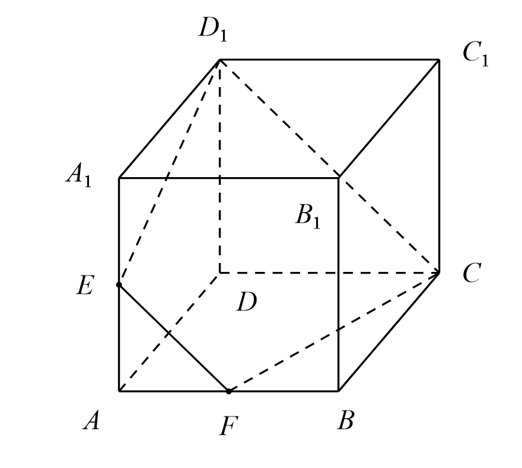
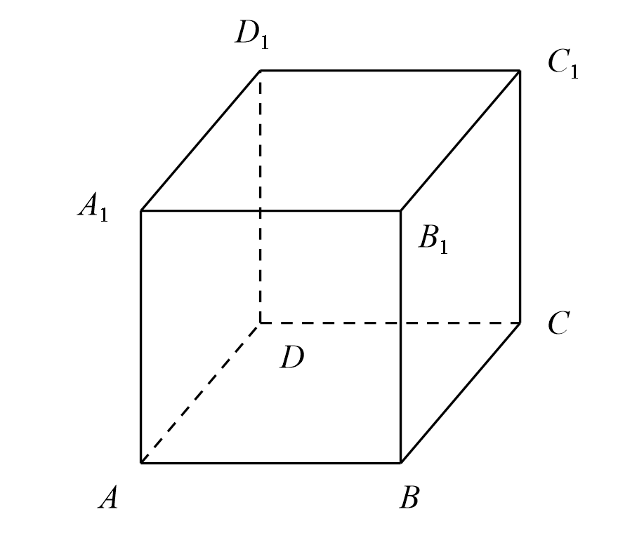

## 20260915 培优专题(1)截面问题

### 一、典型例题

1. 作出平面 $PQR$ 与四棱锥 $ABCDE$ 的截面，截面多边形的边数为 \_\_\_\_\_\_\_\_\_\_\_\_\_\_\_\_。   

2. 在正方体 $ABCD-A_1B_1C_1D_1$ 中，$P$ 为 $BB_1$ 的中点，画出过 $A_1$、$D_1$、$P$ 的截面。
   
3. 如图，在正方体 $ABCD-A_1B_1C_1D_1$ 中，点 $E$、$F$ 分别是棱 $B_1B$、$B_1C_1$ 的中点，点 $G$ 是棱 $C_1C$ 的中点，则过线段 $AG$ 且平行于平面 $A_1EF$ 的截面图形为（　　）
   A. 矩形　　B. 三角形　　C. 正方形　　D. 等腰梯形

4. 如图，在正方体 $ABCD-A_1B_1C_1D_1$ 中，$E$ 为 $AB$ 中点，$P$ 为线段 $C_1D_1$ 上一动点，过 $D$、$E$、$P$ 的平面截正方体的截面图形不可能是（　　）
   A. 三角形　　B. 矩形　　C. 梯形　　D. 菱形
   

5. 如图，四面体 $A-BCD$ 中，$AD=BC=2$，$AD\perp BC$，截面四边形 $EFGH$ 满足 $EF\parallel BC$，$FG\parallel AD$，则下列结论错误的序号是 \_\_\_\_\_\_\_\_\_\_\_\_\_\_\_\_。
   ① 四边形 $EFGH$ 的周长为定值；
   ② 四边形 $EFGH$ 的面积为定值；
   ③ 四边形 $EFGH$ 为矩形；
   ④ 四边形 $EFGH$ 的面积有最大值 $1$。
   

6. 已知正方体 $ABCD-A_1B_1C_1D_1$ 的棱长为 $6$，$E$、$F$ 分别是 $A_1D_1$、$AA_1$ 的中点。
   (1) 作出过点 $C$、$E$、$F$ 的截面；
   (2) 求出过点 $C$、$E$、$F$ 的截面的周长；
   (3) 过点 $C$、$E$、$F$ 的截面将正方体分割成两个部分，记这两个部分的体积分别为 $V_1$、$V_2$（$V_1<V_2$），求 $V_1:V_2$ 的值。
   

### 二、课后练习

1. 如图所示，正方体 $ABCD-A_1B_1C_1D_1$ 的棱长为 $2$，$E$、$F$ 分别为 $AA_1$、$AB$ 的中点，$M$ 点是正方形 $ABB_1A_1$ 内的动点，若 $C_1M\parallel$ 平面 $CD_1E$，则 $M$ 点的轨迹长度为 \_\_\_\_\_\_\_\_\_\_\_\_\_\_\_\_。
   

2. 棱长为 $1$ 的正方体 $ABCD-A_1B_1C_1D_1$ 中，点 $P$ 在线段 $AD$ 上（点 $P$ 异于 $A$、$D$ 两点），线段 $DD_1$ 的中点为 $Q$，若平面 $BPQ$ 截该正方体所得的截面为四边形，则线段 $AP$ 长度的取值范围为（　　）
   A. $\left(0,\dfrac{1}{3}\right]$　　B. $\left(\dfrac{1}{2},1\right]$　　C. $\left[\dfrac{1}{3},1\right)$　　D. $\left(0,\dfrac{1}{2}\right]$
   

3. 在正方体 $ABCD-A_1B_1C_1D_1$ 中，$AB=4$，$M$、$N$ 分别为棱 $A_1D_1$、$A_1B_1$ 的中点，过点 $B$ 的平面 $\alpha\parallel$ 平面 $AMN$，则平面 $\alpha$ 截该正方体所得截面是什么多边形？并求截面面积。
   
