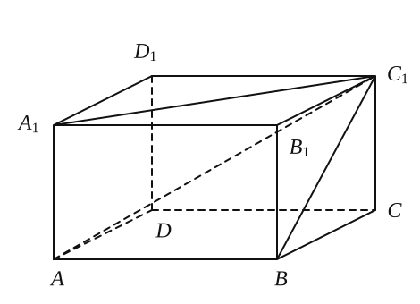
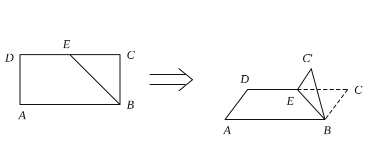
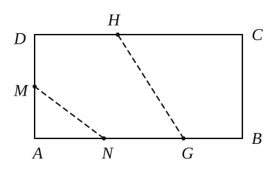
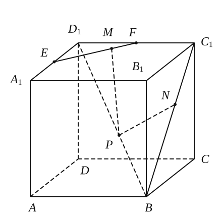
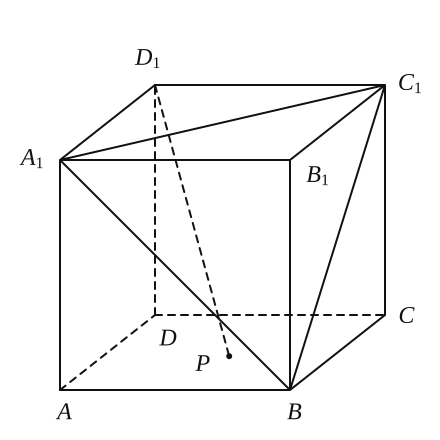
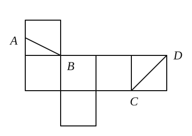

## 20260922 培优专题(2)

### 一、概念辨析

**例题 1** 判断下列命题真假：

1. 一个平面上有三个不共线的点到另一个平面距离相等且不为零，则这两个平面平行。
2. $A$ 是点，$a$、$c$ 是直线，$\alpha$、$\beta$ 是平面，$A\in a$，$A\in\alpha$，$\alpha\perp\beta$，$\alpha\cap\beta=c$，$a\perp c$，则 $a\perp\beta$。
3. 一条直线垂直于一个平面内无数条直线，则该直线与平面垂直。
4. 若一个二面角的两个半平面与另一个二面角的两个半平面分别垂直，则这两个二面角相等或互补。
5. $a$、$b$ 是直线，$\alpha$ 是平面，若 $a\parallel\alpha$，$b\parallel\alpha$，则 $a\parallel b$。
6. 已知 $a$、$b$ 是直线，$\alpha$、$\beta$ 是平面，$a\subset\alpha$，$b\subset\beta$，且 $a\perp b$，则 $\alpha\perp\beta$。

其中正确的命题序号为 \_\_\_\_\_\_\_\_\_\_\_\_\_\_\_\_。

**例题 2** 在长方体 $ABCD-A_1B_1C_1D_1$ 中，如果对角线 $AC_1$ 与过点 $A$ 的相邻三个面所成的角分别为 $\alpha$、$\beta$、$\gamma$，那么 $\cos^2\alpha+\cos^2\beta+\cos^2\gamma=$ \_\_\_\_\_\_\_\_\_\_\_\_\_\_\_\_。

**例题 3** 已知矩形 $ABCD$ 的长为 $2$，宽为 $1$（如图所示）。

(1) 若 $E$ 为 $DC$ 的中点，将矩形沿 $BE$ 折起，使得平面 $C'BE\perp$ 平面 $ABCD$，分别求 $C'$ 到 $AB$ 和 $AD$ 的距离；

(2) 在矩形 $ABCD$ 中，点 $M$ 是 $AD$ 的中点，点 $N$ 是 $AB$ 的三等分点（靠近 $A$ 点），沿折痕 $MN$ 将 $\triangle AMN$ 翻折成 $\triangle A'MN$，使平面 $A'MN\perp$ 平面 $ABCD$。又点 $G$、$H$ 分别在线段 $NB$、$CD$ 上，若沿折痕 $GH$ 将四边形 $GHCB$ 向上翻折，使 $C$ 与 $A'$ 重合，求线段 $NG$ 的长。

**例题 4** 如图，在棱长为 $1$ 的正方体 $ABCD-A_1B_1C_1D_1$ 中，$E$、$F$ 分别为棱 $A_1D_1$、$C_1D_1$ 的中点，若点 $P$、$M$、$N$ 分别为线段 $BD_1$、$EF$、$BC_1$ 上的动点，则 $PM+PN$ 的最小值为 \_\_\_\_\_\_\_\_\_\_\_\_\_\_\_\_。

### 二、练习

1. 已知正三棱柱 $ABC-A_1B_1C_1$ 的所有棱长都是 $2$，点 $M$ 在棱 $AC$ 上运动，则 $A_1M-BM$ 的最小值为 \_\_\_\_\_\_\_\_\_\_\_\_\_\_\_\_。

2. 🔴已知 $OX$、$OY$、$OZ$ 是空间交于同一点 $O$ 的互相垂直的三条直线，点 $P$ 到这三条直线的距离分别为 $5$、$6$、$7$，则 $OP$ 长为 \_\_\_\_\_\_\_\_\_\_\_\_\_\_\_\_。

3. 若两异面直线 $a$、$b$ 所成的角为 $70^\circ$，过空间内一点 $P$ 作与直线 $a$、$b$ 所成角均是 $70^\circ$ 的直线 $l$，则所作直线 $l$ 的条数为 \_\_\_\_\_\_\_\_\_\_\_\_\_\_\_\_。

4. 长方体 $ABCD-A_1B_1C_1D_1$ 的棱长分别为 $AA_1=2$，$AB=3$，$AD=4$，则顶点 $A_1$ 到直线 $BD$ 的距离为 \_\_\_\_\_\_\_\_\_\_\_\_\_\_\_\_。

5. 从同一点 $P$ 引出的三条射线 $PA$、$PB$、$PC$ 两两所成的角的大小为 $60^\circ$，则直线 $PC$ 与平面 $PAB$ 所成角的大小是 \_\_\_\_\_\_\_\_\_\_\_\_\_\_\_\_。

6. ==平面 $\alpha$ 内两条平行线 $l_1$、$l_2$ 相距 $28\,\text{cm}$，$l\not\subset\alpha$，且 $l$ 到 $\alpha$ 的距离为 $15\,\text{cm}$，$l\parallel l_1$，且相距 $17\,\text{cm}$，则 $l$ 与 $l_2$ 的距离为== \_\_\_\_\_\_\_\_\_\_\_\_\_\_\_\_。

7. 🔴《九章算术》中将四个面都是直角三角形的四面体称为“==鳖臑==”，则以正方体 $ABCD-A_1B_1C_1D_1$ 的顶点为顶点的“鳖臑”的个数为 \_\_\_\_\_\_\_\_\_\_\_\_\_\_\_\_。

8. 设正六边形 $ABCDEF$ 的边长为 $a$，线段 $PA$ 垂直于正六边形所在的平面，且 $PA=2a$，分别求点 $P$ 到 $CD$、$DE$ 与 $BC$ 所在直线的距离。

9. 🔴到空间不共面的 $A$、$B$、$C$、$D$ 四点距离相等的平面个数（　　）
   A. $7$ 个　　B. $4$ 个　　C. $3$ 个　　D. $1$ 个

10. 如图，在棱长为 $2$ 的正方体 $ABCD-A_1B_1C_1D_1$ 中，点 $P$ 在底面 $ABCD$ 内，若直线 $D_1P$ 与平面 $A_1BC_1$ 无公共点，则线段 $D_1P$ 的最小值为 \_\_\_\_\_\_\_\_\_\_\_\_\_\_\_\_。    

11. 一个正方体的展开如图所示，点 $B$、$C$、$D$ 为原正方体的顶点，点 $A$ 为原正方体一条棱的中点，那么在原来的正方体中，直线 $CD$ 与 $AB$ 所成角的余弦值为 \_\_\_\_\_\_\_\_\_\_\_\_\_\_\_\_。

    

12. 在棱长为 $2$ 的正方体 $ABCD-A_1B_1C_1D_1$ 中，$M$ 是棱 $A_1D_1$ 的中点，过 $C_1$、$B$、$M$ 作正方体的截面，则这个截面的形状是 \_\_\_\_\_\_\_\_\_\_\_\_\_\_\_\_，截面的面积是 \_\_\_\_\_\_\_\_\_\_\_\_\_\_\_\_。

13. 🔴一条与平面相交的线段，其长度为 $10\,\text{cm}$，两端点到平面的距离分别是 $2\,\text{cm}$、$3\,\text{cm}$，这条线段与平面 $\alpha$ 所成的角是 \_\_\_\_\_\_\_\_\_\_\_\_\_\_\_\_。
