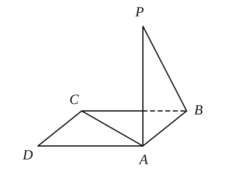
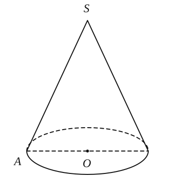
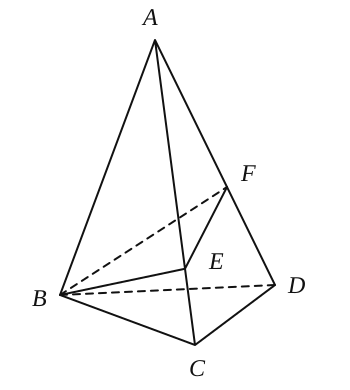
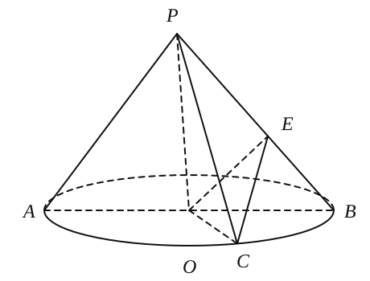
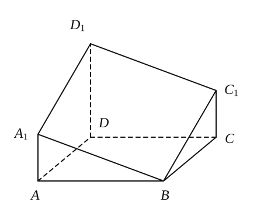
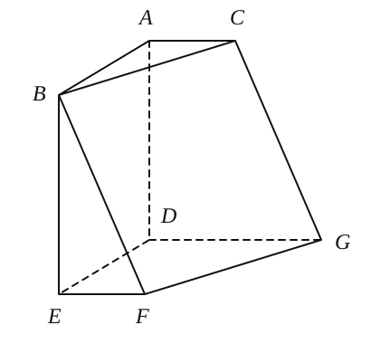
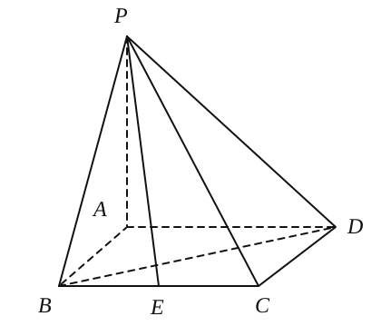
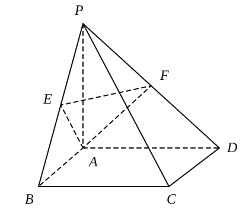

## 20260929

### 一、构造法

**1.** 已知 $PA$、$PB$、$PC$ 两两垂直，空间一点 $M$ 到 $PA$、$PB$、$PC$ 的距离分别为 $8$、$9$、$12$，则 $MP$ 的长为 \_\_\_\_\_\_\_\_。

**2.** 对棱相等的四面体各面一定是（　　）三角形。

A. 锐角　　B. 直角　　C. 钝角　　D. A、B、C 都有可能

**3.** 如图所示，点 $P$ 在正方形 $ABCD$ 所在平面外，$PA\perp$ 平面 $ABCD$，$PA=AB$，则 $PB$ 与 $AC$ 所成的角是（　　）。

A. $90^\circ$　　B. $60^\circ$　　C. $45^\circ$　　D. $30^\circ$

### 二、蚂蚁问题

**4.** 圆锥 $SO$ 的底面半径为 $r$，母线长等于底面半径的 $6$ 倍，若一动点 $P$ 在圆锥侧面上运动。

(1) 求动点 $P$ 自 $A$ 出发又返回到 $A$ 点出的最短路程；

(2) 求动点 $P$ 自 $A$ 出发沿最短路程到达母线 $SA$ 的路程。

**5.** 有一根长为 $h\,\mathrm{cm}$，底面半径为 $r\,\mathrm{cm}$ 的圆柱型铁管，用一段铁丝在该圆柱的侧面上缠绕 $2$ 圈，并使铁丝的两个端点落在圆柱的同一母线的两端，若铁丝长度的最小值为 $40\,\mathrm{cm}$，则圆柱侧面积的最大值为 \_\_\_\_\_\_\_\_ $\mathrm{cm}$。

**6.** 如图，正三棱锥 $A-BCD$ 的底面边长为 $a$，侧棱长为 $2a$，过 $B$ 点作截面与 $AC$、$AD$ 交于 $E$、$F$，则截面三角形 $BEF$ 周长的最小值是 \_\_\_\_\_\_\_\_。

### 三、长度和求最值

**7.** 如图，$AB$ 是底面圆 $O$ 的直径，点 $C$ 是圆 $O$ 上异于 $A$、$B$ 的点，$PO$ 垂直于圆 $O$ 所在的平面，且 $PO=OB=1$，$BC=\sqrt{2}$，点 $E$ 在线段 $PB$ 上，则 $CE+OE$ 的最小值为 \_\_\_\_\_\_\_\_。

**8.** 【高考原题】如图，棱长为 $2$ 的正方体 $ABCD-A_1B_1C_1D_1$，$E$ 为 $CC_1$ 的中点，点 $P$、$Q$ 分别为面 $A_1B_1C_1D_1$ 和线段 $B_1C$ 上动点，求 $\triangle PEQ$ 周长的最小值（　　）。

A. $2\sqrt{2}$　　B. $\sqrt{10}$　　C. $\sqrt{11}$　　D. $\sqrt{12}$

### 四、割补法

**9.** 如图所示的多面体是经过正四棱柱底面顶点 $B$ 作截面 $A_1BC_1D_1$ 后形成的。已知 $AB=1$，$A_1A=C_1C=\frac{1}{2}D_1D$，$D_1B$ 与底面 $ABCD$ 所成的角为 $\frac{\pi}{3}$，则这个多面体的体积为 \_\_\_\_\_\_\_\_。

**10.** 如图，在六面体 $ABCDEFG$ 中，平面 $ABC\parallel$ 平面 $DEFG$，$AB\perp AC$，$AD\perp$ 平面 $DEFG$，$ED\perp DG$，$EF\parallel DG$，且 $AB=AD=DE=DG=2$，$AC=EF=1$。

(1) 求证：$BF\parallel$ 平面 $ACGD$；

(2) 求六面体 $ABCDEFG$ 的体积。

### 五、等体积法

**11.** 在四棱锥 $P-ABCD$ 中，底面是边长为 $2$ 的正方形，$PA\perp$ 底面 $ABCD$，$E$ 为 $BC$ 的中点，$PC$ 与底面所成的角为 $\arctan\frac{\sqrt{2}}{2}$。

(1) 求证：$BD\perp PC$；

(2) 求点 $E$ 到平面 $BDP$ 的距离。

**12.** 如图，在四棱锥 $P-ABCD$ 中，底面 $ABCD$ 是边长为 $2$ 的正方形，且 $CB\perp BP$，$CD\perp DP$，$PA=2$，点 $E$、$F$ 分别为 $PB$、$PD$ 的中点。

(1) 求证：$PA\perp$ 平面 $ABCD$；

(2) 求点 $P$ 到平面 $AEF$ 的距离。

