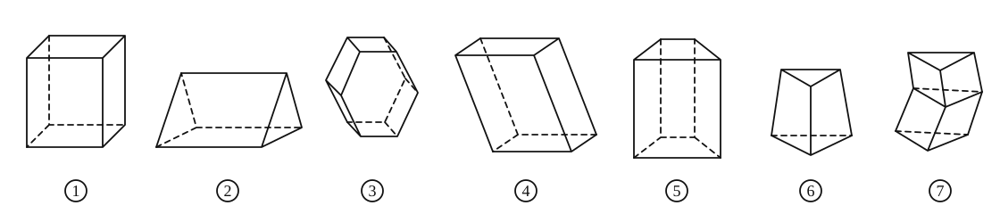
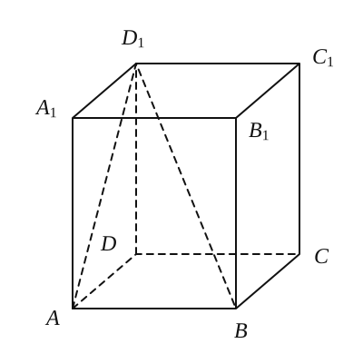
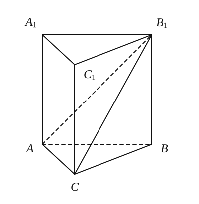
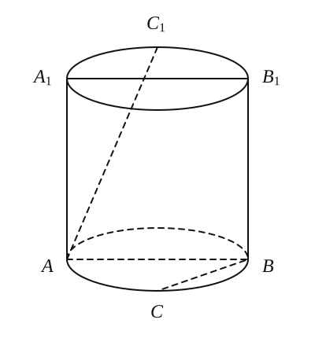
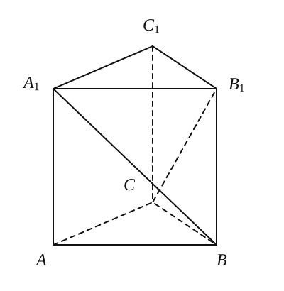
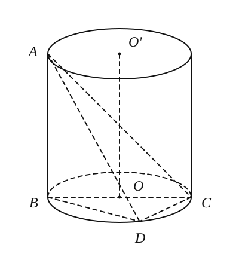
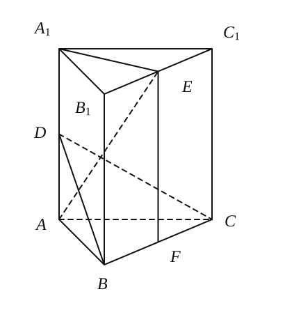

# 第 十 一章 简单几何体
## 20260922 棱体和圆柱

### 一、填空题（写出必要的过程）

1. 下面的几何体中是棱柱的有 \_\_\_\_\_\_\_\_\_\_。

   A. $3$ 个　                                   B. $4$ 个             　C. $5$ 个　                   D. $6$ 个

2. 已知一个长方体共一顶点的三个面的面积分别是 $\sqrt{2}$、$\sqrt{3}$、$\sqrt{6}$，这个长方体的对角线长是 \_\_\_\_\_\_\_\_\_\_。

3. 将边长为 $1$ 的正方形以其一边所在的直线为旋转轴旋转一周，所得几何体的底面周长是 \_\_\_\_\_\_\_\_\_\_。

4. 一棱柱有 $10$ 个顶点，其所有的侧棱长的和为 $60\,\mathrm{cm}$，则每条侧棱长为 $\underline{\qquad\qquad}\,\mathrm{cm}$。

5. 下列关于棱柱的说法，其中正确说法的序号是 \_\_\_\_\_\_\_\_\_\_。
   ① 所有的面都是平行四边形；② 每一个面都不会是三角形；③ 两底面平行，并且各侧棱也平行；④ 棱柱的侧棱总与底面垂直。
   
6. 如图，直四棱柱 $ABCD-A_1B_1C_1D_1$ 的底面是边长为 $1$ 的正方形，侧棱长 $AA_1=\sqrt{2}$，则二面角 $D_1-AB-D$ 的大小等于 \_\_\_\_\_\_\_\_\_\_。 

7. 在直三棱柱 $ABC-A_1B_1C_1$ 中，$A_1A=AB=\sqrt{2}$，$BC=1$，$\angle ACB=90^\circ$，则 $AB_1$ 与面 $BB_1C_1C$ 所成的角的大小是 \_\_\_\_\_\_\_\_\_\_。   

8. 如图，已知圆柱的轴截面 $ABB_1A_1$ 是正方形，$C$ 是圆柱下底面弧 $AB$ 的中点，$C_1$ 是圆柱上底面弧 $A_1B_1$ 的中点，那么异面直线 $AC_1$ 与 $BC$ 所成角的正切值为 \_\_\_\_\_\_\_\_\_\_。  

### 二、解答题

9. 已知直三棱柱 $ABC-A_1B_1C_1$，底面三角形 $ABC$ 中，$CA=CB=1$，$\angle BCA=90^\circ$，棱 $AA_1=2$，求异面直线 $BA_1$ 与 $CB_1$ 夹角的余弦值。
   

10. 已知 $AB$ 是圆柱体 $OO'$ 的一条母线，$BC$ 过底面圆的圆心 $O$，$D$ 是圆 $O$ 上不与点 $B$、$C$ 重合的任意一点，已知棱 $AB=5$，$BC=5$，$CD=3$。
    （1）求异面直线 $AD$ 与 $OO'$ 所成的角的大小；（2）求二面角 $A-DC-B$ 的大小。
    
    
11. 正三棱柱 $ABC-A_1B_1C_1$ 中，$BC=2$，$AA_1=\sqrt{6}$，$D$、$E$ 分别是 $AA_1$、$B_1C_1$ 的中点。
    （1）求证：面 $AA_1E\perp$ 面 $BCD$；（2）求直线 $A_1E$ 与平面 $BCD$ 所成的角。
    