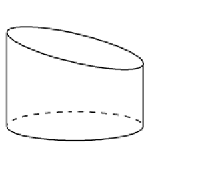
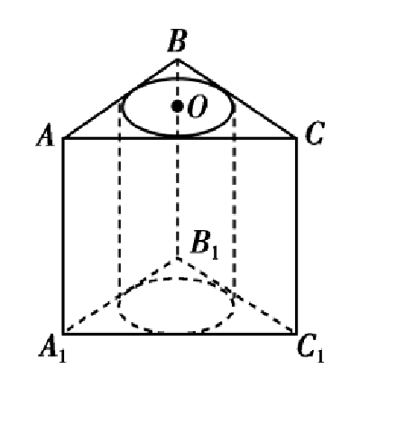
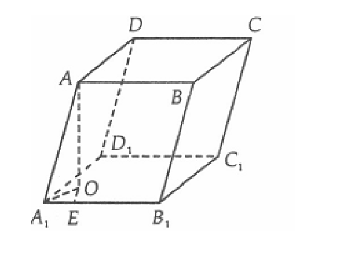
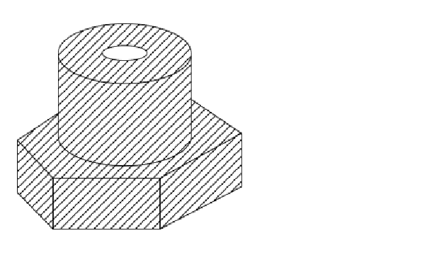
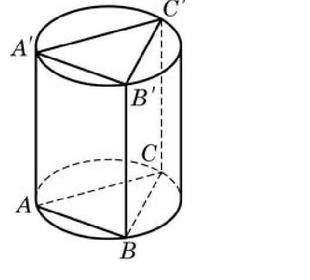
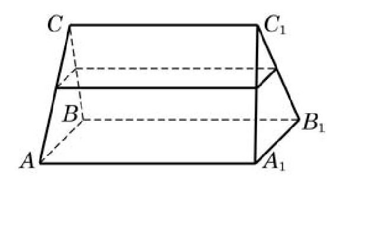

# 第 十 一章 简单几何体
## 20260922 棱体和圆柱

### 一、填空题（写出必要的过程）

1. ❌下面的几何体中是棱柱的有 \_\_\_\_\_\_\_\_\_\_。【基础概念】

   A. $3$ 个　                                   B. $4$ 个             　C. $5$ 个　                   D. $6$ 个

2. 已知一个长方体共一顶点的三个面的面积分别是 $\sqrt{2}$、$\sqrt{3}$、$\sqrt{6}$，这个长方体的对角线长是 \_\_\_\_\_\_\_\_\_\_。

3. 将边长为 $1$ 的正方形以其一边所在的直线为旋转轴旋转一周，所得几何体的底面周长是 \_\_\_\_\_\_\_\_\_\_。

4. 一棱柱有 $10$ 个顶点，其所有的侧棱长的和为 $60\,\mathrm{cm}$，则每条侧棱长为 $\underline{\qquad\qquad}\,\mathrm{cm}$。

5. 下列关于棱柱的说法，其中正确说法的序号是 \_\_\_\_\_\_\_\_\_\_。
   ① 所有的面都是平行四边形；② 每一个面都不会是三角形；③ 两底面平行，并且各侧棱也平行；④ 棱柱的侧棱总与底面垂直。
   
6. ❌如图，直四棱柱 $ABCD-A_1B_1C_1D_1$ 的底面是边长为 $1$ 的正方形，侧棱长 $AA_1=\sqrt{2}$，则二面角 $D_1-AB-D$ 的大小等于 \_\_\_\_\_\_\_\_\_\_。 【计算错】

7. 在直三棱柱 $ABC-A_1B_1C_1$ 中，$A_1A=AB=\sqrt{2}$，$BC=1$，$\angle ACB=90^\circ$，则 $AB_1$ 与面 $BB_1C_1C$ 所成的角的大小是 \_\_\_\_\_\_\_\_\_\_。   

8. 如图，已知圆柱的轴截面 $ABB_1A_1$ 是正方形，$C$ 是圆柱下底面弧 $AB$ 的中点，$C_1$ 是圆柱上底面弧 $A_1B_1$ 的中点，那么异面直线 $AC_1$ 与 $BC$ 所成角的正切值为 \_\_\_\_\_\_\_\_\_\_。  

### 二、解答题

9. 已知直三棱柱 $ABC-A_1B_1C_1$，底面三角形 $ABC$ 中，$CA=CB=1$，$\angle BCA=90^\circ$，棱 $AA_1=2$，求异面直线 $BA_1$ 与 $CB_1$ 夹角的余弦值。
   

10. 已知 $AB$ 是圆柱体 $OO'$ 的一条母线，$BC$ 过底面圆的圆心 $O$，$D$ 是圆 $O$ 上不与点 $B$、$C$ 重合的任意一点，已知棱 $AB=5$，$BC=5$，$CD=3$。
    （1）求异面直线 $AD$ 与 $OO'$ 所成的角的大小；（2）求二面角 $A-DC-B$ 的大小。
    
    
11. 正三棱柱 $ABC-A_1B_1C_1$ 中，$BC=2$，$AA_1=\sqrt{6}$，$D$、$E$ 分别是 $AA_1$、$B_1C_1$ 的中点。
    （1）求证：面 $AA_1E\perp$ 面 $BCD$；（2）求直线 $A_1E$ 与平面 $BCD$ 所成的角。
    

## 20260923 柱体的体积与表面积(1)

### 一、填空题

1. 若圆柱的底面半径是 $1$，母线长为 $2$，则这个圆柱的体积是 \_\_\_\_\_\_\_\_\_\_。

2. 底面边长为 $2$，高为 $1$ 的正三棱柱的体积是 \_\_\_\_\_\_\_\_\_\_。

3. 若一个圆柱的侧面积是 $4\pi$，高为 $1$，则这个圆柱的体积是 \_\_\_\_\_\_\_\_\_\_。

4. 若正六棱柱的高为 $4$，底面边长为 $2$，则这个正六棱柱的体积是 \_\_\_\_\_\_\_\_\_\_。

5. 已知正四棱柱高等于 $6$，侧面积等于 $24$，则体积等于 \_\_\_\_\_\_\_\_\_\_。

6. 已知侧面都是矩形的四棱柱，侧棱长为 $5$，底面是边长为 $2$ 的菱形，则这个棱柱的侧面积是 \_\_\_\_\_\_\_\_\_\_。

7. 设矩形边长分别为 $6$ 和 $4$，将其卷成圆柱的侧面，则圆柱的体积为 \_\_\_\_\_\_\_\_\_\_。

8. 如图，一个底面半径为 $2$ 的圆柱被一平面所截，截得的几何体的最短和最长母线长分别为 $2$ 和 $3$，则该几何体的体积为 \_\_\_\_\_\_\_\_\_\_。

   

9. 设甲、乙两个圆柱的底面积分别为 $S_1$、$S_2$，体积分别为 $V_1$、$V_2$，若它们的侧面积相等，且 $\dfrac{S_1}{S_2}=\dfrac{9}{4}$，则 $\dfrac{V_1}{V_2}$ 的值是 \_\_\_\_\_\_\_\_\_\_。

10. 如图，直三棱柱 $ABC-A_1B_1C_1$ 的高为 $6\ \mathrm{cm}$，底面三角形的边长分别为 $3\ \mathrm{cm}$、$4\ \mathrm{cm}$、$5\ \mathrm{cm}$，以上、下底的内切圆为底面，挖去一个圆柱，剩余部分形成的几何体的体积为 \_\_\_\_\_\_\_\_\_\_。

    

### 二、解答题

11. 如图，已知平行六面体 $ABCD-A_1B_1C_1D_1$ 的底面是边长为 $a$ 的正方形，侧棱 $AA_1$ 的长为 $b$，且 $\angle AA_1B_1=\angle AA_1D_1=60^\circ$，求平行六面体的体积。

    

12. 如图所示的几何体，上面是圆柱，其底面直径为 $6\ \mathrm{cm}$，高为 $3\ \mathrm{cm}$；下面是正六棱柱，其底面边长为 $4\ \mathrm{cm}$，高为 $2\ \mathrm{cm}$。现从中间挖去一个直径为 $2\ \mathrm{cm}$ 的圆柱，求此几何体的体积。

    

13. 设圆柱有一个内接棱柱（即棱柱的侧棱都是圆柱的母线，棱柱的底面分别在圆柱的两个底面内）。已知圆柱的体积是 $4\sqrt{3}\pi$，棱柱的底面是边长为 $2$ 的正三角形，求棱柱的体积。

    

14. 如图，一个直三棱柱形容器中盛有水，且侧棱 $AA_1=8$。当侧面 $AA_1B_1B$ 水平放置时，液面恰好过 $AC$、$BC$、$A_1C_1$、$B_1C_1$ 的中点。当底面 $ABC$ 水平放置时，液面高为多少？

    