# 第 十 章 立体几何
## 20260901 平面及其基本性质(1)

### 一、填空题
1. 点 $A$ 在直线 $l$ 上，用符号表示：\_\_\_\_\_\_\_\_。
2. 直线 $l$ 与平面 $\alpha$ 相交于 $A$，用符号表示：\_\_\_\_\_\_\_\_。
3. 符号 $\alpha \cap \beta=l$，$A \in l$，用文字表示：\_\_\_\_\_\_\_\_。
4. 已知点 $P$ 不在直线 $l$ 上，$l$ 在平面 $\alpha$ 内，则 $P$，$l$，$\alpha$ 之间的关系用符号表示：\_\_\_\_\_\_\_\_。
5. 一条直线和一个平面最多的公共点有：\_\_\_\_\_\_\_\_个。
6. 空间两个不重合的平面将空间分成 $n$ 个部分，则 $n$ 的所有可能值是：\_\_\_\_\_\_\_\_。

### 二、选择题
7. 下列点、直线、平面的表示方法中正确的是（）
A. $\left. \begin{array}{l} A \in \alpha \\ B \in \alpha \end{array} \right\} \Rightarrow AB \in \alpha$                               B. $\left. \begin{array}{l} A \subsetneqq \alpha \\ B \subsetneqq \alpha \end{array} \right\} \Rightarrow AB \in \alpha$
C. $\left. \begin{array}{l} A \subsetneqq \alpha \\ B \subsetneqq \alpha \end{array} \right\} \Rightarrow AB \subsetneqq \alpha$                               D. $\left. \begin{array}{l} A \in \alpha \\ B \in \alpha \end{array} \right\} \Rightarrow AB \subsetneqq \alpha$

8. 直线 $a$ 和 $b$ 相交于平面 $\alpha$ 内一点，用符号表示为（）
A. $a \cap b = P, P \in \alpha$                                        B. $a \cap b = P, P \subsetneqq \alpha$
C. $a \subsetneqq \alpha, b \subsetneqq \alpha, a \cap b = P$                             D. $a \subsetneqq \alpha, b \not\subset \alpha, a \cap b = P$

9. 点 $A$ 在直线 $l$ 上，直线 $l$ 在平面 $\alpha$ 外，则有（）
A. 点 $A$ 不在平面 $\alpha$ 上
B. 点 $A$ 在平面 $\alpha$ 上
C. 点 $A$ 可能在平面 $\alpha$ 上也可能不在平面 $\alpha$ 上
D. 直线 $l$ 与平面 $\alpha$ 无交点

10. 下列命题中正确的有（）
A. 因为直线是无限延伸的，所以平面内的一条直线就可以伸到平面外去
B. 两个平面有时只相交于一个公共点
C. 四条线段首尾相连所得的封闭图形，一定是平面图形
D. 平面无面积，也无厚薄

### 三、解答题
11. 判断下列命题的真假。（真：用“√”；假，用“×”）
(1) 一个平面的面积是 $16\ \mathrm{cm}^2$；（）
(2) 直线 $l$ 与平面 $\alpha$ 有且只有两个公共点；（）
(3) 四条线段首尾相连一定构成一个平面四边形；（）
(4) 8 个平面重叠起来要比 6 个平面重叠起来厚；（）
(5) 若直线上有一个点在一个平面内，则这条直线在这个平面内；（）

12. 已知下列集合语言表示的位置关系，画出图形
(1) $A \in \alpha$，$\alpha$，$B \notin \alpha$
(2) $l \subset \alpha$，$m \not\subset \alpha$
(3) $\alpha \cap \beta=l$
(4) $P \in l$，$P \notin \alpha$，$Q \in l$，$Q \in \alpha$
(5) $l_1 \cap \alpha = A, \ l_2 \cap \alpha = B, \ l_1 \parallel l_2$

13. 证明：若四边形有三条边在一个平面上，则它的第四条边也在这个平面上。

14. 根据图形用符号表示下列点、直线、平面之间的关系。
    (1) 点 $P$ 与直线 $AB$；
    (2) 点 $C$ 与直线 $AB$；
    (3) 点 $M$ 与平面 $AC$；
    (4) 点 $A_1$ 与平面 $AC$；
    (5) 直线 $AB$ 与直线 $BC$；
    (6) 直线 $AB$ 与平面 $AC$；
    (7) 平面 $A_1B$ 与平面 $AC$。
    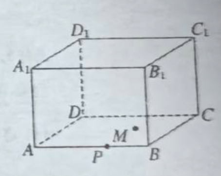

## 20260902 平面及其基本性质(2)

### 一、填空题
1. ❌空间不共线的四个点可确定 \_\_\_\_\_\_\_\_ 个平面。
2. 在空间四点中，无三点共线是无四点共面的 \_\_\_\_\_\_\_\_ 条件。
3. 三条互相平行的直线最多可确定 \_\_\_\_\_\_\_\_ 个平面。
4. 若一个平面 $\alpha$ 经过圆上三个不同的点，那么圆上所有的点 \_\_\_\_\_\_\_\_ 这个平面上。（填“在”，“不在”，“可能在”或“也可能不在”）
5. 设 $E,F$ 是空间四边形 $ABCD$ 的边 $AD,BC$ 的中点，那么 $EF$ \_\_\_\_\_\_\_\_ $\frac{1}{2}(AB+CD)$（填“$>$”、“$<$”或“$=$”）

### 二、选择题
7. 给出下列六组条件：
① 空间三个点；② 空间两条相交直线；③ 三条直线中的一条与另外两条分别相交；
④ 空间一直线与一个点；⑤ 三条平行直线与第四条直线都相交；⑥ 两两相交但不交于同一点的三条直线。
则其中能确定一个平面的条件共有（）
A. 1个
B. 2个
C. 3个
D. 4个

9. ❌三条直线相交，仅有两个交点时，可以确定的平面个数为（）
A. 1个
B. 1个或2个
C. 2个
D. 以上都不对

10. 下面命题中，正确的是（）
(A) 四边形一定是平面图形；
(B) 三点可以确定一个平面；
(C) 四条边都相等的四边形是菱形；
(D) 梯形一定是平面图形。

### 三、解答题
11. 请将以下四图中，看得见的部分用实线描出。
    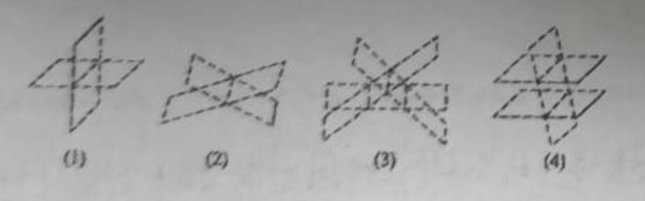

12. 已知不共点的四条直线 $a,b,c,d$ 两两相交. 求证：$a,b,c,d$ 四条直线共面.
    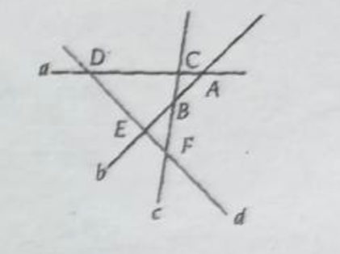

13. 已知 $l$ 上有三点 $A、B、C$，过这三点分别作互相平行的直线 $a,b,c$。求证：$l、a、b、c$ 四条直线共面。

14. 一个平面将空间分成几部分？二个平面将空间分成几部分？三个平面将空间分成几部分？

## 20260903 相交平面

1.下列四个命题中，真命题为（）
A. 两个平面 $\alpha,\beta$ 有一个公共点，就说平面 $\alpha,\beta$ 相交于过点 $P$ 的任意一条直线
B. 两个平面 $\alpha,\beta$ 有且只有一条公共直线 $a$，就说平面 $\alpha,\beta$ 相交，记作 $\alpha \cap \beta = a$
C. 两个平面 $\alpha,\beta$ 有一个公共点 $P$，就说平面 $\alpha,\beta$ 相交于点 $P$，记作 $\alpha \cap \beta = P$
D. 平面 $ABC$ 与平面 $BDC$ 相交于线段 $BC$

2.画三个平面，使其中的两个平面互相平行，而第三个平面与这两个平面都相交。

3.如图，在长方体 $ABCD-A_1B_1C_1D_1$ 中，
（1）设 $AC$ 与 $BD$ 的交点为 $O$，$O$ 必为平面 \_\_\_\_\_\_\_\_ 与平面 \_\_\_\_\_\_\_\_ 的公共点（答案不唯一）；
❌（2）画出平面 $A_1BCD_1$ 与平面 $B_1BDD_1$ 的交线。
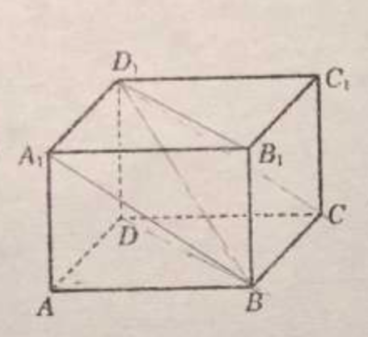

4.按照绘出的要求，完成图中两个相交平面的作图，图中所给线段 $AB$ 分别是两个平面的交线。
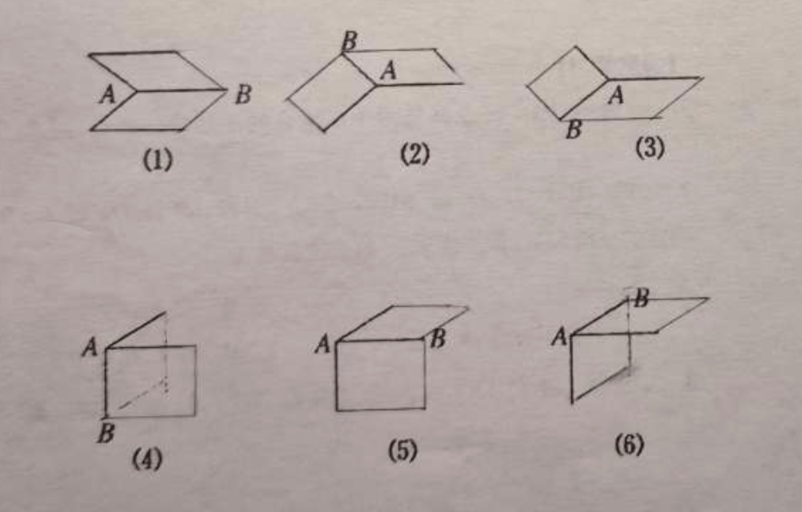

5.已知正方体 $ABCD--A_1B_1C_1D_1$ 中，$BD_1$ 与平面 $ACB_1$ 交于点 $P$，设 $BD$ 与 $AC$ 相交于点 $O$。求证：$P \in$ 直线 $B_1O$。
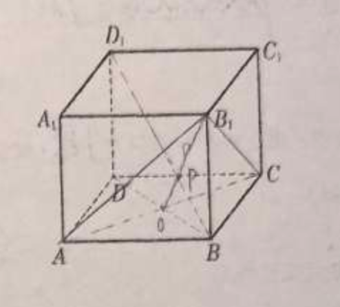

6.正方体 $ABCD--A_1B_1C_1D_1$ 中，$M,N$ 分别是 $AB_1,AA_1$ 的中点，求证：
(1)$M,N,C,D_1$ 四点共面；
(2)$CM,D_1N,DA$ 三线共点。
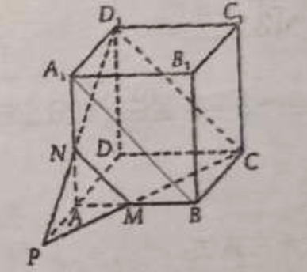

7.❌如图，过 $P,Q,R$ 作正方体 $ABCD--A_1B_1C_1D_1$ 的截面。
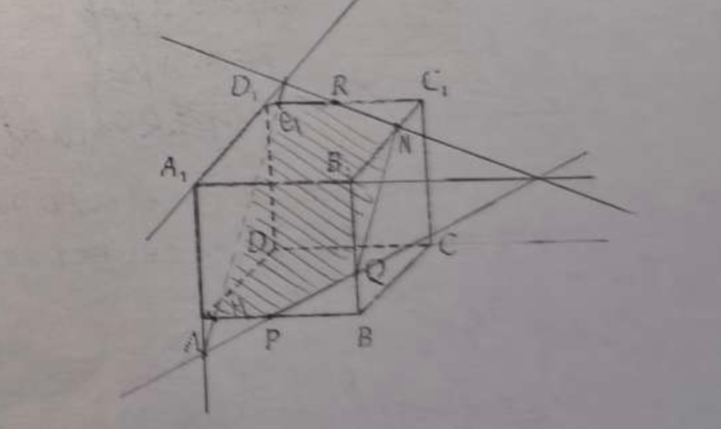

## 20260904 空间图形的平面直观图的画法

1. (1) 画水平放置的直角梯形的直观图，如图所示。
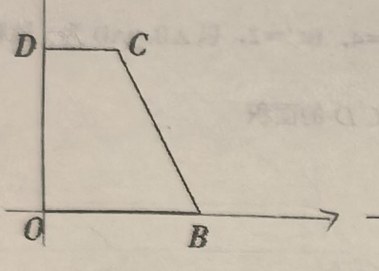

2. 用斜二测画法画长、宽、高分别为 $4\ \mathrm{cm}$、$3\ \mathrm{cm}$、$2\ \mathrm{cm}$ 的长方体 $ABCD-A'B'C'D'$ 的直观图。

3. 水平放置的 $\triangle ABC$ 的直观图如图所示，已知 $A'C'=3$，$B'C'=2$，则 $\triangle ABC$ 中边 $BC$ 的实际长度为\_\_\_\_\_\_\_\_。
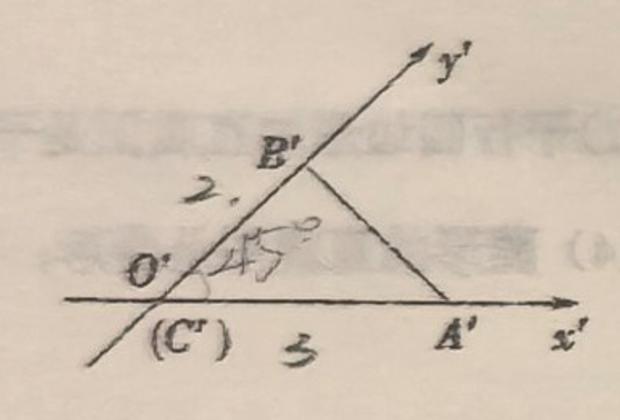

4. 如图所示为水平放置的正方形 $ABCO$，它在直角坐标系 $xOy$ 中，点 $B$ 的坐标为 $(2,2)$，现在用斜二测画法作它的直观图，则顶点 $B'$ 到 $x'$ 轴的距离为\_\_\_\_\_\_\_\_。
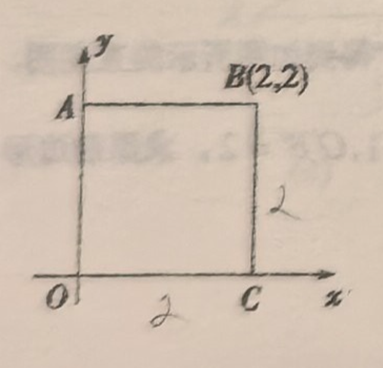

5. 如图所示，正方形 $O'A'B'C'$ 的边长为 $1\ \mathrm{cm}$，它是一个水平放置的平面图形的直观图，则原图形的周长为\_\_\_\_\_\_\_\_ $\mathrm{cm}$。
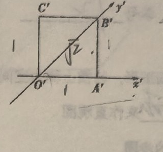

6. 如图，矩形 $O'A'B'C'$ 是水平放置的一个平面图形的直观图，其中 $O'A'=6\ \mathrm{cm}$，$O'C'=2\ \mathrm{cm}$，$C'D'=2\ \mathrm{cm}$，则原图形是（　　）
A. 正方形　　B. 矩形　　C. 一般的平行四边形　　D. 菱形
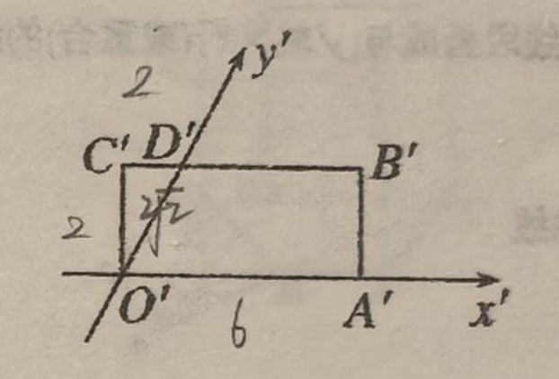

7. 如图所示，梯形 $A_1B_1C_1D_1$ 是一个平面图形 $ABCD$ 的直观图。若 $A_1D_1\parallel O'y'$，$A_1B_1\parallel C_1D_1$，$A_1B_1=\dfrac{2}{3}C_1D_1=2$，$A_1D_1=O'D_1=1$，试画出原四边形，并求原图形的面积。
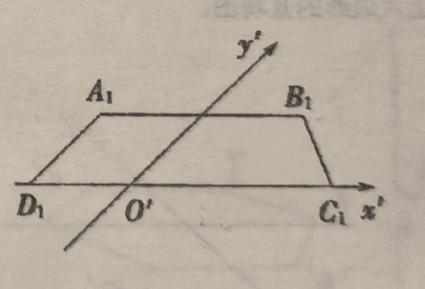

## 20260907 空间的平行直线

### 一、填空题

1. 空间两个角 $\alpha$，$\beta$ 的两边分别对应平行，且 $\alpha=60^\circ$，则角 $\beta$ 的大小为\_\_\_\_\_\_\_\_。

2. 下列命题中，正确的结论的序号是\_\_\_\_\_\_\_\_。
① 如果一个角的两边与另一个角的两边分别平行，那么这两个角相等。
② 如果两条相交直线和另两条相交直线分别平行，那么这两组直线所成的锐角（或直角）相等。
③ 如果一个角的两边和另一个角的两边分别垂直，那么这两个角相等或互补。
④ 如果两条直线同时平行于第三条直线，那么这两条直线互相平行。

3. 如图，空间四边形 $ABCD$，顺次连接各边中点 $E$，$F$，$G$，$H$，则四边形 $EFGH$ 一定是\_\_\_\_\_\_\_\_。
① 若对角线 $AC$、$BD$ 相等，则四边形 $EFGH$ 的形状是\_\_\_\_\_\_\_\_。
② 若对角线 $AC$、$BD$ 垂直，则四边形 $EFGH$ 的形状是\_\_\_\_\_\_\_\_。
③ 若对角线 $AC$、$BD$ 相等且垂直，则四边形 $EFGH$ 的形状是\_\_\_\_\_\_\_\_。
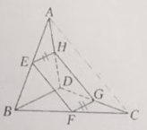

### 二、选择题

4. ❌两等角的一组对应边平行，则（　　）
A. 另一组对应边平行  
B. 另一组对应边不平行  
C. 另一组对应边不可能垂直  
D. 以上都不对

5. ❌已知在正方体 $ABCD-A_1B_1C_1D_1$ 中（如图），$l\subset$ 平面 $A_1B_1C_1D_1$，且 $l$ 与 $B_1C_1$ 不平行，则下列一定不可能的是（　　）
A. $l$ 与 $AD$ 平行  
B. $l$ 与 $AD$ 不平行  
C. $l$ 与 $AC$ 平行  
D. $l$ 与 $BD$ 垂直
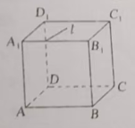

### 三、解答题

6. 如图，$P$ 是正方体 $ABCD-A_1B_1C_1D_1$ 木块的上底面内的一点，在面 $AC$ 内，过 $P$ 点分别按下列要求画出直线。
（1）与 $C_1D_1$ 平行；
（2）与 $A_1D_1$ 平行；
（3）与 $B_1D_1$ 平行。
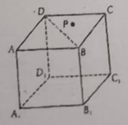

7. 在正方体 $ABCD-A_1B_1C_1D_1$ 中，$M$、$M_1$ 分别是棱 $AD$ 和 $A_1D_1$ 的中点。
（1）求证：四边形 $BB_1M_1M$ 为平行四边形；
（2）求证：$\angle BMC=\angle B_1M_1C_1$。
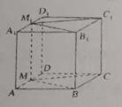

8. 如图所示，不共面的三条射线 $OA$、$OB$、$OC$，点 $A_1$、$B_1$、$C_1$ 分别是 $OA$、$OB$、$OC$ 上的点，且 $\dfrac{OA_1}{OA}=\dfrac{OB_1}{OB}=\dfrac{OC_1}{OC}$。
求证：$\triangle A_1B_1C_1\sim\triangle ABC$。
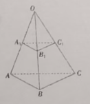

9. 已知棱长为 $a$ 的正方体 $ABCD-A_1B_1C_1D_1$ 中，$M$、$N$ 分别是 $D_1A_1$、$D_1C_1$ 的中点。
（1）求证：四边形 $ACNM$ 为梯形；
（2）求四边形 $ACNM$ 的面积。
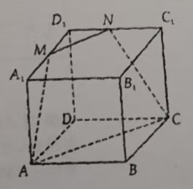

## 20260908 异面直线

### 一、填空题

1. 若直线 $a \parallel b$，$b \parallel c$，则直线 $a$ 与直线 $c$ 的位置关系是\_\_\_\_\_\_\_\_。

2. 过直线外的一个点，可作\_\_\_\_\_\_\_\_条直线和这条直线平行。

3. 已知 $a$ 和 $l$ 是异面直线，$b$ 和 $l$ 也是异面直线，则直线 $a$、$b$ 的位置关系是\_\_\_\_\_\_\_\_。

4. ❌如果两条直线在同一平面上的射影是两条平行线，则这两条直线的位置关系是\_\_\_\_\_\_\_\_。

5. 直线 $a \parallel b \parallel c$，直线 $d \cap \alpha=A$，$d \cap \beta=B$，则 $d$ 与 $c$ 的位置关系是\_\_\_\_\_\_\_\_。

6. 下列命题中，真命题的是\_\_\_\_\_\_\_\_。
（1）若直线 $a$ 在平面 $\alpha$ 上，直线 $b$ 不在平面 $\alpha$ 上，则 $a$、$b$ 是异面直线；
（2）若 $a$ 与 $c$ 相交，$b$ 与 $c$ 异面，则 $a$ 与 $b$ 异面；
（3）若 $a$ 与 $b$ 相交，$b$ 与 $c$ 相交，则 $a$ 与 $c$ 也相交；
（4）设 $a$、$b$ 是两条直线，若 $a \parallel$ 平面 $\alpha$，$a \parallel b$，则 $b \parallel$ 平面 $\alpha$；
（5）若 $a$、$b$ 分别在两个相交平面内，则这两条直线可能平行、相交或异面。

### 二、选择题

7. 分别与两条异面直线同时相交的直线（　　）
A. 一定是异面直线　　B. 不可能平行　　C. 不可能相交　　D. 相交、平行和异面都有可能

8. 两条直线没有公共点是这两条直线为异面直线的（　　）
A. 充分非必要条件　　B. 必要非充分条件　　C. 充分必要条件　　D. 既非充分也非必要条件

9. 三条直线 $a$、$b$、$c$，若 $a \perp c$ 且 $b \perp c$，则 $a$、$b$ 的位置关系必定是（　　）
A. 相交　　B. 平行　　C. 异面　　D. 相交、平行、异面都有可能

10. 正方体的十二条棱可组成 $n$ 对异面直线，则 $n$ 等于（　　）
A. $24$　　B. $3$　　C. $6$　　D. $12$

### 三、解答题

11. 已知 $\alpha \cap \beta=a$，$b \subset \beta$，$a \cap b=A$，且 $c \subset \alpha$，$c \parallel a$。求证：$b$、$c$ 是异面直线。
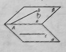

12. 在长方体 $ABCD-A_1B_1C_1D_1$ 中，哪些棱所在的直线与体对角线 $A_1C$ 是异面直线？
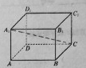

13. 如图，在长方体 $ABCD-A_1B_1C_1D_1$ 中，判断下列直线的位置关系：
（1）直线 $A_1B$ 与直线 $D_1C$ 的位置关系是\_\_\_\_\_\_\_\_；
（2）直线 $A_1B$ 与直线 $B_1C$ 的位置关系是\_\_\_\_\_\_\_\_；
（3）直线 $D_1D$ 与直线 $D_1C$ 的位置关系是\_\_\_\_\_\_\_\_；
（4）直线 $AB$ 与直线 $B_1C$ 的位置关系是\_\_\_\_\_\_\_\_。
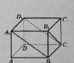

14. 如图，已知不在同一平面上的三条直线 $a$、$b$、$c$ 相交于点 $O$，$M$、$P$ 是直线 $a$ 上的两点，$N$、$Q$ 分别是直线 $b$、$c$ 上与点 $O$ 不重合的点。求证：$MN$ 和 $PQ$ 是异面直线。
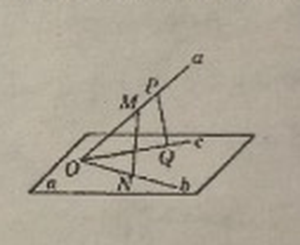

15. 如图，在正方体 $ABCD-A_1B_1C_1D_1$ 中，点 $M$、$N$ 分别是 $A_1B_1$、$B_1C_1$ 的中点。
求证：
（1）$AM$ 和 $CN$ 共面；
（2）$D_1B$ 和 $CC_1$ 是异面直线。
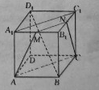

## 20260909 异面直线所成的角

### 一、填空题

在正方体 $ABCD-A_1B_1C_1D_1$ 中：

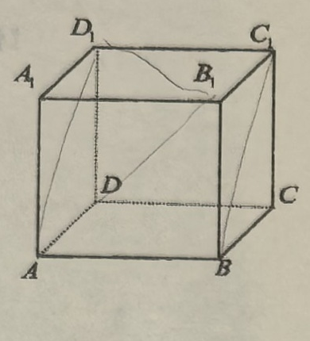

1. $A_1B$ 和 $CC_1$ 所成角的大小是\_\_\_\_\_\_\_\_。

2. $AB_1$ 和 $BC_1$ 所成角的大小是\_\_\_\_\_\_\_\_。

3. 过空间直线外一点，能作\_\_\_\_\_\_\_\_条直线与已知直线平行；
   过空间直线外一点，能作\_\_\_\_\_\_\_\_条直线与已知直线垂直。

4. 设 $P$ 是直线 $l$ 外一定点，过点 $P$ 且与 $l$ 成 $30^\circ$ 角的异面直线有\_\_\_\_\_\_\_\_条。

5. ❌空间四边形的对角线互相垂直，那么顺次连接四边形各边中点所得的四边形是\_\_\_\_\_\_\_\_形。

6. 下列命题中，真命题是\_\_\_\_\_\_\_\_。
① 若两条直线和第三条直线所成的角相等，则这两条直线必平行；
② 若一条直线垂直于两条平行直线中的一条，则它一定与另一条直线垂直；
③ 两条异面直线所成的角的取值范围是 $0^\circ<\alpha<90^\circ$。

### 二、选择题

7. 袋内有一把直尺，无论这把直尺怎样放置，在教室的地面上总能画出一条直线，使这条直线与直尺（　　）
A. 平行　　B. 异面　　C. 相交　　D. 垂直

8. 若 $\angle AOB=150^\circ$，直线 $a\parallel OA$，直线 $a$ 和 $OB$ 是异面直线，那么 $a$ 和 $OB$ 所成的角是（　　）
A. $150^\circ$　　B. $30^\circ$　　C. $30^\circ$ 或 $150^\circ$　　D. 不能确定

9. 在正方体 $ABCD-A_1B_1C_1D_1$ 中，与 $AD_1$ 成 $60^\circ$ 角的面对角线共有（　　）
A. $4$ 条　　B. $6$ 条　　C. $8$ 条　　D. $10$ 条

10. 如图，正方体 $ABCD-A_1B_1C_1D_1$ 中，$R$、$S$、$T$ 是相应各棱的中点，试判断下列哪两条直线是异面直线。（　　）
    A. $BS$ 与 $AA_1$　　B. $BS$ 与 $DR$　　C. $BS$ 与 $CT$　　D. $DR$ 与 $CT$
    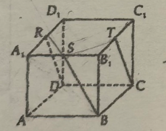

### 三、解答题

11. 如图，长方体 $ABCD-A_1B_1C_1D_1$ 中，已知它的三条棱长分别为 $AB=\sqrt{5}$，$AD=2\sqrt{5}$，$AA_1=2\sqrt{11}$，求 $AC$ 与 $BC_1$ 所成角的大小。
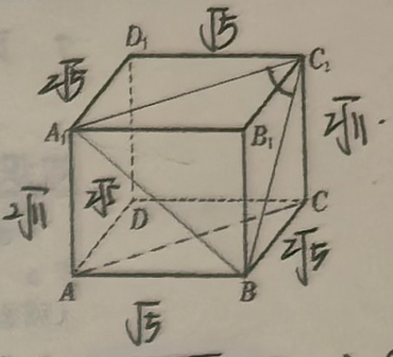

12. 如图，在四面体 $ABCD$ 中，$AC=8$，$BD=6$，$M$、$N$ 分别为 $AB$、$CD$ 的中点，且异面直线 $AC$ 与 $BD$ 所成的角为 $90^\circ$。求 $MN$ 的长。
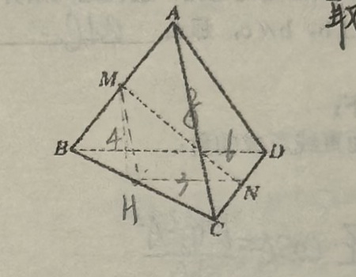

13. ❌在长方体 $ABCD-A_1B_1C_1D_1$ 中，$AB=BC=1$，$AA_1=\sqrt{3}$。求异面直线 $AD_1$ 与 $DB_1$ 所成角的余弦值。
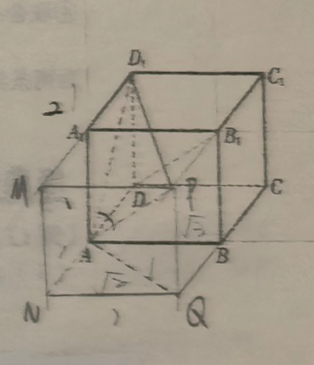

14. 设 $A$、$B$、$C$、$D$ 为空间四点，$E$、$F$、$G$、$H$ 分别是 $AC$、$BC$、$DB$、$DA$ 的中点。若 $AB=12\sqrt{2}$，$CD=4\sqrt{3}$，四边形 $EFGH$ 的面积为 $12\sqrt{3}$，求异面直线 $AB$、$CD$ 所成的角。
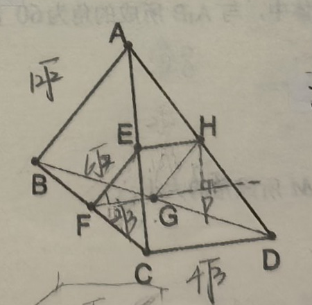

## 20260910 异面直线所成的角2

### 一、填空题

1. 若空间中有两条直线，则“这两条直线为异面直线”是“这两条直线没有公共点”的\_\_\_\_\_\_\_\_条件。

2. 三条直线两两相交，可确定的平面个数是\_\_\_\_\_\_\_\_。

3. 设 $A\in\alpha$，$B\in\beta$，$\alpha\cap\beta=l$，且 $A\notin l$，$B\notin l$，则 $l$ 与 $AB$ 的位置关系是\_\_\_\_\_\_\_\_。

4. 如果两条直线在同一平面上的射影是两条相交直线，则这两条直线的位置关系是\_\_\_\_\_\_\_\_。

5. 若 $a$、$b$ 是异面直线，$b$、$c$ 也是异面直线，则直线 $a$、$c$ 的位置关系是\_\_\_\_\_\_\_\_。

6. 两异面直线 $a$、$b$ 所成角为 $60^\circ$，过空间任意一点 $P$ 作直线与 $a$、$b$ 所成的角均为等角，且该角为 $60^\circ$，则所作直线的数目为\_\_\_\_\_\_\_\_。

7. 在空间四边形 $ABCD$ 中，$AB=CD$，$M$、$N$ 分别为 $AD$、$BC$ 的中点，则 $MN$ \_\_\_\_ $AB$（填“$<$”、“$>$”或“$=$”）。

8. 在如图所示的直观图中，四边形 $O'A'B'C'$ 为菱形且边长为 $2\ \mathrm{cm}$，则在坐标系 $xOy$ 中原四边形 $OABC$ 为\_\_\_\_\_\_\_\_（填形状），其面积为\_\_\_\_\_\_\_\_ $\mathrm{cm}^2$。
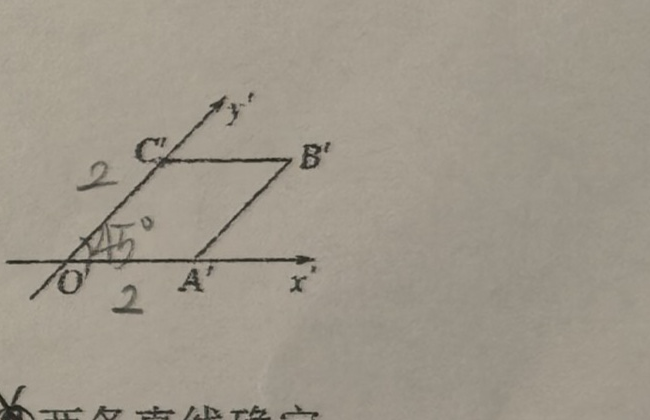

9. 下列判断中：①三点确定一个平面；②一条直线和一点确定一个平面；③两条直线确定一个平面；④三角形和梯形一定是平面图形；⑤四边形一定是平面图形；⑥六边形一定是平面图形；⑦两两相交的三条直线确定一个平面。其中正确的是\_\_\_\_\_\_\_\_。

### 二、选择题

10. 下列图形中不一定是平面图形的是（　　）
A. 三角形　　B. 菱形　　C. 梯形　　D. 四边相等的四边形

11. 异面直线 $a$、$b$ 分别在平面 $\alpha$、$\beta$ 内，$\alpha\cap\beta=l$，则 $l$ 与 $a$、$b$ 的位置关系是（　　）
A. 与 $a$、$b$ 均相交　　B. 至少与 $a$、$b$ 中一条相交　　C. 与 $a$、$b$ 均不相交　　D. 至多与 $a$、$b$ 中一条相交

12. 若两条异面直线所成的角为 $60^\circ$，则称这对异面直线为“黄金异面直线对”。在连接正方体各顶点的所有直线中，“黄金异面直线对”共有（　　）对。
A. $48$ 对　　B. $24$ 对　　C. $12$ 对　　D. $66$ 对

### 三、解答题

13. 在长方体 $ABCD-A_1B_1C_1D_1$ 中，$AB=BC=1$，$AA_1=\sqrt{3}$，求异面直线 $AC$ 与 $DB_1$ 所成角的余弦值。
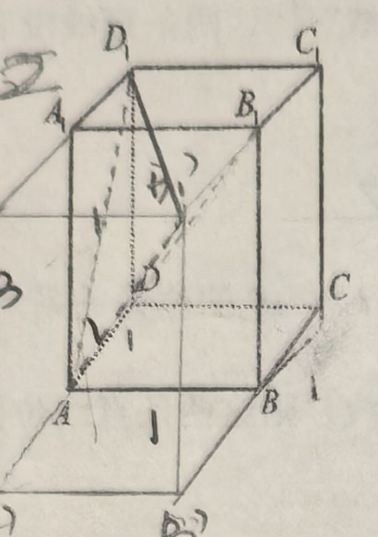

14. 如图，已知 $E$、$F$ 是空间四边形 $ABCD$ 中 $AB$、$CD$ 的中点，且 $AC=BD=2a$，$EF=\sqrt{3}a$，求异面直线 $AC$ 与 $BD$ 所成角的大小。
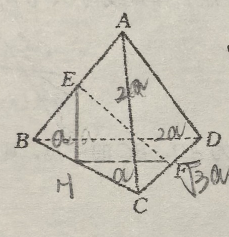

15. 在正方体 $ABCD-A_1B_1C_1D_1$ 中，$E$、$F$、$G$、$H$ 分别是棱 $AB$、$BC$、$CC_1$、$C_1D_1$ 的中点。
（1）❌判断直线 $EF$ 与 $GH$ 的位置关系，并说明理由；
（2）求异面直线 $AD_1$ 与 $FG$ 所成角的大小。
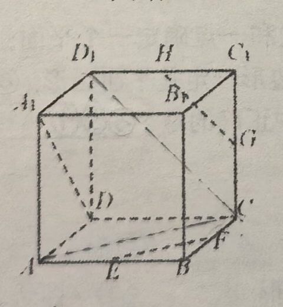

## 20260911 直线和平面平行(1)

### 一、选择题

1. （多选）两条直线 $a$、$b$ 满足 $a\parallel b$，$b\subset$ 平面 $\alpha$，则 $a$ 与平面 $\alpha$ 的位置关系可以是（　　）  
A. $a\parallel\alpha$　　B. $a$ 与 $\alpha$ 相交　　C. $a$ 与 $\alpha$ 不相交　　D. $a\subset\alpha$

2. 下列命题正确的是（　　）  
A. 如果一条直线不在平面内，则这条直线就与这个平面平行  
B. 过直线外一点，可以作无数个平面与这条直线平行  
C. 如果一条直线与平面平行，则它与平面内的任何直线平行  
D. 如果一条直线平行于平面内的无数条直线，则该直线与平面平行

3. 如图所示，在正方体 $ABCD-A'B'C'D'$ 中，$E$、$F$ 分别为四边形 $ABCD$ 和四边形 $A'B'C'D'$ 的中心，则正方体的六个面中与 $EF$ 平行的平面有（　　）  
A. $1$ 个　　B. $2$ 个　　C. $3$ 个　　D. $4$ 个 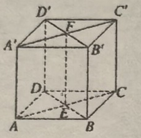

4. 若直线 $l$ 与平面 $\alpha$ 相交，则（　　）  
A. 平面 $\alpha$ 内存在无数条直线与直线 $l$ 异面  
B. 平面 $\alpha$ 内存在唯一的一条直线与直线 $l$ 平行  
C. 平面 $\alpha$ 内存在唯一的一条直线与直线 $l$ 垂直  
D. 平面 $\alpha$ 内的直线与直线 $l$ 都相交

5. 直线 $l\parallel$ 平面 $\alpha$，直线 $m\parallel$ 平面 $\alpha$，直线 $l$ 与 $m$ 相交于点 $P$，且 $l$ 与 $m$ 确定的平面为 $\beta$，则 $\alpha$ 与 $\beta$ 的位置关系是（　　）  
A. 相交　　B. 平行　　C. 异面　　D. 不确定

6. ❌下列四个正方体图形中，$A$、$B$ 为正方体的两个顶点，$M$、$N$、$P$ 分别为其所在棱的中点。能得出 $AB\parallel$ 平面 $MNP$ 的图形有（　　）个。  
A. $1$　　B. $2$　　C. $3$　　D. $4$  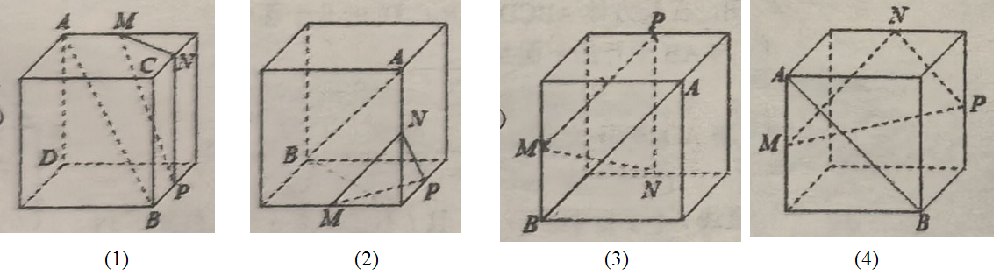

### 二、解答题

7. 如图，在正方体 $ABCD-A_1B_1C_1D_1$ 中，$E$、$F$、$G$ 分别是 $BC$、$CC_1$、$BB_1$ 的中点。  求证：$EF\parallel$ 平面 $AD_1G$。
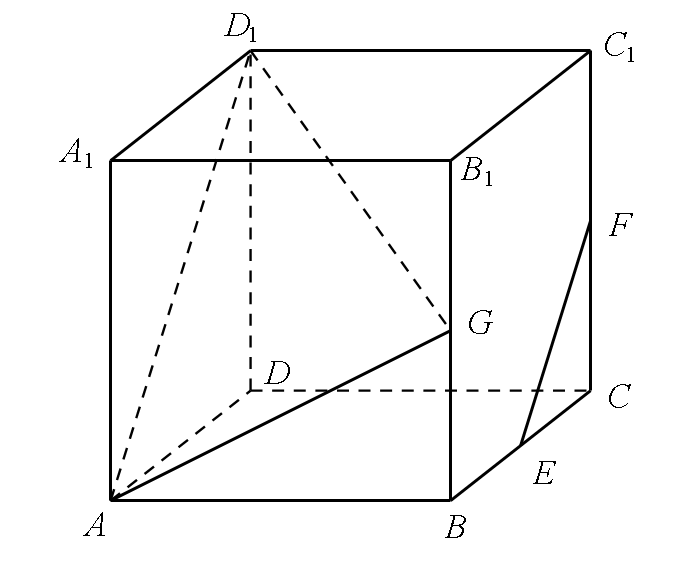

8. 如图，四边形 $ABCD$ 是平行四边形，$P$ 是平面 $ABCD$ 外一点，$M$、$N$ 分别是 $AB$、$PC$ 的中点。求证：$MN\parallel$ 平面 $PAD$。
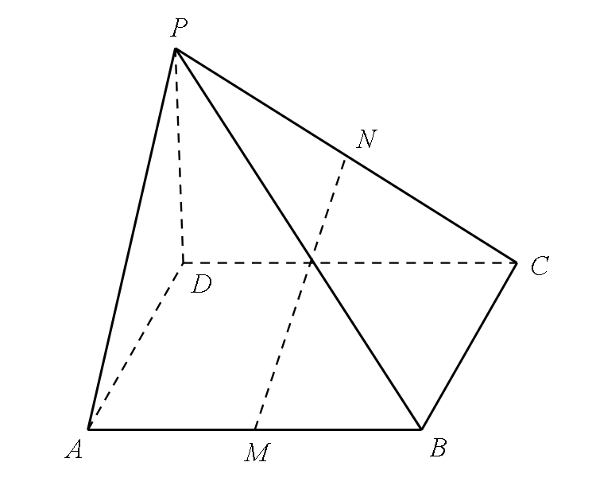

9. ❌在长方体 $ABCD-A_1B_1C_1D_1$ 中，$M$、$N$ 分别为矩形 $A_1ADD_1$ 和 $D_1C_1CD$ 的中心。求证：$MN\parallel$ 平面 $ABCD$。
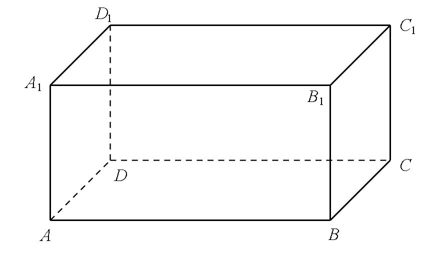

10. 如图，已知四边形 $ABCD$ 是正方形，四边形 $ACEF$ 是矩形，$M$ 是线段 $EF$ 的中点。求证：$AM\parallel$ 平面 $BDE$。
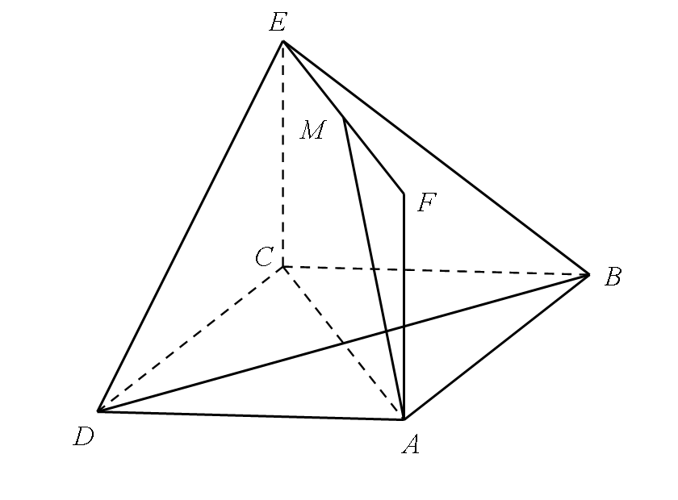

## 20260914 直线和平面平行(2)

### 一、选择题（写出必要过程）

1. 设 $a$、$b$ 是平面 $M$ 外的两条直线，且 $a\parallel M$，那么 $a\parallel b$ 是 $b\parallel M$ 的（　　）条件。
A. 充分非必要　　B. 必要非充分　　C. 充要　　D. 既非充分又非必要

2. 已知正方体 $ABCD-A_1B_1C_1D_1$，则下面四条直线中与平面 $AB_1C$ 平行的是（　　）
A. $DB_1$　　B. $A_1D_1$　　C. $C_1D_1$　　D. $A_1D$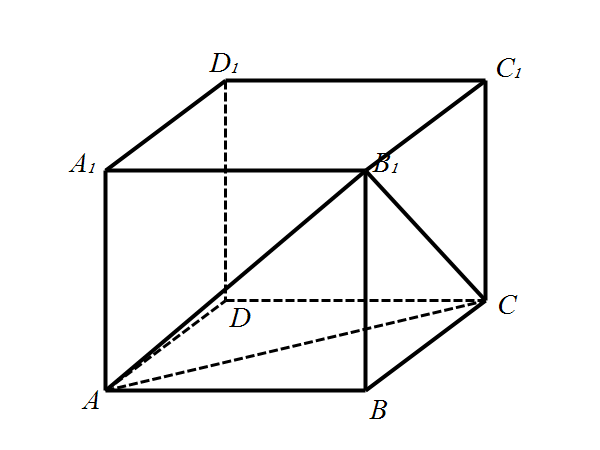

3. 在长方体 $ABCD-A_1B_1C_1D_1$ 的六个表面与六个对角面（面 $AA_1C_1C$、面 $ABC_1D_1$、面 $ADC_1B_1$、面 $BB_1D_1D$、面 $A_1BCD_1$ 及面 $A_1B_1CD$）所在的平面中，与棱 $AA_1$ 平行的平面共有（　　）
A. $2$ 个　　B. $3$ 个　　C. $4$ 个　　D. $5$ 个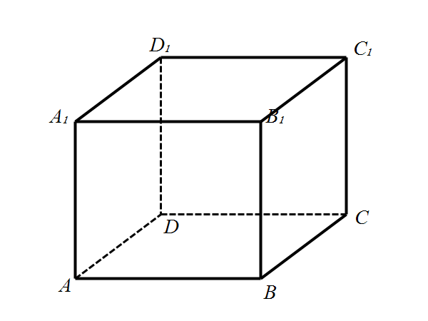

4. 在空间四边形 $ABCD$ 中，$E$、$F$ 分别为边 $AB$、$AD$ 上的点，且 $AE:EB=AF:FD=1:4$，$H$、$G$ 分别为 $BC$、$CD$ 的中点，则（　　）
A. $BD\parallel$ 平面 $EFG$，且四边形 $EFGH$ 是平行四边形  
B. $EF\parallel$ 平面 $BCD$，且四边形 $EFGH$ 是梯形  
C. $HG\parallel$ 平面 $ABD$，且四边形 $EFGH$ 是平行四边形  
D. $EH\parallel$ 平面 $ADC$，且四边形 $EFGH$ 是梯形
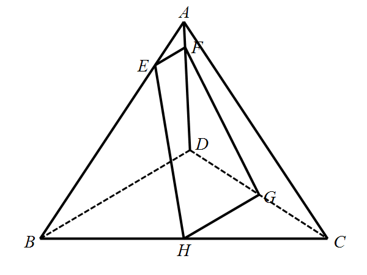

5. 如图所示，在空间四边形 $ABCD$ 中，$E$、$F$、$G$、$H$ 分别是 $AB$、$BC$、$CD$、$DA$ 上的点（不与端点重合），$EH\parallel FG$，则 $EH$ 与 $BD$ 的位置关系是（　　）
A. 平行　　B. 相交　　C. 异面　　D. 不确定
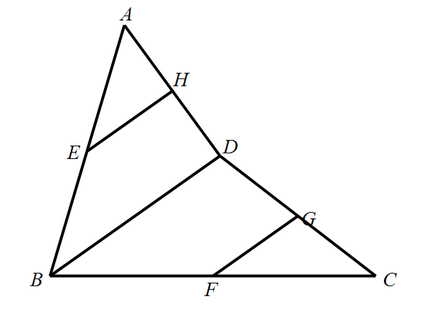

6. 如图所示，四边形 $ABCD$ 是梯形，$AB\parallel CD$，且 $AB\parallel$ 平面 $\alpha$，$AD$、$BC$ 与平面 $\alpha$ 分别交于点 $M$、$N$，且点 $M$ 是 $AD$ 的中点，$AB=4$，$CD=6$，则 $MN=$ \_\_\_\_\_\_\_\_。
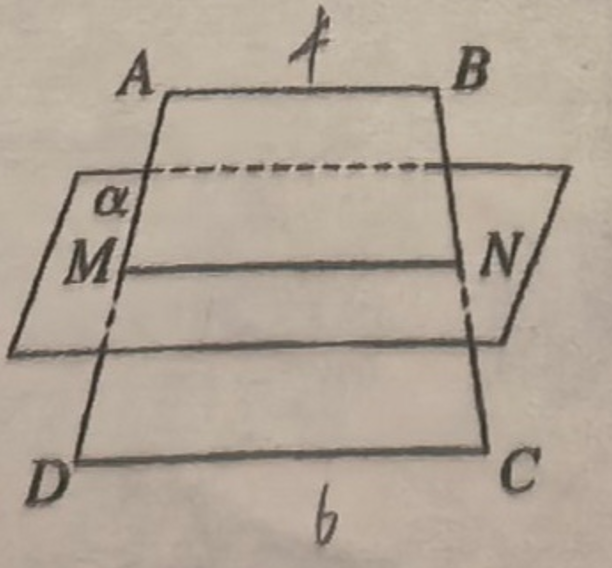

### 二、解答题

7. 如图，$\triangle ABC$ 为任意三角形，$AE\parallel CD$，且 $AE=2CD$，$F$ 为 $BE$ 中点。求证：$DF\parallel$ 平面 $ABC$。
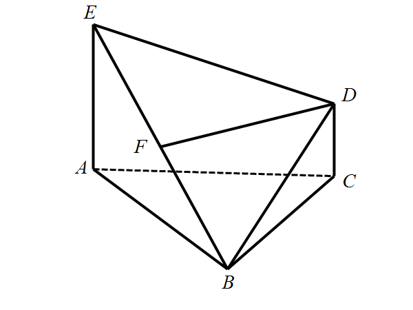

8. 如图，直线 $a\parallel$ 平面 $\alpha$，$A$ 是平面 $\alpha$ 的另一侧的点，点 $B$、$C$、$D\in a$，线段 $AB$、$AC$、$AD$ 分别交 $\alpha$ 于点 $E$、$F$、$G$，若 $BD=4$，$CF=4$，$AF=5$，求 $EG$ 的长度。
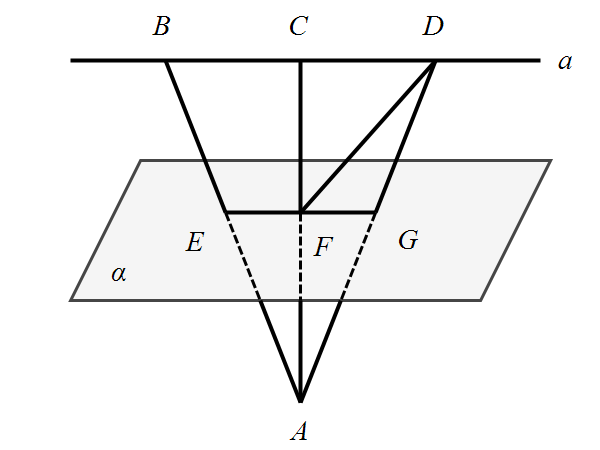

9. 如图所示，在四棱锥 $P-ABCD$ 中，底面 $ABCD$ 是平行四边形，$AC$ 与 $BD$ 交于点 $O$，$M$ 是 $PC$ 的中点，在 $DM$ 上取一点 $G$，过 $G$ 和 $AP$ 作平面交平面 $BDM$ 于 $GH$。求证：$AP\parallel GH$。
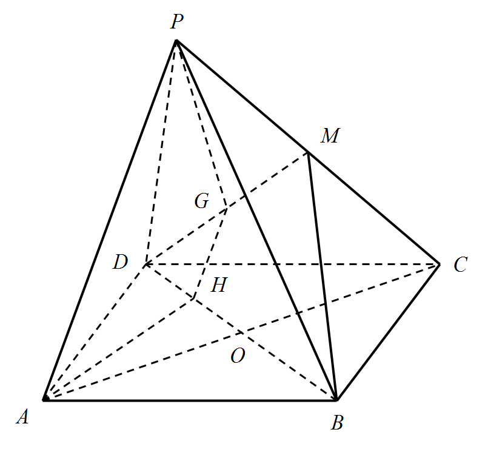

10. 如图所示，在四面体 $ABCD$ 中，用平行于棱 $AB$、$CD$ 的平面截此四面体。求证：截面 $MNPQ$ 是平行四边形。
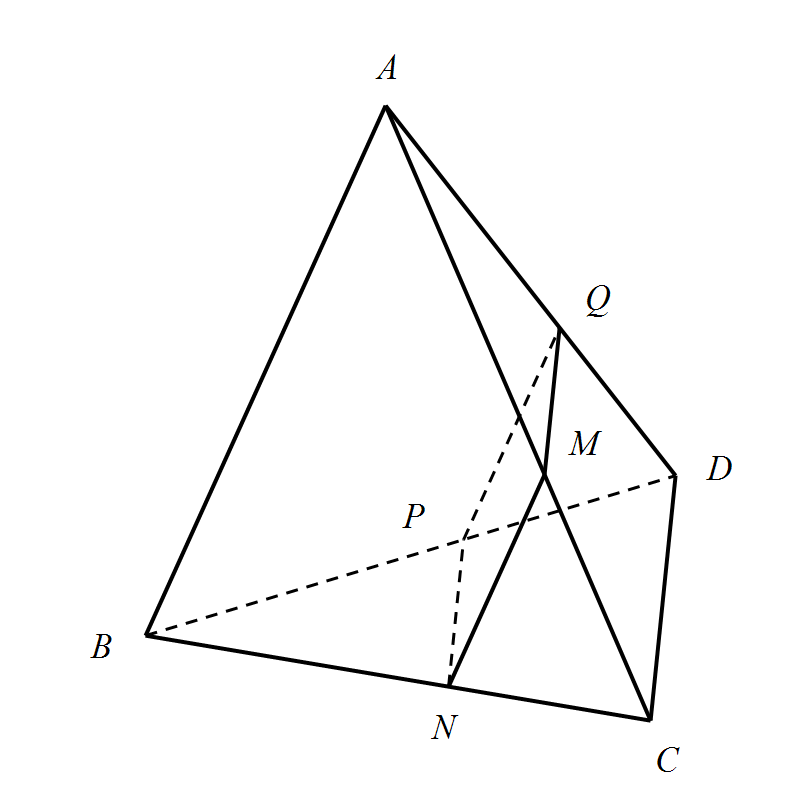

## 20260915 直线与平面垂直

### 一、选择题

1. 已知 $\triangle ABC$ 所在的平面为 $\alpha$，$l$、$m$ 是两条不同的直线，$l\perp AB$，$l\perp AC$，$m\perp BC$，$m\perp AC$，则直线 $l$、$m$ 的位置关系是（　　）
A. 相交　　                         B. 异面　　                       C. 平行　　                D. 不确定

2. 如图，平面 $\alpha\cap\beta=PQ$，$EG\perp$ 平面 $\alpha$，$FH\perp$ 平面 $\alpha$，垂足分别为 $G$、$H$。为使 $PQ\perp GH$，则需要增加一个条件是（　　）
A. $EF\perp$ 平面 $\alpha$　　          B. $EF\perp$ 平面 $\beta$                   C. $PQ\perp GE$　　            D. $PQ\perp FH$

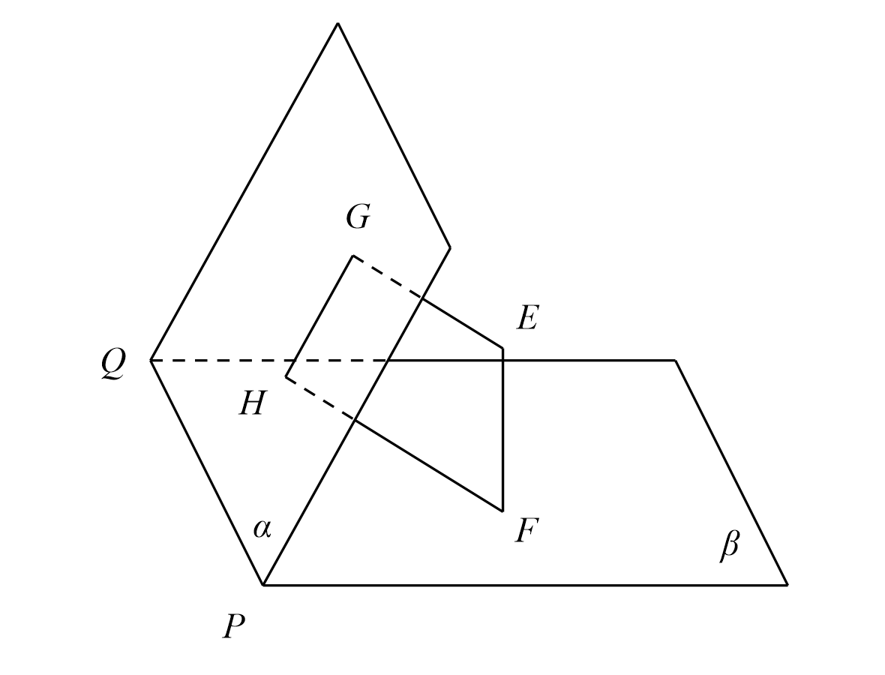

3. 如图所示的正方形 $SG_1G_2G_3$ 中，$E$、$F$ 分别是 $G_1G_2$、$G_2G_3$ 的中点，现沿 $SE$、$SF$、$EF$ 把这个正方形折成一个四面体，使 $G_1$、$G_2$、$G_3$ 重合为点 $G$，则有（　　）
A. $SG\perp$ 平面 $EFG$　　            B. $EG\perp$ 平面 $SEF$                C. $GF\perp$ 平面 $SEF$　　                     D. $SG\perp$ 平面 $SEF$

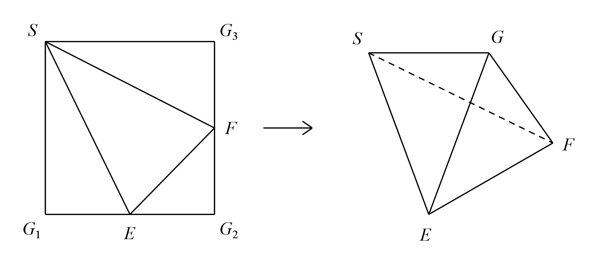

4. 如图，在三棱锥 $A-BCD$ 中，$AB\perp$ 平面 $BCD$，$DC\perp BC$，图中直角三角形的个数是（　　）
A. $2$　                            　B. $3$　　            C. $4$　　                 D. $1$

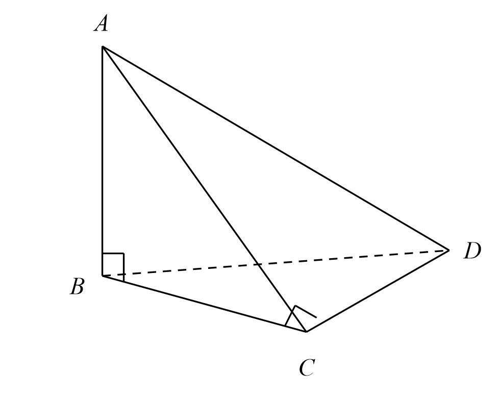

5. 如图，当 $A\in\alpha$，点 $B\in\alpha$，点 $P\notin\alpha$，$PB\perp\alpha$，$C$ 是 $\alpha$ 内异于 $A$ 和 $B$ 的动点，且 $PC\perp AC$，则动点 $C$ 在平面 $\alpha$ 内组成的图形是（　　）
A. 一条线段，但要去掉两个点                          B. 一个圆，但要去掉两个点  
C. 两条平行直线                                               D. 半圆，但要去掉两个点

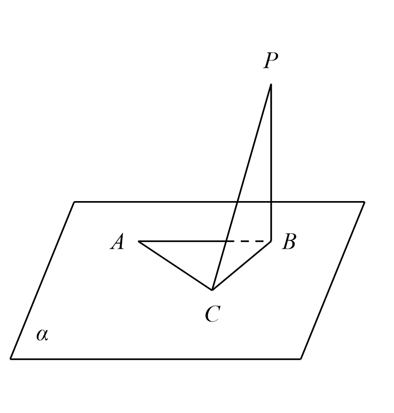

### 二、解答题

6. 已知平面 $\alpha$ 与平面 $\beta$ 相交于直线 $AB$，直线 $PC$ 垂直于平面 $\alpha$，直线 $PD$ 垂直于平面 $\beta$，其垂足分别为 $C$、$D$。求证：$AB\perp CD$。

7. 在正方体 $ABCD-A_1B_1C_1D_1$ 中，求证：$D_1B\perp$ 平面 $AB_1C$。

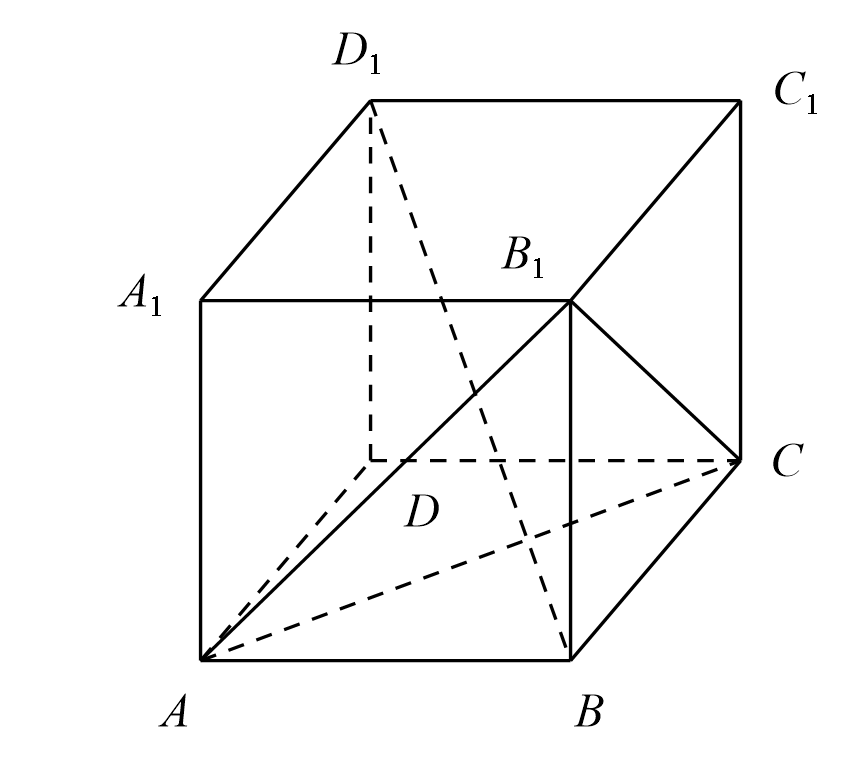

8. 如图，在棱长为 $1$ 的正方体 $ABCD-A_1B_1C_1D_1$ 中，$E$、$F$ 及 $G$ 分别为棱 $BB_1$、$DD_1$ 和 $CC_1$ 的中点。
（1）求证：$C_1F\parallel$ 平面 $DEG$；  
（2）若点 $M$ 为棱 $DC$ 的中点，求证：$D_1M\perp$ 平面 $DEG$。

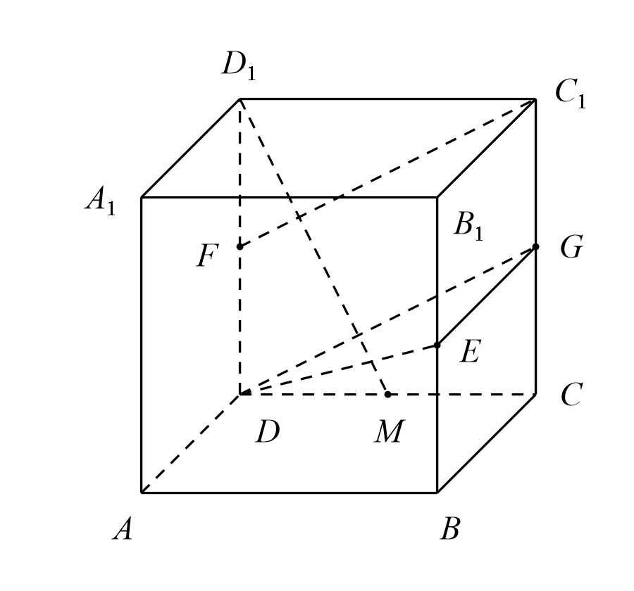

9. 已知四棱锥 $P-ABCD$ 的底面是边长为 $2$ 的菱形，且 $\angle ABC=60^\circ$，$PA=PC=2$，$PB=PD$。
（1）若 $O$ 是 $AC$ 与 $BD$ 的交点，求证：$PO\perp$ 平面 $ABCD$；  
（2）若点 $M$ 是 $PD$ 的中点，求异面直线 $AB$ 与 $CM$ 所成角的余弦值。

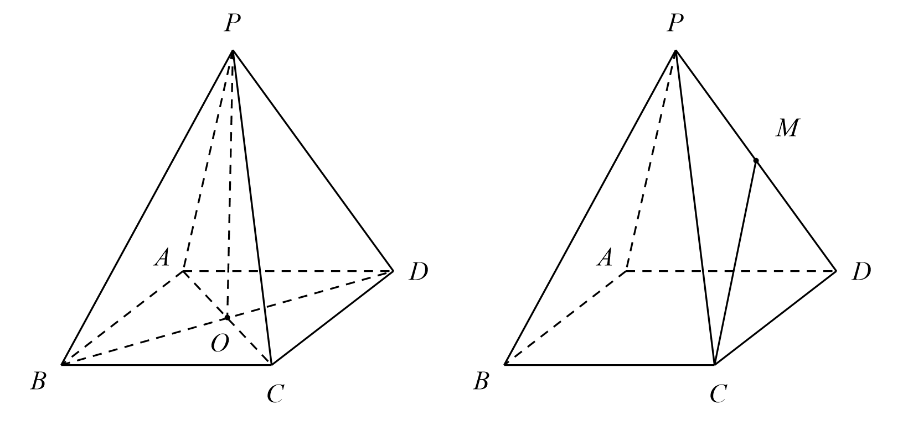

## 20260916 直线与平面所成的角

### 一、判断题

下列命题中，是真命题的在括号内填入 $\checkmark$；是假命题的在括号内填入 $\times$。
（1）一条直线在平面内的射影是一条直线。（　　）
（2）在平面内射影是直线的图形一定是直线。（　　）
（3）如果两条线段在同一平面内的射影长相等，那么这两条线段的长相等。（　　）
（4）如果两条斜线与平面所成的角相等，那么这两条斜线互相平行。（　　）

### 二、填空题（写出必要的过程）

1. 已知 $\triangle ABC$，点 $P$ 是平面 $ABC$ 外一点，点 $O$ 是点 $P$ 在平面 $ABC$ 上的射影，且点 $O$ 在 $\triangle ABC$ 内：  
（1）若点 $P$ 到 $\triangle ABC$ 的三个顶点的距离相等，则点 $O$ 一定是 $\triangle ABC$ 的\_\_\_\_\_\_\_\_心；  
（2）若点 $P$ 到 $\triangle ABC$ 的三边所在直线的距离相等，则点 $O$ 一定是 $\triangle ABC$ 的\_\_\_\_\_\_\_\_心。
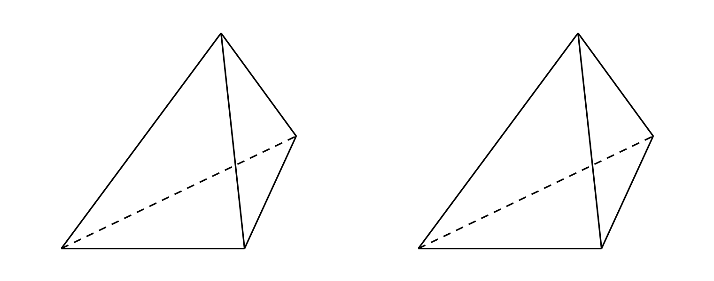

2. 已知斜线段的长度是斜线段在平面内的投影的长的两倍，则这条斜线和这个平面所成的角的大小为\_\_\_\_\_\_\_\_。

3. 过平面 $\alpha$ 外一点 $P$ 的斜线段 $PA$ 的长是过这点的垂线段 $PB$ 的长的 $\dfrac{2\sqrt{3}}{3}$ 倍（$A,B\in\alpha$），则斜线 $PA$ 与平面 $\alpha$ 所成的角的大小为\_\_\_\_\_\_\_\_。

4. 正方体 $ABCD-A_1B_1C_1D_1$ 中，则 $AD_1$ 与平面 $AA_1C_1C$ 所成角的大小为\_\_\_\_\_\_\_\_。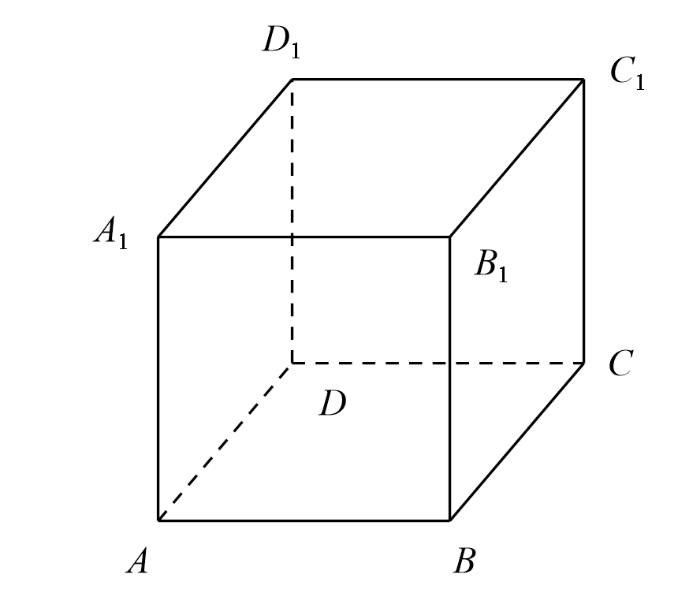

5. $PA$、$PB$ 是平面 $\alpha$ 的斜线，已知 $\angle APB=90^\circ$，$AB=10$，点 $P$ 到平面 $\alpha$ 的距离为 $3$，$PA$ 和平面 $\alpha$ 所成的角为 $30^\circ$，求 $PB$ 和平面 $\alpha$ 所成角的大小为\_\_\_\_\_\_\_\_。

### 三、解答题

6. 已知 $P$ 是等边三角形 $ABC$ 所在平面外一点，$PA=PB=PC=3$，$\triangle ABC$ 的边长为 $2$，求 $PC$ 和平面 $ABC$ 所成的角的大小。
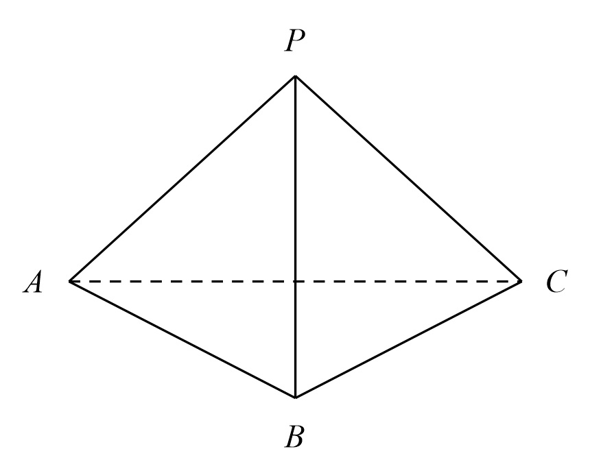

7. 如图，已知长方体 $ABCD-A_1B_1C_1D_1$ 的对角线 $A_1C$ 与侧棱 $BB_1$ 所成的角为 $45^\circ$，且 $AB=BC=1$，求 $A_1C$ 与侧面 $BB_1C_1C$ 所成角的大小。
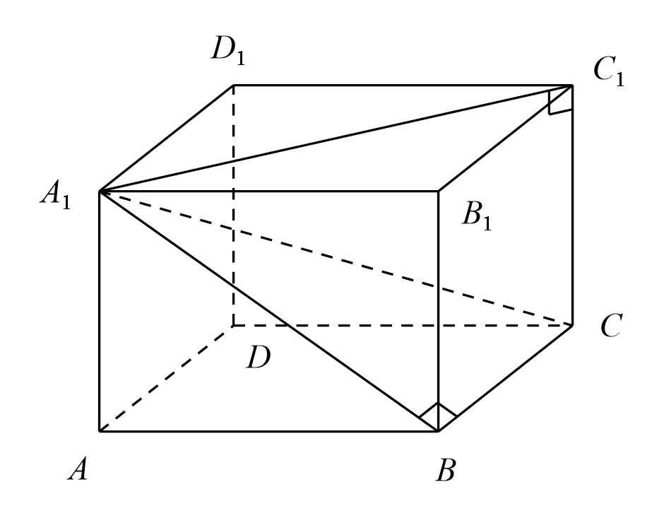

8. 直角梯形 $ABCD$ 中，$\angle DAB=\angle ADC=90^\circ$，$AB=AD=2$，$CD=4$，$PD\perp AD$，$PD\perp CD$，且 $PD=2$。  
（1）求 $PB$ 和 $ABCD$ 所成角的大小；  （2）求 $PB$ 和平面 $PAD$ 所成角的大小。
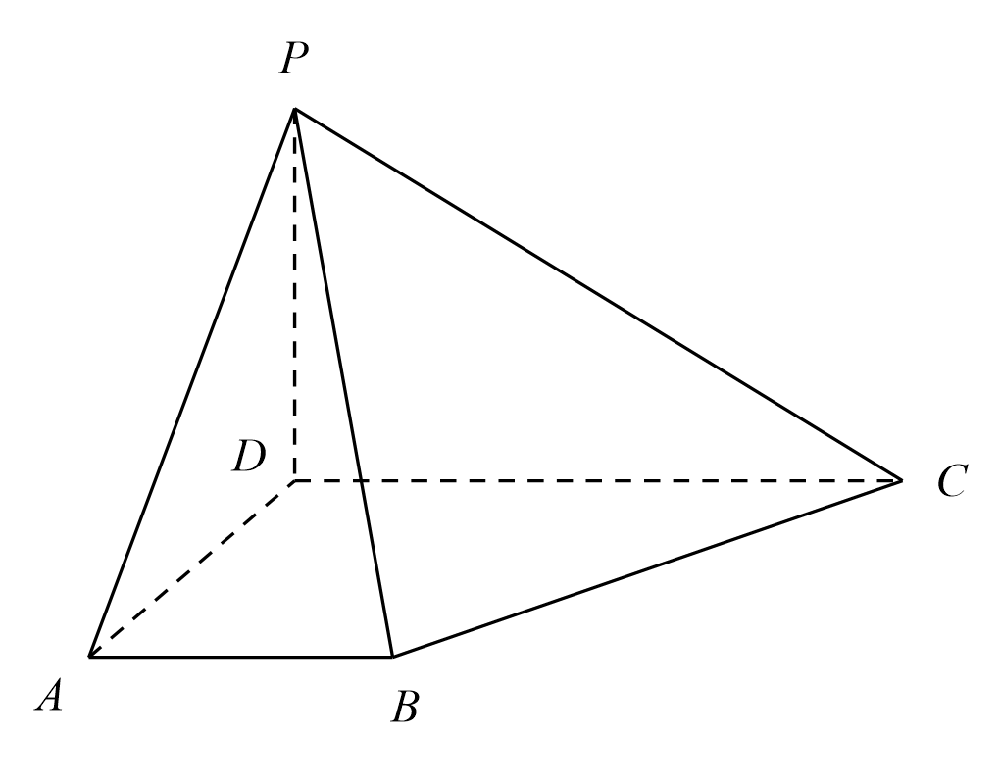

## 20260917 三垂线定理

### 一、填选题

1. 判断下列命题的真假（真命题用 $\checkmark$ 表示；假命题用 $\times$ 表示）。
① 若 $a$ 是平面 $\alpha$ 的斜线，直线 $b$ 垂直于 $a$ 在 $\alpha$ 内的射影，则 $a\perp b$。（　　）  
② 若 $a$ 是平面 $\alpha$ 的斜线，平面 $\beta$ 内的一条直线 $b$ 垂直于 $a$ 在 $\alpha$ 内的射影，则 $a\perp b$。（　　）  
③ 若 $a$ 是平面 $\alpha$ 的斜线，$b\subset\alpha$，且 $b$ 垂直于 $a$ 在另一个平面内的射影，则 $a\perp b$。（　　）  
④ 若 $a$ 是平面 $\alpha$ 的斜线，$b\subset\alpha$，且 $b$ 垂直于 $a$ 在 $\alpha$ 内的射影，则 $a\perp b$。（　　）

2. 如图，如果 $MC\perp$ 菱形 $ABCD$ 所在平面，那么 $MA$ 与 $BD$ 的位置关系是（　　）。  
A. 平行　　                  B. 垂直相交                              C. 垂直但不相交　　         D. 相交但不垂直
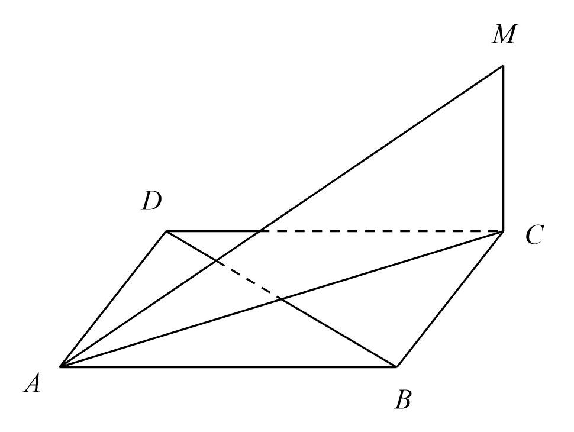

3. 下列说法正确的是（　　）。  
A. 过平面外一点作这个平面的垂直平面是唯一的  
B. 过平面的一条斜线作这个平面的垂直平面是唯一的  
C. 过直线外一点作这直线的平行平面是唯一的  
D. 过直线外一点作这直线的垂线是唯一的

4. 如果直线 $l$ 是平面 $\alpha$ 的斜线，那么平面 $\alpha$ 内（　　）。  
A. 不存在与 $l$ 平行的直线　　                          B. 不存在与 $l$ 垂直的直线  
C. 与 $l$ 垂直的直线只有一条　　                       D. 与 $l$ 平行的直线有无数条

5. 如图，$P$ 为 $\triangle ABC$ 所在平面 $\alpha$ 外一点，$PB\perp\alpha$，$PC\perp AC$，则 $\triangle ABC$ 的形状为（　　）。  
A. 锐角三角形　　                   B. 直角三角形                              C. 钝角三角形　               　D. 不确定
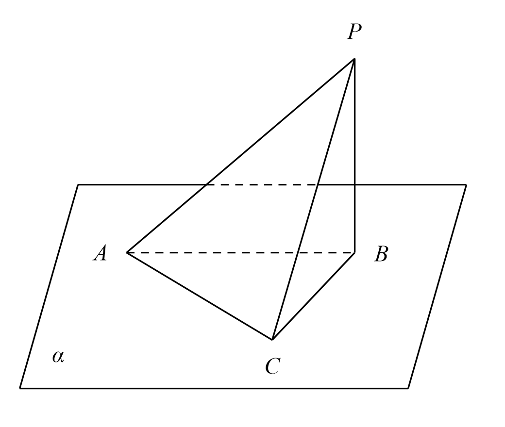

6. 已知 $PA\perp$ 矩形 $ABCD$ 所在的平面，则下列结论中不正确的是（　　）。  
A. $PB\perp BC$　　                 B. $PD\perp CD$                              C. $PD\perp BD$　　          D. $PA\perp BD$

7. 如图所示，在矩形 $ABCD$ 中，$AB=1$，$BC=a\ (a>0)$，$PA\perp$ 平面 $ABCD$，且 $PA=1$，若 $BC$ 边上存在点 $Q$，使得 $PQ\perp QD$，则 $a$ 的最小值为\_\_\_\_\_\_\_\_。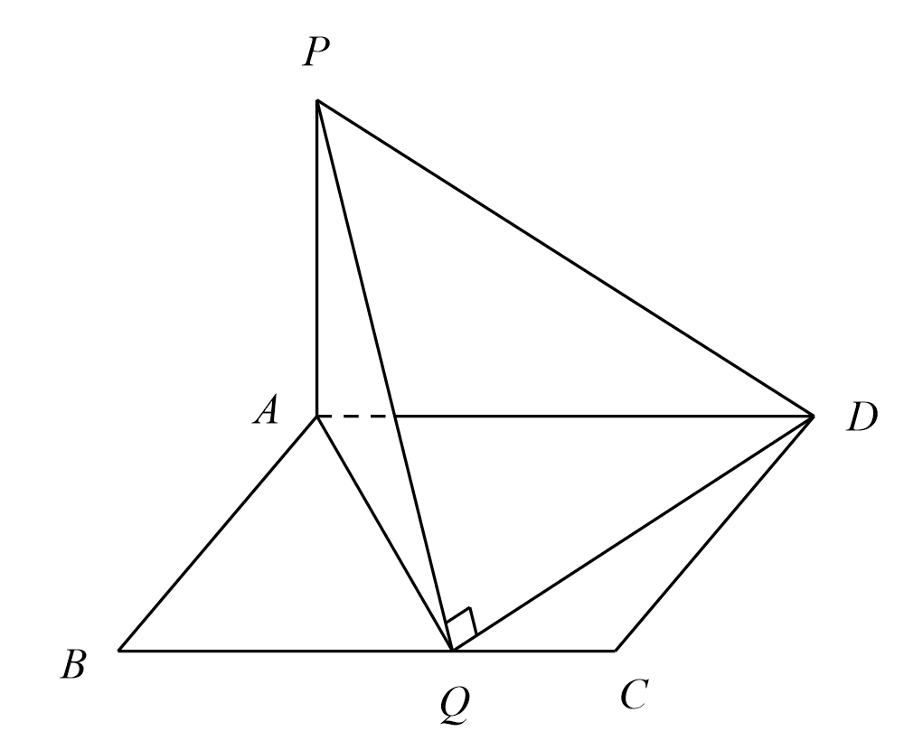

### 二、解答题

8. 设 $\triangle ABC$ 所在平面 $\alpha$ 外的一点 $P$，作 $PO\perp\alpha$，垂足为 $O$，连接 $PA$、$PB$ 及 $PC$。  
  若 $PA\perp PB$，$PB\perp PC$，$PC\perp PA$，求证：点 $O$ 是 $\triangle ABC$ 的垂心。

  

  

9. 如图，在 $\triangle ABC$ 中，$\angle ACB=90^\circ$，且 $DA$ 垂直于 $\triangle ABC$ 所在的平面 $\alpha$，$M$、$N$ 分别是边 $AC$、$DB$ 的中点。  
求证：$MN\perp AC$。
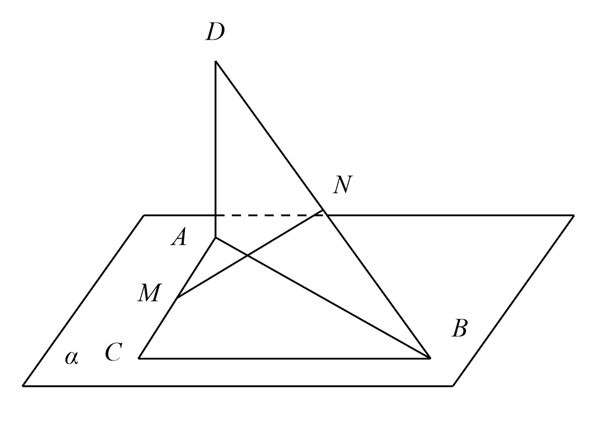

10. 从平面外一点 $D$ 向该平面引垂线段 $DA$ 及斜线段 $DB$、$DC$。已知 $DA$ 的长为 $a$，$\angle BDA=\angle CDA=60^\circ$，$\angle BDC=90^\circ$，求 $BC$ 的长。

    

    

    

11. 如图，$AB$ 为 $\odot O$ 的直径，$PA$ 垂直于 $\odot O$ 所在的平面，$M$ 为圆周上任意一点，$AN\perp PM$，$N$ 为垂足。  
（1）求证：$AN\perp$ 平面 $PBM$；  
（2）若 $AQ\perp PB$，垂足为 $Q$，求证：$NQ\perp PB$。
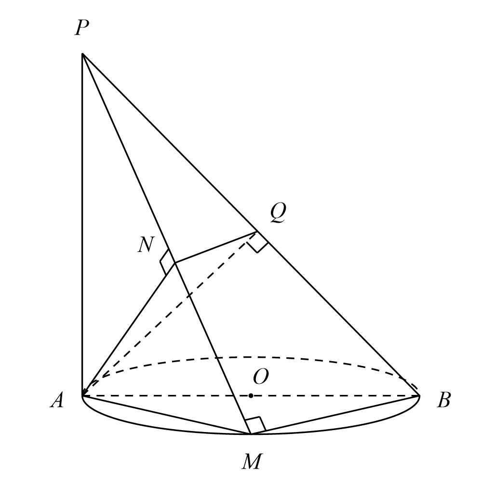