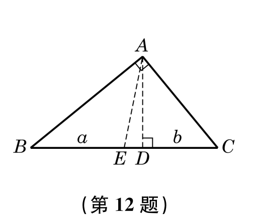
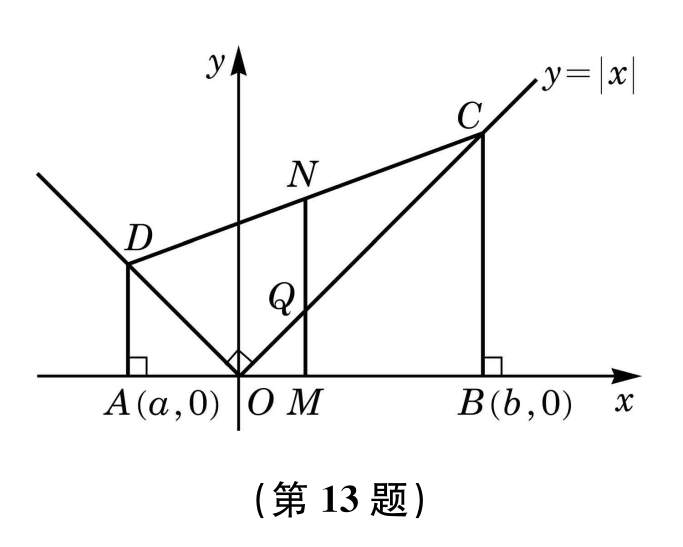

# 第二章 等式与不等式

## 2.1 等式与不等式的性质
### 练习2.1(1)- 等式的性质与方程的解集

1. 设 $a$, $b$, $c$, $d$ 是实数，判断下列命题的真假，并说明理由：  
   (1) 若 $a^2 = b^2$，则 $a = b$；  
   (2) 若 $a(c^2 + 1) = b(c^2 + 1)$，则 $a = b$；  
   (3) 若 $ab = 0$，则 $a = 0$ 或 $b = 0$；  
   (4) 若 $\frac{a}{c} = \frac{b}{d}$，且 $c + d \neq 0$，则 $\frac{a + b}{c + d} = \frac{a}{c}$。  

2. 设 $a \in \mathbb{R}$，求关于 $x$ 的方程 $ax = a^2 + x - 1$ 的解集。  

3. 设 $k \in \mathbb{R}$，求关于 $x$ 与 $y$ 的二元一次方程组  $ \begin{cases}  y = kx + 1, \\ y = 2kx + 3  \end{cases} $  的解集。  

### 练习2.1(2) - 一元二次方程的解集及根与系数的关系

1. 求一元二次方程 $ax^2 - 4x + 2 = 0 \ (a \neq 0)$ 的解集。  

2. 已知方程 $2x^2 + 4x - 3 = 0$ 的两个根为 $x_1$,  $x_2$，求下列各式的值：  
   (1) $x_1^2 x_2 + x_2^2 x_1$；  
   (2) $\frac{1}{x_1} + \frac{1}{x_2}$；  
   (3) $x_1^2 + x_2^2$；  
   (4) $x_1^3 + x_2^3$。  

### 练习2.1(3) - 不等式的性质

1. 设 $a$, $b$, $c$, $d$ 为实数，判断下列命题的真假，并说明理由：  
   (1) 如果 $a > b$，$c > d$，那么 $a + d > b + c$；  
   (2) 如果 $ab > ac$，那么 $b > c$；  
   (3) 如果 $a \geqslant  b$ 且 $a \leqslant b$，那么 $a = b$；  
   (4) 如果 $a > b$，$\frac{1}{c} > \frac{1}{d}$，那么 $\frac{a}{c} > \frac{b}{d}$；  
   (5) 如果 $\frac{b}{a} > \frac{d}{c}$，那么 $bc > ad$。  

2. 设 $ab > 0$，求证：$a > b$ 是 $\frac{1}{a} < \frac{1}{b}$ 的充要条件。  

### 练习2.1(4) - 不等式的性质

1. 设 $a$, $b$, $c$ 是实数，判断下列命题的真假，并说明理由：  
   (1) 如果 $a^2 > b^2$，那么 $a > b$；  
   (2) 如果 $ab > c$，那么 $a > \frac{c}{b}$；  
   (3) 如果 $a > b \geqslant  0$，那么 $\sqrt{a} > \sqrt{b}$。  

2. 设 $x$ 是实数，比较 $x^2 + 4$ 与 $4x$ 的值的大小。

### 习题 2.1

[这](./2.1习题.md)

## 2.2 不等式的求解

### 一元一次不等式及一元一次不等式组的求解
例1. 设 $a$  为实数，求关于 $x$  的不等式 $ax < 2$  的解集。

> [!TIP]
>
> 解 由不等式的性质，可得：  

例2. 设 $a$  为实数，解关于 $x$  的一元一次不等式组 $ \begin{cases} 2x + a > 0, \\3x - 6a < 0.\end{cases}$ 

> [!TIP]
>
> 解 根据不等式的性质，原不等式组等价于...

### 练习2.2(1) -  一元二次不等式的求解

1. 设 $a \neq 1$，解关于$x$的不等式：  $ax < a^2 + x - 1$
   
2. 填空题：  
   (1) $(x-2)(x+3) < 0$ 的解集是\_\_\_\_\_\_\_\_\_\_\_\_；  
   (2) $(2-x)(x+3) < 0$ 的解集是\_\_\_\_\_\_\_\_\_\_\_\_；  
   (3) $(x-2)(x+3) \geqslant 0$ 的解集是\_\_\_\_\_\_\_\_\_\_\_\_.

3. 求下列不等式的解集：  
   (1) $-8x \leqslant 3x^2 + 4$；  
   (2) $-x^2 < 2x - 4$.  

### 练习2.2(2) -  一元二次不等式的求解

1. 解下列不等式：  
   (1) $x + 2 > -x^2$  
   (2) $-x^2 + 3x - 4 > 0$  
   (3) $9x^2 - 6x + 1 > 0$  
   (4) $4x - x^2 > 4$  
   (5) $2x^2 + 1 \geqslant x$  
   (6) $x^2 + \frac{1}{9} \geqslant \frac{2}{3}x$  

2. 写出一个一元二次不等式，使它的解集分别为：  
   (1) $(3 - \sqrt{2}, 3 + \sqrt{2})$  
   (2) $(-\infty, 3 - \sqrt{2}] \cup [3 + \sqrt{2}, +\infty)$  
   (3) $\mathbb{R}$  
   (4) $\varnothing$.  

### 练习2.2(3) -  一元二次不等式的求解

1. 求下列不等式组的解集：  
   (1) $\left\{\begin{array}{l}x^2 - 2x - 3 > 0,\\ x - 1 > 0;\end{array}\right.$  
   (2) $\left\{\begin{array}{l}x^2 - 2x - 15 \geqslant 0,\\ x^2 - 4x - 12 < 0.\end{array}\right.$  

2. 若关于 $x$ 的不等式 $x^2 - x + m < 0$ 的解集为 $\varnothing$，求实数$m$的取值范围.  

3. 已知一元二次不等式 $x^2 - ax - b < 0$ 的解集为 $(2, 3)$，求实数 $a$, $b$ 的值及不等式 $bx^2 - ax - 1 > 0$ 的解集.  

### 练习2.2(4) - 分式不等式的求解

解下列不等式:  
(1) $\frac{3 - 2x}{x - 1} < 0$  
(2) $\frac{2x - 1}{x + 2} \leqslant 0$  
(3) $\frac{2x - 1}{x - 1} > 2$  
(4) $\frac{4 + x}{2 + x} \geqslant 2$  
(5) $\frac{x - 1}{x^2 - 4x + 5} > 1$  
(6) $\frac{4 - x}{x^2 + x + 1} \leqslant -1$  

### 练习2.2(5) - 含绝对值不等式的求解

解下列不等式:  
(1) $|x + 3| < 4$  
(2) $|1 - 2x| > 3$  
(3) $|2x - 3| < 3x - 2$  
(4) $|x + 1| + |x - 4| > 7$

### 习题 2.2

[这](./2.2习题.md)

## 2.3 基本不等式及其应用

### 练习2.3(1) - 平均值不等式及其应用
1. 设 $a$ 是正数，求证：$a + 1 \geqslant 2\sqrt{a}$.

2. 证明：若 $x < 0$，则 $x + \frac{1}{x} \leqslant -2$, 并指出等号成立的条件。

### 练习2.3(2) -平均值不等式及其应用
1. 用一根长为 $l$ 的铁丝制成一个矩形框架。当长和宽分别为多少时，该框架的面积最大？

2. 在面积为 $\pi$ 的圆中作一个内接矩形，使它的面积最大。求此矩形面积的最大值及此时矩形的各边长。

### 练习2.3(3) - 三角不等式

1. 已知 $a$,  $b \in \mathbb{R}$，求证：  $|a + b| + |a - b| \geqslant 2|b|$.
   
2. 已知实数 $a$,  $b$ 满足 $|a| < \frac{1}{2}$，$|b| < \frac{1}{2}$，证明下列各式：  
   （1）$|a + b| < 1$；  
   （2）$|a - b| < 1$。
### 习题 2.3

[这](./2.3习题.md)

## 复习题

### A组

1. 设一元二次方程 $2x^{2}-6x-3=0$ 的两个实根为 $x_{1}$, $x_{2}$，求下列各式的值：
   (1) $(x_{1}+1)(x_{2}+1)$；  
   (2) $(x_{1}^{2}-1)(x_{2}^{2}-1)$。

2. 设 $a>b>0$，比较 $\frac{b+2a}{a+2b}$ 与 $\frac{a}{b}$ 的值的大小。

3. 已知 $x>y$，求证：$x^{3}-y^{3}>x^{2} y-x y^{2}$。

4. 若关于 $x$ 的不等式 $(a+1)x-a<0$ 的解集为 $(2,+\infty)$，求实数 $a$ 的值，并求不等式 $(a-1)x+3-a>0$ 的解集。

5. 解下列一元二次不等式：
   (1) $-x^{2}+11<-2x-4$；  
   (2) $3x^{2}<13x+10$；  
   (3) $6x+2\geqslant 5x^{2}$；  
   (4) $x^{2}\leqslant 8(1-x)$；  
   (5) $-x^{2}\geqslant 9(9-2x)$；  
   (6) $3(x-3)\leqslant x^{2}$。

6. 试写出一个二次项系数为1的一元二次不等式，使它的解集分别为：
   (1) $(-\infty,\sqrt{2})\cup(\sqrt{2},+\infty)$；  
   (2) $[2-\sqrt{3}, 2+\sqrt{3}]$。

7. 求不等式 $5\leqslant x^{2}-2x+2<26$ 的所有正整数解。

8. 解下列分式不等式：
   (1) $\frac{2x+1}{x+7}>-3$；  
   (2) $\frac{3x}{x^{2}+2}\geqslant 1$。

9. 设关于$x$的不等式 $a_{1}x^{2}+b_{1}x+c_{1}>0$ 与 $a_{2}x^{2}+b_{2}x+c_{2}>0$ 的解集分别为 $A$, $B$，试用集合运算表示下列不等式组的解集：
   (1) $\left\{\begin{matrix}a_{1}x^{2}+b_{1}x+c_{1}>0,\\a_{2}x^{2}+b_{2}x+c_{2}>0;\end{matrix}\right.$ 
   (2) $\left\{\begin{matrix}a_{1}x^{2}+b_{1}x+c_{1}\leqslant 0,\\a_{2}x^{2}+b_{2}x+c_{2}>0;\end{matrix}\right.$ 
   (3) $\left\{\begin{matrix}a_{1}x^{2}+b_{1}x+c_{1}\leqslant 0,\\a_{2}x^{2}+b_{2}x+c_{2}\leqslant 0.\end{matrix}\right.$

10. 解下列含绝对值的不等式：
    (1) $|2x-1|\leqslant x$；  
    (2) $|2x+1|+|x-2|<8$。

11. 已知 $a$, $b$ 是正数，求证：$\sqrt{(1+a)(1+b)}\geqslant 1+\sqrt{ab}$。

12. 如图，在直角三角形 $ABC$ 中，$AD$ 垂直于斜边 $BC$，且垂足为 $D$。设 $BD$ 及 $CD$ 的长度分别为 $a$ 与 $b$：
    (1) 求斜边上的高 $AD$ 与中线 $AE$ 的长；  
    (2) 用不等式表示斜边上的高 $AD$ 与中线 $AE$ 长度的大小关系。
    

13. 如图，已知直角梯形 $ABCD$ 的顶点 $A(a,0)$, $B(b,0)$ 位于 $x$ 轴上，顶点 $C$, $D$ 落在函数 $y=|x|$ 的图像上，$M$, $N$ 分别为线段 $AB$, $CD$ 的中点，$O$为坐标原点，$Q$ 为线段 $OC$ 与线段 $MN$ 的交点：
    (1) 求中点 $M$ 的坐标，以及线段 $MQ$, $MN$ 的长度；  
    (2) 用不等式表示 $MQ$, $MN$ 长度的大小关系。
    

### B组

1. 已知一元二次方程 $x^{2} + px + p = 0$ 的两个实根分别为 $\alpha$, $\beta$，且 $\alpha^{2} + \beta^{2} = 3$，求实数 $p$ 的值。

2. 已知一元二次方程 $2x^{2} - 4x + m + 3 = 0$ 有两个同号实根，求实数 $m$ 的取值范围。

3. 设 $a, b \in \mathbb{R}$，已知关于 $x$ 的不等式 $(a + b)x + (b - 2a) < 0$ 的解集为 $(1, +\infty)$，求不等式 $(a - b)x + 3b - a > 0$ 的解集。

4. 解下列不等式：
   (1) $-2 < \frac{1}{2x + 1} \leqslant 3$;  
   (2) $2 < |x + 1| \leqslant 3$.

5. 已知集合 $A = \left\{ x \mid |x - a| < 2 \right\}$，$B = \left\{ x \mid \frac{2x - 1}{x + 2} < 1 \right\}$，且 $A \subseteq B$，求实数 $a$ 的取值范围。

6. 证明：若 $x > -1$，则 $x + \frac{1}{x + 1} \geqslant 1$，并指出等号成立的条件。

7. 设 $a, b$ 为正数，且 $a + b = 2$，求 $\frac{1}{a} + \frac{1}{b}$ 的最小值。

8. 已知 $a, b, c$ 都是正数，求证：$\frac{b + c}{a} + \frac{c + a}{b} + \frac{a + b}{c} \geqslant 6$.

9. 设实数 $x$, $y$ 满足 $|x + y| = 1$，求 $xy$ 的最大值。

10. 已知 $a$, $b$ 为实数，求证：$|a| + |b| \leqslant |a + b| + |a - b|$，并指出等号成立的条件。

11. 已知 $a, b$ 是实数，
    (1) 求证：$a^{2} + ab + b^{2} \geqslant 0$，并指出等号成立的条件；  
    (2) 求证：如果 $a > b$，那么 $a^{3} > b^{3}$.

### 拓展与思考  
1. 解下列不等式：  
   (1) $\dfrac{3x-11}{x^2-6x+9} \leqslant 1$；  
   (2) $|3-2x| \geqslant |x+1|$。  
2. 已知集合 $A = \{x \mid x^2 - 2x - 3 > 0\}$，$B = \{x \mid x^2 + px + q \leqslant 0\}$，若 $A \cup B = \mathbb{R}$，且 $A \cap B = [-2, -1)$，求实数 $p$ 及 $q$ 的值。  
3. 已知实数 $0 < a < b$，求证：  
   $$
   a < \dfrac{2ab}{a+b} < \sqrt{ab} < \dfrac{a+b}{2} < \dfrac{\sqrt{a^2+b^2}}{2} < b
   $$
4. 方程 $(x-1)(x-2)(x-3)=0$ 的三个根 $1$, $2$, $3$ 将数轴划分为四个区间，即 $(-\infty,1)$，$(1,2)$，$(2,3)$，$(3,+\infty)$，试在这四个区间上分别考察 $(x-1)(x-2)(x-3)$ 的符号，从而得出不等式 $(x-1)(x-2)(x-3) > 0$ 与 $(x-1)(x-2)(x-3) < 0$ 的解集。  
   一般地，对 $x_1$, $x_2$, $x_3 \in \mathbb{R}$，且 $x_1 \leqslant x_2 \leqslant x_3$，试分别求不等式  
   $$
   (x-x_1)(x-x_2)(x-x_3) > 0 \quad \text{与} \quad (x-x_1)(x-x_2)(x-x_3) < 0
   $$
   的解集（提示：$x_1$, $x_2$, $x_3$ 相互之间可能相等，需要分情况讨论）。
   
## 答案
### 2.1 等式与不等式的性质

#### 练习2.1(1) - 等式的性质与方程的解集

1. **判断命题的真假并说明理由**  
   (1) 假。反例：$a=2, b=-2$，满足 $a^2=b^2$，但 $a \neq b$。  
   (2) 真。因 $c^2+1 \geq 1 > 0$，两边同除非零数 $c^2+1$，得 $a=b$。  
   (3) 真。实数乘法性质：若 $ab=0$，则 $a=0$ 或 $b=0$。  
   (4) 真。设 $\frac{a}{c}=\frac{b}{d}=k$，则 $a=kc, b=kd$，代入得 $\frac{a+b}{c+d}=k=\frac{a}{c}$。  

2. **求方程 $ax = a^2 + x - 1$ 的解集**  
   整理得 $(a-1)x = a^2 - 1$。  
   - 当 $a \neq 1$ 时，解集为 $\{a+1\}$；  
   - 当 $a=1$ 时，解集为 $\mathbb{R}$（全体实数）。  

3. **求二元一次方程组的解集**  
   联立得 $kx + 1 = 2kx + 3$，即 $kx = -2$。  
   - 当 $k \neq 0$ 时，解集为 $\left\{ \left( -\frac{2}{k}, -1 \right) \right\}$；  
   - 当 $k=0$ 时，解集为 $\varnothing$（空集）。  

#### 练习2.1(2) - 一元二次方程的解集及根与系数的关系

1. **求一元二次方程 $ax^2 - 4x + 2 = 0 \ (a \neq 0)$ 的解集**  
   判别式 $\Delta = 16 - 8a$。  
   - 当 $a < 2$ 且 $a \neq 0$ 时，解集为 $\left\{ \frac{2 + \sqrt{4 - 2a}}{a}, \frac{2 - \sqrt{4 - 2a}}{a} \right\}$；  
   - 当 $a = 2$ 时，解集为 $\{1\}$；  
   - 当 $a > 2$ 时，解集为 $\varnothing$。  

2. **已知方程 $2x^2 + 4x - 3 = 0$ 的根为 $x_1, x_2$，求下列各式的值**  
   由韦达定理，$x_1 + x_2 = -2$，$x_1 x_2 = -\frac{3}{2}$。  
   (1) $x_1^2 x_2 + x_2^2 x_1 = x_1 x_2 (x_1 + x_2) = 3$；  
   (2) $\frac{1}{x_1} + \frac{1}{x_2} = \frac{x_1 + x_2}{x_1 x_2} = \frac{4}{3}$；  
   (3) $x_1^2 + x_2^2 = (x_1 + x_2)^2 - 2x_1 x_2 = 7$；  
   (4) $x_1^3 + x_2^3 = (x_1 + x_2)(x_1^2 - x_1 x_2 + x_2^2) = -17$。  

#### 练习2.1(3) - 不等式的性质

1. **判断命题的真假并说明理由**  
   (1) 假。反例：$a=3, b=1, c=2, d=0$，满足 $a > b, c > d$，但 $a + d = 3 \not> b + c = 3$。  
   (2) 假。反例：$a=-1, b=1, c=2$，满足 $ab > ac$，但 $b=1 \not> c=2$。  
   (3) 真。由实数的三歧性，$a \geq b$ 且 $a \leq b$ 等价于 $a = b$。  
   (4) 假。反例：$a=3, b=2, c=-3, d=-2$，满足 $a > b, \frac{1}{c} > \frac{1}{d}$，但 $\frac{a}{c} = -1 \not> \frac{b}{d} = -1$。  
   (5) 假。反例：$a=1, b=2, c=-1, d=1$，满足 $\frac{b}{a} > \frac{d}{c}$，但 $bc = -2 \not> ad = 1$。  

2. **证明 $a > b$ 是 $\frac{1}{a} < \frac{1}{b}$ 的充要条件（$ab > 0$）**  
   - **充分性**：$a > b$ 且 $ab > 0$，两边同乘 $\frac{1}{ab}$（正数），得 $\frac{1}{b} > \frac{1}{a}$，即 $\frac{1}{a} < \frac{1}{b}$。  
   - **必要性**：$\frac{1}{a} < \frac{1}{b}$ 且 $ab > 0$，两边同乘 $ab$（正数），得 $b < a$，即 $a > b$。  

#### 练习2.1(4) - 不等式的性质

1. **判断命题的真假并说明理由**  
   (1) 假。反例：$a=-3, b=2$，满足 $a^2 > b^2$，但 $a < b$。  
   (2) 假。反例：$a=1, b=-1, c=-3$，满足 $ab > c$，但 $a=1 < \frac{c}{b}=3$。  
   (3) 真。函数 $f(x) = \sqrt{x}$ 在 $[0, +\infty)$ 严格递增，故 $a > b \geq 0$ 时 $\sqrt{a} > \sqrt{b}$。  

2. **比较 $x^2 + 4$ 与 $4x$ 的大小**  
   作差得 $x^2 + 4 - 4x = (x - 2)^2 \geq 0$，故 $x^2 + 4 \geq 4x$（当且仅当 $x=2$ 时取等）。
   
### 2.2 不等式的求解
#### 练习2.2(1)  
1. 设 $ a \neq 1 $，解关于 $ x $ 的不等式：  
   $$ ax < a^2 + x - 1 $$  
   解集：  
   - 若 $ a > 1 $，则 $ x < a + 1 $；  
   - 若 $ a < 1 $，则 $ x > a + 1 $。  

2. 填空题：  
   (1) $(x-2)(x+3) < 0$ 的解集是 $\boxed{(-3, 2)}$；  
   (2) $(2-x)(x+3) < 0$ 的解集是 $\boxed{(-\infty, -3) \cup (2, +\infty)}$；  
   (3) $(x-2)(x+3) \geqslant 0$ 的解集是 $\boxed{(-\infty, -3] \cup [2, +\infty)}$。  

3. 求下列不等式的解集：  
   (1) $-8x \leqslant 3x^2 + 4$ 的解集是 $\boxed{(-\infty, -2] \cup \left[-\dfrac{2}{3}, +\infty\right)}$；  
   (2) $-x^2 < 2x - 4$ 的解集是 $\boxed{\left(-\infty, -1 - \sqrt{5}\right) \cup \left(-1 + \sqrt{5}, +\infty\right)}$。  

#### 练习2.2(2)  
1. 解下列不等式：  
   (1) $x + 2 > -x^2$ 的解集是 $\boxed{\mathbb{R}}$；  
   (2) $-x^2 + 3x - 4 > 0$ 的解集是 $\boxed{\varnothing}$；  
   (3) $9x^2 - 6x + 1 > 0$ 的解集是 $\boxed{\left(-\infty, \dfrac{1}{3}\right) \cup \left(\dfrac{1}{3}, +\infty\right)}$；  
   (4) $4x - x^2 > 4$ 的解集是 $\boxed{\varnothing}$；  
   (5) $2x^2 + 1 \geqslant x$ 的解集是 $\boxed{\mathbb{R}}$；  
   (6) $x^2 + \dfrac{1}{9} \geqslant \dfrac{2}{3}x$ 的解集是 $\boxed{\mathbb{R}}$。  

2. 写出一个一元二次不等式，使它的解集分别为：  
   (1) $(3 - \sqrt{2}, 3 + \sqrt{2})$： $\boxed{x^2 - 6x + 7 < 0}$；  
   (2) $(-\infty, 3 - \sqrt{2}] \cup [3 + \sqrt{2}, +\infty)$： $\boxed{x^2 - 6x + 7 \geqslant 0}$；  
   (3) $\mathbb{R}$： $\boxed{x^2 + 1 > 0}$；  
   (4) $\varnothing$： $\boxed{x^2 < 0}$。  

#### 练习2.2(3)  
1. 求下列不等式组的解集：  
   (1) $\left\{\begin{array}{l} x^2 - 2x - 3 > 0 \\ x - 1 > 0 \end{array}\right.$ 的解集是 $\boxed{(3, +\infty)}$；  
   (2) $\left\{\begin{array}{l} x^2 - 2x - 15 \geqslant 0 \\ x^2 - 4x - 12 < 0 \end{array}\right.$ 的解集是 $\boxed{[5, 6)}$。  

2. 若关于 $x$ 的不等式 $x^2 - x + m < 0$ 的解集为 $\varnothing$，则实数 $m$ 的取值范围是 $\boxed{m \geqslant \dfrac{1}{4}}$。  

3. 已知一元二次不等式 $x^2 - ax - b < 0$ 的解集为 $(2, 3)$，则：  
   - $a = \boxed{5}$，$b = \boxed{-6}$；  
   - 不等式 $bx^2 - ax - 1 > 0$ 的解集是 $\boxed{\left(-\dfrac{1}{2}, -\dfrac{1}{3}\right)}$。  

#### 练习2.2(4)  
解下列不等式：  
(1) $\dfrac{3 - 2x}{x - 1} < 0$ 的解集是 $\boxed{(-\infty, 1) \cup \left(\dfrac{3}{2}, +\infty\right)}$；  
(2) $\dfrac{2x - 1}{x + 2} \leqslant 0$ 的解集是 $\boxed{(-2, \frac{1}{2}]}$；  
(3) $\dfrac{2x - 1}{x - 1} > 2$ 的解集是 $\boxed{(1, +\infty)}$；  
(4) $\dfrac{4 + x}{2 + x} \geqslant 2$ 的解集是 $\boxed{(-2, 0]}$；  
(5) $\dfrac{x - 1}{x^2 - 4x + 5} > 1$ 的解集是 $\boxed{(2, 3)}$；  
(6) $\dfrac{4 - x}{x^2 + x + 1} \leqslant -1$ 的解集是 $\boxed{\varnothing}$。  

#### 练习2.2(5)  
解下列不等式：  
(1) $|x + 3| < 4$ 的解集是 $\boxed{(-7, 1)}$；  
(2) $|1 - 2x| > 3$ 的解集是 $\boxed{(-\infty, -1) \cup (2, +\infty)}$；  
(3) $|2x - 3| < 3x - 2$ 的解集是 $\boxed{(1, +\infty)}$；  
(4) $|x + 1| + |x - 4| > 7$ 的解集是 $\boxed{(-\infty, -2) \cup (5, +\infty)}$。

---

### 2.3 基本不等式及其应用

#### 练习 2.3(1)
1. **求证：$ a + 1 \geqslant 2\sqrt{a} $（$ a > 0 $)**  
   **证明**：  
   由平均值不等式（算术平均 ≥ 几何平均）：  
   $$
   \frac{a + 1}{2} \geqslant \sqrt{a \cdot 1} = \sqrt{a}
   $$
   两边乘以 2 得：  
   $$
   a + 1 \geqslant 2\sqrt{a}
   $$
   **等号成立条件**：当 $ a = 1 $ 时成立（此时几何平均等于算术平均）。

   ---

2. **求证：若 $ x < 0 $，则 $ x + \frac{1}{x} \leqslant -2 $**  
   **证明**：  
   设 $ y = -x $（则 $ y > 0 $)，原式化为：  
   $$
   x + \frac{1}{x} = -y - \frac{1}{y} = -\left( y + \frac{1}{y} \right)
   $$
   由平均值不等式（$ y > 0 $)：  
   $$
   y + \frac{1}{y} \geqslant 2 \quad \Rightarrow \quad -\left( y + \frac{1}{y} \right) \leqslant -2
   $$
   即 $ x + \frac{1}{x} \leqslant -2 $。  
   **等号成立条件**：当 $ y = 1 $ 即 $ x = -1 $ 时成立。

---

#### 练习 2.3(2)
1. **铁丝长 $ l $ 的矩形框架，求面积最大时长和宽**  
   **解**：  
   - 设长为 $ a $，宽为 $ b $，则周长约束：  
     $$
     2(a + b) = l \quad \Rightarrow \quad a + b = \frac{l}{2}
     $$
   - 面积 $ S = ab $ 的最大值由平均值不等式得：  
     $$
     \frac{a + b}{2} \geqslant \sqrt{ab} \quad \Rightarrow \quad ab \leqslant \left( \frac{a + b}{2} \right)^2 = \left( \frac{l}{4} \right)^2 = \frac{l^2}{16}
     $$
   - 等号成立条件：当 $ a = b $ 时面积最大。  
   **结论**：  
   - 当长宽相等（$ a = b = \frac{l}{4} $) 时，面积最大  
   - 最大面积为 $ \dfrac{l^2}{16} $.

   ---

2. **面积为 $ \pi $ 的圆内接矩形，求面积最大值及边长**  
   **解**：  
   - 设圆的半径为 $ r $，则：  
     $$
     \pi r^2 = \pi \quad \Rightarrow \quad r = 1 \quad \text{（直径 } d = 2)
     $$
   - 圆内接矩形的对角线等于直径（$ \sqrt{a^2 + b^2} = 2 $)，即约束：  
     $$
     a^2 + b^2 = 4
     $$
   - 面积 $ S = ab $ 的最大值由不等式得：  
     $$
     a^2 + b^2 \geqslant 2ab \quad \Rightarrow \quad 4 \geqslant 2S \quad \Rightarrow \quad S \leqslant 2
     $$
   - 等号成立条件：当 $ a = b $ 时，代入 $ a^2 + b^2 = 4 $ 得：  
     $$
     2a^2 = 4 \quad \Rightarrow \quad a = b = \sqrt{2}
     $$
     **结论**：  
   - 矩形面积最大值为 $ 2 $  
   - 此时边长均为 $ \sqrt{2} $.

---

#### 练习 2.3(3)
1. **求证：$ |a + b| + |a - b| \geqslant 2|b| $**  
   **证明**：  
   由三角不等式及其推广：  
   $$
   |a + b| + |a - b| \geqslant \left| (a + b) - (a - b) \right| = |2b| = 2|b|
   $$
   **几何解释**：  
   - 当 $ |a| \leqslant |b| $ 时取等号（例如 $ a = b = 1 $ 时 $ |1+1| + |1-1| = 2 = 2|1| $)

   ---

2. **已知 $ |a| < \frac{1}{2} $, $ |b| < \frac{1}{2} $，求证：**  
   **(1) $ |a + b| < 1 $**  
   **证明**：  
   由三角不等式：  
   $$
   |a + b| \leqslant |a| + |b| < \frac{1}{2} + \frac{1}{2} = 1
   $$
   因 $ |a| $ 和 $ |b| $ 均小于 $ \frac{1}{2} $，严格成立 $ |a + b| < 1 $。  

   **(2) $ |a - b| < 1 $**  
   **证明**：  
   同理由三角不等式：  
   $$
   |a - b| \leqslant |a| + |-b| = |a| + |b| < \frac{1}{2} + \frac{1}{2} = 1
   $$
   严格成立 $ |a - b| < 1 $.

---

#### 关键知识点总结
| 练习         | 核心知识点                     | 应用技巧                          |
|--------------|------------------------------|----------------------------------|
| 2.3(1)-1     | 平均值不等式（$ \frac{x+y}{2} \geqslant \sqrt{xy} $) | 直接构造算术平均与几何平均        |
| 2.3(1)-2     | 不等式方向与符号处理            | 代换 $ y = -x $ 化归为正数情形 |
| 2.3(2)-1     | 固定和求积最大值                | 周长约束 → 面积优化（正方形最优） |
| 2.3(2)-2     | 几何约束与代数转化              | 圆直径 = 矩形对角线 → $ a^2 + b^2 = 4 $ |
| 2.3(3)-1     | 绝对值三角不等式推广            | $ |u| + |v| \geqslant |u \pm v| $ |
| 2.3(3)-2     | 三角不等式严格放缩              | 由 $ |a|, |b| < c $ 推 $ |a \pm b| < 2c $ |

### 复习题
#### A组

##### 问题1
设一元二次方程 $2x^2 - 6x - 3 = 0$ 的两个实根为 $x_1, x_2$。  
由韦达定理，根之和 $x_1 + x_2 = -\frac{b}{a} = -\frac{-6}{2} = 3$，根之积 $x_1 x_2 = \frac{c}{a} = \frac{-3}{2} = -\frac{3}{2}$。  

**(1)** $(x_1 + 1)(x_2 + 1) = x_1 x_2 + x_1 + x_2 + 1 = -\frac{3}{2} + 3 + 1 = -\frac{3}{2} + 4 = \frac{5}{2}$。  

**(2)** $(x_1^2 - 1)(x_2^2 - 1) = x_1^2 x_2^2 - (x_1^2 + x_2^2) + 1$。  
其中 $x_1^2 + x_2^2 = (x_1 + x_2)^2 - 2x_1 x_2 = 3^2 - 2 \times (-\frac{3}{2}) = 9 + 3 = 12$，  
$x_1^2 x_2^2 = (x_1 x_2)^2 = \left(-\frac{3}{2}\right)^2 = \frac{9}{4}$。  
故 $(x_1^2 - 1)(x_2^2 - 1) = \frac{9}{4} - 12 + 1 = \frac{9}{4} - 11 = \frac{9}{4} - \frac{44}{4} = -\frac{35}{4}$。  
$$
\boxed{\begin{array}{c} \text{(1) } \dfrac{5}{2} \\ \\ \text{(2) } -\dfrac{35}{4} \end{array}}
$$

##### 问题2  
设 $a > b > 0$，比较 $\frac{b+2a}{a+2b}$ 与 $\frac{a}{b}$ 的大小。  
考虑差值：  
$$
\frac{b+2a}{a+2b} - \frac{a}{b} = \frac{(b+2a)b - a(a+2b)}{b(a+2b)} = \frac{b^2 + 2ab - a^2 - 2ab}{b(a+2b)} = \frac{b^2 - a^2}{b(a+2b)} = \frac{(b-a)(b+a)}{b(a+2b)}。
$$
由于 $a > b > 0$，有 $b - a < 0$，$a + b > 0$，分母 $b(a+2b) > 0$，故差值小于 0，即 $\frac{b+2a}{a+2b} < \frac{a}{b}$。  

$$
\boxed{\dfrac{b+2a}{a+2b} < \dfrac{a}{b}}
$$

##### 问题3  
已知 $x > y$，求证：$x^3 - y^3 > x^2 y - x y^2$。  
左边：$x^3 - y^3 = (x - y)(x^2 + xy + y^2)$，  
右边：$x^2 y - x y^2 = xy(x - y)$。  
不等式化为：  
$$
(x - y)(x^2 + xy + y^2) > xy(x - y)。
$$
由于 $x > y$，有 $x - y > 0$，可除以 $x - y$：  
$$
x^2 + xy + y^2 > xy \implies x^2 + y^2 > 0。
$$
因 $x, y$ 为实数且 $x > y$，$x^2 + y^2 > 0$ 恒成立（当且仅当 $x = y = 0$ 时取等，但 $x > y$ 不成立），故原不等式成立。  

$$
\boxed{\text{证明见上}}
$$

##### 问题4 
不等式 $(a+1)x - a < 0$ 的解集为 $(2, +\infty)$。  
化为：$(a+1)x < a$。  
解集为 $x > 2$，表明系数 $a+1 < 0$（否则解集为 $x < \text{某值}$)，且边界点为 $x = \frac{a}{a+1} = 2$。  
解方程：  
$$
\frac{a}{a+1} = 2 \implies a = 2(a+1) \implies a = 2a + 2 \implies a = -2。
$$
验证：$a + 1 = -1 < 0$，当 $x > 2$ 时不等式成立（如 $x=3$，$(-1)(3) - (-2) = -1 < 0$)，解集确为 $(2, +\infty)$。  
代入 $a = -2$ 到第二不等式：$(a-1)x + 3 - a = (-3)x + 5 > 0$，  
即 $-3x + 5 > 0 \implies 3x < 5 \implies x < \frac{5}{3}$。  
解集为 $(-\infty, \frac{5}{3})$。  

$$
\boxed{a = -2 \quad ; \quad \left( -\infty, \dfrac{5}{3} \right)}
$$

##### 问题5
解一元二次不等式：  

**(1)** $-x^2 + 11 < -2x - 4$  
移项：$-x^2 + 2x + 15 < 0$，乘 $-1$（不等号反向）：$x^2 - 2x - 15 > 0$。  
方程 $x^2 - 2x - 15 = 0$ 的根为 $x = 5, x = -3$，二次函数开口向上，故解集为 $x < -3$ 或 $x > 5$，即 $(-\infty, -3) \cup (5, +\infty)$。  

**(2)** $3x^2 < 13x + 10$  
移项：$3x^2 - 13x - 10 < 0$。  
方程 $3x^2 - 13x - 10 = 0$ 的根为 $x = 5, x = -\frac{2}{3}$，开口向上，故解集为 $-\frac{2}{3} < x < 5$。  

**(3)** $6x + 2 \geqslant 5x^2$  
移项：$-5x^2 + 6x + 2 \geqslant 0$，乘 $-1$（不等号反向）：$5x^2 - 6x - 2 \leqslant 0$。  
方程 $5x^2 - 6x - 2 = 0$ 的根为 $x = \frac{3 \pm \sqrt{19}}{5}$，开口向上，故解集为 $\frac{3 - \sqrt{19}}{5} \leqslant x \leqslant \frac{3 + \sqrt{19}}{5}$。  

**(4)** $x^2 \leqslant 8(1 - x)$  
展开：$x^2 \leqslant 8 - 8x$，移项：$x^2 + 8x - 8 \leqslant 0$。  
方程 $x^2 + 8x - 8 = 0$ 的根为 $x = -4 \pm 2\sqrt{6}$，开口向上，故解集为 $-4 - 2\sqrt{6} \leqslant x \leqslant -4 + 2\sqrt{6}$。  

**(5)** $-x^2 \geqslant 9(9 - 2x)$  
右边：$81 - 18x$，移项：$-x^2 - 81 + 18x \geqslant 0$，乘 $-1$（不等号反向）：$x^2 - 18x + 81 \leqslant 0$。  
即 $(x - 9)^2 \leqslant 0$，仅当 $x = 9$ 时取等，故解集为 $\{9\}$。  

**(6)** $3(x - 3) \leqslant x^2$  
展开：$3x - 9 \leqslant x^2$，移项：$-x^2 + 3x - 9 \leqslant 0$，乘 $-1$（不等号反向）：$x^2 - 3x + 9 \geqslant 0$。  
判别式 $9 - 36 = -27 < 0$，开口向上，故对所有实数成立，解集为 $\mathbb{R}$。  

$$
\boxed{\begin{array}{c} \text{(1) } (-\infty, -3) \cup (5, +\infty) \\ \\ \text{(2) } \left( -\dfrac{2}{3}, 5 \right) \\ \\ \text{(3) } \left[ \dfrac{3 - \sqrt{19}}{5}, \dfrac{3 + \sqrt{19}}{5} \right] \\ \\ \text{(4) } \left[ -4 - 2\sqrt{6}, -4 + 2\sqrt{6} \right] \\ \\ \text{(5) } \{9\} \\ \\ \text{(6) } \mathbb{R} \end{array}}
$$

##### 问题6
二次项系数为 1。  

**(1)** 解集为 $(-\infty, \sqrt{2}) \cup (\sqrt{2}, +\infty)$，即 $x \neq \sqrt{2}$，对应不等式 $(x - \sqrt{2})^2 > 0$。  

**(2)** 解集为 $[2 - \sqrt{3}, 2 + \sqrt{3}]$，即二次函数在根间非正，对应不等式 $x^2 - 4x + 1 \leqslant 0$（因 $(x - (2 - \sqrt{3}))(x - (2 + \sqrt{3})) = x^2 - 4x + 1$)。  

$$
\boxed{\begin{array}{c} \text{(1) } (x - \sqrt{2})^2 > 0 \\ \\ \text{(2) } x^{2} - 4x + 1 \leqslant 0 \end{array}}
$$

##### 问题7  
不等式 $5 \leqslant x^2 - 2x + 2 < 26$。  
设 $f(x) = x^2 - 2x + 2$。  
解 $f(x) \geqslant 5$：$x^2 - 2x - 3 \geqslant 0$，根 $x = -1, x = 3$，开口向上，解为 $x \leqslant -1$ 或 $x \geqslant 3$。  
解 $f(x) < 26$：$x^2 - 2x - 24 < 0$，根 $x = -4, x = 6$，开口向上，解为 $-4 < x < 6$。  
取交集：  
- $x \leqslant -1$ 与 $-4 < x < 6$ 得 $-4 < x \leqslant -1$，  
- $x \geqslant 3$ 与 $x < 6$ 得 $3 \leqslant x < 6$。  
求正整数解：$x = 3, 4, 5$（验证均满足）。  

$$
\boxed{3,\ 4,\ 5}
$$

##### 问题8
解分式不等式：  

**(1)** $\frac{2x+1}{x+7} > -3$  
移项：$\frac{2x+1}{x+7} + 3 > 0 \implies \frac{5x+22}{x+7} > 0$。  
临界点 $x = -\frac{22}{5} = -4.4, x = -7$。  
符号分析：解为 $x < -7$ 或 $x > -4.4$，即 $(-\infty, -7) \cup (-\frac{22}{5}, +\infty)$。  

**(2)** $\frac{3x}{x^2 + 2} \geqslant 1$  
移项：$\frac{3x}{x^2 + 2} - 1 \geqslant 0 \implies \frac{-x^2 + 3x - 2}{x^2 + 2} \geqslant 0$。  
分母 $x^2 + 2 > 0$ 恒正，分子 $-x^2 + 3x - 2 = -(x-1)(x-2)$，故等价于 $-(x-1)(x-2) \geqslant 0 \implies (x-1)(x-2) \leqslant 0$，解为 $1 \leqslant x \leqslant 2$。  

$$
\boxed{\begin{array}{c} \text{(1) } (-\infty, -7) \cup \left( -\dfrac{22}{5}, +\infty \right) \\ \\ \text{(2) } [1, 2] \end{array}}
$$

##### 问题9
设 $A, B$ 分别为不等式 $a_1 x^2 + b_1 x + c_1 > 0$ 和 $a_2 x^2 + b_2 x + c_2 > 0$ 的解集。  

**(1)** 两不等式同时成立：解集为 $A \cap B$。  

**(2)** $\begin{cases} a_1 x^2 + b_1 x + c_1 \leqslant 0 \\ a_2 x^2 + b_2 x + c_2 > 0 \end{cases}$：  
第一不等式解集为 $A^c$（$A$ 的补集），第二为 $B$，故解集为 $A^c \cap B$。  

**(3)** $\begin{cases} a_1 x^2 + b_1 x + c_1 \leqslant 0 \\ a_2 x^2 + b_2 x + c_2 \leqslant 0 \end{cases}$：  
第一解集为 $A^c$，第二为 $B^c$，故解集为 $A^c \cap B^c$。  

$$
\boxed{\begin{array}{c} \text{(1) } A \cap B \\ \\ \text{(2) } A^{c} \cap B \\ \\ \text{(3) } A^{c} \cap B^{c} \end{array}}
$$

##### 问题10  
解含绝对值不等式：  

**(1)** $|2x-1| \leqslant x$  
因绝对值非负，需 $x \geqslant 0$。  
化为：$-x \leqslant 2x-1 \leqslant x$。  
解 $2x-1 \leqslant x \implies x \leqslant 1$，  
解 $2x-1 \geqslant -x \implies 3x \geqslant 1 \implies x \geqslant \frac{1}{3}$。  
结合 $x \geqslant 0$，得 $\frac{1}{3} \leqslant x \leqslant 1$。  

**(2)** $|2x+1| + |x-2| < 8$  
关键点 $x = -\frac{1}{2}, x = 2$，分区间讨论：  
- $x < -\frac{1}{2}$：$|2x+1| = -2x-1, |x-2| = -x+2$，和 $-3x+1 < 8 \implies x > -\frac{7}{3}$，解为 $-\frac{7}{3} < x < -\frac{1}{2}$。  
- $-\frac{1}{2} \leqslant x < 2$：$|2x+1| = 2x+1, |x-2| = -x+2$，和 $x+3 < 8 \implies x < 5$，结合得 $-\frac{1}{2} \leqslant x < 2$。  
- $x \geqslant 2$：$|2x+1| = 2x+1, |x-2| = x-2$，和 $3x-1 < 8 \implies x < 3$，结合得 $2 \leqslant x < 3$。  
合并：$-\frac{7}{3} < x < 3$。  

$$
\boxed{\begin{array}{c} \text{(1) } \left[ \dfrac{1}{3}, 1 \right] \\ \\ \text{(2) } \left( -\dfrac{7}{3}, 3 \right) \end{array}}
$$

##### 问题11
已知 $a, b > 0$，求证 $\sqrt{(1+a)(1+b)} \geqslant 1 + \sqrt{ab}$。  
两边平方（均正）：  
左边：$(1+a)(1+b) = 1 + a + b + ab$，  
右边：$(1 + \sqrt{ab})^2 = 1 + 2\sqrt{ab} + ab$。  
需证 $1 + a + b + ab \geqslant 1 + 2\sqrt{ab} + ab \implies a + b \geqslant 2\sqrt{ab}$。  
由 AM-GM 不等式，$\frac{a+b}{2} \geqslant \sqrt{ab}$，即 $a + b \geqslant 2\sqrt{ab}$，当且仅当 $a = b$ 时取等。  

$$
\boxed{\text{证明见上}}
$$

##### 问题12
> [!NOTE]
>
> 如图，在直角三角形 $ABC$ 中，$AD$ 垂直于斜边 $BC$，且垂足为 $D$。设 $BD$ 及 $CD$ 的长度分别为 $a$ 与 $b$：
>     (1) 求斜边上的高 $AD$ 与中线 $AE$ 的长；  
>     (2) 用不等式表示斜边上的高 $AD$ 与中线 $AE$ 长度的大小关系。
>     

###### ✅ 第一步：理解图形
在直角三角形 $ \triangle ABC $ 中，直角位于顶点 $ A $。斜边 $ BC $ 被点 $ D $ 分为两段：

- $ BD = a $
- $ DC = b $

因此，斜边总长为：

$$
BC = a + b
$$

###### ✅ 第二步：求高 $ AD $ 的长度

从直角顶点 $ A $ 向斜边 $ BC $ 作垂线 $ AD $，根据几何性质有：

$$
AD^2 = BD \cdot DC = a \cdot b
$$

所以：

$$
AD = \sqrt{ab}
$$

###### ✅ 第三步：求中线 $ AE $ 的长度

点 $ E $ 是斜边 $ BC $ 的中点，因此：

$$
AE = \frac{1}{2} BC = \frac{a + b}{2}
$$

###### ✅ 第四步：比较 $ AD $ 与 $ AE $

由算术-几何平均不等式（AM–GM）得：

$$
\frac{a + b}{2} \geq \sqrt{ab}
$$

即：

$$
AE \geq AD
$$

###### 📌 最终答案：
- (1) $ AD = \boxed{\sqrt{ab}} $， $ AE = \boxed{\frac{a+b}{2}} $
- (2) $ \boxed{AD \leqslant AE} $

##### 问题13
> [!NOTE]
> 13. 如图，已知直角梯形 $ABCD$ 的顶点 $A(a,0)$, $B(b,0)$ 位于 $x$ 轴上，顶点 $C$, $D$ 落在函数 $y=|x|$ 的图像上，$M$, $N$ 分别为线段 $AB$, $CD$ 的中点，$O$为坐标原点，$Q$ 为线段 $OC$ 与线段 $MN$ 的交点：
>     (1) 求中点 $M$ 的坐标，以及线段 $MQ$, $MN$ 的长度；  
>     (2) 用不等式表示 $MQ$, $MN$ 长度的大小关系。
>     

###### ✅ 第一步：理解图形

在直角梯形 $ABCD$ 中：

- 顶点 $A(a,0)$、$B(b,0)$ 位于 $x$ 轴上，且 $a < 0 < b$；
- 顶点 $D$ 在 $y = |x|$ 的左支上，故 $D = (a, -a)$；
- 顶点 $C$ 在 $y = |x|$ 的右支上，故 $C = (b, b)$；
- $M$ 是 $AB$ 的中点，$N$ 是 $CD$ 的中点；
- $O$ 为坐标原点；
- $Q$ 是线段 $OC$ 与 $MN$ 的交点。

###### ✅ 第二步：求中点 $M$ 的坐标

$$
M = \left( \frac{a + b}{2},\ 0 \right)
$$

###### ✅ 第三步：求线段 $MN$ 的长度

$$
N = \left( \frac{a + b}{2},\ \frac{b - a}{2} \right)
$$

$$
MN = \left| \frac{b - a}{2} - 0 \right| = \frac{b - a}{2}
$$

###### ✅ 第四步：求线段 $MQ$ 的长度

- 直线 $OC$ 过原点 $O(0,0)$ 和点 $C(b,b)$，方程为 $y = x$；
- 直线 $MN$ 过点 $M$ 和 $N$，由于两者横坐标相同，故为垂直线 $x = \frac{a + b}{2}$；
- 联立得交点 $Q = \left( \frac{a + b}{2},\ \frac{a + b}{2} \right)$；

$$
MQ = \left| \frac{a + b}{2} - 0 \right| = \frac{|a + b|}{2}
$$

###### ✅ 第五步：比较 $MQ$ 与 $MN$

$$
MQ = \frac{|a + b|}{2}, \quad MN = \frac{b - a}{2}
$$

由绝对值不等式：

$$
|a + b| \leq |a| + |b| = -a + b = b - a
$$

由于 $a < 0 < b$，等号不成立，故：

$$
|a + b| < b - a \quad \Rightarrow \quad MQ < MN
$$

##### 📌 最终答案：

- (1) $ M = \boxed{\left( \dfrac{a+b}{2},\ 0 \right)} $， $ MQ = \boxed{\dfrac{|a+b|}{2}} $， $ MN = \boxed{\dfrac{b-a}{2}} $
- (2) $ \boxed{MQ < MN} $

#### B组

##### 1. 求实数 $p$ 的值
已知一元二次方程 $x^2 + px + p = 0$ 的两个实根为 $\alpha, \beta$，且 $\alpha^2 + \beta^2 = 3$。  
由韦达定理：  
$$
\alpha + \beta = -p, \quad \alpha\beta = p
$$
又  
$$
\alpha^2 + \beta^2 = (\alpha + \beta)^2 - 2\alpha\beta = p^2 - 2p = 3
$$
解方程：  
$$
p^2 - 2p - 3 = 0 \implies (p - 3)(p + 1) = 0 \implies p = 3 \text{ 或 } p = -1
$$
检验判别式：  
$$
\Delta = p^2 - 4p
$$
- 当 $p = 3$ 时，$\Delta = 9 - 12 = -3 < 0$，无实根，舍去。  
- 当 $p = -1$ 时，$\Delta = 1 + 4 = 5 > 0$，有实根。  
故 $p = -1$。  

$$
\boxed{p=-1}
$$

##### 2. 求实数 $m$ 的取值范围
方程 $2x^2 - 4x + m + 3 = 0$ 有两个同号实根。  
判别式：  
$$
\Delta = (-4)^2 - 4 \cdot 2 \cdot (m+3) = 16 - 8(m+3) = -8m - 8 \geq 0 \implies m \leq -1
$$
两根同号，乘积大于 0：  
$$
\alpha\beta = \frac{m+3}{2} > 0 \implies m > -3
$$
综上：  
$$
-3 < m \leq -1
$$
当 $m = -1$ 时，$\Delta = 0$，有相等实根，且乘积为 $1 > 0$，符合。  
故 $m \in (-3, -1]$。  
$$
\boxed{(-3,-1]}
$$

##### 3. 求不等式 $(a - b)x + 3b - a > 0$ 的解集
已知不等式 $(a + b)x + (b - 2a) < 0$ 的解集为 $(1, +\infty)$。  
令 $f(x) = (a+b)x + (b-2a)$，则 $f(1) = 0$：  
$$
(a+b)(1) + (b-2a) = -a + 2b = 0 \implies a = 2b
$$
解集为 $x > 1$，说明系数 $a+b < 0$：  
$$
a + b = 2b + b = 3b < 0 \implies b < 0
$$
现在解不等式 $(a - b)x + 3b - a > 0$：  
代入 $a = 2b$：  
$$
a - b = b, \quad 3b - a = b
$$
不等式变为：  
$$
b x + b > 0
$$
由于 $b < 0$，除以 $b$（不等号反向）：  
$$
x + 1 < 0 \implies x < -1
$$
故解集为 $(-\infty, -1)$。  

$$
\boxed{(-\infty,-1)}
$$

##### 4. 解不等式
###### (1) $-2 < \frac{1}{2x + 1} \leqslant 3$
首先，分母 $2x + 1 \neq 0 \implies x \neq -\frac{1}{2}$。  
分解为两个不等式：  
- $\frac{1}{2x+1} > -2$  
- $\frac{1}{2x+1} \leqslant 3$  

解 $\frac{1}{2x+1} \leqslant 3$：  
$$
\frac{1}{2x+1} - 3 \leqslant 0 \implies \frac{1 - 3(2x+1)}{2x+1} \leqslant 0 \implies \frac{-6x -2}{2x+1} \leqslant 0 \implies \frac{3x+1}{2x+1} \geqslant 0
$$
临界点：$x = -\frac{1}{3}, -\frac{1}{2}$。  
符号分析：解为 $x < -\frac{1}{2}$ 或 $x \geq -\frac{1}{3}$。  

解 $\frac{1}{2x+1} > -2$：  
$$
\frac{1}{2x+1} + 2 > 0 \implies \frac{1 + 2(2x+1)}{2x+1} > 0 \implies \frac{4x+3}{2x+1} > 0
$$
临界点：$x = -\frac{3}{4}, -\frac{1}{2}$。  
符号分析：解为 $x < -\frac{3}{4}$ 或 $x > -\frac{1}{2}$。  

取交集：  
$$
x < -\frac{3}{4} \quad \text{或} \quad x > -\frac{1}{2}
$$
故解集为 $(-\infty, -\frac{3}{4}) \cup (-\frac{1}{2}, +\infty)$。  

###### (2) $2 < |x + 1| \leqslant 3$
分解为：  
- $|x+1| > 2$  
- $|x+1| \leqslant 3$  

解 $|x+1| \leqslant 3$：  
$$
-3 \leqslant x+1 \leqslant 3 \implies -4 \leqslant x \leqslant 2
$$
解 $|x+1| > 2$：  
$$
x+1 < -2 \quad \text{或} \quad x+1 > 2 \implies x < -3 \quad \text{或} \quad x > 1
$$
取交集：  
$$
-4 \leqslant x < -3 \quad \text{或} \quad 1 < x \leqslant 2
$$
故解集为 $[-4, -3) \cup (1, 2]$。  

$$
\boxed{(-\infty,-\frac{3}{4}) \cup (-\frac{1}{2},+\infty)} \quad \text{和} \quad \boxed{[-4,-3) \cup (1,2]}
$$

##### 5. 求实数 $a$ 的取值范围
集合 $A = \{x \mid |x - a| < 2\} = (a-2, a+2)$。  
集合 $B = \{x \mid \frac{2x-1}{x+2} < 1\}$。  
解 $\frac{2x-1}{x+2} < 1$：  
$$
\frac{2x-1}{x+2} - 1 < 0 \implies \frac{x-3}{x+2} < 0
$$
临界点：$x = 3, -2$。  
符号分析：解为 $-2 < x < 3$，即 $B = (-2, 3)$。  
由 $A \subseteq B$，需：  
$$
a-2 \geq -2 \quad \text{和} \quad a+2 \leq 3
$$
解得：  
$$
a \geq 0 \quad \text{和} \quad a \leq 1
$$
故 $a \in [0, 1]$。  

$$
\boxed{[0,1]}
$$

##### 6. 证明不等式并指出等号成立条件
要证：若 $x > -1$，则 $x + \frac{1}{x+1} \geq 1$。  
考虑：  
$$
x + \frac{1}{x+1} - 1 = \frac{x^2}{x+1}
$$
由于 $x > -1$，有 $x+1 > 0$，故 $\frac{x^2}{x+1} \geq 0$，等号当且仅当 $x = 0$。  
所以不等式成立，等号成立当 $x = 0$。  

$$
\boxed{x=0}
$$

##### 7. 求 $\frac{1}{a} + \frac{1}{b}$ 的最小值
已知 $a > 0, b > 0, a + b = 2$。  
$$
\frac{1}{a} + \frac{1}{b} = \frac{a+b}{ab} = \frac{2}{ab}
$$
由 AM-GM 不等式：  
$$
ab \leq \left(\frac{a+b}{2}\right)^2 = 1
$$
所以  
$$
\frac{2}{ab} \geq 2
$$
当 $a = b = 1$ 时取等。  
故最小值为 2。  

$$
\boxed{2}
$$

##### 8. 证明不等式
要证：$\frac{b+c}{a} + \frac{c+a}{b} + \frac{a+b}{c} \geq 6$。  
 重写为:  
$$
\frac{b+c}{a} + \frac{c+a}{b} + \frac{a+b}{c} = \left(\frac{b}{a} + \frac{a}{b}\right) + \left(\frac{c}{a} + \frac{a}{c}\right) + \left(\frac{c}{b} + \frac{b}{c}\right)
$$
由 AM-GM，每项 $\geq 2$，故总和 $\geq 6$，等号当 $a = b = c$。  

##### 9. 求 $xy$ 的最大值
已知 $|x+y| = 1$。  
由不等式 $xy \leqslant \left(\frac{x+y}{2}\right)^2$：  
若 $x+y = 1$，则 $xy \leq \frac{1}{4}$，当 $x = y = \frac{1}{2}$ 时取等。  
若 $x+y = -1$，则 $xy \leq \left(\frac{-1}{2}\right)^2 = \frac{1}{4}$，当 $x = y = -\frac{1}{2}$ 时取等。  
故最大值为 $\frac{1}{4}$。  

$$
\boxed{\dfrac{1}{4}}
$$

##### 10. 证明不等式并指出等号成立条件
要证：$|a| + |b| \leq |a+b| + |a-b|$。  
考虑右边：  
$$
|a+b| + |a-b| = 2 \max(|a|, |b|)
$$
左边：$|a| + |b|$。  
显然 $|a| + |b| \leq 2 \max(|a|, |b|)$，等号当 $|a| = |b|$。  
故不等式成立，等号当 $|a| = |b|$。  

##### 11. 证明
###### (1) 证 $a^2 + ab + b^2 \geq 0$，等号成立条件
$$
a^2 + ab + b^2 = \left(a + \frac{b}{2}\right)^2 + \frac{3}{4}b^2 \geq 0
$$
等号当且仅当 $a = 0$ 且 $b = 0$。  

###### (2) 证若 $a > b$，则 $a^3 > b^3$
$$
a^3 - b^3 = (a-b)(a^2 + ab + b^2)
$$
由 $a > b$，有 $a-b > 0$。  
由 (1)，$a^2 + ab + b^2 > 0$（因为若等于 0，则 $a = b = 0$，矛盾）。  
故 $a^3 - b^3 > 0$，即 $a^3 > b^3$。  

#### 拓展与思考

##### 1. 解不等式
###### (1) $\frac{3x-11}{x^2-6x+9} \leqslant 1$
分母 $x^2-6x+9 = (x-3)^2$，$x \neq 3$。  
 rewrite:  
$$
\frac{3x-11}{(x-3)^2} - 1 \leqslant 0 \implies \frac{-x^2+9x-20}{(x-3)^2} \leqslant 0 \implies \frac{x^2-9x+20}{(x-3)^2} \geqslant 0
$$
分子：$x^2-9x+20 = (x-4)(x-5)$。  
所以  
$$
\frac{(x-4)(x-5)}{(x-3)^2} \geqslant 0
$$
分母总是正（除 $x=3$），故等价于 $(x-4)(x-5) \geq 0$ 且 $x \neq 3$。  
解为 $x \leq 4$ 或 $x \geq 5$，且 $x \neq 3$。  
故解集为 $(-\infty, 3) \cup (3, 4] \cup [5, +\infty)$。  

###### (2) $|3-2x| \geq |x+1|$
平方两边：  
$$
(3-2x)^2 \geq (x+1)^2 \implies 9 - 12x + 4x^2 \geq x^2 + 2x + 1 \implies 3x^2 - 14x + 8 \geq 0
$$
解方程 $3x^2 - 14x + 8 = 0$：  
$$
x = \frac{14 \pm \sqrt{196 - 96}}{6} = \frac{14 \pm 10}{6} = \frac{4}{6} = \frac{2}{3} \text{ 或 } 4
$$
所以解为 $x \leq \frac{2}{3}$ 或 $x \geq 4$。  

$$
\boxed{(-\infty,3) \cup (3,4] \cup [5,+\infty)} \quad \text{和} \quad \boxed{(-\infty,\frac{2}{3}] \cup [4,+\infty)}
$$

##### 2. 求 $p$ 和 $q$ 的值
集合 $A = \{x \mid x^2 - 2x - 3 > 0\} = (-\infty, -1) \cup (3, +\infty)$。  
集合 $B = \{x \mid x^2 + px + q \leqslant 0\}$。  
已知 $A \cup B = \mathbb{R}$ 且 $A \cap B = [-2, -1)$。  
由 $A \cup B = \mathbb{R}$，需 $B$ 覆盖 $[-1, 3]$。  
由 $A \cap B = [-2, -1)$，需 $B = [-2, 3]$。  
所以二次方程 $x^2 + px + q = 0$ 的根为 $-2$ 和 $3$。  
由 Vieta：  
$$
p = -(-2 + 3) = -1, \quad q = (-2)(3) = -6
$$
故 $p = -1, q = -6$。  

$$
\boxed{p=-1,\ q=-6}
$$

##### 3. 证明不等式链
已知 $0 < a < b$，要证：  
$$
a < \frac{2ab}{a+b} < \sqrt{ab} < \frac{a+b}{2} < \sqrt{\frac{a^2+b^2}{2}} < b
$$
证明：  
- $a < \frac{2ab}{a+b}$:  
  $a(a+b) < 2ab \implies a^2 < ab$，成立。  
- $\frac{2ab}{a+b} < \sqrt{ab}$:  
  平方：$\frac{4a^2b^2}{(a+b)^2} < ab \implies 4ab < (a+b)^2 \implies 0 < (a-b)^2$，成立。  
- $\sqrt{ab} < \frac{a+b}{2}$:  
  平方：$4ab < (a+b)^2 \implies 0 < (a-b)^2$，成立。  
- $\frac{a+b}{2} < \sqrt{\frac{a^2+b^2}{2}}$:  
  平方：$\frac{(a+b)^2}{4} < \frac{a^2+b^2}{2} \implies (a+b)^2 < 2(a^2+b^2) \implies 0 < (a-b)^2$，成立。  
- $\sqrt{\frac{a^2+b^2}{2}} < b$:  
  平方：$\frac{a^2+b^2}{2} < b^2 \implies a^2 < b^2$，成立。  
  故不等式链成立。  

##### 4. 求不等式的解集
对于 $(x-1)(x-2)(x-3)$：  
- 符号：  
  - $(-\infty, 1)$: negative  
  - $(1, 2)$: positive  
  - $(2, 3)$: negative  
  - $(3, +\infty)$: positive  
  所以  
- $(x-1)(x-2)(x-3) > 0$ 的解集为 $(1, 2) \cup (3, +\infty)$  
- $(x-1)(x-2)(x-3) < 0$ 的解集为 $(-\infty, 1) \cup (2, 3)$  

一般地，对于 $x_1 \leqslant x_2 \leqslant x_3$：  
- 如果 $x_1, x_2, x_3$ 互不相等，则：  
  - $(x-x_1)(x-x_2)(x-x_3) > 0$ 的解集为 $(x_1, x_2) \cup (x_3, +\infty)$  
  - $(x-x_1)(x-x_2)(x-x_3) < 0$ 的解集为 $(-\infty, x_1) \cup (x_2, x_3)$  
- 如果 $x_1 = x_2 < x_3$，则：  
  - $>0$ 的解集为 $(x_3, +\infty)$  
  - $<0$ 的解集为 $(-\infty, x_1) \cup (x_1, x_3)$  
- 如果 $x_1 < x_2 = x_3$，则：  
  - $>0$ 的解集为 $(x_1, x_2) \cup (x_2, +\infty)$  
  - $<0$ 的解集为 $(-\infty, x_1)$  
- 如果 $x_1 = x_2 = x_3$，则：  
  - $>0$ 的解集为 $(x_1, +\infty)$  
  - $<0$ 的解集为 $(-\infty, x_1)$