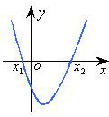
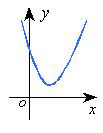

# 一元二次不等式和一元二次方程的关系

## 知识点 

### （1）一元二次不等式  
只含有一个未知数，并且未知数的最高次数是二次，这样的不等式叫做**一元二次不等式**，它的一般形式为 $ax^2 + bx + c > 0$ 或 $ax^2 + bx + c < 0$（$a \neq 0$）。  

### （2）一元二次不等式的解法  
**法1**：把 $ax^2 + bx + c > 0$ 或 $ax^2 + bx + c < 0$（$a \neq 0$）先分解因式，借用初中学过的积的符号法则将其实现等价转化为一次不等式组，进而求出其解集的并集。  
**法2**：利用一元二次不等式与二次函数、一元二次方程的内在关系，结合二次函数的图像，研究不等式在 $\Delta > 0$、$\Delta = 0$ 和 $\Delta < 0$时各种解集的情况。  

| $a > 0$       | $\Delta > 0$                | $\Delta = 0$                | $\Delta < 0$                |
|------------------|------------------------------|------------------------------|------------------------------|
| **二次函数**  $y = ax^2 + bx + c$  的图象 |  |  |  |
| **一元二次方程** $ax^2 + bx + c = 0$  的根 | 有两实根 $x = x_1 \text{ 或 } x = x_2$ | 有两相等的实根 $x = x_1 = x_2$ | 无实根 |
| **不等式** $ax^2 + bx + c > 0$ 的解集 | $(−\infty,x1)\cup(x2,+\infty)$ | $(−\infty,x_1)\cup(x_1,+\infty)$ | $R$ |
| **不等式** $ax^2 + bx + c < 0$ 的解集 | $(x1,x2)$ | $\varnothing$ | $\varnothing$ |
| **不等式** $ax^2 + bx + c \geqslant 0$ 的解集 |  |  |  |
| **不等式** $ax^2 + bx + c \leqslant 0$ 的解集 |  |  |  |

> [!TIP]
>
> 若 $a < 0$，则一元二次不等式 $ax^2 + bx + c > 0$ 及 $ax^2 + bx + c < 0$ 其解集如何？
>
> | $a < 0$                                              | $\Delta > 0$ | $\Delta = 0$ | $\Delta < 0$ |
>| ---------------------------------------------------- | ------------ | ------------ | ------------ |
> | **二次函数**  $y = ax^2 + bx + c$  的图象  |              |              |              |
> | **一元二次方程** $ax^2 + bx + c = 0$  的根 |              |              |              |
> | **不等式** $ax^2 + bx + c > 0$ 的解集      |              |              |              |
> | **不等式** $ax^2 + bx + c < 0$ 的解集      |              |              |              |
> 

> [!TIP]
> 本知识点常和韦达定理结合使用，请回忆**韦达定理**，注意韦达定理**实际是给出了根去求系数**。

**证明**  假设 $a>0$，一元二次方程 $ax^2 +bx+c = k$ 有两个不同实根 $x_1,x_2$ 时（假设 $x_1<x_2$），则不等式 $ax^2 +bx+c <k$ 的解集是 $(x_1,x_2)$，**反之也成立**。即，

1. $\alpha: ax^2 +bx+c = k$ 有两个不同实根 $x_1,x_2$ （假设 $x_1<x_2$）
2. $\beta:  ax^2 +bx+c <k$ 的解集是 $(x_1,x_2)$

这两者之间的关系是: $\alpha \Leftrightarrow  \beta$，如何证明?

## 专题 4

（23-24高一下·上海嘉定·阶段练习）若不等式 $ -2 < x^{2} + mx - m^{2} < 1$  的解集为 $ (n, 2)$ ，则  $m + n =$ \_\_\_\_\_。

## 专题 5

### A 双基过关

9.（23-24高一上·上海浦东新·期中）关于 $x$ 的不等式 $2x^{2}+ax+b < 0$ 的解集为 $(2,3)$，则 $a+b =$ \_\_\_\_\_\_\_\_\_\_\_．

10.（23-24高一上·上海·期中）已知一元二次不等式 $x^{2}-ax+3 < 0$ 的解集为 $(1,3)$，则 $a$ = \_\_\_\_\_\_．

### B 巩固提高

11. （23-24高一上·上海·期中）已知实数 $a < b$，关于 $x$ 的不等式 $x^{2} - (a + b)x + ab + 1 < 0$ 的解集为 $(x_{1}, x_{2})$，则实数 $a,b,x_{1},x_{2}$ 从小到大的排列顺序是\_\_\_\_.

18. （23-24高一上·上海杨浦·期末）  
    （1）已知关于 $x$ 的不等式 $ax^{2} - 5x + b < 0$ 的解集是 $\{x \mid 2 < x < 3\}$，求 $a，b$ 的值；  
    （2）解关于 $x$ 的不等式 $(x - c)(x - 6) > 0 \ (c \in \mathbb{R})$.

20. （23-24高一上·上海·阶段练习）已知函数 $f(x) = ax^{2} - 3x + 2$。  
    （1）若不等式 $f(x) > -2$ 的解集为区间 $(-4, 1)$，求实数 $a$ 的值；  
    （2）当 $a < 0$ 时，求关于 $x$ 的不等式 $f(x) > ax - 1$ 的解集.   
> [!TIP]
>
> 这道题说 $f(x)>k$ 的解集是**区间**，教科书上在推导一元二次解集的时候，讨论的是二次系数 $a > 0$，$f(x) < k$ 的解集是**区间**，**但是也说到了不失一般性**

### C 综合训练

22. （23-24高一上·上海·期中）已知：一元二次不等式 $ax^{2}+bx+c>0$ 的解集为 $(-3,2)$，则不等式 $cx^{2}+bx+a>0$ 的解集为（   ）  
A. $\left(-\frac{1}{3},\frac{1}{2}\right)$  
B. $\left(-\infty,-\frac{1}{3}\right)\cup\left(\frac{1}{2},+\infty\right)$  
C. $\left(-\frac{1}{3},0\right)\cup\left(0,\frac{1}{2}\right)$  
D. $\left(-\infty,-\frac{1}{2}\right)\cup\left(\frac{1}{3},+\infty\right)$  

25. （23-24高一上·上海嘉定·期末）已知 $b,c\in\mathbf{R}$，关于 $x$ 的不等式  $ax^{2}+bx+c<0$ 的解集为 $(-2,3)$，则 $bc=$ \_\_\_\_.（用 $a$ 表示） 

> [!TIP]
>
> 本题是韦达定理的**典型扩展**