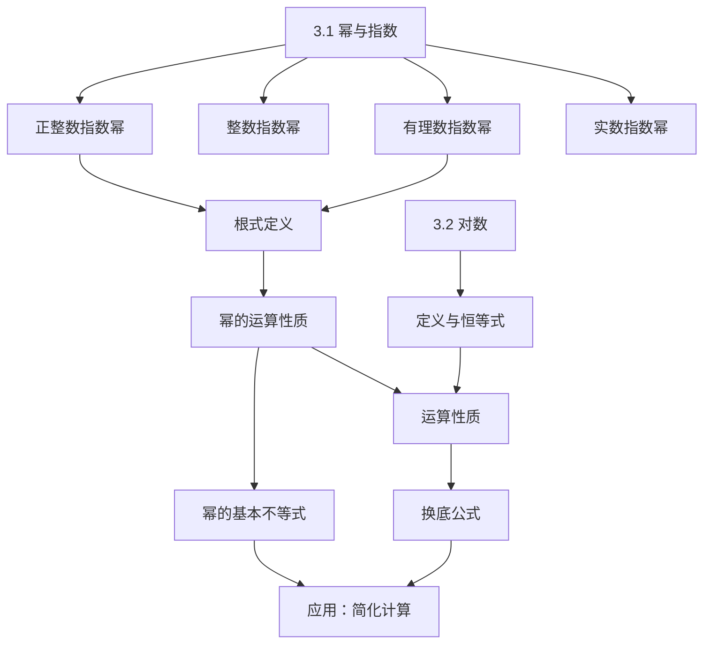

### 一 知识点总结

#### 1. 新知识点（按小节分类）

**3.1 幂与指数**
- **指数幂的拓展**  
  - 正整数指数幂：$a^n = a \cdot a \cdots a$（$n$ 个 $a$ 相乘）  
  - 整数指数幂：  
    - $a^0 = 1$（$a \neq 0$）  
    - $a^{-n} = \frac{1}{a^n}$（$a \neq 0$）  
  - 有理数指数幂（基于根式）：  
    - $a^{\frac{1}{n}} = \sqrt[n]{a}$（$n>1$，$a>0$）  
    - $a^{\frac{m}{n}} = \sqrt[n]{a^m} = (\sqrt[n]{a})^m$  
  - 实数指数幂：通过有理数逼近定义，保留运算性质。  
- **根式概念**  
  - $n$ 次方根定义：$x^n = a \Rightarrow x = \sqrt[n]{a}$  
  - 性质：  
    - $n$ 奇：$\sqrt[n]{a^n} = a$  
    - $n$ 偶：$\sqrt[n]{a^n} = |a|$  
- **幂的运算性质**（$a>0, b>0, s,t \in \mathbb{R}$）：  
  1. $a^s a^t = a^{s+t}$  
  2. $(a^s)^t = a^{st}$  
  3. $(ab)^t = a^t b^t$  
- **幂的基本不等式**：  
  - $a>1, s>0 \Rightarrow a^s > 1$  
  - $0<a<1, s>0 \Rightarrow 0<a^s<1$  

**3.2 对数**  
- **定义**：$a^x = N \Leftrightarrow x = \log_a N$（$a>0, a\neq1, N>0$）  
  - 恒等式：$a^{\log_a N} = N$  
  - 特殊值：$\log_a 1 = 0$, $\log_a a = 1$  
  - 常用对数（$\lg N = \log_{10} N$）、自然对数（$\ln N = \log_e N$）  
- **运算性质**：  
  1. $\log_a (MN) = \log_a M + \log_a N$  
  2. $\log_a \frac{M}{N} = \log_a M - \log_a N$  
  3. $\log_a (N^c) = c \log_a N$  
- **换底公式**：  
  $\log_b N = \frac{\log_a N}{\log_a b}$（$b>0, b\neq1$）  
  - 推论：$\log_{a^m} N^n = \frac{n}{m} \log_a N$  

#### 2. mermaid 流程图（知识点关系）

### 二 定理/性质汇总分析

| 章节 | 编号 | 定理/性质 | 旧知识点 | 旧知识点引入时间 |
|------|------|-----------|----------|------------------|
| 3.1 | 1 | $a^s a^t = a^{s+t}$ | 正整数指数幂运算性质 | 初中 |
| 3.1 | 2 | $(a^s)^t = a^{st}$ | 正整数指数幂运算性质 | 初中 |
| 3.1 | 3 | $(ab)^t = a^t b^t$ | 正整数指数幂运算性质 | 初中 |
| 3.1 | 4 | $a>1, s>0 \Rightarrow a^s>1$ | 实数指数幂定义 | 本节 |
| 3.2 | 1 | $\log_a (MN) = \log_a M + \log_a N$ | 指数运算性质 | 3.1 |
| 3.2 | 2 | $\log_a \frac{M}{N} = \log_a M - \log_a N$ | 指数运算性质 | 3.1 |
| 3.2 | 3 | $\log_a (N^c) = c \log_a N$ | 指数运算性质 | 3.1 |
| 3.2 | 4 | $\log_b N = \frac{\log_a N}{\log_a b}$ | 对数定义 | 本节 |

### 三 例题分析（每节一个表格）

#### 3.1 幂与指数例题

| 例题 | 新知识点 | 旧知识点 | 旧知识点引入时间 |
|------|----------|----------|------------------|
| 例1：求 $-\frac{1}{32}$ 的 5 次方根和 81 的 4 次方根 | $n$ 次方根定义 | 乘方运算 | 初中 |
| 例2：求 $\sqrt[5]{(-2)^5}$ 和 $\sqrt[6]{(-8)^2}$ | 根式性质（奇偶次） | 绝对值 | 初中 |
| 例3：求 $4^{3/2}$ 和 $(\frac{81}{625})^{-3/4}$ | 分数指数幂运算 | 指数律 | 3.1 |
| 例4：用有理数指数幂表示 $\sqrt[3]{a^2}$、$a^3 \cdot \sqrt[4]{a^3}$、$\sqrt{a \sqrt{a}}$ | 根式与指数幂互化 | 根式定义 | 本节 |
| 例5：化简 $(x^{\pi/2})^{\sqrt{3}} \cdot \sqrt{x}$ 和分式指数表达式 | 实数指数幂运算 | 指数律 | 3.1 |

#### 3.2 对数例题

| 例题 | 新知识点 | 旧知识点 | 旧知识点引入时间 |
|------|----------|----------|------------------|
| 例1：求 $\log_2 8$、$\log_2 \sqrt{2}$、$\log_{10} 0.00001$ | 对数定义 | 指数运算 | 3.1 |
| 例2：求 $\log_2 x = -1$、$\log_{1/2} x = 3$、$\ln x = -1$ 的解 | 对数与指数互化 | 分数指数幂 | 3.1 |
| 例3：求 $\log_3 (9^4 \times 3^2)$、$\log_3 \sqrt[5]{9}$、$2\log_5 10 + \log_5 3 - \log_5 12$ | 对数运算性质 | 指数律 | 3.1 |
| 例4：用 $a, b$ 表示 $\log_5 12$（已知 $\log_5 2 = a, 5^b = 3$） | 对数性质综合应用 | 指数运算 | 3.1 |
| 例5：声强级计算（$I = 10$ 时 $y$；$I_{60}/I_{50}$） | 对数实际应用 | 常用对数 | 本节 |
| 例6：求 $\log_2 25 \cdot \log_3 4 \cdot \log_5 9$ 和 $\frac{1}{\log_2 3} + \frac{\lg 13.5}{\lg 3}$ | 换底公式应用 | 对数性质 | 本节 |
| 例7：证明 $\log_{a^m} N^n = \frac{n}{m} \log_a N$ | 换底公式推论 | 对数定义 | 本节 |

### 四 练习分析（每节一个表格）

#### 练习 3.1(1)

| 练习 | 知识点 | 对应例题 | 难度 |
|------|--------|----------|------|
| 1：求 $-\frac{32}{243}$ 的 5 次方根 | $n$ 次方根（奇次） | 例1 | 3 |
| 2：求 9 的 4 次方根 | $n$ 次方根（偶次） | 例1 | 3 |
| 3(1)：求 $\sqrt[5]{(-4)^5}$ | 根式性质（奇次） | 例2 | 2 |
| 3(2)：求 $\sqrt[6]{(a-b)^6}$（$a<b$） | 根式性质（偶次含参） | 例2 | 4 |

#### 练习 3.1(2)

| 练习 | 知识点 | 对应例题 | 难度 |
|------|--------|----------|------|
| 1(1)：求 $100^{1/2}$ | 分数指数幂求值 | 例3 | 2 |
| 1(2)：求 $8^{-2/3}$ | 负分数指数幂 | 例3 | 3 |
| 2(1)：$a^{10/3} \cdot \sqrt[5]{a^3}$ 化指数形式 | 指数幂运算 | 例4 | 4 |
| 2(2)：$\sqrt[3]{a \sqrt[3]{a}}$ 化指数形式 | 多重根式化简 | 例4 | 5 |
| 3(1)：化简 $(a^{3+\sqrt{5}})^{3-\sqrt{5}}$ | 实数指数幂运算 | 例5 | 4 |
| 3(2)：化简分式指数表达式 | 指数幂综合运算 | 例5 | 6 |
| 4：证明 $0<a<1, s>0 \Rightarrow 0<a^s<1$ | 幂的基本不等式 | 例5 | 7 |

#### 练习 3.2(1)

| 练习 | 知识点 | 对应例题 | 难度 |
|------|--------|----------|------|
| 1：指数式 $5^x=6$ 的对数等价式 | 对数定义 | 例1 | 2 |
| 2(1)：求 $\log_5 25$ | 对数求值 | 例1 | 2 |
| 2(2)：求 $\log_{1/2} 27$ | 对数求值（底为分数） | 例1 | 4 |
| 2(3)：求 $\log_4 \sqrt{2}$ | 对数求值（真数为根式） | 例1 | 3 |
| 2(4)：求 $2^{\log_{\sqrt[3]{2}} 3}$ | 对数恒等式应用 | 例1 | 5 |
| 3(1)：$\log_4 x = 2$ 求 $x$ | 求真数 | 例2 | 2 |
| 3(2)：$\log_x 4 = 2$ 求 $x$ | 求底数 | 例2 | 3 |

#### 练习 3.2(2)

| 练习 | 知识点 | 对应例题 | 难度 |
|------|--------|----------|------|
| 1(1)：用 $A,B$ 表示 $\log_a (xy)$ | 积的对数性质 | 例3 | 3 |
| 1(2)：用 $A,B$ 表示 $\log_a \frac{x^2}{\sqrt{y}}$ | 商、幂的对数性质 | 例3 | 5 |
| 2(1)：求 $\log_{15} 3 + \log_{15} 5$ | 积的对数性质 | 例3 | 2 |
| 2(2)：求 $\log_2 \sqrt[3]{4}$ | 幂的对数性质 | 例3 | 3 |
| 2(3)：求 $\log_5 \sqrt{10} - \frac{1}{2} \log_5 250$ | 商、幂对数综合 | 例3 | 5 |
| 3：用 $a,b$ 表示 $\log_7 72$（已知 $\log_7 3=a, 7^b=2$） | 对数性质综合 | 例4 | 6 |

#### 练习 3.2(3)

| 练习 | 知识点 | 对应例题 | 难度 |
|------|--------|----------|------|
| 1(1)：求 $\log_8 \frac{1}{4}$ | 换底公式 | 例6 | 4 |
| 1(2)：求 $\log_a b \cdot \log_b c \cdot \log_c a$ | 换底公式连锁 | 例6 | 6 |
| 1(3)：求 $3^{2 + \log_9 4}$ | 对数恒等式 | 例6 | 5 |
| 1(4)：化简分式对数表达式 | 换底综合应用 | 例6 | 7 |
| 2：用 $a$ 表示 $\log_2 96$（已知 $\log_3 2 = a$） | 换底公式 | 例6 | 6 |
| 3：证明 $\log_b a = \frac{1}{\log_a b}$ | 换底公式推论 | 例7 | 4 |

### 五 习题分析（每节一个表格）

#### 习题 3.1（A组）

| 习题 | 知识点 | 对应例题 | 难度 |
|------|--------|----------|------|
| 1(1)：求 -64 的立方根 | $n$ 次方根（奇次） | 例1 | 2 |
| 1(2)：求 256 的 4 次方根 | $n$ 次方根（偶次） | 例1 | 2 |
| 2(1)：求 $\sqrt[5]{\frac{243}{32}}$ | 根式求值 | 例2 | 3 |
| 2(2)：求 $-\sqrt[3]{0.125}$ | 根式求值 | 例2 | 3 |
| 2(3)：求 $\sqrt[7]{(-2)^7}$ | 根式性质（奇次） | 例2 | 2 |
| 2(4)：求 $\sqrt[6]{(-27)^2}$ | 根式性质（偶次） | 例2 | 3 |
| 3(1)：$\sqrt[3]{x^5}$ 化指数形式 | 根式化指数幂 | 例4 | 4 |
| 3(2)：$(\sqrt[5]{x})^3$ 化指数形式 | 根式化指数幂 | 例4 | 4 |
| 3(3)：$\sqrt[7]{x^3 y^4}$ 化指数形式 | 根式化指数幂 | 例4 | 5 |
| 3(4)：$\sqrt[7]{\frac{x^3}{y^4}}$ 化指数形式 | 根式化指数幂 | 例4 | 5 |
| 4(1)：$a^{2/3}$ 化根式 | 指数幂化根式 | 例4 | 3 |
| 4(2)：$a^{3/4}$ 化根式 | 指数幂化根式 | 例4 | 3 |
| 4(3)：$a^{-2/5}$ 化根式 | 负指数幂化根式 | 例4 | 4 |
| 4(4)：$a^{-5/2}$ 化根式 | 负指数幂化根式 | 例4 | 4 |
| 5(1)：$x^3 = 27$ 求 $x$ | 幂方程 | 例1 | 2 |
| 5(2)：$x^4 = 121$ 求 $x$ | 幂方程（偶次） | 例1 | 4 |
| 5(3)：$x^{3/2} = 1000$ 求 $x$ | 分数指数幂方程 | 例3 | 5 |
| 5(4)：$x^{-4/5} = \frac{16}{625}$ 求 $x$ | 负分数指数幂方程 | 例3 | 6 |
| 6(1)：$a^{1/3} a^{1/4}$ 化简 | 同底指数幂乘法 | 例5 | 3 |
| 6(2)：$\sqrt[3]{a \sqrt{a}}$ 化简 | 多重根式化简 | 例4 | 5 |
| 6(3)：$(a^{1/4} b^{-3/8})^8$ 化简 | 积的幂运算 | 例5 | 5 |
| 6(4)：$\left( \frac{a^{-3} b^4}{\sqrt{b}} \right)^{-1/3}$ 化简 | 综合指数运算 | 例5 | 7 |
| 7(1)：分式指数化简 | 指数幂综合运算 | 例5 | 6 |
| 7(2)：$(a^{2-\sqrt{3}} b)^{2+\sqrt{3}} \cdot b^{2-\sqrt{3}}$ 化简 | 实数指数幂运算 | 例5 | 7 |

#### 习题 3.1（B组）

| 习题 | 知识点 | 对应例题 | 难度 |
|------|--------|----------|------|
| 1：$x<0$ 时求 $\mid x\mid + \sqrt[3]{x^6} + 2\sqrt[3]{x^3}$ | 根式性质（含绝对值） | 例2 | 6 |
| 2：已知 $a^{2x} = 2$，求 $\frac{a^{3x} + a^{-3x}}{a^x + a^{-x}}$ | 指数运算变形 | 例5 | 8 |
| 3：证明 $a^a b^b > (ab)^{\frac{a+b}{2}}$（$a>b>0$） | 幂不等式应用 | 例5 | 9 |

#### 习题 3.2（A组）

| 习题 | 知识点 | 对应例题 | 难度 |
|------|--------|----------|------|
| 1(1)：$3^4 = 81$ 化对数式 | 指数化对数 | 例1 | 2 |
| 1(2)：$5^{-1/2} = x$ 化对数式 | 指数化对数 | 例1 | 3 |
| 2(1)：$\log_{1/3} 27 = -3$ 化指数式 | 对数化指数 | 例2 | 2 |
| 2(2)：$\log_2 \frac{1}{8} = -3$ 化指数式 | 对数化指数 | 例2 | 2 |
| 3(1)：求 $\log_3 27$ | 对数求值 | 例1 | 2 |
| 3(2)：求 $\log_{1/3} 81$ | 对数求值 | 例1 | 4 |
| 3(3)：求 $\ln \frac{1}{e} + \lg \sqrt{10}$ | 自然对数与常用对数 | 例1 | 5 |
| 4(1)：$\log_2 x = 5$ 求 $x$ | 求真数 | 例2 | 2 |
| 4(2)：$\log_{15} \frac{1}{125} = x$ 求 $x$ | 对数求值 | 例1 | 4 |
| 4(3)：$\log_x 4 = \frac{1}{2}$ 求 $x$ | 求底数 | 例2 | 3 |
| 5(1)：求 $\log_2 (2 \times \sqrt[3]{2})$ | 积的对数性质 | 例3 | 3 |
| 5(2)：求 $\log_{21} 3 + \log_{21} 7$ | 积的对数性质 | 例3 | 2 |
| 5(3)：求 $\log_5 \sqrt{6} - \frac{1}{2} \log_5 150$ | 商、幂对数综合 | 例3 | 5 |
| 5(4)：求 $3^{\log_3 1} + \log_2 48 - \log_2 3$ | 对数恒等式及性质 | 例3 | 4 |
| 5(5)：复杂对数式化简 | 对数综合运算 | 例3 | 7 |
| 6(1)：用 $A,B,C$ 表示 $\log_a (x y^2)$ | 对数性质应用 | 例4 | 4 |
| 6(2)：用 $A,B,C$ 表示 $\log_a \frac{x y}{\sqrt{z}}$ | 对数性质综合 | 例4 | 5 |
| 6(3)：$\log_a (x^2 y^2) + \log_a (y \sqrt{x})$ 化简 | 对数性质综合 | 例4 | 6 |
| 7(1)：求 $\log_4 (2 \sqrt{2})$ | 对数求值 | 例3 | 4 |
| 7(2)：求 $\log_2 3 \cdot \log_9 2$ | 换底公式 | 例6 | 5 |
| 7(3)：求 $\frac{3}{\log_2 6} + \frac{3}{\log_3 6}$ | 换底公式应用 | 例6 | 6 |
| 7(4)：$(\log_4 3 + \log_8 3)(\log_3 2 + \log_9 2) + \log_{\frac{1}{2}} \sqrt[4]{32}$ | 换底综合应用 | 例6 | 8 |
| 8：用 $a$ 表示 $\lg 2$ 和 $\lg 20$（已知 $\lg 5 = a$） | 常用对数性质 | 例4 | 5 |

#### 习题 3.2（B组）

| 习题 | 知识点 | 对应例题 | 难度 |
|------|--------|----------|------|
| 1(1)：$\log_2 (1-3x)$ 的定义域 | 对数定义域 | 例1 | 4 |
| 1(2)：$\log_a (x^2 + x)$ 的定义域 | 对数定义域 | 例1 | 5 |
| 2(1)：求 $\log_4 8 - \log_{1/2} 3 - \log_{\sqrt{2}} 4$ | 换底综合 | 例6 | 7 |
| 2(2)：求 $2^{\log_6 5} \cdot 3^{\log_6 5}$ | 对数恒等式 | 例3 | 6 |
| 2(3)：求 $(\lg 50)^2 + \lg 2 \cdot \lg 50^2 + (\lg 2)^2$ | 对数运算变形 | 例3 | 7 |
| 3：里氏震级能量比值计算 | 对数实际应用 | 例5 | 7 |
| 4：用 $a,b$ 表示 $\log_2 3$ 和 $\log_{12} 25$（已知 $\lg 2 = a, \lg 3 = b$） | 换底公式 | 例6 | 8 |
| 5：已知 $5.4^x = 3, 0.6^y = 3$，求 $\frac{1}{x} - \frac{1}{y}$ | 对数与换底 | 例6 | 9 |
| 6：证明 $\log_a b \cdot \log_c d = \log_a d \cdot \log_c b$ | 换底公式推广 | 例7 | 8 |

### 六 复习题分析

#### 复习题（A组）

| 题目 | 知识点 | 对应例题 | 难度 |
|------|--------|----------|------|
| 1(1)：$x^3 = 5$ 求 $x$；$3^x = 5$ 求 $x$ | 开方与对数定义 | 例1, 例2 | 3, 4 |
| 1(2)：$\sqrt[4]{a \sqrt[3]{a}}$ 化指数形式 | 多重根式化简 | 例4 | 5 |
| 1(3)：$\log_8 x = -\frac{2}{3}$ 求 $x$ | 对数求值 | 例2 | 4 |
| 1(4)：$\log_a b \cdot \log_5 a = 3$ 求 $b$ | 换底公式 | 例6 | 6 |
| 2(1)：$\lg a$ 与 $\lg b$ 互为相反数的条件 | 对数性质 | 例3 | 5 |
| 2(2)：指数运算正误判断 | 指数律 | 例5 | 4 |
| 3：已知 $10^\alpha = 3, 10^\beta = 4$，求 $10^{\alpha + \beta}$ 和 $10^{\alpha - \beta/2}$ | 指数运算 | 例3 | 5 |
| 4(1)：求 $\frac{1}{4^x + 1} + \frac{1}{4^{-x} + 1}$ | 指数运算变形 | 无 | 6 |
| 4(2)：化简 $4^{\sqrt{2}+1} \cdot 2^{3-2\sqrt{2}} \cdot 8^{-\frac{2}{3}}$ | 指数幂综合 | 例5 | 7 |
| 5：化简 $\sqrt{(\lg a)^2 - \lg \frac{a^2}{10}}$（$\lg a < 1$） | 对数与代数综合 | 无 | 8 |
| 6：求 $2^m - m \lg 2 - 4$（$m = \log_2 10$） | 对数恒等式 | 例3 | 6 |

#### 复习题（B组）

| 题目 | 知识点 | 对应例题 | 难度 |
|------|--------|----------|------|
| 1(1)：已知 $4^x = 2^{-1/2}, 4^y = \sqrt[3]{32}$，求 $2x-3y$ | 指数方程 | 无 | 7 |
| 1(2)：$\log_3 (\log_4 x) = 1$ 求 $x$ | 复合对数方程 | 例2 | 6 |
| 1(3)：已知 $3^a = 7^b = 63$，求 $\frac{2}{a} + \frac{1}{b}$ | 指数与对数综合 | 无 | 9 |
| 2：$\log_{36} 45$ 用 $a,b$ 表示（已知 $\log_{18} 9 = a, 18^b = 5$） | 换底公式 | 例6 | 9 |
| 3：$\log_{0.2} (ab)$ 的最小值（给定约束） | 对数不等式 | 无 | 9 |
| 4：化简分式指数表达式 | 指数运算综合 | 例5 | 8 |
| 5：证明 $a^{2b+k} - a^{b+k} > a^{b+k} - a^k$（$a>1, b>0$） | 幂不等式 | 例5 | 8 |

### 七 定理/性质和例题按习题形式输出

#### 3.1 定理/性质
1. **题**：化简 $a^s a^t$（$a>0, s,t \in \mathbb{R}$）  
   **答**：$a^{s+t}$  
2. **题**：化简 $(a^s)^t$（$a>0, s,t \in \mathbb{R}$）  
   **答**：$a^{st}$  
3. **题**：化简 $(ab)^t$（$a>0, b>0, t \in \mathbb{R}$）  
   **答**：$a^t b^t$  
4. **题**：若 $a>1, s>0$，比较 $a^s$ 与 1 的大小。  
   **答**：$a^s > 1$  

#### 3.1 例题
1. **题**：求 $-\frac{1}{32}$ 的 5 次方根和 81 的 4 次方根。  
   **答**：$-\frac{1}{2}$；$\pm 3$  
2. **题**：求 $\sqrt[5]{(-2)^5}$ 和 $\sqrt[6]{(-8)^2}$。  
   **答**：$-2$；$2$  
3. **题**：求 $4^{3/2}$ 和 $(\frac{81}{625})^{-3/4}$。  
   **答**：$8$；$\frac{125}{27}$  
4. **题**：用有理数指数幂表示 $\sqrt[3]{a^2}$、$a^3 \cdot \sqrt[4]{a^3}$、$\sqrt{a \sqrt{a}}$。  
   **答**：$a^{2/3}$；$a^{15/4}$；$a^{1/4}$  
5. **题**：化简 $(x^{\pi/2})^{\sqrt{3}} \cdot \sqrt{x}$ 和分式指数表达式。  
   **答**：$x^{\frac{\pi \sqrt{3} + 1}{2}}$；$-9a$  

#### 3.2 定理/性质
1. **题**：化简 $\log_a (MN)$（$M>0, N>0$）。  
   **答**：$\log_a M + \log_a N$  
2. **题**：化简 $\log_a \frac{M}{N}$（$M>0, N>0$）。  
   **答**：$\log_a M - \log_a N$  
3. **题**：化简 $\log_a (N^c)$（$N>0, c \in \mathbb{R}$）。  
   **答**：$c \log_a N$  
4. **题**：用 $\log_a N$ 和 $\log_a b$ 表示 $\log_b N$。  
   **答**：$\frac{\log_a N}{\log_a b}$  

#### 3.2 例题
1. **题**：求 $\log_2 8$、$\log_2 \sqrt{2}$、$\log_{10} 0.00001$。  
   **答**：$3$；$\frac{1}{2}$；$-5$  
2. **题**：解 $\log_2 x = -1$、$\log_{1/2} x = 3$、$\ln x = -1$。  
   **答**：$\frac{1}{2}$；$\frac{1}{8}$；$\frac{1}{e}$  
3. **题**：求 $\log_3 (9^4 \times 3^2)$、$\log_3 \sqrt[5]{9}$、$2\log_5 10 + \log_5 3 - \log_5 12$。  
   **答**：$10$；$\frac{2}{5}$；$2$  
4. **题**：用 $a, b$ 表示 $\log_5 12$（$\log_5 2 = a, 5^b = 3$）。  
   **答**：$2a + b$  
5. **题**：声强级计算（$I = 10$ 时 $y$；$I_{60}/I_{50}$）。  
   **答**：$130$ dB；$10$ 倍  
6. **题**：求 $\log_2 25 \cdot \log_3 4 \cdot \log_5 9$ 和 $\frac{1}{\log_2 3} + \frac{\lg 13.5}{\lg 3}$。  
   **答**：$8$；$3$  
7. **题**：证明 $\log_{a^m} N^n = \frac{n}{m} \log_a N$。  
   **答**：略（见教材证明）