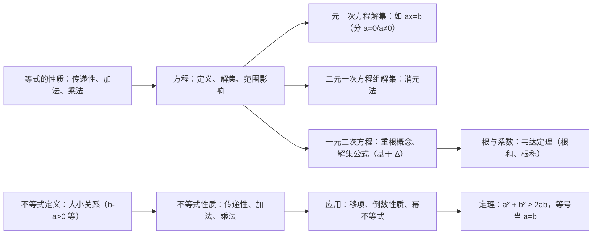

## 2.1 等式与不等式的性质

### 一 知识点总结

#### 1. 新知识点（按子小节分类）

**1.1 等式的性质与方程的解集**
- **等式定义**：用等号（=）连接两个表达式所得式子（如 $\sin 30^\circ = \frac{1}{2}$）。
- **等式性质**：
  - 传递性：若 $a = b$ 且 $b = c$，则 $a = c$。
  - 加法性质：若 $a = b$，则 $a + c = b + c$。
  - 乘法性质：若 $a = b$，则 $ac = bc$（$c \neq 0$ 时可除）。
- **推论**：等式两边可减同数或除以非零数仍成立。
- **方程相关**：
  - 方程定义：含未知数的等式（如 $(x - \frac{1}{2})(x-1)(x - \sqrt{2}) = 0$）。
  - 解与解集：使方程成立的未知数值为解，所有解组成解集；解集取决于未知数的取值范围（如自然数、有理数、实数集）。
- **旧知识点引入**：实数运算（小学/初中）、等号基本概念（小学）。

**1.2 一元二次方程的解集及根与系数的关系**
- **一元二次方程定义**：$ax^2 + bx + c = 0\ (a \neq 0)$，解习惯称根。
- **重根概念**：若两根相等，称为重根（解集中仅出现一次）。
- **解集公式**：基于判别式 $\Delta = b^2 - 4ac$：
  - $\Delta > 0$：解集 $\{ \frac{-b \pm \sqrt{\Delta}}{2a} \}$（两个不等实根）。
  - $\Delta = 0$：解集 $\{ -\frac{b}{2a} \}$（重根）。
  - $\Delta < 0$：解集 $\varnothing$（无实根）。
- **韦达定理**：
  - 若根为 $x_1, x_2$，则 $x_1 + x_2 = -\frac{b}{a}$, $x_1 x_2 = \frac{c}{a}$。
  - 证明基于因式分解 $ax^2 + bx + c = a(x - x_1)(x - x_2)$ 及系数匹配。
- **旧知识点引入**：一元二次方程求解、因式分解（初中）。

**1.3 不等式的性质**
- **不等式定义**：用不等号（$>$, $<$, $\geq$, $\leq$）连接表达式的式子（如 $a^2 + b^2 \geq 2ab$）。
- **大小关系**：
  - $b > a \iff b - a > 0$；$b < a \iff b - a < 0$；$b = a \iff b - a = 0$。
  - 任意两实数 $a, b$：$a > b$, $a < b$ 或 $a = b$，三者仅一成立。
- **不等式性质**：
  - 传递性：若 $a > b$ 且 $b > c$，则 $a > c$。
  - 加法性质：若 $a > b$，则 $a + c > b + c$。
  - 乘法性质：若 $a > b$，则：
    - $c > 0$ 时 $ac > bc$；
    - $c < 0$ 时 $ac < bc$。
- **推论与应用**：
  - 移项性质：若 $a + b > c$，则 $a > c - b$（反亦然）。
  - 倒数性质：若 $a > b > 0$，则 $\frac{1}{b} > \frac{1}{a} > 0$。
  - 幂不等式：若 $a > b > 0$，则 $a^n > b^n$（$n$ 为正整数）。
  - 反证法应用：若 $a^n > b^n$（$a,b > 0$），则 $a > b$。
- **比较大小方法**：比较表达式 $A$ 与 $B$，证 $A - B > 0$ 则 $A > B$；证 $A - B < 0$ 则 $A < B$。
- **定理**：$a^2 + b^2 \geq 2ab$，等号当 $a = b$ 成立（基于 $(a - b)^2 \geq 0$）。
- **旧知识点引入**：实数大小比较、基础不等式（初中）。

#### 2. 关系图

- **关系说明**：等式性质为基础 ，**扩展**到方程**解集**（一/二元一次、一元二次）；方程**过渡到**不等式；韦达定理深化根与系数联系；不等式性质衍生推论和定理。

### 二 定理和例题分析

#### 1. 定理分析（共 2 个）
| 定理描述 | 证明涉及新知识点 | 证明涉及旧知识点（引入时间） |
|----------|------------------|------------------------------|
| **韦达定理**：若 $ax^2 + bx + c = 0$（$a \neq 0$）根为 $x_1, x_2$，则 $x_1 + x_2 = -\frac{b}{a}$, $x_1 x_2 = \frac{c}{a}$。 | 一元二次解集、因式分解系数匹配（例 5）。 | 等式性质（小学/初中）、因式分解（初中）。 |
| **比较定理**：$a^2 + b^2 \geq 2ab$，等号当 $a = b$。 | 比较差方法（$A - B = (a - b)^2 \geq 0$）。 | 平方差公式（初中）。 |

#### 2. 例题分析（共 13 个）
| 例题 | 涉及新知识点 | 涉及旧知识点（引入时间） |
|------|------------------|------------------------------|
| **例 1**：判断等式命题真假（如 $ac=bc \Rightarrow a=b$ 假）。 | 等式性质、推论。 | 实数运算（初中）。 |
| **例 2**：求 $ax = b$ 解集（分 $a \neq 0$/$a=0$）。 | 一元一次方程解集。 | 代数方程（初中）。 |
| **例 3**：求二元方程组 $\begin{cases} y = 2x + 1 \\ y = kx + 3 \end{cases}$ 解集。 | 方程解集、消元法。 | 方程组解法（初中）。 |
| ⭐**例 4**：求 $ax^2 + bx + c = 0$ 解集（基于 $\Delta$）。 | 一元二次解集公式。 | 判别式（初中）。 |
| ⭐**例 5**：证 $a_1 x^2 + b_1 x + c_1 = a_2 x^2 + b_2 x + c_2$ 恒成立 $\iff a_1 = a_2, b_1 = b_2, c_1 = c_2$ | 系数匹配（代入特定 $x$ 值）。 | 等式传递性（小学/初中）。 |
| **例 6**：已知 $x^2 + x - 3 = 0$ 根 $x_1, x_2$，求 $x_1^2 x_2 + x_2^2 x_1$、$|x_1 - x_2|$。 | 韦达定理应用、根式化简。 | 代数变形（初中）。 |
| **例 7**：证 $a + b > c \iff a > c - b$。 | 移项性质。 | 不等式加法（初中）。 |
| **例 8**：若 $a > b$, $c > d$，证 $a + c > b + d$。 | 不等式加法性质。 | 实数加减（小学）。 |
| **例 9**：若 $a > b$, $c > d$，证 $a - d > b - c$。 | 不等式组合应用。 | 代数重组（初中）。 |
| **例 10**：(1) 若 $a > b > 0$，证 $\frac{1}{b} > \frac{1}{a}$；(2) 若 $a > b > 0$, $c > d > 0$，证 $\frac{a}{d} > \frac{b}{c}$。 | 倒数性质、乘法性质。 | 分式运算（初中）。 |
| **例 11**：(1) 若 $a > b > 0$, $c > d > 0$，证 $ac > bd$；(2) 若 $a > b > 0$，证 $a^n > b^n$。 | 幂不等式、传递性。 | 指数运算（初中）。 |
| **例 12**：若 $a^n > b^n$（$a,b > 0$, $n$ 正整数），证 $a > b$（反证法）。 | 反证法应用。 | 实数性质（初中）。 |
| **例 13**：比较 $(a+1)^2$ 与 $a^2 - a + 1$ 大小（分 $a > 0$, $a = 0$, $a < 0$）。 | 比较差方法。 | 代数展开（初中）。 |

#### 3. 练习分析（总 8 题，按练习集）
| 练习集 | 题目描述 | 涉及新知识点 | 涉及旧知识点（引入时间） | 可参考例题 |
|--------|----------|------------------|------------------------------|------------|
| **练习 2.1(1)**（共 3 题） | 1. 判断命题真假（如 $a^2 = b^2 \Rightarrow a = b$）。 | 等式性质、推论。 | 平方差公式（初中）。 | 例 1 |
|  | 2. 求 $ax = a^2 + x - 1$ 解集。 | 一元二次方程解集。 | 代数变形（初中）。 | 例 2 |
|  | 3. 求方程组 $\begin{cases} y = kx + 1 \\ y = 2kx + 3 \end{cases}$ 解集。 | 方程组解集。 | 消元法（初中）。 | 例 3 |
| **练习 2.1(2)**（共 1 题） | 1. 求 $ax^2 - 4x + 2 = 0$（$a \neq 0$）解集。 | 一元二次解集公式。 | 判别式应用（初中）。 | 例 4 |
| **练习 2.1(3)**（共 2 题） | 1. 判断不等式命题真假（如 $ab > ac \Rightarrow b > c$）。 | 不等式性质、乘法规则。 | 实数符号（初中）。 | 例 10、例 1（不等版） |
|  | 2. 证 $a > b$ $\iff$ $\frac{1}{a} < \frac{1}{b}$（$ab > 0$）。 | 倒数性质充要条件。 | 分式运算（初中）。 | 例 10(1) |
| **练习 2.1(4)**（共 2 题） | 1. 判断命题真假（如 $ac^2 > bc^2 \Rightarrow a > b$）。 | 不等式乘法性质。 | 平方非负性（初中）。 | 例 10 |
|  | 2. 比较 $x^2 + 4$ 与 $4x$ 大小。 | 比较差方法。 | 代数比较（初中）。 | 例 13、定理 |

### 三 定理和例题按习题形式输出

#### 定理习题
1. **定理 1（韦达定理）**  
   若一元二次方程 $ax^2 + bx + c = 0$（$a \neq 0$）的两个根为 $x_1$ 和 $x_2$，证明：  
   $$ x_1 + x_2 = -\frac{b}{a}, \quad x_1 x_2 = \frac{c}{a} $$

2. **定理 2（比较定理）**  
   对任意实数 $a$ 和 $b$，证明：  
   $$ a^2 + b^2 \geq 2ab $$  
   等号成立当且仅当 $a = b$。

#### 例题习题
1. **例 1**  
   设 $a, b, c, d$ 是实数，判断下列命题的真假，并说明理由：  
   (1) 如果 $a = b$ 且 $c = d$，那么 $a + c = b + d$；  
   (2) 如果 $a = b$ 且 $c = d$，那么 $ac = bd$；  
   (3) 如果 $a = b \neq 0$，那么 $\frac{1}{a} = \frac{1}{b}$；  
   (4) 如果 $a = b$，那么 $a^n = b^n$（$n$ 为正整数）；  
   (5) 如果 $ac = bc$，那么 $a = b$；  
   (6) 如果 $(a - b)^2 + (b - c)^2 = 0$，那么 $a = b = c$。

2. **例 2**  
   设 $a, b \in \mathbb{R}$，求关于 $x$ 的方程 $ax = b$ 的解集。

3. **例 3**  
   设 $k \in \mathbb{R}$，求关于 $x$ 与 $y$ 的二元一次方程组 $\begin{cases} y = kx + 1 \\ y = 2kx + 3 \end{cases}$ 的解集。

4. **例 4**  
   求一元二次方程 $ax^2 + bx + c = 0$（$a \neq 0$）的解集。

5. **例 5**  
   证明：$a_1 = a_2$, $b_1 = b_2$, $c_1 = c_2$ 是等式 $a_1 x^2 + b_1 x + c_1 = a_2 x^2 + b_2 x + c_2$ 恒成立的充要条件。

6. **例 6**  
   已知方程 $x^2 + x - 3 = 0$ 的两个根为 $x_1$、$x_2$，求：  
   (1) $x_1^2 x_2 + x_2^2 x_1$；  
   (2) $|x_1 - x_2|$。

7. **例 7**  
   证明：如果 $a + b > c$，那么 $a > c - b$；反之亦然。

8. **例 8**  
   已知 $a > b$，$c > d$。求证：$a + c > b + d$。

9. **例 9**  
   已知 $a > b$，$c > d$。求证：$a - d > b - c$。

10. **例 10**  
    (1) 已知 $a > b > 0$，求证：$\frac{1}{b} > \frac{1}{a} > 0$；  
    (2) 已知 $a > b > 0$，$c > d > 0$，求证：$\frac{a}{d} > \frac{b}{c}$。

11. **例 11**  
    (1) 已知 $a > b > 0$，$c > d > 0$，求证：$ac > bd$；  
    (2) 已知 $a > b > 0$，求证：$a^n > b^n$（$n$ 为正整数）。

12. **例 12**  
    已知 $a, b$ 为正数，$n$ 为正整数。求证：如果 $a^n > b^n$，那么 $a > b$。

13. **例 13**  
      设 $a$ 是实数，比较 $(a + 1)^2$ 与 $a^2 - a + 1$ 的值的大小。
    
## 2.1 节习题分析 

### A组

| 题号 | 知识点                 | 难度 | 例题 | 关键分析 |
|------|------|----------|----------|----------|
| **1** | 含参一元一次方程解集   | 2    | 例2      | 直接套用例2解法，分 $a \neq 0$/$a=0$ 讨论 |
| **2** | 含参二元方程组解集     | 3    | 例3      | 消元法讨论 $k$（与例3同构） |
| **3** | 一元二次方程解集公式   | 4    | 例4      | 判别式 $\Delta = (-2a)^2 - 4(a^2-4) = 16$，解集 $\{a+2, a-2\}$ |
| **4** | 多项式恒等式系数求解   | 5    | 例5      | 赋值法/比较系数：令 $x=1$ 得 $c=-2$；令 $x=0$ 得 $a-b+c=-1$ |
| **5** | 韦达定理与根差公式     | 6    | 例6      | 利用求根公式：$\|x_1-x_2\| = \frac{\sqrt{\Delta}}{\|a\|}$（$\Delta = b^2-4ac$） |
| **6** | 韦达定理构造新方程     | 7    | 例6      | 4小问均需计算新根的和与积： (1) 根 $-\!x_1,\!-\!x_2$→方程 $t^2\!-\!3t\!-\!3\!=\!0$ (4) 根 $x_1^2,x_2^2$→$t^2\!-\!15t\!+\!9\!=\!0$ |
| **7** | 不等式性质综合判断     | 7    | 例1,10-13| (3)(6) 需反例： (3) 反例 $a\!=2,b=1,c=0.5,d=0.1$ (6) 反例 $a=0.01, b=-1$ |
| **8** | 不等式符号与绝对值     | 4    | 例1,10  | (1)C ($\|a\|>\|b\|$) (2)B ($a^2>ab$) (3)C ($a^3<0<b^3$) |
| **9** | 充要条件证明           | 6    | 无       | 必要性：$ab>0$ 且 $a+b>0$ ⇒ $a,b>0$（反证法） |
| **10**| 作差法比较大小         | 4    | 例13     | 差= $(x^3+1)-(x^3-1)=2>0$ |
| **11**| 实数比较（平方/作差）  | 6    | 例13     | (1) 平方：$(3+\sqrt{3})^2=12+6\sqrt{3} > 9+4\sqrt{5}$ (2) 平方：$(\sqrt{3}+\sqrt{5})^2=8+2\sqrt{15}>8+4\sqrt{3}$ |
| **12**| 配方法比较大小         | 3    | 例13     | 差 $=(a-1)^2+(b+1)^2 \geq 0$ |
| **13**| 不等式组合证明         | 5    | 例9      | 作差：$(a-b)(c-d)>0$（$a>b$, $c>d$） |
| **14**| 因式分解证不等式       | 4    | 例13     | 差 $=(a+1)(a-1)^2 \geq 0$（$a \geq -1$） |
| **15**| 作差法+等号条件       | 6    | 例13     | 差 $=(a+b)(a-b)^2 \geq 0$，等号当 $a=b$ |

### B组

| 题号 | 知识点                 | 难度 | 例题 | 关键分析 |
|------|------|----------|----------|------|
| **1** | 含参方程退化讨论       | 4    | 例2      | 当 $a=2$ 时，方程退化为 $0x=0$ → 解集 $\mathbb{R}$ |
| **2** | 含参一元二次方程解集   | 8    | 例4      | 分 $m \neq -1$（二次）和 $m=-1$（一次）讨论，二次时再分 $\Delta \geq 0$ |
| **3** | 多项式恒等式赋值法     | 5    | 例5      | 令 $x=0$ 直接得 $a-b+c=-1$ |
| **4** | 韦达定理与根符号       | 7    | 无       | $ac<0$ ⇒ 两根异号且 $\Delta>0$（充要性证明） |
| **5(1)** | 复杂根变换构造新方程   | 7   | 无       |  |
|**5(2)**   | 复杂根变换构造新方程 | 9 |  |  |
|**5(3)**   | 复杂根变换构造新方程 | 7 |  |  |
|**5(4)**   | 复杂根变换构造新方程 | 9 |  | (4) 根 $x_1^4,x_2^4$ 需计算 $s=\frac{97}{16}$, $p=\frac{81}{16}$ → $16t^2-97t+81=0$ |
| **6** | 韦达定理求参数         | 6    | 例6      | $4m^2-2(m-1)=4$ ⇒ $m=1$ 或 $-\frac{1}{2}$（$\Delta>0$ 恒成立） |
| **7** | 不等式反证法           | 6    | 无       | 反证法：$a \leq 0$ 或 $c \geq 0$ 均与 $a>b>c$ 矛盾 |
| **8** | 二次方程根的分布       | 10   | 无       | 充要条件：$s>2$, $p>s-1$, $s^2 \geq 4p$（需 $f(1)=1-s+p>0$） |
| **9** | 浓度问题与不等式证明   | 6    | 例13     | 作差：$\frac{b+x}{a+x}-\frac{b}{a}=\frac{x(a-b)}{a(a+x)}>0$（$a>b>0$） |
