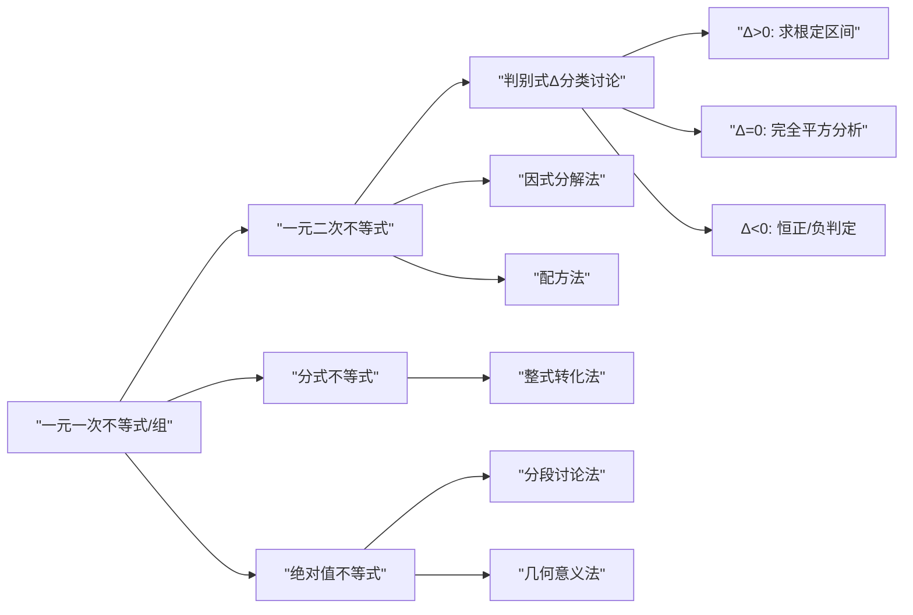

## 2.2 不等式的求解 - 详细总结

### 一 知识点总结

#### 1. 新知识点分类
**1.1 一元一次不等式及不等式组**
- 含参数一元一次不等式解法
- 分类讨论（系数正负性）
- 不等式组解集的求法（交集运算）
- 解集的区间表示法

**1.2 一元二次不等式**
- 一元二次不等式定义：$ax^2+bx+c>0$（或$<0,\geqslant0,\leqslant0$)
- 判别式$\Delta=b^2-4ac$分类解法：
  - $\Delta>0$：求根→因式分解→符号分析
  - $\Delta=0$：配方法→完全平方分析
  - $\Delta<0$：配方法→恒正/负性判定
- 含参数问题（已知解集求参数）

**1.3 分式不等式**
- 基本形式：$\frac{P(x)}{Q(x)}>0$
- 解法：
  - 等价转化：$P(x)\cdot Q(x)>0$
  - 不等式组法：$\begin{cases}P(x)>0\\Q(x)>0\end{cases}$或$\begin{cases}P(x)<0\\Q(x)<0\end{cases}$
- 分母不为零的隐含条件

**1.4 含绝对值不等式**

- 几何意义（数轴距离）
- 基本类型解法：
  - $|x|<a \Rightarrow -a<x<a$
  - $|x|>a \Rightarrow x<-a$ 或 $x>a$
- 复杂类型解法：
  - 分段讨论法（按零点分区）
  - 几何意义法（距离分析）

#### 2. 知识点关系流程图

### 二 定理与例题分析

#### 定理总结（2个核心结论）
| 定理描述 | 证明涉及的新知识点 | 证明涉及的旧知识点 | 旧知识点引入时间 |
|----------|---------------------|---------------------|------------------|
| 一元一次不等式 $ax < b$ 的解集分类 | 不等式性质（乘负数变号） | 实数比较大小 | 初中/必修1 |
| 一元二次不等式解集与 $\Delta$ 的关系（表2-1,2-2） | 因式分解（$\Delta>0$) 配方法（$\Delta\leqslant0$) | 一元二次方程求根 完全平方公式 | 初中/必修1 |

#### 例题分析（17道）
| 例题 | 涉及的新知识点 | 涉及的旧知识点 | 旧知识点引入时间 |
|------|----------------|----------------|------------------|
| 例1：$ax<1$ | 含参一元一次不等式分类讨论 | 不等式基本性质 | 2.1节 |
| 例2：$\begin{cases}2x+a>0\\3x-6a<0\end{cases}$ | 含参不等式组解法 | 集合交集运算 | 必修1集合 |
| 例3：$(x-3)(x+1)>0$ | 一元二次不等式（因式分解型） | 一元一次不等式组 | 例2 |
| 例4：$(x-1)(x+4)<0$ | 一元二次不等式（因式分解型） | 一元一次不等式组 | 例2 |
| 例5：$-2x^2+3x-\frac{1}{2}\geqslant0$ | 一元二次不等式（一般形式） | 一元二次方程求根 | 2.1节 |
| 例6：$x^2\leqslant4x-4$等 | 一元二次不等式（$\Delta\leqslant0$） | 配方法 | 初中 |
| 例7：$\begin{cases}x-3>0\\x^2-3x-4>0\end{cases}$ | 混合型不等式组解法 | 一元二次不等式解法 | 例3-6 |
| 例8：$x^2+(k-1)x+4>0$解集$\mathbb{R}$ | 含参一元二次不等式 | 判别式与二次函数 | 2.1节 |
| 例9：$x^2+bx+c<0$解集$(1,2)$ | 由解集求参数 | 韦达定理 | 2.1节 |
| 例10：$\frac{x+3}{4-x}>0$ | 分式不等式基本解法 | 一元二次不等式 | 例3-6 |
| 例11：$\frac{5x+3}{x-1}\leq3$ | 分式不等式（移项转化） | 分式性质 | 初中 |
| 例12：$\frac{x+5}{x^2+2x+3}\leq1$ | 分式不等式（分母恒正） | 配方法 | 初中 |
| 例13：服装代理问题 | 分式不等式实际应用 | 数学建模基础 | 初中 |
| 例14：$|x-1|<2$ | 基本绝对值不等式 | 数轴表示 | 初中 |
| 例15：$|2x+1|\geq3$ | 基本绝对值不等式 | 数轴表示 | 初中 |
| 例16：$|1-2x|>x$ | 含绝对值不等式（分段讨论） | 代数定义 | 2.1节 |
| 例17：$|x-3|+|x-5|<4$ | 多绝对值不等式 | 区间划分 | 必修1函数 |

#### 练习分析（5组）
| 练习 | 题目 | 涉及的新知识点 | 涉及的旧知识点 | 参考例题 |
|------|------|----------------|----------------|----------|
| 2.2(1) | 1：$ax<a^2+x-1$ | 含参一元一次不等式 | 移项合并 | 例1 |
|  | 2(1)：$(x-2)(x+3)<0$ | 一元二次不等式 | 因式分解 | 例4 |
|  | 2(2)：$(2-x)(x+3)<0$ | 一元二次不等式 | 系数处理 | 例5 |
|  | 2(3)：$(x-2)(x+3)\geqslant0$ | 一元二次不等式 | 等号处理 | 例5 |
|  | 3(1)：$-8x\leqslant3x^2+4$ | 一元二次不等式 | 移项整理 | 例5 |
|  | 3(2)：$-x^2<2x-4$ | 一元二次不等式 | 移项整理 | 例5 |
| 2.2(2) | 1(1)：$x+2>-x^2$ | 一元二次不等式 | 移项整理 | 例5 |
|  | 1(2)：$-x^2+3x-4>0$ | $\Delta<0$情形 | 判别式分析 | 例6 |
|  | 1(3)：$9x^2-6x+1>0$ | $\Delta=0$情形 | 完全平方 | 例6 |
|  | 1(4)：$4x-x^2>4$ | 一元二次不等式 | 移项整理 | 例5 |
|  | 1(5)：$2x^2+1\geqslant x$ | 一元二次不等式 | 移项整理 | 例5,6 |
|  | 1(6)：$x^2+\frac{1}{9}\geqslant\frac{2}{3}x$ | $\Delta\leqslant0$情形 | 配方法 | 例6 |
|  | 2(1)：解集$(3-\sqrt2,3+\sqrt2)$ | 构造不等式 | 根与解集关系 | 例9 |
|  | 2(2)：解集$(-\infty,3-\sqrt2]\cup[3+\sqrt2,+\infty)$ | 构造不等式 | 根与解集关系 | 例9 |
|  | 2(3)：解集$\mathbb{R}$ | 构造不等式 | $\Delta<0$条件 | 例8 |
|  | 2(4)：解集$\varnothing$ | 构造不等式 | $\Delta<0$条件 | 例8 |
| 2.2(3) | 1(1)：$\begin{cases}x^2-2x-3>0\\x-1>0\end{cases}$ | 不等式组 | 交集运算 | 例7 |
|  | 1(2)：$\begin{cases}x^2-2x-15\geqslant0\\x^2-4x-12<0\end{cases}$ | 不等式组 | 交集运算 | 例7 |
|  | 2：$x^2-x+m<0$解集$\varnothing$ | 含参不等式 | $\Delta\leqslant0$ | 例8 |
|  | 3：$x^2-ax-b<0$解集$(2,3)$ | 由解集求参数 | 韦达定理 | 例9 |
| 2.2(4) | 1：$\frac{3-2x}{x-1}<0$ | 分式不等式 | 符号分析 | 例10 |
|  | 2：$\frac{2x-1}{x+2}\leq0$ | 分式不等式 | 符号分析 | 例10 |
|  | 3：$\frac{2x-1}{x-1}>2$ | 分式不等式（移项） | 通分运算 | 例11 |
|  | 4：$\frac{4+x}{2+x}\geq2$ | 分式不等式（移项） | 通分运算 | 例11 |
|  | 5：$\frac{x-1}{x^2-4x+5}>1$ | 分式不等式（分母恒正） | 配方法 | 例12 |
|  | 6：$\frac{4-x}{x^2+x+1}\leq-1$ | 分式不等式（移项） | 配方法 | 例12 |
| 2.2(5) | 1：$|x+3|<4$ | 基本绝对值不等式 | 数轴表示 | 例14 |
|  | 2：$|1-2x|>3$ | 基本绝对值不等式 | 数轴表示 | 例15 |
|  | 3：$|2x-3|<3x-2$ | 含绝对值不等式 | 分段讨论 | 例16 |
|  | 4：$|x+1|+|x-4|>7$ | 多绝对值不等式 | 分段讨论 | 例17 |

### 三 定理和例题习题化

#### 定理习题
1. 设 $a$ 为实数，解关于 $x$ 的不等式 $ax < 1$（分类讨论 $a>0,a=0,a<0$）
2. 已知 $a>0$，$\Delta=b^2-4ac$，求 $ax^2+bx+c>0$ 的解集（分 $\Delta>0,\Delta=0,\Delta<0$ 讨论）

#### 例题习题（完整17道）
1. （例1）设 $a$ 为实数，求 $ax < 1$ 的解集
2. （例2）解不等式组 $\begin{cases} 2x + a > 0 \\ 3x - 6a < 0 \end{cases}$
3. （例3）解 $(x-3)(x+1) > 0$
4. （例4）解 $(x-1)(x+4) < 0$
5. （例5）解 $-2x^2 + 3x - \frac{1}{2} \geqslant 0$
6. （例6）解：① $x^2 \leqslant 4x - 4$；② $x(x+1) \geqslant 7x - 9$；③ $4x^2 - 4x + 3 > 0$；④ $x^2 \leqslant x - 2$
7. （例7）解不等式组 $\begin{cases} x - 3 > 0 \\ x^2 - 3x - 4 > 0 \end{cases}$
8. （例8）若 $x^2 + (k-1)x + 4 > 0$ 解集为 $\mathbb{R}$，求 $k$ 的范围
9. （例9）已知 $x^2 + bx + c < 0$ 解集为 $(1,2)$，求 $b,c$ 及 $bx^2 - 5x + c \leqslant 0$ 的解集
10. （例10）解 $\frac{x+3}{4-x} > 0$
11. （例11）解 $\frac{5x+3}{x-1} \leq 3$
12. （例12）解 $\frac{x+5}{x^2+2x+3} \leq 1$
13. （例13）服装代理问题：建立并求解代理费 $r$ 的不等式
14. （例14）解 $|x-1| < 2$
15. （例15）解 $|2x+1| \geq 3$
16. （例16）解 $|1-2x| > x$
17. （例17）解 $|x-3| + |x-5| < 4$

### 四 2.2 节习题分析

#### 一、知识点与难度分析（满分 10 分）

| 题号 | 知识点分类         | 具体考点                                                                 | 难度 | 对应例题    |
|------|--------------------|--------------------------------------------------------------------------|------|------------|
| **A 组**                                                                                             |||||
| 1(1) | 一元一次不等式     | 基础不等式求解                                                           | 2    | 无          |
| 1(2) | 不等式组           | 一元一次不等式组的解法                                                   | 3    | 例 2        |
| 2(1) | 含参一元一次不等式 | 已知参数符号（$a>2$），直接求解                                        | 3    | 例 1        |
| 2(2) | 含参一元一次不等式 | 已知参数符号（$m<1$），变号问题                                        | 4    | 例 1        |
| 2(3) | 含参一元一次不等式 | 未指定参数符号（$p \neq q$），需分类讨论                                | 6    | 例 1        |
| 3(1) | 一元二次不等式     | 可因式分解型（需调整符号）                                               | 4    | 例 3、4     |
| 3(2) | 一元二次不等式     | 移项后因式分解求解                                                       | 3    | 例 3、4     |
| 3(3) | 一元二次不等式     | 直接因式分解求解                                                         | 2    | 例 4        |
| 3(4) | 一元二次不等式     | 提取公因式后因式分解                                                     | 5    | 例 3        |
| 4    | 集合与不等式       | 二次不等式解集的并、交、补运算                                           | 6    | 例 7        |
| 5    | 判别式求参数       | 二次方程有两不等实根，$\Delta > 0$                                      | 3    | 例 8        |
| 6    | 判别式求参数       | 二次方程有实根，$\Delta \geq 0$                                         | 4    | 例 8        |
| 7(1) | 一元二次不等式     | $\Delta = 0$ 的临界情况                                                 | 3    | 例 6(1)     |
| 7(2) | 一元二次不等式     | $\Delta = 0$ 恒成立问题                                                 | 2    | 例 6(2)     |
| 7(3) | 一元二次不等式     | $\Delta < 0$ 无解情况                                                   | 2    | 例 6(4)     |
| 7(4) | 一元二次不等式     | 配方法判断恒成立                                                         | 4    | 例 6(3)     |
| 8(1) | 一元二次不等式     | $\Delta < 0$ 且 $a>0$ 恒成立                                          | 2    | 表 2-2      |
| 8(2) | 一元二次不等式     | 移项后 $\Delta < 0$ 恒成立                                              | 4    | 表 2-2      |
| 8(3) | 一元二次不等式     | $\Delta < 0$ 无解情况                                                   | 2    | 表 2-2      |
| 9    | 判别式求参数       | 二次方程无实根，$\Delta < 0$                                             | 3    | 例 8        |
| 10   | 韦达定理应用       | 已知解集求参数                                                           | 7    | 例 9        |
| 11   | 不等式组           | 二次不等式组的交集运算（需数轴分析）                                     | 8    | 例 7        |
| 12(1)| 分式不等式         | 基础分式不等式转化整式                                                   | 3    | 例 10       |
| 12(2)| 分式不等式         | 移项通分讨论                                                             | 6    | 例 11       |
| 12(3)| 分式不等式         | 含分母变号的分式不等式                                                   | 7    | 例 11       |
| 12(4)| 分式不等式         | 移项通分后符号处理                                                       | 5    | 例 11       |
| 12(5)| 分式不等式         | 移项通分后二次不等式求解                                                 | 5    | 例 11       |
| 13   | 含参方程解的性质   | 解的正负性分析（结合分式不等式）                                         | 7    | 无          |
| 14(1)| 绝对值不等式       | 基础绝对值不等式转化                                                     | 3    | 例 14       |
| 14(2)| 绝对值不等式       | 分类讨论与解集合并                                                       | 6    | 例 16       |
| 14(3)| 绝对值不等式       | 分类讨论求解                                                             | 4    | 例 15       |
| 14(4)| 绝对值不等式       | 多零点分段法                                                             | 7    | 例 17       |
| 15   | 实际应用问题       | 航行时间模型（分式不等式+二次不等式）                                    | 9    | 例 13       |
| **B 组**                                                                                             |||||
| 1    | 含参一元一次不等式 | 参数符号全面分类讨论                                                     | 7    | 例 1        |
| 2(1) | 含参二次不等式     | 根的大小分类讨论                                                         | 6    | 例 3、4扩展 |
| 2(2) | 含参二次不等式     | 根的大小与符号分类讨论                                                   | 8    | 无          |
| 2(3) | 含参二次不等式     | 移项后因式分解求解                                                       | 5    | 无          |
| 3    | 韦达定理应用       | 已知解集求参数+新不等式求解                                              | 7    | 例 9        |
| 4(1) | 复杂分式不等式     | 双重不等式拆解与通分                                                     | 9    | 例 11       |
| 4(2) | 分式不等式         | 移项后高次不等式求解                                                     | 6    | 例 10、11   |
| 4(3) | 分式不等式         | 代数变形与通分技巧                                                       | 8    | 例 11       |
| 5(1) | 分式不等式         | 恒正分母简化+二次不等式求解                                              | 5    | 例 12       |
| 5(2) | 分式不等式         | 平方分母的特殊处理                                                       | 4    | 例 10       |
| 6(1) | 绝对值不等式       | 双重绝对值不等式拆解                                                     | 6    | 例 15       |
| 6(2) | 绝对值不等式       | 双重绝对值不等式求解                                                     | 5    | 例 14       |
| 6(3) | 绝对值不等式       | 多零点分段法（需讨论多个区间）                                           | 8    | 例 17       |
| 6(4) | 绝对值不等式       | 绝对值性质（ $ |t|>t \iff t<0 $）                            | 5    | 例 16       |
| 7    | 不等式组无解条件   | 参数取值使解集为空                                                       | 7    | 无          |
| 8    | 恒成立问题         | 二次不等式对所有 $x$ 成立（$k=0$ 和 $k \neq 0$ 分类）                | 7    | 例 8        |

> [!IMPORTANT]
>
> **难度说明**：  
>
> - **1–3 分**：基础题（直接套用公式或单步计算）  
> - **4–6 分**：中档题（需多步变形或分类讨论）  
> - **7–9 分**：难题（综合性强、易错或含复杂参数讨论）  

#### 二、关键题型解析与例题对应
##### 典型中高难度题解析
1. **含参一元一次不等式（B1）**  
   - **考点**：$ax > b$ 的解集需分 $a>0$, $a<0$, $a=0$（其中 $a=0$ 时再分 $b \geq 0$ 和 $b < 0$）  
   - **例题对应**：例 1（参数讨论思想）  

2. **复杂分式不等式（A12(3), B4(1))**  
   - **考点**：  
     - 移项通分：$\frac{2}{3-4x} \geq 1 \to \frac{4x-1}{4x-3} \leq 0$  
     - 双重不等式：$2 < \frac{1}{3x-1} \leq 3$ 需拆解为两个不等式分别求解再取交集  
   - **例题对应**：例 11（通分技巧）  

3. **实际应用问题（A15）**  
   - **考点**：  
     - 建模：总时间 = $\frac{75}{v+4} + \frac{126}{v-4} + 0.5 \leq 5$  
     - 转化为二次不等式：$9v^2 - 402v - 552 \geq 0$  
   - **例题对应**：例 13（实际问题转化为不等式）  

4. **多绝对值不等式（A14(4), B6(3))**  
   - **考点**：  
     - 零点分段法：按 $x=-2$, $x=1.5$ 分段讨论  
     - 合并解集：$|x+2|-|2x-3|<1$ 的解集为 $(-\infty, \frac{2}{3}) \cup (4, +\infty)$  
   - **例题对应**：例 17（分段讨论法）  
#### 三、高频考点总结
1. **含参不等式**：  
   - **核心**：参数符号决定解集形式（如 $ax > b$、$(x-a)(x-b)>0$）  
   - **关键步骤**：分类讨论（例 1, 例 3-4 扩展）  

2. **二次不等式与判别式**：  
   - **$\Delta > 0$**：解集由两根确定（表 2-1）  
   - **$\Delta \leq 0$**：解集由 $a$ 的符号和 $\Delta$ 决定（表 2-2）  

3. **分式不等式转化技巧**：  
   - **原则**：$\frac{P(x)}{Q(x)} > 0 \iff P(x)Q(x) > 0$（例 10）  
   - **注意点**：分母恒正时可直接乘（例 12）  

4. **绝对值不等式核心方法**：  
   - **基础型**：$|x| < a \iff -a < x < a$（例 14）  
   - **复杂型**：零点分段法（例 17）  

> **注**：B 组题综合性强，需融合多个知识点（如 B4(3) 融合分式通分、代数变形、二次不等式）。