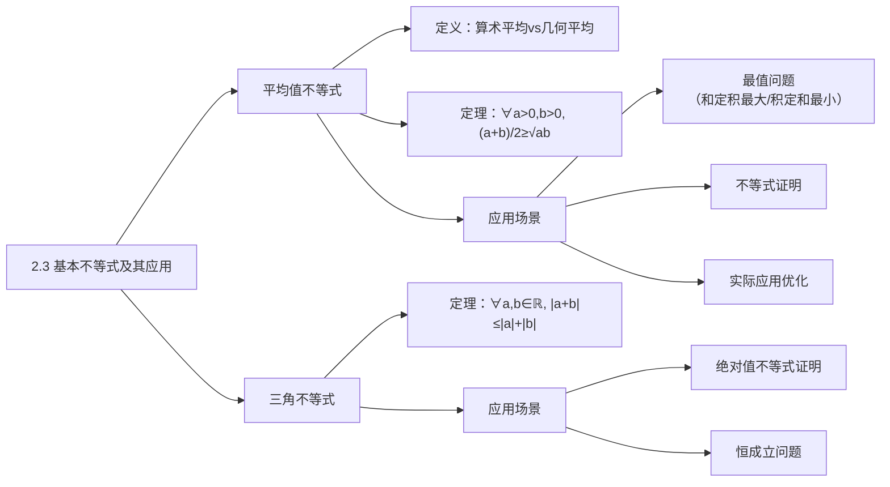
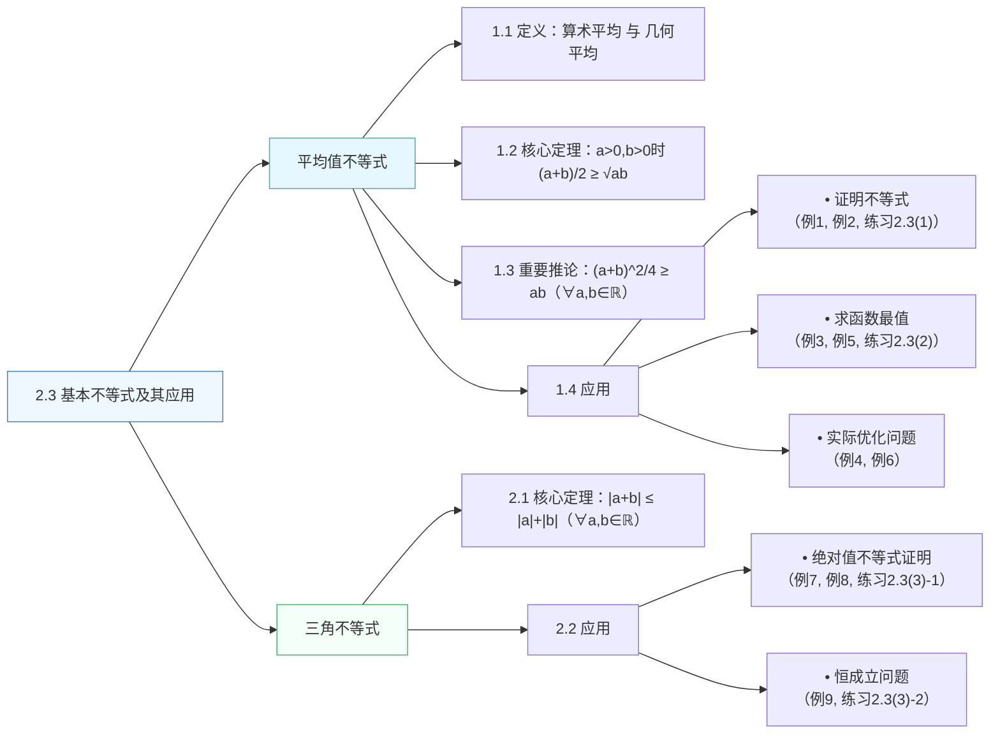

## 2.3 基本不等式及其应用

### 一 知识点总结

#### 1. 新知识点（按子小节分类）

**1.1 平均值不等式及其应用**  
- **定义**：  
  - 算术平均值：$\dfrac{a+b}{2}$（对同一个量两次测量的平均）  
  - 几何平均值：$\sqrt{ab}$（面积相同的正方形边长）  
- **定理**：  
  $\dfrac{a+b}{2} \geqslant \sqrt{ab}$（$a>0,\ b>0$），当且仅当 $a=b$ 时等号成立  
- **证明方法**：  
  $\dfrac{a+b}{2}-\sqrt{ab}=\dfrac{(\sqrt{a}-\sqrt{b})^2}{2} \geqslant 0$  
- **最值规律**：  
  - 积 $xy$ 为定值 → 和 $x+y$ 有最小值  
  - 和 $x+y$ 为定值 → 积 $xy$ 有最大值  
  - 最值在 $x=y$ 时取得  

**1.2 三角不等式**  
- **定理**：  
  $|a+b| \leqslant |a|+|b|$（$\forall a,b \in \mathbb{R}$），当且仅当 $ab \geqslant 0$ 时等号成立  
  
- **证明方法**：  
  $|a+b|^2 = a^2+2ab+b^2 \leqslant |a|^2 + 2|ab| + |b|^2 = (|a|+|b|)^2$  
  
- **推广形式**：  
  $|a|-|b| \leqslant |a-b|$，$|a+b|+|a-b| \geqslant 2|a|$ ，当且仅当 $(a-b)b \geqslant 0$ 时等号成立  
  $|a|-|b| \geqslant -|a-b|$，当且仅当 $(b-a)a \geqslant 0$ 时等号成立（$|a|+|b-a| \geqslant |b|$）

#### 2. 知识结构流程图

---

### 二 定理与例题分析

#### 1. 定理统计
| 序号 | 定理内容                                                                 | 涉及新知识点               | 涉及旧知识点                  | 旧知识点引入时间        |
|------|--------------------------------------------------------------------------|----------------------------|-------------------------------|------------------------|
| 1    | $\dfrac{a+b}{2} \geqslant \sqrt{ab}$ ($a>0,b>0$)                       | 平均值不等式               | 不等式性质、代数运算          | 初中/本章前两节        |
| 2    | $(\dfrac{a+b}{2})^2 \geqslant ab$ ($\forall a,b \in \mathbb{R}$)      | 平均值不等式变形           | 完全平方公式                  | 初中                  |
| 3    | $\vert a+b \vert \leqslant \vert a \vert + \vert b \vert$             | 三角不等式                 | 绝对值定义、不等式性质        | 初中/本章前两节       |

#### 2. 例题统计（共10题）
| 序号 | 题目简述                                                                 | 涉及新知识点             | 涉及旧知识点                  | 旧知识点引入时间        |
|------|--------------------------------------------------------------------------|--------------------------|-------------------------------|------------------------|
| 例1  | $x>0$，求证$x+\frac{1}{x} \geqslant 2$                                 | 平均值不等式应用         | 分式运算                      | 初中                  |
| 例2  | $ab>0$，求证$\frac{b}{a}+\frac{a}{b} \geqslant 2$                     | 平均值不等式应用         | 分式性质                      | 初中                  |
| 例3  | 求 $y=x(4-x)$ 最大值                                                   | 基本不等式求最值         | 二次函数性质                  | 初中                  |
| 例4  | $a+2b=1$，比较 $ab$ 与$\frac{1}{8}$大小                                | 定和求积最值             | 代数式变形                    | 初中                  |
| 例5(1)| 证周长一定的矩形中正方形面积最大                                       | 几何最值应用             | 矩形面积公式                  | 初中                  |
| 例5(2)| 证面积一定的矩形中正方形周长最小                                       | 几何最值应用             | 矩形周长公式                  | 初中                  |
| 例6  | 绿地设计使人行道面积最小                                               | 实际优化问题             | 代数式展开                    | 初中                  |
| 例7  | 证 $\vert a+b \vert + \vert a-b \vert \geqslant 2\vert a \vert$       | 三角不等式推广           | 绝对值性质                    | 初中/本章前两节       |
| 例8  | 证 $\vert a \vert - \vert b \vert \leqslant \vert a-b \vert$           | 三角不等式推论           | 不等式传递性                  | 初中/本章前两节       |
| 例9  | 证 $\vert x-3 \vert + \vert x-5 \vert \geqslant 2$恒成立               | 绝对值恒成立问题         | 一元二次不等式                | 初中/本章前两节       |

#### 3. 练习统计（共6题）
| 练习组   | 题号 | 题目简述                                                     | 涉及新知识点         | 涉及旧知识点          | 旧知识点引入时间 |
|----------|------|-------------------------------------------------------------|---------------------|----------------------|----------------|
| 2.3(1)   | 1    | $a>0$，证$a+1 \geqslant 2\sqrt{a}$                        | 平均值不等式应用     | 根式运算            | 初中          |
|          | 2    | $x<0$，证$x+\frac{1}{x} \leqslant -2$                     | 不等式方向变换       | 负号性质            | 初中          |
| 2.3(2)   | 1    | 铁丝长$l$的矩形框架最大面积                                 | 几何最值应用         | 周长与面积关系      | 初中          |
|          | 2    | 圆面积$\pi$的内接矩形最大面积                               | 几何最值应用         | 圆内接矩形性质      | 初中          |
| 2.3(3)   | 1    | 证$\vert a+b \vert + \vert a-b \vert \geqslant 2\vert b \vert$ | 三角不等式推广       | 绝对值性质          | 初中          |
|          | 2    | $\vert a \vert<\frac{1}{2}$，证$\vert a\pm b \vert<1$        | 绝对值不等式应用     | 不等式放缩          | 初中          |

#### 4. 练习与例题对应关系
| 练习       | 参考例题      | 理由说明                                      |
|------------|--------------|---------------------------------------------|
| 2.3(1)-1   | 例1          | 同类型不等式证明（单变量）                    |
| 2.3(1)-2   | 例1+例2      | 需结合负号处理的不等式方向变化                |
| 2.3(2)-1   | 例5(1)       | 完全相同的最值模型（周长定→面积最大）         |
| 2.3(2)-2   | 例5(1)       | 几何最值原理相同（圆内接矩形属特例）          |
| 2.3(3)-1   | 例7          | 同类型绝对值不等式证明（变量对称性）          |
| 2.3(3)-2   | 例8+例9      | 结合绝对值性质与不等式放缩的综合应用          |

---

### 三 定理与例题习题化

#### 定理（证明题）
1. **定理1**  
   已知 $a>0,\ b>0$，证明：$\dfrac{a+b}{2} \geqslant \sqrt{ab}$，并指出等号成立条件。

2. **定理2**  
   对任意实数 $a,b$，证明：$\left(\dfrac{a+b}{2}\right)^2 \geqslant ab$，并指出等号成立条件。

3. **定理3**  
   对任意实数 $a,b$，证明：$\vert a+b \vert \leqslant \vert a \vert + \vert b \vert$，并指出等号成立条件。

#### 例题（解答题）
1. **例1**  
   已知 $x>0$，求证：$x+\dfrac{1}{x} \geqslant 2$，并指出等号成立的条件。

2. **例2**  
   已知 $ab>0$，求证：$\dfrac{b}{a}+\dfrac{a}{b} \geqslant 2$，并指出等号成立的条件。

3. **例3**  
   求二次函数 $y=x(4-x)$ 的最大值。

4. **例4**  
   设 $a>0,\ b>0$，且 $a+2b=1$，试比较 $ab$ 与 $\dfrac{1}{8}$ 的大小关系。

5. **例5(1)**  
   证明：在周长为定值 $l$ 的所有矩形中，正方形的面积最大。

6. **例5(2)**  
   证明：在面积为定值 $S$ 的所有矩形中，正方形的周长最小。

7. **例6**  
   某小区欲建 $700\text{m}^2$ 矩形绿地，绿地南北两侧人行道宽 $3\text{m}$，东西两侧宽 $4\text{m}$。求使人行道占地最小时的绿地边长（精确到 $0.1\text{m}$）。

8. **例7**  
   对任意实数 $a,b$，证明：$\vert a+b \vert + \vert a-b \vert \geqslant 2\vert a \vert$。

9. **例8**  
   对任意实数 $a,b$，证明：$\vert a \vert - \vert b \vert \leqslant \vert a-b \vert$，并说明等号成立条件。

10. **例9**  
    证明：$\vert x-3 \vert + \vert x-5 \vert \geqslant 2$ 对所有实数 $x$ 成立，并求等号成立的 $x$ 范围。

---

### 四 知识结构流程图（A4打印优化版）

----

### 一、A组与B组习题知识点分析及难度评估（10分最难，1分最简单）

#### **A组习题**
| 题号 | 考查知识点                                                                 | 难度 | 对应教材例题/知识点来源                                                                 |
|------|----------------------------------------------------------------------------|------|---------------------------------------------------------------------------------------|
| 1    | 平均值不等式的变形（$a^2+b^2 \geq 2ab$、$\frac{b}{a}+\frac{a}{b} \geq 2$） | 2    | 例2（$\frac{b}{a}+\frac{a}{b} \geq 2$）、练习2.3(1)-1（$a+1 \geq 2\sqrt{a}$）       |
| 2    | 平均值不等式的综合排序（调和平均≤几何平均≤算术平均）                        | 5    | 例3（$x(4-x) \leq 4$）、例5（矩形周长与面积关系）                                   |
| 3    | 调和平均≤几何平均的证明（$\frac{2}{\frac{1}{a}+\frac{1}{b}} \leq \sqrt{ab}$） | 3    | 例1（$x+\frac{1}{x} \geq 2$）、例2（$\frac{b}{a}+\frac{a}{b} \geq 2$）              |
| 4    | 代数式变形与完全平方非负性（$a^2+2b^2+1 \geq 2b(a+1)$）                   | 4    | 例4（$ab \leq \frac{1}{8}$）、练习2.3(1)-2（$x+\frac{1}{x} \leq -2$）              |
| 5    | 二次函数最值（配方法或平均值不等式）                                        | 2    | 例3（$y=x(4-x)$的最大值）                                                           |
| 6    | 条件最值（直角三角形面积最大值，$a^2+b^2=100$时$ab$的最大值）            | 4    | 例4（$a+2b=1$时$ab$的最大值）、例5（周长定→面积最大）                              |
| 7    | 绝对值三角不等式的推广（$|a-b| \leq |a-c|+|c-b|$）                        | 5    | 例7（$|a+b|+|a-b| \geq 2|a|$）、例8（$|a|-|b| \leq |a-b|$）                      |
| 8    | 绝对值方程求解（分区间讨论）                                                | 6    | 例9（$|x-3|+|x-5| \geq 2$）、练习2.3(3)-1（$|a+b|+|a-b| \geq 2|b|$）              |

---

#### **B组习题**
| 题号 | 考查知识点                                                                 | 难度 | 对应教材例题/知识点来源                                                                 |
|------|----------------------------------------------------------------------------|------|---------------------------------------------------------------------------------------|
| 1    | 平均值不等式的多变量排序（$0<a<b$且$a+b=1$时$a, b, \frac{1}{2}, 2ab, a^2+b^2$的顺序） | 7    | 例5（矩形周长与面积关系）、A组2题（正数排序）                                         |
| 2    | 平均值不等式的变形（$\frac{a^2+2a+1}{a} = a+\frac{1}{a}+2 \geq 4$）        | 4    | 例1（$x+\frac{1}{x} \geq 2$）、例2（$\frac{b}{a}+\frac{a}{b} \geq 2$）              |
| 3    | 乘积形式的最值（$(a+b)(\frac{1}{a}+\frac{1}{b}) \geq 4$）                  | 5    | 例3（$x(4-x) \leq 4$）、例5（周长定→面积最大）                                       |
| 4    | 多次应用平均值不等式（$(a^2+1)(b^2+1) > 4ab$）                            | 6    | 例4（$ab \leq \frac{1}{8}$）、A组4题（代数式变形）                                   |
| 5    | 绝对值三角不等式的应用（$|x-y| < h$）                                     | 4    | 例7（$|a+b|+|a-b| \geq 2|a|$）、例8（$|a|-|b| \leq |a-b|$）                      |
| 6    | 曼哈顿距离的三角不等式（$d(A,B) \leq d(B,C)+d(C,A)$）                      | 6    | 例7（$|a+b|+|a-b| \geq 2|a|$）、例9（$|x-3|+|x-5| \geq 2$）                      |
| 7    | 绝对值三角不等式的推广（$|a+b+c| \leq |a|+|b|+|c|$）                      | 3    | 例7（$|a+b|+|a-b| \geq 2|a|$）、例8（$|a|-|b| \leq |a-b|$）                      |
| 8    | 绝对值不等式的最值分析（$|x+2|-|x-1| \geq -3$）                           | 7    | 例8（$|a|-|b| \leq |a-b|$）、例9（$|x-3|+|x-5| \geq 2$）、A组8题（绝对值方程）     |

---

### 二、2.3节对应例题总结
教材2.3节提供了以下核心例题，与习题直接对应：
- **平均值不等式应用**：例1（$x+\frac{1}{x} \geq 2$）、例2（$\frac{b}{a}+\frac{a}{b} \geq 2$）、例3（二次函数最值）、例4（条件最值$ab \leq \frac{1}{8}$）、例5（矩形周长与面积最值）。
- **三角不等式应用**：例7（$|a+b|+|a-b| \geq 2|a|$）、例8（$|a|-|b| \leq |a-b|$）、例9（$|x-3|+|x-5| \geq 2$）。
- **练习2.3(1)-3**：$(x-1)(5-x)$的最大值（对应A组5题）。
- **练习2.3(3)-1**：$|a+b|+|a-b| \geq 2|b|$（对应B组6题）。

---

### 总结
- **低难度（1-3分）**：A组1、3、5题；B组7题（基础不等式直接应用）。
- **中等难度（4-6分）**：A组2、4、6、7题；B组2、3、5、6题（需结合变形或多步推导）。
- **高难度（7-10分）**：A组8题；B组1、4、8题（需综合应用或分情况讨论）。