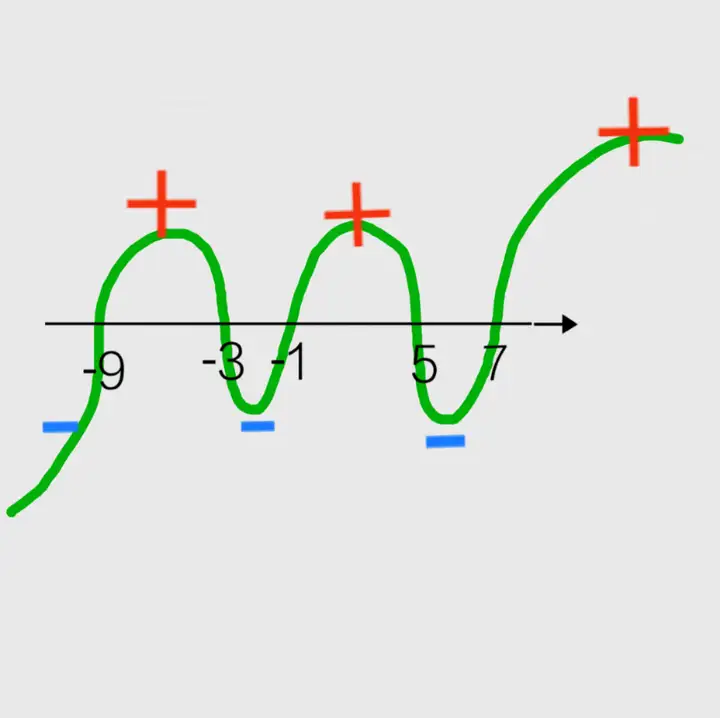
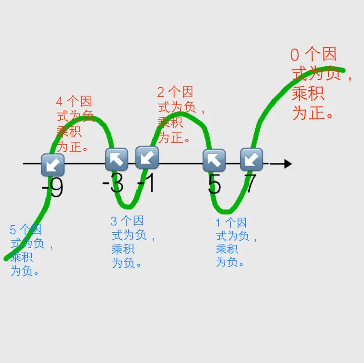

# 穿针引线法（根轴法）解一元高次不等式的原理是什么？

我们先来看这个一元二次不等式：$ (x-1)(x+3)<0 $ 。  

对于刚刚学过一元一次不等式组的初中生，最先想到的思路可能是根据有理数（或实数）乘法「**同号得正，异号得负**」的符号法则，将原不等式转化为两个一元一次不等式组，然后取两个不等式组解集的并集。其具体过程如下：  

> [!NOTE]
>
> 【解】原一元二次不等式可以化为两个一元一次不等式组  
>
> ①$ \begin{cases}x-1<0,\\x+3>0;\end{cases} $ ②$ \begin{cases}x-1>0,\\x+3<0.\end{cases} $  
>
> 解不等式组 ①，得$ -3<x<1 $ ；  
>
> 解不等式组 ②，得 解集为空集。  
>
> 综上，原不等式的解集为$\{x|-3<x<1\}$ 。  
>

然而，只要我们仔细地思考一下，就会发现这种方法其实有两个显著的缺点。  

(1) 对于次数较低的整式不等式，将其转化为多若干个一元一次不等式组尚有可操作性。反之，如果不等式的次数非常高，如果依然利用这样的方法解不等式，则计算量将会变得异常庞大。  

**以一元五次不等式 $(x+1)(x+3)(x-5)(x-7)(x+9)>0$ 为例**。  

如果我们依然利用这种方法转化为若干个一元一次不等式组，则需要解 $ C_{5}^{0}+C_{5}^{2}+C_{5}^{4}=16$ (个) [或者 $ 2^{5}\div 2=16$  (个)]不等式组，分别为：  

$$
\left\{\begin{array}{l}
x+1>0,\\
x+3>0,\\
x-5>0,\\
x-7>0,\\
x+9>0;
\end{array}\right.
\quad
\begin{cases}
x+1<0,\\
x+3<0,\\
x-5>0,\\
x-7>0,\\
x+9>0;
\end{cases}
\quad
\left\{\begin{array}{l}
x+1<0,\\
x+3>0,\\
x-5<0,\\
x-7>0,\\
x+9>0;
\end{array}\right.
\quad
\left\{\begin{array}{l}
x+1<0,\\
x+3>0,\\
x-5>0,\\
x-7<0,\\
x+9>0;
\end{array}\right.
$$

$$
\left\{\begin{array}{l}
x+1<0,\\
x+3<0,\\
x-5<0,\\
x-7>0,\\
x+9>0;
\end{array}\right.
\quad
\begin{cases}
x+1>0,\\
x+3<0,\\
x-5>0,\\
x-7<0,\\
x+9>0;
\end{cases}
\quad
\left\{\begin{array}{l}
x+1>0,\\
x+3<0,\\
x-5>0,\\
x-7>0,\\
x+9<0;
\end{array}\right.
\quad
\left\{\begin{array}{l}
x+1>0,\\
x+3>0,\\
x-5<0,\\
x-7<0,\\
x+9<0;
\end{array}\right.
$$

$$
\left\{\begin{array}{l}
x+1>0,\\
x+3>0,\\
x-5>0,\\
x-7<0,\\
x+9<0;
\end{array}\right.
\quad
\left\{\begin{array}{l}
x+1<0,\\
x+3<0,\\
x-5<0,\\
x-7<0,\\
x+9>0;
\end{array}\right.
\quad
\left\{\begin{array}{l}
x+1<0,\\
x+3<0,\\
x-5<0,\\
x-7>0,\\
x+9<0;
\end{array}\right.
\quad
\left\{\begin{array}{l}
x+1<0,\\
x+3>0,\\
x-5<0,\\
x-7<0,\\
x+9<0;
\end{array}\right.
$$

$$
\left\{\begin{array}{l}
x+1>0,\\
x+3<0,\\
x-5<0,\\
x-7<0,\\
x+9<0;
\end{array}\right.
\quad
\left\{\begin{array}{l}
x+1>0,\\
x+3<0,\\
x-5>0,\\
x-7>0,\\
x+9>0;
\end{array}\right.
\quad
\left\{\begin{array}{l}
x+1>0,\\
x+3>0,\\
x-5<0,\\
x-7<0,\\
x+9>0;
\end{array}\right.
\quad
\left\{\begin{array}{l}
x+1<0,\\
x+3>0,\\
x-5>0,\\
x-7>0,\\
x+9<0;
\end{array}\right.
$$

由此可见，随着整式不等式的次数 $n$ 逐渐增加，则需要转化的一元一次不等式组的数量 $ 2^{n}/2 $ 也呈指数增长。无论是解数学题，还是在实际应用中，如果但凡遇见乘积型整式不等式都利用该方法加以求解，其实是一种很不现实、很不经济的解法。  

(2)一次函数 $ y=ax+b $ 在全体实数范围内都有意义，且为**全局单调函数**。其中，当一次项系数 $ a>0 $时，为**全局增函数**；当一次项系数 $ a<0 $ 时，为**全局减函数**。  

这意味着，当 $ a>0  $ 时，如果当自变量 $x$ 的取值大于这个一次函数的零点（其定义为当函数值 $ y=0 $ 时，自变量 $x$ 的值），其函数值y一定为正。反之，当自变量x的取值小于这个一次函数的零点时，其函数值y一定为负。  

以本答案最开始引入的不等式 $ (x-3)(x+1)<0 $ 为例。  

一次函数 $ y=x-3 $ 的零点为 $ x=3 $。当 $ x>3 $ 时，函数值 $y$ 为正；当 $ x<3 $ 时，函数值 $y$为负。  

一次函数 $ y=x+1 $ 的零点为 $ x=-1 $。当 $ x>-1 $ 时，函数值 $y$ 为正；当 $ x< -1 $ 时，函数值 $y$ 为负。  

于是，当自变量 $x$ 的取值介于两个一次函数的零点之间（即 $ -1 < x < 3 $ ）时，则零点较大的一次函数 $ y = x - 3 $ 的函数值已经为负，而零点较小的一次函数 $ y = x + 1 $ 的函数值依然为正。而当自变量 $x$ 的取值大于二者最大的零点（即 $ x > 3 $ ）时，二者的函数值 $y$ 都为正；当自变量 $x$ 的取值小于二者最小的零点（即 $ x < -1 $ ）时，二者的函数值y都为负。  

由此可见，当自变量 $x$ 取任何实数，都不可能使 $ y = x + 1 $ 的函数值为负，且 $ y = x - 3 $ 的函数值为正。这意味着，上述的不等式组 ② 其实纯属冗余。  

**那么问题来了，我们有什么更简洁的方法来避开以上两种缺点呢**？  

其实，上述讨论已经透露了这种全新方法的基本思想。  

由一次函数的全局单调性可知，对于若干个关于 $x$ 的实系数一次多项式，只要一次项系数为正，则当 $x$ 的取值大于它们当中最大的根时，则每个一次多项式的值都为正，其乘积必为正。接下来，$x$ 的取值从大到小，每经过一个根，就会有一个多项式或多个相同的多项式由正变为负。依次类推，直到当 $x$ 的取值小于它们当中最小的根时，其所有因式都为负。  

然后，利用「偶数个负数相乘得正，奇数个负数相乘得负」，可知当 $x$在每段由相邻的根为端点的取值区间内，乘积的正负性（的讨论），可得原不等式的解集。  

特别地，对于 $n$ 个一次实系数多项式的乘积，  

·   若有偶数个一次因式为负，则乘积为正，其相应的取值区间对应「＞0」型不等式的解集；  

·   若有奇数个一次因式为负，则乘积为负，则其相应的取值区间对应「＜0」型不等式的解集。  

我们以前面提到的不等式 $(x+1)(x+3)(x-5)(x-7)(x+9)＞0$ 为例。  

> [!TIP]
>
> 【解】易知，函数y=(x+1)(x+3)(x-5)(x-7)(x+9)的零点为-1、-3、5、7、-9。  
>
> 由于这个函数的形式为5个一次实系数因式的乘积，共5个零点，以它们为端点，可将定义域R划分为6个区间。然后，利用「偶数个负数相乘得正，奇数个负数相乘得负」，可知当x在其中的任意区间内，其乘积的正负性： 
>
> | x的取值范围 | x-7  | x-5  | x+1  | x+3  | x+9  | 乘积 | 备注        |
> | ----------- | ---- | ---- | ---- | ---- | ---- | ---- | ----------- |
> | x>7         | 正   | 正   | 正   | 正   | 正   | 正   | 0个因式为负 |
> | x=7         | 0    | 正   | 正   | 正   | 正   | 0    |             |
> | 5<x<7       | 负   | 正   | 正   | 正   | 正   | 负   | 1个因式为负 |
> | x=5         | 负   | 0    | 正   | 正   | 正   | 0    |             |
> | -1<x<5      | 负   | 负   | 正   | 正   | 正   | 正   | 2个因式为负 |
> | x=-1        | 负   | 负   | 0    | 正   | 正   | 0    |             |
> | -3<x<-1     | 负   | 负   | 负   | 正   | 正   | 负   | 3个因式为负 |
> | x=-3        | 负   | 负   | 负   | 0    | 正   | 0    |             |
> | -9<x<-3     | 负   | 负   | 负   | 负   | 正   | 正   | 4个因式为负 |
> | x=-9        | 负   | 负   | 负   | 负   | 0    | 0    |             |
> | x<-9        | 负   | 负   | 负   | 负   | 负   | 负   | 5个因式为负 |
>
> 由上述表格可知，当 $x>7$，或 $-1<x<5$，或 $-9<x<-3$ 时，5 个因式的乘积为正，即函数值$y>0$。于是，原不等式的解集为 
>
> $$
> \left\{x|-9<x<-3\space\text{或} \space -1<x<5 \space \text {或} \space x>7\right\}
> $$

由此可见，满足该不等式的取值范围其实只有3段连续的区间，对应3种不同的各个因式的正负性情况。换言之，由第一种方法转化出的16个不等式组，有13个其实是冗余的「空集不等式组」，在实数范围内没有任何对应。对于这些解集为空集的不等式组，只要方法得当，则完全可以避免。  

尽管利用列表法对原不等式中的每一个因式的正负性进行分类讨论，其计算量要比转化为多个一元一次不等式组的并集要小得多，然而书写起来，在形式上依旧比较繁琐。  

为了更快、更方便地解不等式，考虑对上述表格再进行一次改良。  

我们不妨先画一条数轴，然后在数轴标上所有的零点 $ x_{1} $，$ x_{2} $，$ x_{3} $，…，$ x_{n} $（$ x_{1,2,3,\ldots,n}\in\mathbb{R} $）。接下来，找到比最大的零点还要大的区间（也就是最右端的区间），从上方开始起笔，向左画一条连续、光滑的曲线。每经过一个零点，就从数轴的一侧穿到另一侧，依此类推，一直画到比最小的零点还要小的区间（也就是最左端的区间）。我们通常将这种解不等式的方法称为**「（数轴）穿根法」**。它是求解任意个一次多项式的乘积形式的不等式最常见的方法，其本质就是上述零点分段表格的浓缩版。  

下面我们再来利用穿根法求解前面提到的不等式$ (x+1)(x+3)(x-5)(x-7)(x+9)>0 $，体会利用穿根法解不等式到底有多快、多方便。  

> [!TIP]
>
> 【解】易知，函数 $ y=(x+1)(x+3)(x-5)(x-7)(x+9) $ 的零点为 -1、-3、5、7、-9。  
>
> 由于这个函数的形式为 5 个一次实系数因式的乘积，共 5 个零点、5 个根，以它们为端点，可将定义域 $ \mathbb{R} $ 划分为 **6** 个区间。然后，利用穿根法，可知当 $x$ 在其中的任意区间内，其乘积的正负性：
>
> 
>
> |  |  |
> | :--------------------------------------------------: | :--------------------------------------------------: |
>
>
> 于是，原不等式的解集为：
> $$
> \left\{x|-9<x<-3\space\text{或} \space -1<x<5 \space \text {或} \space x>7\right\}
> $$

## 问题

1. **大于等于** 0 怎么办？$(x+1)(x+3)(x-5)(x-7)(x+9) \geqslant 0$
2. 有平方或者立方会如何，或者更加通用的 $k$ 次方？ $(x+1)^2(x+3)^3(x-5)^k(x-7)(x+9) > 0$
3. 在分母中怎么办？$\frac{(x+1)(x+3)(x-5)(x-7)}{(x+9)^2} \geqslant 0$