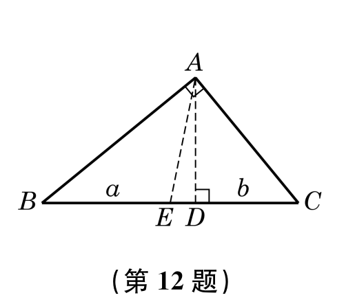
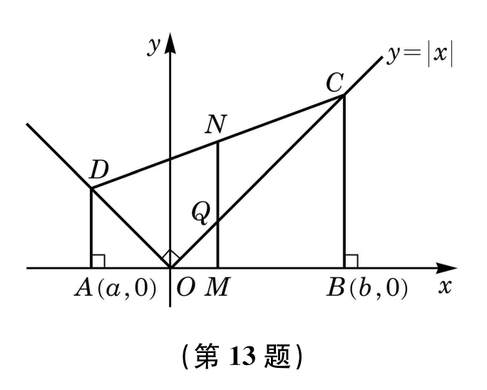

## 20250822 沪教版第二章 复习题 A 组

1. 设一元二次方程 $2x^{2}-6x-3=0$ 的两个实根为 $x_{1}$, $x_{2}$，求下列各式的值：
   (1) $(x_{1}+1)(x_{2}+1)$；  
   (2) $(x_{1}^{2}-1)(x_{2}^{2}-1)$。

2. 设 $a>b>0$，比较 $\frac{b+2a}{a+2b}$ 与 $\frac{a}{b}$ 的值的大小。

5. 解下列一元二次不等式：
   (1) $-x^{2}+11<-2x-4$；  
   (2) $3x^{2}<13x+10$；  
   (3) $6x+2\geqslant 5x^{2}$；  
   (4) $x^{2}\leqslant 8(1-x)$；  
   (5) $-x^{2}\geqslant 9(9-2x)$；  
   (6) $3(x-3)\leqslant x^{2}$。

3. 已知 $x>y$，求证：$x^{3}-y^{3}>x^{2} y-x y^{2}$。

4. 若关于 $x$ 的不等式 $(a+1)x-a<0$ 的解集为 $(2,+\infty)$，求实数 $a$ 的值，并求不等式 $(a-1)x+3-a>0$ 的解集。

6. 试写出一个二次项系数为 $1$ 的一元二次不等式，使它的解集分别为：
   (1) $(-\infty,\sqrt{2})\cup(\sqrt{2},+\infty)$；  
   (2) $[2-\sqrt{3}, 2+\sqrt{3}]$。

8. 解下列分式不等式：
   (1) $\frac{2x+1}{x+7}>-3$；  
   (2) $\frac{3x}{x^{2}+2}\geqslant 1$。

7. 求不等式 $5\leqslant x^{2}-2x+2<26$ 的所有**正整数解**。

9. 设关于$x$的不等式 $a_{1}x^{2}+b_{1}x+c_{1}>0$ 与 $a_{2}x^{2}+b_{2}x+c_{2}>0$ 的解集分别为 $A$, $B$，试用集合运算表示下列不等式组的解集：
   (1) $\left\{\begin{matrix}a_{1}x^{2}+b_{1}x+c_{1}>0,\\a_{2}x^{2}+b_{2}x+c_{2}>0;\end{matrix}\right.$ 
   (2) $\left\{\begin{matrix}a_{1}x^{2}+b_{1}x+c_{1}\leqslant 0,\\a_{2}x^{2}+b_{2}x+c_{2}>0;\end{matrix}\right.$ 
   (3) $\left\{\begin{matrix}a_{1}x^{2}+b_{1}x+c_{1}\leqslant 0,\\a_{2}x^{2}+b_{2}x+c_{2}\leqslant 0.\end{matrix}\right.$

10. 解下列含绝对值的不等式：
    (1) $|2x-1|\leqslant x$；  
    (2) $|2x+1|+|x-2|<8$。

11. 已知 $a$, $b$ 是正数，求证：$\sqrt{(1+a)(1+b)}\geqslant 1+\sqrt{ab}$。

12. 如图，在直角三角形 $ABC$ 中，$AD$ 垂直于斜边 $BC$，且垂足为 $D$。设 $BD$ 及 $CD$ 的长度分别为 $a$ 与 $b$：

| (1) 求斜边上的高 $AD$ 与中线 $AE$ 的长；   (2) 用不等式表示斜边上的高 $AD$ 与中线 $AE$ 长度的大小关系。 |  |
| ------------------------------------------------------------ | ------------------------------------------------------------ |

13. 如图，已知直角梯形 $ABCD$ 的顶点 $A(a,0)$, $B(b,0)$ 位于 $x$ 轴上，顶点 $C$, $D$ 落在函数 $y=|x|$ 的图像上，$M$, $N$ 分别为线段 $AB$, $CD$ 的中点，$O$为坐标原点，$Q$ 为线段 $OC$ 与线段 $MN$ 的交点：

| (1) 求中点 $M$ 的坐标，以及线段 $MQ$, $MN$ 的长度；   (2) 用不等式表示 $MQ$, $MN$ 长度的大小关系。 |  |
| ------------------------------------------------------------ | ------------------------------------------------------------ |

