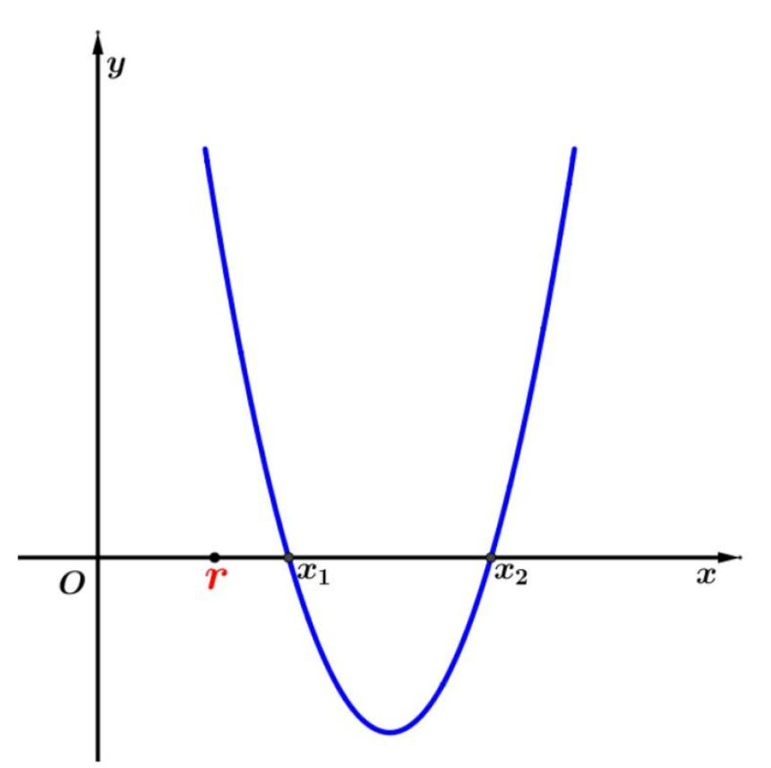

# 20250818
## 5天分式化简专项训练
> 要计时

### Day 2：分式乘除与约分  
**核心：因式分解、约分规范、符号处理**  
1. 化简：$\dfrac{x^2-9}{x^2-6x+9} \div \dfrac{x+3}{x-3}$  
2. 计算：$\left( \dfrac{x}{y} - \dfrac{y}{x} \right) \div \dfrac{x^2-y^2}{xy}$  
3. 化简：$\dfrac{x^2 - y^2}{(x-y)^2} \times \dfrac{x-y}{x+y}$  
4. 计算：$\dfrac{4x}{x^2-16} \cdot \dfrac{x-4}{2x}$  
5. 化简：$\dfrac{a^2 - 9b^2}{9b^2 - a^2} + \dfrac{a}{3b}$  

## 沪教版 2.1 习题
### A组
1. 设 $ a\in R $ ，求关于 $x$ 的方程 $ ax=2 $ 的解集.

2. 设 $ k\in R $ ，求关于 $x$ 与 $y$ 的二元一次方程组 $ \begin{cases}y=-2x+1,\\y=kx-3\end{cases} $ 的解集.

3. 设 $ a\in R $ ，求一元二次方程 $ x^{2}-2ax+a^{2}-4=0 $ 的解集.

4. 已知等式  $ 2x^{2}+3x+5=a(2x+1)(x+1)+c  $ 恒成立，求常数 $ a$, $c $ 的值.

5. 已知一元二次方程 $ ax^{2}+bx+c=0(a\neq0) $ 的两实根为  $ x_{1} $ ,  $ x_{2} $ ，求证： $ \left|x_{2}-x_{1}\right|=\frac{\sqrt{b^{2}-4ac}}{\left|a\right|} $ .

6. 已知一元二次方程  $ x^{2}+3x-3=0  $ 的两个实根分别为  $ x_{1} $ ,  $ x_{2} $ ，求作二次项系数是 1，且分别以下列数值为根的一元二次方程：
   (1)  $ -x_{1} $ ，$-x_{2} $ ；
   (2)  $ 2x_{1}+1 $ ，$2x_{2}+1 $ ；
   (3)  $ \frac{1}{x_{1}} $ ，$\frac{1}{x_{2}} $ ；
   (4)  $ x_{1}^{2} $ ，$x_{2}^{2} $ .

7. 设$a$, $b$, $c$, $d$为实数，判断下列命题的真假：
   (1) 若 $ a>b\ge0 $ ，则 $ a^{2}>b^{2} $ ；
   (2) 若 $ \sqrt{a}>\sqrt{b} $ ，则 $ a>b $ ；
   (3) 若 $ a>b>0 $ ， $ c>d>0 $ ，则 $ \frac{a}{c}>\frac{b}{d} $ ；
   (4) 若 $ \frac{b}{a}>0 $ ，则 $ ab>0 $ ；
   (5) 若 $ a>b>0 $ ，则 $ a^{2}>ab>b^{2} $ ；
   (6) 若 $ \sqrt{a}>b $ ，则 $ a>b^{2} $ .

8. （选择题）
(1) 如果  $ a^{2}>b^{2} $ ，那么下列不等式中成立的是  (   )
A. $ a>0>b $ ；B. $ a>b>0 $ ；  C. $ |a|>|b| $ ；  D. $ a>|b| $ .

(2) 如果  $ a<b<0 $ ，那么下列不等式中成立的是  (   )
A. $ \frac{a}{b}<1 $ ；B. $ a^{2}>ab $ ；C. $ \frac{1}{b^{2}}<\frac{1}{a^{2}} $ ；D. $ \frac{1}{a}<\frac{1}{b} $ .

(3) 如果  $ a<0<b $ ，那么下列不等式中成立的是  (   )
A. $ \sqrt{-a}<\sqrt{b} $ ；B. $ a^{2}<b^{2} $ ；C. $ a^{3}<b^{3} $ ；D. $ ab>b^{2} $ .

9. 证明：“ $ a>0 $ 且 $ b>0 $ ”是“ $ a+b>0 $ 且  $ ab>0 $ ”的充要条件.

 

10. 设$x$是实数，比较  $ (x+1)(x^{2}-x+1)  $ 与  $ (x-1)(x^{2}+x+1)  $ 的值的大小.

11. 试比较下列各数的大小，并说明理由：
    (1)  $ 3+\sqrt{3} $ 与 $ 2+\sqrt{5} $ ;
    (2)  $ \sqrt{3}+\sqrt{5} $ 与 $ \sqrt{2}+\sqrt{6} $ .

12. 设 $a$, $b $ 为实数，比较  $a^{2}+b^{2}  $ 与  $ 2a-2b-2 $ 的值的大小.

13. 已知 $a>b$，$c>d$，求证： $ac+bd>ad+bc$ .

14. 已知 $ a\ge-1$，求证： $ a^{3}+1\geq a^{2}+a $ .

15. 已知 $ a$, $b $ 为任意给定的正数，求证： $ a^{3}+b^{3}\geq ab^{2}+ba^{2} $ ，并指出等号成立的条件.

### B组

1. 设 $ a $ 为实数，求关于$x$的方程  $ 2x+a^{2}=ax+4  $ 的解集.

2. 设 $m$ 为实数，求关于$x$的方程 $ (m+1)x^{2}+6mx+9m=1 $ 的解集.

3. 已知等式 $ 2x^{2}-3x-1=a(x-1)^{2}+b(x-1)+c $ 恒成立，其中 $a$, $b$, $c$ 为常数，求 $ a-b+c $ 的值.

4. 对一元二次方程 $ ax^{2}+bx+c=0 \space (a\neq0) $ ，证明：$ac<0$ 是该方程**有两个异号实根**的充要条件.
   > [!TIP]
   >
   > 此题根据韦达定理即可证明，比较简单。但它和第 8 题一样涉及一元二次函数根的分布，要记住此题的结论。

5. 已知一元二次方程 $ 2x^{2}+x-3=0 $ 的两个实根分别为 $ x_{1} $ ,  $ x_{2} $ ，求作二次项系数是1，且分别以下列数值为根的一元二次方程：
   (1) $ x_{1}+x_{2} $ ，$x_{1}x_{2} $ ；
   (2) $ 2x_{1}^{2}+1 $ ，$2x_{2}^{2}+1 $ ；
   (3) $ \frac{x_{2}}{x_{1}} $ ，$\frac{x_{1}}{x_{2}} $ ；
   (4) $ x_{1}^{4} $ ，$x_{2}^{4} $ .

6. 已知一元二次方程 $ x^{2}-2mx+m-1=0 $ 的两实根为 $ x_{1} $ ,  $ x_{2} $ ，且 $ x_{1}^{2}+x_{2}^{2}=4 $ ，求实数 $m$ 的值.

7. 已知实数 $a$, $b$, $c$ 满足 $ a+b+c=0 $ ，且 $ a>b>c $ ，求证： $ a>0 $ 且 $ c<0 $ .

8. 设 $ s=a+b $ ， $ p=ab \space (a,b\in R) $ ，写出 $ a>1 $ 且 $ b>1 $ 用 $s$, $p$ 表示的一个充要条件，并证明.
   > [!TIP]
   >
   > 此题较难，考的是一元二次函数根的分布，比第 4 题更通用，背景如下，对于一元二次方程 $ax^2+bx+c=0, a \neq 0$ 有两实数根 $x_1, x_2$，不失一般性假设 $x_1 \leq x_2$，令 $ s=x_1+x_2，p=x_1 x_2 $，则一元二次方程可以改写为 $x^2-sx+p = 0$，如下图：
   >
   > 
   >
   > 此题意思是，**当且仅当 $s$ 和 $p$ 满足什么条件时，$r < x_1 \leq x_2$**。基于一元二次函数根和系数的关系，主要从以下三个方面考虑根的分布：
   >
   > - ① 判别式 $\Delta =s^2-4p \geq 0$ 
   > - ② 特殊点 $f(r) =r^2 -sr+p > 0 \Rightarrow p > -r^2 + sr$
   > - ③  \_\_\_\_\_\_\_\_。
   >
   > 现在改成如下的填空题：
   >
   > 1. 实际上如果 $x_1 \leq x_2 < r$，上述的 ① 和 ② 也满足，所以应该还有一个和 $s$ 或  $p$ 相关的第 ③ 点，请列出改条件

9. 原有酒精溶液 $a$ (单位:g)，其中含有酒精 $b$ (单位:g)，其酒精浓度为 $ \frac{b}{a} $ 。为增加酒精浓度，在原溶液中加入酒精 $x$ (单位:g)，新溶液的浓度变为 $ \frac{b+x}{a+x} $ 。根据这一事实，可提炼出如下关于不等式的命题：若 $ a>b>0 $ ， $ x>0 $ ，则 $ \frac{b}{a}<\frac{b+x}{a+x}<1 $ 。试加以证明.