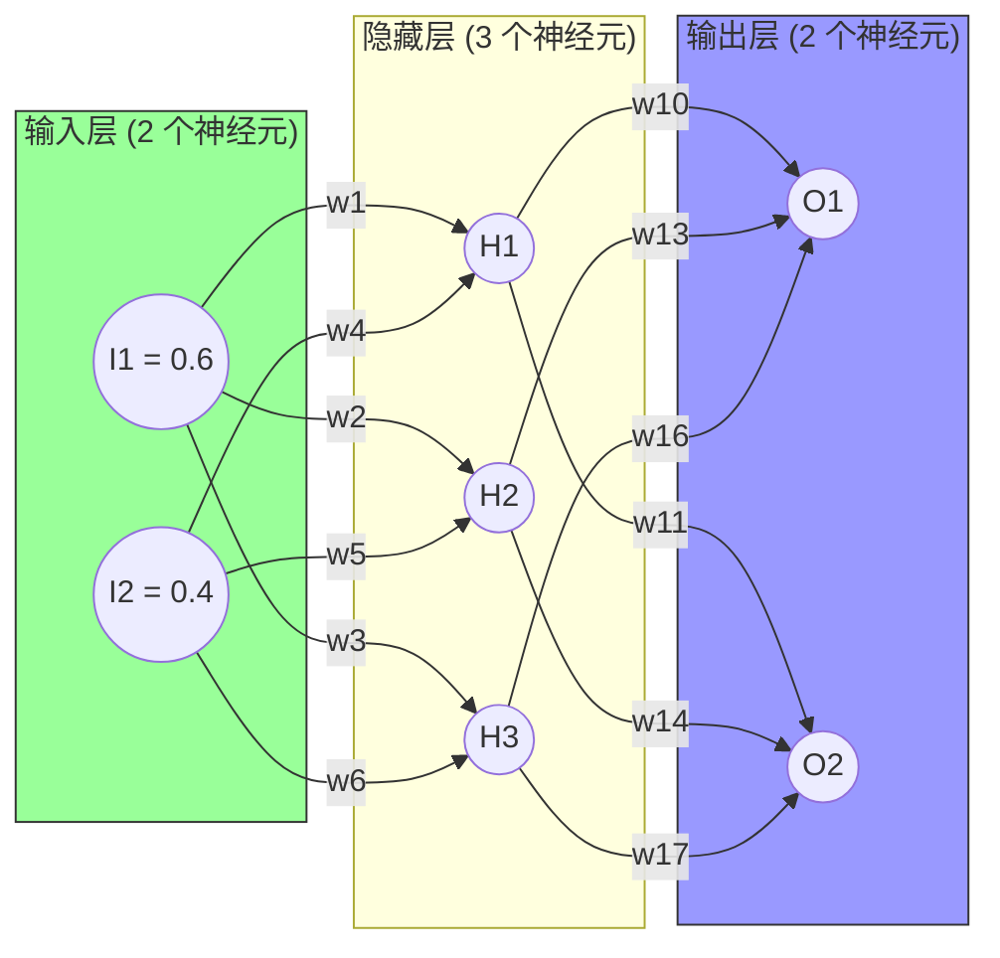

# 2 [反向传播算法工作原理](http://neuralnetworksanddeeplearning.com/chap2.html)

第 1 章介绍了神经网络如何使用梯度下降算法来学习权重和偏置，但其中存在一个问题：没有讨论如何计算代价函数的梯度。本章会讲解计算这些梯度的快速算法——反向传播算法。

反向传播算法诞生于 20 世纪 70 年代，但直到 David Rumelhart、Geoffrey Hinton 和 Ronald Williams 于 1986 年发表了一篇著名的论文^1^，人们才意识到其重要性。这篇论文阐述了对于一些神经网络，反向传播算法比传统方法更快，这使得之前无法解决的问题可以诉诸神经网络。如今，反向传播算法已经成为神经网络学习的重要组成部分。

> 1. http://www.nature.com/nature/journal/v323/n6088/pdf/323533a0.pdf

本章比其他章包含更多数学内容。如果你对数学不是特别感兴趣，可以跳过本章，将反向传播当成一个黑盒，忽略其中的细节。既然如此，为何要研究这些细节呢？

答案是为了加强理解。反向传播的核心是对代价函数 $C$ 关于任何权重 $w$（或者偏置 $b$）的偏导数 $\partial C / \partial w$ 的表达式。该表达式用于计算改变权重和偏置时代价变化的快慢。尽管表达式有点复杂，但有其内在逻辑——每个元素都很直观。因此，反向传播不仅仅是一种快速的学习算法，实际上它还告诉我们如何通过改变权重和偏置来改变整个神经网络的行为，这也是学习反向传播细节的价值所在。

如前所述，你既可以阅读本章，也可以直接跳到下一章。即使把反向传播看作黑盒，也可以掌握书中的其余内容。当然，后文会涉及本章的结论。不过，对于这些知识点，即使你不了解推导细节，也应该能理解主要结论。

### 2.1 [热身：使用矩阵快速计算输出](http://neuralnetworksanddeeplearning.com/chap2.html#warm_up_a_fast_matrix-based_approach_to_computing_the_output_from_a_neural_network)

讨论反向传播前，首先介绍一下如何通过基于矩阵的算法来计算神经网络的输出。实际上，[1.6 节提到了这个算法](http://neuralnetworksanddeeplearning.com/chap1.html#implementing_our_network_to_classify_digits)，但未讨论细节，下面详述。这样做有助于你在熟悉的场景中理解反向传播中使用的矩阵表示。

首先给出神经网络中权重的清晰定义。$w^l_{jk}$ 表示第 $(l-1)^{\rm th}$ 层的第 $k^{\rm th}$ 个神经元到第 $l^{\rm th}$ 层第 $j^{\rm th}$ 个神经元的连接的权重。图 2-1 给出了神经网络中第 2 层的第 4 个神经元到第 3 层的第 2 个神经元的连接的权重。


这样的表示粗看上去比较奇怪，需要花一点时间消化。稍后你会发现这种表示方便且自然。下标 $j$ 和 $k$ 的顺序可能会引起困惑，有人觉得反过来更合理。下面介绍这样做的原因。

神经网络的偏置和激活值也使用类似的表示，用 $b^l_j$ 表示第 $l^{\rm th}$ 层第 $j^{\rm th}$ 个神经元的偏置，用 $a^l_j$ 表示第 $l^{\rm th}$ 层第 $j^{\rm th}$ 个神经元的激活值。图 2-2 清楚地展示了这种表示的含义：


有了这些表示，第 $l^{\rm th}$ 层第 $j^{\rm th}$ 个神经元的激活值 $a^l_j$  就和第 $(l-1)^{\rm th}$ 层的激活值通过方程关联起来了（对比方程(4)和第 1 章的讨论）

$$
\begin{eqnarray} 
  a^{l}_j = \sigma\left( \sum_k w^{l}_{jk} a^{l-1}_k + b^l_j \right),
\tag{23}\end{eqnarray}
$$

其中求和是对第 $(l-1)^{\rm th}$ 层的所有 $k$ 个神经元进行的。为了以矩阵的形式重写该表达式，我们对层 $l$ 定义一个权重矩阵 $w^l$，$w^l$ 的元素正是连接到第 $l$ 层神经元的权重，更确切地说，第 $j$ 行第 $k$ 列的元素是 $w^l_{jk}$。类似地，对层 $l$ 定义一个偏置向量 $b^l$。由此可推导出偏置向量的分量其实就是前面给出的 $b^l_j$，每个元素对应第 $l^{\rm th}$ 层的每个神经元。然后定义激活向量 $a^l$，其分量是激活值 $a^l_j$。

最后需要引入向量化函数（比如 $\sigma$）来按照矩阵形式重写方程(23)。第 1 章提到过向量化，其含义就是对向量 $v$ 中的每个元素应用函数（比如 $\sigma$）。我们使用 $\sigma(v)$ 来表示按元素应用函数。所以，$\sigma(v)$ 的每个元素满足 $\sigma(v)_j = \sigma(v_j)$。如果函数是 $f(x) = x^2$，那么向量化的 $f$ 作用如下：
$$
\begin{eqnarray}
  f\left(\left[ \begin{array}{c} 2 \\ 3 \end{array} \right] \right)
  = \left[ \begin{array}{c} f(2) \\ f(3) \end{array} \right]
  = \left[ \begin{array}{c} 4 \\ 9 \end{array} \right],
\tag{24}\end{eqnarray}
$$

也就是说，向量化的 $f$ 仅对向量的每个元素进行平方运算。

有了这些表示，方程(23)就可以写成简洁的向量形式了，如下所示：

$$
\begin{eqnarray} 
  a^{l} = \sigma(w^l a^{l-1}+b^l).
\tag{25}\end{eqnarray}
$$

该表达式让我们能够以全局视角考虑每层的激活值和前一层激活值的关联方式：我们仅仅把权重矩阵应用于激活值，然后加上一个偏置向量，最后应用 $\sigma$ 函数*。这种全局视角比神经元层面的视角更简洁（没有用索引下标）。这样做既保证了清晰表达，又避免了使用下标。在实践中，表达式同样很有用，因为大多数矩阵库提供了实现矩阵乘法、向量加法和向量化的快捷方法。实际上，第 1 章的代码隐式地使用了这种表达式来计算神经网络的输出。

> *其实，这就是不使用之前的下标表示（$w^l_{jk}$）的初因。如果用 $j$ 来索引输入神经元，用 $k$ 索引输出神经元，那么在方程(25)中需要对这里的矩阵进行转置。这个小的改变会带来麻烦，本可以简单地表述为“将权重矩阵应用于激活值”。

在使用方程(25)计算 $a^l$ 的过程中，我们计算了中间量 $z^l \equiv w^l a^{l-1}+b^l$。这个中间量其实非常有用：我们将 $z^l$ 称作第 $l$ 层神经元的带权输入，稍后深入探究。方程(25)有时会写成带权输入的形式：$a^l = \sigma(z^l)$。此外，$z^l$ 的分量为 $z^l_j = \sum_k w^l_{jk} a^{l-1}_k+b^l_j$，其实 $z^l_j$ 就是第 $l$ 层第 $j$ 个神经元的激活函数的带权输入。

### 2.2 [关于代价函数的两个假设](http://neuralnetworksanddeeplearning.com/chap2.html#the_two_assumptions_we_need_about_the_cost_function)

反向传播用于计算代价函数 $C$ 关于 $w$ 和 $b$ 的偏导数 $\partial C / \partial w$ 和 $\partial C / \partial b$。为了利用反向传播，需要针对代价函数做出两个主要假设。在此之前，先看一个具体的代价函数。我们会使用第 1 章中的二次代价函数，参见方程(6)。按照前面给出的表示，二次代价函数的形式如下：
$$
\begin{eqnarray}
  C = \frac{1}{2n} \sum_x \|y(x)-a^L(x)\|^2,
\tag{26}\end{eqnarray}
$$

其中 $n$ 是训练样本的总数，求和运算遍历了训练样本 $x$，$y = y(x)$ 是对应的目标输出，$L$ 表示神经网络的层数，$a^L = a^L(x)$ 是当输入为 $x$ 时神经网络输出的激活向量。

> $a^L(x)$ 是模型对输入 $x$ 的最终预测值

**为了应用反向传播，需要对代价函数 $C$ 做出什么前提假设呢**？<u>第一个假设是代价函数可以写成在每个训练样本 $x$ 上的代价函数 $C_x$ 的均值</u>，即 $C = \frac{1}{n} \sum_x C_x$。这是关于二次代价函数的例子，对于其中每个单独的训练样本，其代价是 $C_x = \frac{1}{2} \|y-a^L \|^2$。对于书中提到的其他代价函数，该假设也成立。

需要这个假设的原因是反向传播实际上是对单独的训练样本计算了  $\partial C_x / \partial w$ 和  $\partial C_x / \partial b$，然后在所有训练样本上进行平均得到 $\partial C / \partial w$ 和 $\partial C / \partial b$ 。实际上，基于该假设，训练样本 $x$ 相当于固定了，丢掉了下标，将代价函数 $C_x$ 写成了 $C$。最终我们会把下标加上，但现在这样做是为了简化表示。

<u>第二个假设就是代价函数可以写成神经网络输出的函数</u>，如图 2-3 所示：


例如二次代价函数满足该要求，因为对于单独的训练样本 $x$，其二次代价函数可以写成：

$$
\begin{eqnarray}
  C = \frac{1}{2} \|y-a^L\|^2 = \frac{1}{2} \sum_j (y_j-a^L_j)^2,
\tag{27}\end{eqnarray}
$$

这是关于输出激活值的函数。当然，该代价函数还依赖目标输出 $y$，你可能疑惑为什么不把代价函数也看作关于 $y$ 的函数。记住，输入的训练样本 $x$ 是固定的，所以输出 $y$ 也是固定参数，尤其无法通过随意改变权重和偏置来改变它，即这不是神经网络学习的对象。所以，把 $C$ 看成仅有输出激活值 $a^L$ 的函数才是合理的，$y$ 仅是协助定义函数的参数。

### 2.3 [阿达马积, $s \odot t$](http://neuralnetworksanddeeplearning.com/chap2.html#the_hadamard_product_$s_\odot_t$)

反向传播算法基于常规的线性代数运算，比如向量加法、向量矩阵乘法等，但是有一个运算不太常用。假设 $s$ 和 $t$是两个维度相同的向量，那么 $s \odot t$ 表示按元素的乘积。所以 $s \odot t$ 的元素就是 $(s \odot t)_j = s_j t_j$，举例如下：

$$
\begin{eqnarray}
\left[\begin{array}{c} 1 \\ 2 \end{array}\right] 
  \odot \left[\begin{array}{c} 3 \\ 4\end{array} \right]
= \left[ \begin{array}{c} 1 * 3 \\ 2 * 4 \end{array} \right]
= \left[ \begin{array}{c} 3 \\ 8 \end{array} \right].
\tag{28}\end{eqnarray}
$$

这种按元素相乘有时称作**阿达马积**或**舒尔积**，本书采用前者。优秀的矩阵库通常会提供阿达马积的快速实现，在实现反向传播时易于使用。

### 2.4 [反向传播的 4 个基本方程](http://neuralnetworksanddeeplearning.com/chap2.html#the_four_fundamental_equations_behind_backpropagation)

其实反向传播考量的是如何更改权重和偏置以控制代价函数，其终极含义就是计算偏导数 $\partial C / \partial w^l_{jk}$ 和 $\partial C / \partial b^l_j$。为了计算这些值，首先需要引入中间量 $\delta^l_j$，它是的误差。**反向传播将给出计算误差 $\delta^l_j$ 的流程，然后将其与 $\partial C / \partial w^l_{jk}$ 和 $\partial C / \partial b^l_j$ 联系起来**。

为了说明误差是如何定义的，设想神经网络中有个捣乱的家伙，如下图所示：


这个家伙在第 $l^{\rm th}$ 层的第 $j^{\rm th}$ 个神经元上。当输入进来时，它会扰乱神经元的操作。它会在神经元的带权输入上增加很小的变化 $\Delta z^l_j$，使得神经元输出由 $\sigma(z^l_j)$ 变成 $\sigma(z^l_j+\Delta z^l_j)$。这个变化会向后面的层传播，最终导致整个代价发生 $\frac{\partial C}{\partial z^l_j} \Delta z^l_j$ 的改变。

现在，这个家伙变好了，想帮忙优化代价函数，它试着寻找能让代价更小的 $\Delta z^l_j$。假设 $\frac{\partial C}{\partial z^l_j}$ 有一个很大的值（或正或负）。这个家伙可以通过选择跟 $\frac{\partial C}{\partial z^l_j}$ 符号相反的 $\Delta z^l_j$ 来缩小代价。如果 $\frac{\partial C}{\partial z^l_j}$ 接近 0，那么它并不能通过扰动带权输入 $z^l_j$ 来缩小太多代价。对它而言，这时神经元已经很接近最优了*。这里可以得出具有启发性的认识——$\frac{\partial C}{\partial z^l_j}$ 是对神经元误差的度量。

按照前面的描述，把第 $l^{\rm th}$ 层第 $j^{\rm th}$ 个神经元上的误差  $\delta^l_j$ 定义为：

$$
\begin{eqnarray} 
  \delta^l_j \equiv \frac{\partial C}{\partial z^l_j}.
\tag{29}\end{eqnarray}
$$

> *这里需要注意的是，只有在  $\Delta z^l_j$ 很小时才满足，需要假设这个家伙只能进行微调。

按照惯例，用 $\delta^l$ 表示与第 $l$ 层相关的误差向量。可以利用反向传播计算每一层的 $\delta^l$，然后将这些误差与实际需要的量 $\partial C / \partial w^l_{jk}$ 和 $\partial C / \partial b^l_j$ 关联起来。

你可能想知道这个家伙为何改变带权输入 $z^l_j$。把它想象成改变输出激活值 $a^l_j$ 肯定更自然，这样就可以使用 $\frac{\partial   C}{\partial a^l_j}$ 度量误差了。这样做的话，其实和下面要讨论的差不多，但前面的方法会让反向传播在代数运算上变得比较复杂，所以这里使用 $\delta^l_j = \frac{\partial C}{\partial z^l_j}$ 作为对误差的度量

> *在分类问题中，误差有时会用作分类的错误率。如果神经网络分类的正确率为 96.0%，那么其误差就是 4.0%。显然，这和前面提到的误差相差较大。在实际应用中，这两种含义易于区分。

**解决方案**：反向传播基于 4 个基本方程，利用它们可以计算误差 $\delta^l$ 和代价函数的梯度。下面列出这 4 个方程，但请注意，你不需要立刻理解这些方程。实际上，反向传播方程的内容很多，完全理解相当需要时间和耐心。当然，这样的付出有着巨大的回报。因此，对这些内容的讨论仅仅是正确掌握这些方程的开始。

探讨这些方程的流程如下：首先[给出这些方程的简短证明](http://neuralnetworksanddeeplearning.com/chap2.html#proof_of_the_four_fundamental_equations_(optional))，然后以伪代码的方式给出[这些方程的算法表示](http://neuralnetworksanddeeplearning.com/chap2.html#the_backpropagation_algorithm)，并展示如何将这些伪代码[转化成可执行的 Python 代码](http://neuralnetworksanddeeplearning.com/chap2.html#the_code_for_backpropagation)。本章[最后](http://neuralnetworksanddeeplearning.com/chap2.html#backpropagation_the_big_picture)将直观展现反向传播方程的含义，以及如何从零开始认识这个规律。根据该方法，我们会经常提及这 4 个基本方程。随着理解的加深，这些方程看起来会更合理、更美妙、更自然。

**关于输出层误差的方程**，$\delta^L$ 分量表示为：

$$
\begin{eqnarray} 
  \delta^L_j = \frac{\partial C}{\partial a^L_j} \sigma'(z^L_j).
\tag{BP1}\end{eqnarray}
$$

这个表达式非常自然。右边第一项 $\partial C / \partial a^L_j$ 表示代价随第 $j^{\rm th}$  个输出激活值的变化而变化的速度。假如 $C$ 不太依赖特定的输出神经元 $j$，那么 $\delta^L_j$ 就会很小，这也是我们想要的效果。右边第二项 $\sigma'(z^L_j)$, 描述了激活函数 $\sigma$ 在 $z^L_j$ 处的变化速度。

值得注意的是，方程(BP1)中的每个部分都很好计算。具体地说，在计算神经网络行为时计算 $z^L_j$，仅需一点点额外工作就可以计算 $\sigma'(z^L_j)$.。当然，$\partial C / \partial a^L_j$ 取决于代价函数的形式。然而，给定代价函数，计算 $\partial C / \partial a^L_j$ 就没有什么大问题了。如果使用二次代价函数，那么 $C = \frac{1}{2} \sum_j (y_j-a^L_j)^2$，所以 $\partial C / \partial a^L_j = (a_j^L-y_j)$，显然很容易计算。

对 $\delta^L$ 来说，方程(BP1)是个分量形式的表达式。这个表达式非常好，但不是理想形式（我们希望用矩阵表示）。以矩阵形式重写方程其实很简单：

$$
\begin{eqnarray} 
  \delta^L = \nabla_a C \odot \sigma'(z^L).
\tag{BP1a}\end{eqnarray}
$$

其中的 $\nabla_a C$ 定义为一个向量，其分量是偏导数 $\partial C / \partial a^L_j$。可以把 $\nabla_a C$ 看作 $C$ 关于输出激活值的变化速度。显然，方程(BP1)和方程(BP1a)等价，所以下面用方程(BP1)表示这两个方程。例如对于二次代价函数，有 $\nabla_a C = (a^L-y)$，所以方程(BP1)的整个矩阵形式如下：

$$
\begin{eqnarray} 
  \delta^L = (a^L-y) \odot \sigma'(z^L).
\tag{30}\end{eqnarray}
$$

如上所示，该方程中的每一项都有很好的向量形式，因此便于使用 NumPy 或其他矩阵库进行计算。

使用下一层的误差 $\delta^{l+1}$ 来表示当前层的误差 $\delta^l$，有：

$$
\begin{eqnarray} 
  \delta^l = ((w^{l+1})^T \delta^{l+1}) \odot \sigma'(z^l),
\tag{BP2}\end{eqnarray}
$$

其中 $(w^{l+1})^T$ 是第 $(l+1)^{\rm th}$ 层权重矩阵 $w^{l+1}$  的转置。该方程看上去有些复杂，但每个组成元素都解释得通。假设我们知道第 $(l+1)^{\rm th}$ 层的误差 $\delta^{l+1}$，当应用转置的权重矩阵 $(w^{l+1})^T$ 时，可git以凭直觉把它看作在沿着神经网络反向移动误差，以此度量第 $l^{th}$ 层输出的误差；然后计算阿达马积 $\odot \sigma'(z^l)$，这会让误差通过第 $l$ 层的激活函数反向传播回来并给出第 $l$ 层的带权输入的误差 $\delta^l$。

通过组合(BP1)和(BP2)，可以计算任何层的误差 $\delta^l$。首先使用方程(BP1)计算 $\delta^L$，然后使用方程(BP2)计算 $\delta^{L-1}$，接着再次用方程(BP2)计算 $\delta^{L-2}$，如此一步一步地在神经网络中反向传播。

**对于神经网络中的任意偏置，代价函数的变化率如下**：

$$
\begin{eqnarray}  \frac{\partial C}{\partial b^l_j} =
  \delta^l_j.
\tag{BP3}\end{eqnarray}
$$

也就是说，误差 $\delta^l_j$ 和变化率 $\partial C / \partial b^l_j$ 完全一致。该性质很棒，由于(BP1)和(BP2)给出了计算 $\delta^l_j$ 的方式，因此可以将(BP3)简写为：

$$
\begin{eqnarray}
  \frac{\partial C}{\partial b} = \delta,
\tag{31}\end{eqnarray}
$$

其中 $\delta$ 和偏置 $b$ 都是针对同一个神经元的。

**对于神经网络中的任意权重，代价函数的变化率如下**：

$$
\begin{eqnarray}
  \frac{\partial C}{\partial w^l_{jk}} = a^{l-1}_k \delta^l_j.
\tag{BP4}\end{eqnarray}
$$

由此可以计算偏导数 $\partial C / \partial w^l_{jk}$，其中 $\delta^l$ 和 $a^{l-1}$ 这些量的计算方式已经给出，因此可以用更少的下标重写方程，如下所示：

$$
\begin{eqnarray}  \frac{\partial
    C}{\partial w} = a_{\rm in} \delta_{\rm out},
\tag{32}\end{eqnarray}
$$

其中 $a_{\rm in}$ 是输入到权重 $w$ 的神经元的激活值，$\delta_{\rm out}$ 是权重 $w$ 输出的神经元的误差。仔细看看权重 $w$，还有与之相连的两个神经元，如图 2-5 所示。


方程(32)的一个优点是，如果激活值 $a_{\rm in}$ 很小，即 $a_{\rm in} \approx 0$，那么梯度 $\partial C / \partial w$ 的值也会很小。这意味着权重学习缓慢，受梯度下降的影响不大。换言之，方程(BP4)的一个结果就是小激活值神经元的权重学习会非常缓慢。

以上 4 个基本方程还有其他地方值得研究。下面从输出层开始，先看看(BP1)中的项 $\sigma'(z^L_j)$。回顾一下[sigmoid 函数的图像（详见第 1 章）](http://neuralnetworksanddeeplearning.com/chap1.html#sigmoid_graph)，当 $\sigma(z^L_j)$ 近似为0或1时，sigmoid 函数变得非常平缓，这时 $\sigma'(z^L_j) \approx 0$。因此，如果输出神经元处于小激活值（约为 0）或者大激活值（约为 1）时，最终层的权重学习会非常缓慢。这时可以说输出神经元已经**饱和了**，并且，权重学习也会终止（或者学习非常缓慢），输出神经元的偏置也与之类似。

前面的层也有类似的特点，尤其注意(BP2)中的项 $\sigma'(z^l)$ ，这表示如果神经元已经接近饱和，那么 $\delta^l_j$ 很可能变小。这就导致输入到已饱和神经元的任何权重都学习缓慢*。

> *如果 ${w^{l+1}}^T   \delta^{l+1}$  足够大，能够弥补 $\sigma'(z^l_j)$的话，这里的推导就不成立了，但上面是常见的情形。

总结一下，前面讲到，如果输入神经元激活值很小，或者输出神经元已经饱和，权重学习会很缓慢。

这些观测并不出乎意料，它们有助于完善神经网络学习背后的思维模型，而且，这种推断方式可以挪用他处。4 个基本方程其实对任何激活函数都是成立的（稍后将证明，推断本身与任何具体的代价函数无关），因此可以使用这些方程来设计有特定学习属性的激活函数。例如我们准备找一个非 sigmoid 激活函数 $\sigma$，使得 $\sigma'$ 总为正，而且不会趋近 0。这可以避免原始的sigmoid 神经元饱和时学习速度下降的问题。后文会探讨对激活函数的这类修改。牢记这 4 个基本方程（见图2-6）有助于了解为何进行某些尝试，以及这些尝试的影响。


[问题](http://neuralnetworksanddeeplearning.com/chap2.html#problem_543309)

**反向传播方程的另一种表示方式**：前面给出了使用阿达马积的反向传播方程，尤其是(BP1)和(BP2)。如果你对这种特殊的乘积不熟悉，可能会有一些困惑。还有一种表示方式——基于传统的矩阵乘法，某些读者可以从中获得启发。

(1) 证明(BP1)可以写成：

$$
\begin{eqnarray}
    \delta^L = \Sigma'(z^L) \nabla_a C,
  \tag{33}\end{eqnarray}
$$

其中 $\Sigma'(z^L)$ 是一个方阵，其对角线的元素是 $\sigma'(z^L_j)$，其他的元素均为 0。注意，该矩阵通过一般的矩阵乘法作用于 $\nabla_a C$。

(2) 证明(BP2)可以写成：

$$
\begin{eqnarray}
    \delta^l = \Sigma'(z^l) (w^{l+1})^T \delta^{l+1}.
  \tag{34}\end{eqnarray}
$$

(3) 结合(1)和(2)证明：

$$
\begin{eqnarray}
    \delta^l = \Sigma'(z^l) (w^{l+1})^T \ldots \Sigma'(z^{L-1}) (w^L)^T 
    \Sigma'(z^L) \nabla_a C
  \tag{35}\end{eqnarray}
$$

如果习惯于这种形式的矩阵乘法，会发现(BP1)和(BP2)更容易理解。本书坚持使用阿达马积的原因是其实现起来更快。

### 2.5 [基本方程的证明（选学）](http://neuralnetworksanddeeplearning.com/chap2.html#proof_of_the_four_fundamental_equations_(optional))

下面证明 4 个基本方程。它们是多元微积分链式法则的推论。如果你熟悉链式法则，建议自己先尝试推导。

从方程(BP1)开始证明，它是输出误差 $\delta^L$ 的表达式。为了证明该方程，首先回顾定义：

$$
\begin{eqnarray}
  \delta^L_j = \frac{\partial C}{\partial z^L_j}.
\tag{36}\end{eqnarray}
$$

应用链式法则，可以用输出激活值的偏导数的形式重写以上偏导数：

$$
\begin{eqnarray}
  \delta^L_j = \sum_k \frac{\partial C}{\partial a^L_k} \frac{\partial a^L_k}{\partial z^L_j},
\tag{37}\end{eqnarray}
$$

其中求和是对输出层的所有神经元 $k$ 进行的。当然，第 $k^{th}$ 个神经元的输出激活值 $a^L_k$ 只取决于 $k = j$ 时第 $j^{\rm th}$ 个神经元的输入权重 $z^L_j$，所以当 $k \neq j$ 时 $\partial a^L_k / \partial z^L_j$ 不存在。因此可以把上一个方程简化为：

$$
\begin{eqnarray}
  \delta^L_j = \frac{\partial C}{\partial a^L_j} \frac{\partial a^L_j}{\partial z^L_j}.
\tag{38}\end{eqnarray}
$$

基于 $a^L_j = \sigma(z^L_j)$，右边第 2 项可以写成 $\sigma'(z^L_j)$，方程变为：

$$
\begin{eqnarray}
  \delta^L_j = \frac{\partial C}{\partial a^L_j} \sigma'(z^L_j),
\tag{39}\end{eqnarray}
$$

这正是(BP1)的分量形式。

接着证明(BP2)，它以下一层误差 $\delta^{l+1}$ 的形式表示误差 $\delta^l$。为此，用 $\delta^{l+1}_k = \partial C / \partial z^{l+1}_k$. 重写 $\delta^l_j = \partial C / \partial z^l_j$。可以用链式法则实现。

$$
\begin{eqnarray}
  \delta^l_j & = & \frac{\partial C}{\partial z^l_j} \tag{40}\\
  & = & \sum_k \frac{\partial C}{\partial z^{l+1}_k} \frac{\partial z^{l+1}_k}{\partial z^l_j} \tag{41}\\ 
  & = & \sum_k \frac{\partial z^{l+1}_k}{\partial z^l_j} \delta^{l+1}_k,
\tag{42}\end{eqnarray}
$$

最后一行交换了右边的两项，并代入了 $\delta^{l+1}_k$ 的定义。为了对最后一行的第一项求值，注意：

$$
\begin{eqnarray}
  z^{l+1}_k = \sum_j w^{l+1}_{kj} a^l_j +b^{l+1}_k = \sum_j w^{l+1}_{kj} \sigma(z^l_j) +b^{l+1}_k.
\tag{43}\end{eqnarray}
$$

对其求微分可得：

$$
\begin{eqnarray}
  \frac{\partial z^{l+1}_k}{\partial z^l_j} = w^{l+1}_{kj} \sigma'(z^l_j).
\tag{44}\end{eqnarray}
$$

将其代入(42)可得：

$$
\begin{eqnarray}
  \delta^l_j = \sum_k w^{l+1}_{kj}  \delta^{l+1}_k \sigma'(z^l_j).
\tag{45}\end{eqnarray}
$$

这正是(BP2)的分量形式。


最后需要证明方程(BP3)和方程(BP4)。它们同样遵循链式法则，因此和前两个方程的证明方法相似，这里把它们留作练习。

[练习](http://neuralnetworksanddeeplearning.com/chap2.html#exercise_522523)

- 证明方程(BP3)和方程(BP4)。
  反向传播基本方程的证明看起来复杂，实际上恰当应用链式法则即可实现。可以将反向传播看作系统性地应用多元微积分中的链式法则来计算代价函数梯度的一种方式。介绍完了反向传播的理论，下面讨论实现细节。

### 2.6 [反向传播算法](http://neuralnetworksanddeeplearning.com/chap2.html#the_backpropagation_algorithm)

利用反向传播方程可以计算代价函数的梯度，用算法显式表达如下。

1. **输入** $x$：为输入层设置对应的激活值 $a^1$。
2. **前向传播**：对每个 $l = 2, 3, \ldots, L$ 计算相应的 $z^{l} = w^l a^{l-1}+b^l$ 和 $a^l = \sigma(z^l)$.
3. **输出层误差** $\delta^L$：计算向量 $\delta^{L}   = \nabla_a C \odot \sigma'(z^L)$.
4. **反向误差传播**：对每个 $l = L-1, L-2,   \ldots, 2$ 计算 $\delta^{l} = ((w^{l+1})^T \delta^{l+1}) \odot   \sigma'(z^{l})$.
5. **输出**：代价函数的梯度由 $\frac{\partial C}{\partial w^l_{jk}} = a^{l-1}_k \delta^l_j$  和 $\frac{\partial C}{\partial w^l_{jk}} = a^{l-1}_k \delta^l_j$.

计算误差向量 $\delta^l$。这看似有点奇怪，为何要从后面开始？仔细思考反向传播方程的证明，就能明白这种反向移动其实是由于代价函数是神经网络输出的函数。为了理解代价随前面层的权重和偏置变化的规律，需要重复运用链式法则，反向获取需要的表达式。

[练习](http://neuralnetworksanddeeplearning.com/chap2.html#exercises_675621)

- 修改后的单个神经元的反向传播：假设改变一个前馈神经网络中的单个神经元，令其输出为$f(\sum_j w_j x_j + b)$，其中 $f$ 是跟 sigmoid 函数不同的某个函数，如何修改反向传播算法呢？
- 线性神经元上的反向传播：假设将非线性神经元的 $\sigma$ 函数替换为 $\sigma(z) = z$，请重写反向传播算法。

如前所述，反向传播算法对单独的训练样本计算代价函数的梯度，$C = C_x$。实践中通常将反向传播算法和学习算法（例如随机梯度下降算法）组合起来使用，会对许多训练样本计算对应的梯度。例如给定大小为 $m$ 的小批量样本，如下算法对该样本应用梯度下降学习。

1. 输入训练样本的集合。
2. 对每个训练样本 $x$，设置对应的输入激活值 $a^{x, 1}$，并执行以下步骤。
   - **前向传播**: 对每个 $l = 2, 3, \ldots, L$ 计算 $z^{x,l} = w^l a^{x,l-1}+b^l$ 和 $a^{x,l} = \sigma(z^{x,l})$。
   - **输出误差** $\delta^{x,L}$：计算向量 $\delta^{x,L} = \nabla_a C_x \odot \sigma'(z^{x,L})$。
   - **反向传播误差**：对每个 $l = L-1, L-2,   \ldots, 2$ 计算 $\delta^{x,l} = ((w^{l+1})^T \delta^{x,l+1})  \odot \sigma'(z^{x,l})$。
3. 梯度下降: 对每个 $l = L-1, L-2,   \ldots, 2$ 根据 $w^l \rightarrow   w^l-\frac{\eta}{m} \sum_x \delta^{x,l} (a^{x,l-1})^T$ 和 $b^l \rightarrow b^l-\frac{\eta}{m}   \sum_x \delta^{x,l}$ 更新权重和偏置。

当然，在实践中实现随机梯度下降，还需要一个循环来生成小批量训练样本，以及多轮外循环。简单起见，这里暂不讨论。

### 2.7 [反向传播代码](http://neuralnetworksanddeeplearning.com/chap2.html#the_code_for_backpropagation)

介绍完了抽象的反向传播理论，下面分析反向传播的实现代码。回顾第 1章的代码，需要研究 `Network` 类中的 `update_mini_batch` 方法和`backprop` 方法。这些方法的代码其实是前面所讲算法的翻版。其中`update_mini_batch` 方法通过为当前 `mini_batch` 中的训练样本计算梯度来更新 `Network` 的权重和偏置。

```python
class Network(object):
...
    def update_mini_batch(self, mini_batch, eta):
        """对一个小批量样本应用梯度下降算法和反向传播算法来更新神经网络的权重和偏置。mini_batch
        是由若干元组(x, y)组成的列表，eta是学习率。"""
        nabla_b = [np.zeros(b.shape) for b in self.biases]
        nabla_w = [np.zeros(w.shape) for w in self.weights]
        for x, y in mini_batch:
            delta_nabla_b, delta_nabla_w = self.backprop(x, y)
            nabla_b = [nb+dnb for nb, dnb in zip(nabla_b, delta_nabla_b)]
            nabla_w = [nw+dnw for nw, dnw in zip(nabla_w, delta_nabla_w)]
        self.weights = [w-(eta/len(mini_batch))*nw 
                        for w, nw in zip(self.weights, nabla_w)]
        self.biases = [b-(eta/len(mini_batch))*nb 
                       for b, nb in zip(self.biases, nabla_b)]
```
主要工作其实是由 `delta_nabla_b`, `delta_nabla_w = self.backprop(x, y)`完成的，它调用 `backprop` 方法计算偏导数 $\partial C_x / \partial b^l_j$ 和 $\partial C_x / \partial w^l_{jk}$。`backprop` 方法跟前面的算法基本一致，只有一处小的差异——用一个略微不同的方式来索引神经网络层。这个改变其实是为了利用 Python 的特性：使用负值索引从列表的最后往前遍历，例如 `l[-3]` 其实是列表中的倒数第 3 个元素。下面的 `backprop` 代码和一些辅助函数共同用于计算 $\sigma$、导数 $\sigma'$ 以及代价函数的导数。理解了这些，就能掌握所有代码了。如果对某些地方感到困惑，可以参考代码的原始描述及完整清单，[详见 1.6 节](http://neuralnetworksanddeeplearning.com/chap1.html#implementing_our_network_to_classify_digits)。

```python
class Network(object):
    
...
   def backprop(self, x, y):
        """Return a tuple "(nabla_b, nabla_w)" representing the
        gradient for the cost function C_x.  "nabla_b" and
        "nabla_w" are layer-by-layer lists of numpy arrays, similar
        to "self.biases" and "self.weights"."""
        nabla_b = [np.zeros(b.shape) for b in self.biases]
        nabla_w = [np.zeros(w.shape) for w in self.weights]
        # feedforward
        activation = x
        activations = [x] # list to store all the activations, layer by layer
        zs = [] # list to store all the z vectors, layer by layer
        for b, w in zip(self.biases, self.weights):
            z = np.dot(w, activation)+b
            zs.append(z)
            activation = sigmoid(z)
            activations.append(activation)
        # backward pass
        delta = self.cost_derivative(activations[-1], y) * \
            sigmoid_prime(zs[-1])
        nabla_b[-1] = delta
        nabla_w[-1] = np.dot(delta, activations[-2].transpose())
        # Note that the variable l in the loop below is used a little
        # differently to the notation in Chapter 2 of the book.  Here,
        # l = 1 means the last layer of neurons, l = 2 is the
        # second-last layer, and so on.  It's a renumbering of the
        # scheme in the book, used here to take advantage of the fact
        # that Python can use negative indices in lists.
        for l in xrange(2, self.num_layers):
            z = zs[-l]
            sp = sigmoid_prime(z)
            delta = np.dot(self.weights[-l+1].transpose(), delta) * sp
            nabla_b[-l] = delta
            nabla_w[-l] = np.dot(delta, activations[-l-1].transpose())
        return (nabla_b, nabla_w)

...

    def cost_derivative(self, output_activations, y):
        """Return the vector of partial derivatives \partial C_x /
        \partial a for the output activations."""
        return (output_activations-y) 

def sigmoid(z):
    """The sigmoid function."""
    return 1.0/(1.0+np.exp(-z))

def sigmoid_prime(z):
    """Derivative of the sigmoid function."""
    return sigmoid(z)*(1-sigmoid(z))
```

[问题](http://neuralnetworksanddeeplearning.com/chap2.html#problem_269962)

- **全矩阵方法：针对小批量样本的反向传播**。随机梯度下降的实现是对小批量数据中的训练样本进行遍历，因此也可以更改反向传播算法，让它对小批量数据中的所有样本计算梯度。也就是说，可以用一个矩阵 $X = [x_1 x_2 \ldots x_m]$，其中每列就是小批量数据中的向量，而不是单个输入向量 $x$。通过乘以权重矩阵，加上对应的偏置进行前向传播，对各处应用 sigmoid 函数，然后通过类似的过程进行反向传播。请显式写出这种方法的伪代码，更改 `network.py` 来实现该方案。这样做的好处是利用了现代线性代数库，所以会比在小批量数据上进行遍历运行得更快。（在我的计算机上，对于MNIST分类问题，相较于第1 章的实现，速度提升了 1/2。）在实际应用中，所有可靠的用于实现反向传播的库都用了类似的基于矩阵的方法或其变体。

### 2.8 [就何而言，反向传播计算快？](http://neuralnetworksanddeeplearning.com/chap2.html#in_what_sense_is_backpropagation_a_fast_algorithm)

就何而言，反向传播是一个快速的算法呢？为了回答这个问题，首先考虑计算梯度的另一种方法。假设回到 20 世纪五六十年代的神经网络研究，而且你是世界上首个考虑使用梯度下降算法进行学习的研究人员。为了实现想法，必须找出计算代价函数梯度的方法。想到学过的微积分，你决定用链式法则来计算梯度，但尝试后发现代数式看起来非常复杂，于是想改用其他方法。你决定仅仅把代价看作权重的函数 $C = C(w)$（稍后会讲到偏置）。你给这些权重编了号：$w_1, w_2, \ldots$，想计算关于权重 $w_j$ 的偏导数 $\partial C / \partial w_j$。一种显而易见的方法是近似，如下所示：

$$
\begin{eqnarray}  \frac{\partial
    C}{\partial w_{j}} \approx \frac{C(w+\epsilon
    e_j)-C(w)}{\epsilon},
\tag{46}\end{eqnarray}
$$

其中 $\epsilon > 0$，是一个很小的正数，$e_j$ 是第 $j^{\rm th}$ 个方向上的单位向量。换言之，可以通过计算两个接近相同 $w_j$ 值的代价 $C$ 来估计 $\partial C / \partial w_j$，然后应用方程(46)。也可以用同样的方法计算与偏置相关的偏导数 $\partial C / \partial b$。

该方法看起来可行性强，概念简单，用几行代码即可实现。这样的方法似乎比使用链式法则计算梯度更高效。

然而实现之后会发现该方法非常缓慢。为了理解原因，想象神经网络中有 1000 000 个权重，对于每个权重 $w_j$，需要通过计算 $C(w+\epsilon e_j)$ 来求$\partial C / \partial w_j$。这意味着为了计算梯度，需要计算代价函数 1 000 000 次，需要（对每个样本）进行 1 000 000 次前向传播。此外还要计算 $C(w)$，因此总共需要进行 1 000 001 次传播。

反向传播的优势是仅需要一次前向传播和一次反向传播，就能计算出所有偏导数 $\partial C / \partial w_j$。笼统地说，反向传播的计算代价和前向传播的相同*，所以反向传播总的计算代价大约是前向传播的两倍。比起直接计算导数，反向传播显然更有优势。尽管反向传播看似比方程(46)更复杂，但实际上更快。

>  *这个说法是合理的，但需要额外的说明来明晰这一事实。在前向传播过程中，主要的计算代价产生于权重矩阵的乘法，反向传播则是计算权重矩阵的转置矩阵。这些操作的计算代价显然是相近的。

1986 年，这个加速算法首次被人们接受，它扩展了神经网络的适用范围，众多研究人员投入到神经网络的研究中。当然，反向传播并不是万能的。在20 世纪 80 年代后期，人们尝试挑战极限，尤其是尝试使用反向传播来训练深度神经网络。后文会讲到，现代计算机和一些新想法使得反向传播能够成功训练深度神经网络了。

### 2.9 [反向传播：全局观](http://neuralnetworksanddeeplearning.com/chap2.html#backpropagation_the_big_picture)

如前所述，反向传播引出了两类问题。<u>第一类问题是：这个算法实际上在做什么</u>？前面描述了输出的误差被反向传回的过程，但能否更深入一些，更直观地解释这些矩阵和向量乘法？<u>第二类问题是：为什么有人提出了反向传播</u>？按步骤实现算法甚至理解了算法的运行原理并不意味着你对这个问题的理解到了能够提出算法的程度，是否有一个推理思路能指引你发现反向传播算法？下面探讨这两类问题。

为了说明算法究竟在做什么，假设我们已经对神经网络中的一些权重做了一点小小的变动 $\Delta w^l_{jk}$，如图 2-7 所示：


这个改变会导致输出激活值发生相应改变，如图 2-8 所示：


然后，下一层的所有激活值会随之改变，如图 2-9 所示：


接着，这些改变将影响随后的层，一路到达输出层，最终影响代价函数，如图 2-10 所示：


这样代价的变化 $\Delta C$ 和权重的变化 $\Delta w^l_{jk}$ 就能关联起来了：

$$
\begin{eqnarray} 
  \Delta C \approx \frac{\partial C}{\partial w^l_{jk}} \Delta w^l_{jk}.
\tag{47}\end{eqnarray}
$$

这给出了一种计算 $\frac{\partial   C}{\partial w^l_{jk}}$ 的方法：关注 $w^l_{jk}$ 的微小变化如何影响 $C$。如果能做到这点，能够精确地使用易于计算的量来表达每种关系，就能计算$\frac{\partial   C}{\partial w^l_{jk}}$ 了。

下面尝试一下这个方法。$\Delta w^l_{jk}$ 导致第 $l^{\rm th}$ 层第 $j^{\rm th}$ 个神经元的激活值发生小的变化 $\Delta a^{l}_j$，方程如下：

$$
\begin{eqnarray}   \Delta a^l_j \approx \frac{\partial a^l_j}{\partial w^l_{jk}} \Delta w^l_{jk}. \tag{48}\end{eqnarray}
$$

$\Delta a^{l}_j$ 的变化将导致下一层的所有激活值发生变化。我们聚焦于其中一个激活值看看影响，例如 $a^{l+1}_q$，如图 2-11 所示。


实际上，这会导致如下变化：

$$
\begin{eqnarray}
  \Delta a^{l+1}_q \approx \frac{\partial a^{l+1}_q}{\partial a^l_j} \Delta a^l_j.
\tag{49}\end{eqnarray}
$$

将其代入方程(48)，可得：

$$
\begin{eqnarray}
  \Delta a^{l+1}_q \approx \frac{\partial a^{l+1}_q}{\partial a^l_j} \frac{\partial a^l_j}{\partial w^l_{jk}} \Delta w^l_{jk}.
\tag{50}\end{eqnarray}
$$

当然，变化 $\Delta a^{l+1}_q$ 又会影响下一层的激活值。实际上，可以想象一条从 $w^l_{jk}$ 到 $C$ 的路径，其中每个激活值的变化都会导致下一层的激活值发生变化，最终导致输出的代价发生变化。假设激活值的序列为 $a^l_j, a^{l+1}_q, \ldots, a^{L-1}_n, a^L_m$，那么表达式为：

$$
\begin{eqnarray}
  \Delta C \approx \frac{\partial C}{\partial a^L_m} 
  \frac{\partial a^L_m}{\partial a^{L-1}_n}
  \frac{\partial a^{L-1}_n}{\partial a^{L-2}_p} \ldots
  \frac{\partial a^{l+1}_q}{\partial a^l_j}
  \frac{\partial a^l_j}{\partial w^l_{jk}} \Delta w^l_{jk},
\tag{51}\end{eqnarray}
$$

对经过的每个神经元采用 $\partial a / \partial a$ 这种形式的项，输出层则为 $\partial C/\partial a^L_m$。这表示 $C$ 的改变是由于神经网络中这条特定路径上激活值发生变化。当然，神经网络中存在很多路径，$w^l_{jk}$ 可以经其传播而影响代价函数，这里只分析其中一条。为了计算 $C$ 的总变化，需要对权重和最终代价之间所有可能的路径进行求和：

$$
\begin{eqnarray} 
  \Delta C \approx \sum_{mnp\ldots q} \frac{\partial C}{\partial a^L_m} 
  \frac{\partial a^L_m}{\partial a^{L-1}_n}
  \frac{\partial a^{L-1}_n}{\partial a^{L-2}_p} \ldots
  \frac{\partial a^{l+1}_q}{\partial a^l_j} 
  \frac{\partial a^l_j}{\partial w^l_{jk}} \Delta w^l_{jk},
\tag{52}\end{eqnarray}
$$

这是对路径中所有可能的中间神经元选择进行求和。对比方程(47)可知：

$$
\begin{eqnarray} 
  \frac{\partial C}{\partial w^l_{jk}} = \sum_{mnp\ldots q} \frac{\partial C}{\partial a^L_m} 
  \frac{\partial a^L_m}{\partial a^{L-1}_n}
  \frac{\partial a^{L-1}_n}{\partial a^{L-2}_p} \ldots
  \frac{\partial a^{l+1}_q}{\partial a^l_j} 
  \frac{\partial a^l_j}{\partial w^l_{jk}}.
\tag{53}\end{eqnarray}
$$

方程(53)看起来相当复杂，但自有其道理。我们用该方程计算 $C$ 关于神经网络中一个权重的变化率。**这个方程表明，两个神经元之间的连接其实与一个变化率因子相关联，该因子只是一个神经元的激活值相对于其他神经元的激活值的偏导数**。从第一个权重到第一个神经元的变化率因子是$\partial a^{l}_j / \partial w^l_{jk}$。路径的变化率因子其实是这条路径上众多因子的乘积，而整体变化率 $\partial C / \partial w^l_{jk}$ 是从初始权重到最终输出的代价函数的所有可能路径的变化率因子之和。针对某一条路径，该过程如图 2-12 所示：


这里所讲的其实是一种启发式论点，也是一种思考权重变化对神经网络行为影响的方式。下面阐述进一步研究该论点的思路。可以推导出方程(53)中所有单独的偏导数的显式表达式，这用微积分即可实现。之后你就会明白如何用矩阵运算对所有可能的情况求和了。这项工作比较单调，需要一些耐心，但无须太多深思。完成这些后，就可以尽可能地简化了。最后你会发现，这其实就是在进行反向传播！因此，可以将反向传播想象成对所有可能的路径变化率求和的一种方式。换言之，反向传播算法能够巧妙地追踪对权重和偏置的微小扰动。这些扰动会在神经网络中传播，最终到达输出层并影响代价函数。

本书对此不再深入探讨，因为这项工作比较无趣。有兴趣的话可以挑战一下。即使不去尝试，以上思维方式也能够帮助你更好地理解反向传播。

至于反向传播是如何被发现的，实际上透过上述方法，可以发现反向传播的一种证明。然而，该证明比前面介绍的证明更冗长，也更复杂。那么，前面那个简短（却更神秘）的证明是如何被发现的呢？当写出长证明的所有细节后，你会发现里面其实包含了一些明显可以改进的地方，然后对其进行简化，得到稍微简短的证明，接着又能发现一些明显的可简化之处。经过几次迭代证明改进后，就能得到最终的简单却看似奇怪的证明*，因为移除了很多构造的细节！其实最早的证明也并不神秘，而只是经过了大量简化。

> *需要一个巧妙的步骤。方程(53)中的中间变量是类似于 $a^{l+1}_q$ 的激活值。巧妙之处是改用加权的输入，例如用 $z^{l+1}_q$ 作为中间变量。如果没想到这一点，而是继续使用激活值 $a^{l+1}_q$，得到的证明会比本章给出的证明稍复杂些。

## 数学

### 如果，$C = \frac{1}{2} \sum_j (y_j-a^L_j)^2$， 那么 $\partial C / \partial a^L_j$ 等于什么？

当损失函数为均方误差 $C = \frac{1}{2} \sum_j (y_j - a_j^L)^2$ 时，对输出层激活值 $a_j^L$ 的偏导数计算如下：

$$
\frac{\partial C}{\partial a_j^L} = a_j^L - y_j
$$

---

**推导过程**： 
1. 损失函数展开为： 
   $$
   C = \frac{1}{2} \sum_k (y_k - a_k^L)^2
   $$
   其中 $k$ 遍历所有输出层神经元。

2. 对特定神经元 $a_j^L$ 求偏导时，只有 $k = j$ 的项对导数有贡献：  
   $$
   \frac{\partial C}{\partial a_j^L} = \frac{\partial}{\partial a_j^L} \left[ \frac{1}{2} (y_j - a_j^L)^2 \right]
   $$

3. 应用链式法则计算：  
   $$
   \frac{\partial C}{\partial a_j^L} = \frac{1}{2} \cdot 2 \cdot (y_j - a_j^L) \cdot (-1) = -(y_j - a_j^L) = a_j^L - y_j
   $$

---

**关键点**： 
- **符号一致性**：结果 $a_j^L - y_j$ 的符号是正向传播误差（预测值减真实值），这与梯度下降中参数更新的方向一致。  
- **仅依赖当前神经元**：导数仅与第 $j$ 个神经元的激活值和真实值相关，与其他神经元无关。 

---

**示例**： 
若 $a_j^L = 0.8$，真实值 $y_j = 1.0$，则： 
$$
\frac{\partial C}{\partial a_j^L} = 0.8 - 1.0 = -0.2
$$
这表示增大 $a_j^L$ 会减少损失 $C$，符合直觉。 

---

**结论**： 
在均方误差下，输出层误差项的完整表达式为： 
$$
\delta_j^L = (a_j^L - y_j) \cdot \sigma'(z_j^L)
$$
这是反向传播中输出层误差计算的核心公式。

### BP1a $\delta^L = \nabla_a C \odot \sigma'(z^L)$ 的解释

该公式是反向传播中计算**输出层误差项**的核心公式，具体解释如下：

$$
\begin{eqnarray}   \delta^L = \nabla_a C \odot \sigma'(z^L).\tag{BP1a}\end{eqnarray}
$$

1. **符号定义**：
   - **$\delta^L$**：输出层的误差向量，表示每个神经元对总损失的**责任**。  
   - **$\nabla_a C$**：损失函数对输出层激活值 $a^L$ 的梯度向量，即 $\frac{\partial C}{\partial a^L}$。  
   - **$\sigma'(z^L)$**：激活函数在输出层加权输入 $z^L$ 处的导数向量。  
   - **$\odot$**：逐元素相乘（哈达玛积）。

2. **物理意义**：
   - **$\nabla_a C$**：量化损失函数如何随输出层激活值的变化而变化。  
     - 例如，对于均方误差损失 $C = \frac{1}{2} \sum_j (y_j - a_j^L)^2$，有 $\frac{\partial C}{\partial a_j^L} = a_j^L - y_j$，即 $\nabla_a C = a^L - y$。  
   - **$\sigma'(z^L)$**：捕捉激活函数对加权输入的敏感度。若激活函数饱和（如 Sigmoid 两端），$\sigma'(z^L)$ 趋近于零，误差会被抑制。  
   - **逐元素相乘**：将损失梯度与激活函数导数结合，得到每个神经元的最终误差贡献。

3. **示例**：
   假设输出层有 2 个神经元，真实值 $y = [1, 0]$，预测值 $a^L = [0.9, 0.2]$，激活函数为 Sigmoid，则：
   - $\nabla_a C = [0.9 - 1, 0.2 - 0] = [-0.1, 0.2]$  
   - $\sigma'(z^L) = \sigma(z^L)(1 - \sigma(z^L)) = [0.9 \cdot 0.1, 0.2 \cdot 0.8] = [0.09, 0.16]$  
   - $\delta^L = [-0.1 \cdot 0.09, 0.2 \cdot 0.16] = [-0.009, 0.032]$

---

#### 为什么需要这个公式？
- **误差反向传播的起点**：输出层误差 $\delta^L$ 是反向传播的初始信号，后续通过链式法则逐层计算隐藏层误差（如 $\delta^{L-1} = (W^L)^\top \delta^L \odot \sigma'(z^{L-1})$）。  
- **分离损失函数与激活函数的影响**：$\nabla_a C$ 反映损失函数的设计（如均方误差、交叉熵），而 $\sigma'(z^L)$ 反映激活函数的非线性特性，两者共同决定误差的传播强度。

---

#### 关键点总结：
1. **通用性**：公式适用于任意可微损失函数和激活函数。  
2. **逐神经元计算**：每个神经元的误差仅依赖其自身的激活值和真实值，与其他神经元无关。  
3. **反向传播的基石**：输出层误差 $\delta^L$ 是计算权重和偏置梯度的起点，最终驱动参数更新。  

---

#### 公式的直观理解：
- **误差放大与抑制**：若激活函数导数 $\sigma'(z_j^L)$ 较大（如神经元处于激活状态），则误差会被放大；若导数较小（如神经元饱和），误差会被抑制。  
- **梯度方向**：$\nabla_a C$ 的符号指示了激活值应调整的方向（增大或减小以降低损失）。

### BP2 $\delta^l = ((w^{l+1})^T \delta^{l+1}) \odot \sigma'(z^l)$ 的解释

该公式是反向传播中计算隐藏层误差项的关键公式，其含义如下：

#### 公式解析
1. **符号定义**：
   - **$\delta^l$**：第 $l$ 层的误差向量，表示该层神经元对总损失的贡献。
   - **$w^{l+1}$**：连接第 $l$ 层到第 $l+1$ 层的权重矩阵。
   - **$\delta^{l+1}$**：第 $l+1$ 层的误差向量。
   - **$\sigma'(z^l)$**：激活函数在第 $l$ 层加权输入 $z^l$ 处的导数向量（逐元素计算）。
   - **$\odot$**：逐元素相乘（哈达玛积）。

2. **物理意义**：
   - **$(w^{l+1})^T \delta^{l+1}$**：将下一层的误差 $\delta^{l+1}$ 通过权重矩阵的转置反向投影到当前层。这一步对应前向传播中权重的“逆向操作”，将误差分配给当前层的每个神经元。
   - **$\odot \sigma'(z^l)$**：将反向投影的误差与激活函数的导数逐元素相乘。这一步引入了激活函数的非线性影响：若某神经元的激活函数导数小（如 Sigmoid 饱和区），其误差会被抑制；反之，导数大则误差被放大。

#### 公式的推导逻辑
假设损失函数为 $C$，根据链式法则，第 $l$ 层的误差 $\delta^l$ 是损失对 $l$ 层加权输入 $z^l$ 的梯度：
$$
\delta^l = \frac{\partial C}{\partial z^l}.
$$
进一步分解为：
$$
\frac{\partial C}{\partial z^l} = \underbrace{\frac{\partial C}{\partial z^{l+1}}}_{\delta^{l+1}} \cdot \underbrace{\frac{\partial z^{l+1}}{\partial a^l}}_{w^{l+1}} \cdot \underbrace{\frac{\partial a^l}{\partial z^l}}_{\sigma'(z^l)}.
$$
由于 $z^{l+1} = w^{l+1} a^l + b^{l+1}$，可得：
$$
\frac{\partial z^{l+1}}{\partial a^l} = w^{l+1}, \quad \frac{\partial a^l}{\partial z^l} = \sigma'(z^l).
$$
结合链式法则并考虑矩阵转置的维度匹配（误差反向传播需要转置权重矩阵），最终得到：
$$
\delta^l = \left( (w^{l+1})^T \delta^{l+1} \right) \odot \sigma'(z^l).
$$

#### 直观理解
- **误差的反向流动**：  
  误差从 $l+1$ 层传回 $l$ 层时，权重矩阵的转置 $(w^{l+1})^T$ 表示每个权重对误差的“责任分配”。例如，若权重 $w_{jk}^{l+1}$ 较大，则第 $j$ 个神经元（$l+1$ 层）的误差对第 $k$ 个神经元（$l$ 层）的贡献更大。

- **激活函数的调节作用**：  
  若某个神经元处于激活函数的敏感区（如 Sigmoid 的线性区），$\sigma'(z^l)$ 较大，误差会被保留并传递；若处于饱和区（如 Sigmoid 两端），$\sigma'(z^l)$ 趋近零，误差会被抑制。

#### 示例

##### 网络结构
- **输入层**：$ x = [0.6, 0.4] $  
- **隐藏层**：3个神经元（Sigmoid激活）  
- **输出层**：2个神经元（Sigmoid激活）  
- **真实输出**：$ y = [0.8, 0.2] $  



**初始化参数**：  

- 输入层到隐藏层的权重矩阵：  
  $$
  w^1 = \begin{bmatrix} 
  0.1 & 0.2 \\ 
  0.3 & 0.4 \\ 
  0.5 & 0.6 
  \end{bmatrix}, \quad 
  b^1 = \begin{bmatrix} 
  0.7 \\ 
  0.8 \\ 
  0.9 
  \end{bmatrix}
  $$
- 隐藏层到输出层的权重矩阵：  
  $$
  w^2 = \begin{bmatrix} 
  0.2 & 0.3 & 0.4 \\ 
  0.5 & 0.6 & 0.7 
  \end{bmatrix}, \quad 
  b^2 = \begin{bmatrix} 
  1.0 \\ 
  1.1 
  \end{bmatrix}
  $$

##### 前向传播计算
1. **隐藏层加权输入 $ z^1 $**： 
$$
\begin{aligned}
z^1 &= w^1 \cdot x + b^1 \\
&= \begin{bmatrix} 
   0.1 \times 0.6 + 0.2 \times 0.4 + 0.7 \\ 
   0.3 \times 0.6 + 0.4 \times 0.4 + 0.8 \\ 
   0.5 \times 0.6 + 0.6 \times 0.4 + 0.9 
   \end{bmatrix} \\
&= \begin{bmatrix} 
   0.6 \times 0.1 + 0.4 \times 0.2 + 0.7 \\ 
   0.6 \times 0.3 + 0.4 \times 0.4 + 0.8 \\ 
   0.6 \times 0.5 + 0.4 \times 0.6 + 0.9 
   \end{bmatrix} \\
&= \begin{bmatrix} 
   0.06 + 0.08 + 0.7 \\ 
   0.18 + 0.16 + 0.8 \\ 
   0.3 + 0.24 + 0.9 
   \end{bmatrix} \\
&= \begin{bmatrix} 
   0.84 \\ 
   1.14 \\ 
   1.44 
   \end{bmatrix}
\end{aligned}
$$

2. **隐藏层激活值 $ a^1 $**（Sigmoid函数）：  
   $$
   a^1 = \sigma(z^1) = 
   \begin{bmatrix} 
   \frac{1}{1 + e^{-0.84}} \\ 
   \frac{1}{1 + e^{-1.14}} \\ 
   \frac{1}{1 + e^{-1.44}} 
   \end{bmatrix} \approx 
   \begin{bmatrix} 
   0.698 \\ 
   0.758 \\ 
   0.808 
   \end{bmatrix}
   $$

3. **输出层加权输入 $ z^2 $**：  
$$
\begin{aligned}
z^2 &= w^2 \cdot a^1 + b^2 \\
&= \begin{bmatrix} 
0.2 \times 0.698 + 0.3 \times 0.758 + 0.4 \times 0.808 + 1.0 \\ 
0.5 \times 0.698 + 0.6 \times 0.758 + 0.7 \times 0.808 + 1.1 
\end{bmatrix} \\
&= \begin{bmatrix} 
0.1396 + 0.2274 + 0.3232 + 1.0 \\ 
0.349 + 0.4548 + 0.5656 + 1.1 
\end{bmatrix} \\
&\approx \begin{bmatrix} 
1.690 \\ 
2.469 
\end{bmatrix}
\end{aligned}
$$

4. **输出层激活值 $ a^2 $**（Sigmoid函数）：  
   $$
   a^2 = \sigma(z^2) = 
   \begin{bmatrix} 
   \frac{1}{1 + e^{-1.690}} \\ 
   \frac{1}{1 + e^{-2.469}} 
   \end{bmatrix} \approx 
   \begin{bmatrix} 
   0.845 \\ 
   0.922 
   \end{bmatrix}
   $$

5. **损失计算（均方误差）**：  
   $$
   C = \frac{1}{2} \sum_{j=1}^2 (y_j - a_j^2)^2 = 
   \frac{1}{2} \left[(0.8 - 0.845)^2 + (0.2 - 0.922)^2\right] \approx 
   \frac{1}{2} \left[0.0020 + 0.5213\right] \approx 0.2617
   $$

##### 反向传播计算
1. **输出层误差项 $ \delta^2 $**：  
   $$
   \begin{aligned}
   \delta^2 &= (a^2 - y) \odot \sigma'(z^2) \\ 
   &= \begin{bmatrix} 
   0.845 - 0.8 \\ 
   0.922 - 0.2 
   \end{bmatrix} \odot 
   \begin{bmatrix} 
   0.845 \times (1 - 0.845) \\ 
   0.922 \times (1 - 0.922) 
   \end{bmatrix}\\
   &\approx 
   \begin{bmatrix} 
   0.045 \\ 
   0.722 
   \end{bmatrix} \odot 
   \begin{bmatrix} 
   0.131 \\ 
   0.072 
   \end{bmatrix}\\
   &= 
   \begin{bmatrix} 
   0.045 \times 0.131 \\ 
   0.722 \times 0.072 
   \end{bmatrix}\\
    &\approx 
   \begin{bmatrix} 
   0.0059 \\ 
   0.0520 
   \end{bmatrix}
   \end{aligned}
   $$
   
2. **隐藏层误差项 $ \delta^1 $**：  
   - 权重矩阵转置：  
     $$
     (w^2)^T = \begin{bmatrix} 
     0.2 & 0.5 \\ 
     0.3 & 0.6 \\ 
     0.4 & 0.7 
     \end{bmatrix}
     $$
   - 反向投影误差：  
     $$
     (w^2)^T \delta^2 = 
     \begin{bmatrix} 
     0.2 \times 0.0059 + 0.5 \times 0.0520 \\ 
     0.3 \times 0.0059 + 0.6 \times 0.0520 \\ 
     0.4 \times 0.0059 + 0.7 \times 0.0520 
     \end{bmatrix} \approx 
     \begin{bmatrix} 
     0.0012 + 0.0260 \\ 
     0.0018 + 0.0312 \\ 
     0.0024 + 0.0364 
     \end{bmatrix} = 
     \begin{bmatrix} 
     0.0272 \\ 
     0.0330 \\ 
     0.0388 
     \end{bmatrix}
     $$
   - 激活函数导数：  
     $$
     \sigma'(z^1) = a^1 \odot (1 - a^1) \approx 
     \begin{bmatrix} 
     0.698 \times 0.302 \\ 
     0.758 \times 0.242 \\ 
     0.808 \times 0.192 
     \end{bmatrix} \approx 
     \begin{bmatrix} 
     0.211 \\ 
     0.183 \\ 
     0.155 
     \end{bmatrix}
     $$
   - 最终误差项：  
     $$
     \delta^1 = 
     \begin{bmatrix} 
     0.0272 \\ 
     0.0330 \\ 
     0.0388 
     \end{bmatrix} \odot 
     \begin{bmatrix} 
     0.211 \\ 
     0.183 \\ 
     0.155 
     \end{bmatrix} \approx 
     \begin{bmatrix} 
     0.0057 \\ 
     0.0060 \\ 
     0.0060 
     \end{bmatrix}
     $$

##### 参数梯度计算
1. **输出层权重梯度**：  
   $$
   \begin{aligned}
   \frac{\partial C}{\partial w^2} &= \delta^2 \cdot (a^1)^T \\
   &= 
   \begin{bmatrix} 
   0.0059 \\ 
   0.0520 
   \end{bmatrix} 
   \cdot 
   \begin{bmatrix} 
   0.698 & 0.758 & 0.808 
   \end{bmatrix}\\
   &\approx 
   \begin{bmatrix} 
   0.0059 \times 0.698 & 0.0059 \times 0.758 & 0.0059 \times 0.808 \\ 
   0.0520 \times 0.698 & 0.0520 \times 0.758 & 0.0520 \times 0.808 
   \end{bmatrix}\\
   &\approx 
   \begin{bmatrix} 
   0.0041 & 0.0045 & 0.0048 \\ 
   0.0363 & 0.0394 & 0.0420 
   \end{bmatrix}
   \end{aligned}
   $$
   
2. **隐藏层权重梯度**：  
   $$
   \frac{\partial C}{\partial w^1} = \delta^1 \cdot x^T = 
   \begin{bmatrix} 
   0.0057 \times 0.6 & 0.0057 \times 0.4 \\ 
   0.0060 \times 0.6 & 0.0060 \times 0.4 \\ 
   0.0060 \times 0.6 & 0.0060 \times 0.4 
   \end{bmatrix} \approx 
   \begin{bmatrix} 
   0.0034 & 0.0023 \\ 
   0.0036 & 0.0024 \\ 
   0.0036 & 0.0024 
   \end{bmatrix}
   $$

3. **偏置梯度**：  
   $$
   \frac{\partial C}{\partial b^2} = \delta^2 \approx 
   \begin{bmatrix} 
   0.0059 \\ 
   0.0520 
   \end{bmatrix}, \quad 
   \frac{\partial C}{\partial b^1} = \delta^1 \approx 
   \begin{bmatrix} 
   0.0057 \\ 
   0.0060 \\ 
   0.0060 
   \end{bmatrix}
   $$

##### 参数更新（学习率 $\eta = 0.1$）
1. **更新输出层权重**：  
   $$
   \begin{aligned}
   w^2_{\text{new}} &= w^2 - \eta \cdot \frac{\partial C}{\partial w^2} \\
   &\approx 
   \begin{bmatrix} 
   0.2 - 0.1 \times 0.0041 & 0.3 - 0.1 \times 0.0045 & 0.4 - 0.1 \times 0.0048 \\ 
   0.5 - 0.1 \times 0.0363 & 0.6 - 0.1 \times 0.0394 & 0.7 - 0.1 \times 0.0420 
   \end{bmatrix}\\
   &\approx 
   \begin{bmatrix} 
   0.1996 & 0.2996 & 0.3995 \\ 
   0.4964 & 0.5961 & 0.6958 
   \end{bmatrix}
   \end{aligned}
   $$
   
2. **更新隐藏层权重**：  
   $$
   w^1_{\text{new}} = w^1 - \eta \cdot \frac{\partial C}{\partial w^1} \approx 
   \begin{bmatrix} 
   0.1 - 0.1 \times 0.0034 & 0.2 - 0.1 \times 0.0023 \\ 
   0.3 - 0.1 \times 0.0036 & 0.4 - 0.1 \times 0.0024 \\ 
   0.5 - 0.1 \times 0.0036 & 0.6 - 0.1 \times 0.0024 
   \end{bmatrix} \approx 
   \begin{bmatrix} 
   0.0997 & 0.1998 \\ 
   0.2996 & 0.3998 \\ 
   0.4996 & 0.5998 
   \end{bmatrix}
   $$

3. **更新偏置**：  
   $$
   \begin{aligned}
   &b^2_{\text{new}} = b^2 - \eta \cdot \frac{\partial C}{\partial b^2} \approx 
   \begin{bmatrix} 
   1.0 - 0.1 \times 0.0059 \\ 
   1.1 - 0.1 \times 0.0520 
   \end{bmatrix} \approx 
   \begin{bmatrix} 
   0.9994 \\ 
   1.0948 
   \end{bmatrix}\\
   &\quad 
   b^1_{\text{new}} = 
   \begin{bmatrix} 
   0.7 - 0.1 \times 0.0057 \\ 
   0.8 - 0.1 \times 0.0060 \\ 
   0.9 - 0.1 \times 0.0060 
   \end{bmatrix} \approx 
   \begin{bmatrix} 
   0.6994 \\ 
   0.7994 \\ 
   0.8994 
   \end{bmatrix}
   \end{aligned}
   $$

##### 关键小结
1. **误差反向传播**：通过链式法则逐层分配误差，结合激活函数导数调整误差强度。  
2. **Sigmoid的导数**：$\sigma'(z) = \sigma(z)(1 - \sigma(z))$，在激活值接近0或1时导数趋近于0，可能导致梯度消失。  
3. **通用性**：输出层多个神经元可处理多任务（如多分类或回归），权重矩阵的维度需严格匹配。 

#### 总结
公式 BP2 是反向传播的核心步骤之一，它实现了以下功能：  
1. **误差分配**：通过权重矩阵的转置将误差从高层分配到低层。  
2. **非线性调节**：通过激活函数导数调整误差的传播强度。  
3. **逐层传播**：为计算权重梯度 $\frac{\partial C}{\partial w^l}$ 和偏置梯度 $\frac{\partial C}{\partial b^l}$ 提供基础。  

这一公式确保了神经网络能够通过梯度下降高效地更新参数，最终逼近损失函数的最小值。